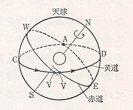

## 時間の単位

　我々には時の経過したことは分かるが、経過した時間の量は精密には分からない。そこで、一定の周期をもつと想像されるもの、あるいは等速運動をすると想像されるものを仮定して時間を測る。そしてこの想像が果たして正しかったかどうかは、これから出発して作られル物理学の体系を全体的に見て判定する。

　それにしても、ある一定の時間、すなわち単位を決めなければならないが、最初の一定の時間として採用されたものは地球の自転から割り出したものであった。いま、地球の中心を中心としてきわめて大きな半径の球面を天空に想像し、全ての星をこの天球上に投影してみる。地球の自転を考慮しないことにすれば、全ての恒星はほぼ天球上の固定点となるが、太陽はこの天球上を運動する。それは地球が太陽の周りに公転しているからである。

この太陽の軌道 VDACV を黄道という。地球は太陽の周りに一定の角速度で運行しているわけではないから、黄道上の太陽の速さも一定ではない。また地軸はこの黄道面（すなわち地球の公転軌道の平面）に垂直になっていない。したがって、地球の自転角速度が一定としても、１日の長さ、すなわち太陽が南中してから翌日南中するまでの時間は四季によって変わってくる。

　そこで、地球の中心を通り、地軸に垂直な平面と天球との交線 EW を赤道と名づけ、この赤道上を一定の速さで動く仮想的な太陽を想像して、これを平均太陽と名付ける。赤道と黄道との交点 V, A の中で、太陽が南半球から北半球へ移る方の点 V を春分点、他の点 A を秋分点という。平均太陽の運動の速さは、真太陽と同時に春分点を出発して、翌年同時に春分点に戻るような速さと決められている。実は地軸が一定の方向を保たず、きわめて徐々にこまのようなすりこぎ運動をしているので、赤道面の方法は徐々に変わり、春分点も多少移動していく。春分点を出て再び春分点に戻るまでの時間は、厳密に太陽が天球上を１周する時間よりやや短く、これを 1太陽年（あるいは 1回帰年）という。

　それはとにかく、平均太陽は赤道上を一定の速さで動いているので、もし地球の自転の速さが一定ならば、平均太陽が今日南中してから、翌日南中するまでの時間は一定となるはずである。この時間を1日、その 1/24 を 1時間と定義する。[^note1]

　以上が従来の時間の単位で、これは地球自転が一定不変の速さという仮定に基づいている。しかし。このようにして決めた今までの時間を用いると、地球から見た月の運動が計算から予想されるところと違い、永年の中には次第に早くなっていく傾向のあることが分かった。地球に万有引力をおよぼしているものは太陽の他に惑星もある。このために地球は太陽の周りに正確な長円運動をするのでなくて、きわめて僅かずつであるが、軌道の形が円形に近づいていく。月のみかけの運動が計算と合わない一つの原因がここにあるが、それだけでは計算の違いが十分説明できない。このようなことから、地球自転速度が一定という仮定にはかなり以前から疑いが持たれていた。近年、時計が非常に進歩し、ことに水晶時計が発達し、時間の測定がきわめて精密に行われるようになるにつれてこの疑いがますます濃くなってきた。

[^note1]:日本では統計 135° の地点すなわち明石市を通る子午線を基準に選んでいる。そこで、平均太陽は正午に明石市で南中するが、真太陽は必ずしもそうでない。
