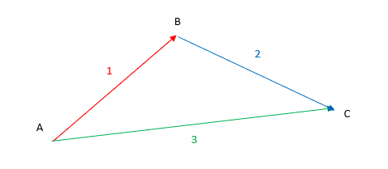
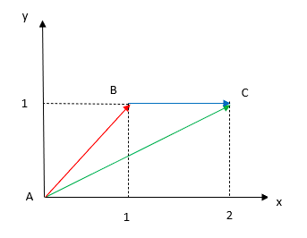
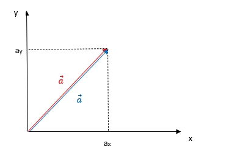
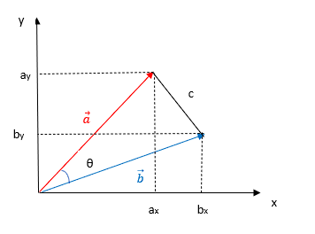

## ベクトルについて

大きさと向きを持つ量

これは主に点の位置関係を表すために用いられる。ただ、一点のことを示すために使うことができないことに気を付ける。

例）図のように、ABCの三人がいた場合

1. Aさんから見てBさんはこの方向にこれだけの距離のところにいる。

1. Bさんから見てCさんはこの方向にこれだけの距離のところにいる。

1. Aさんから見てCさんはこの方向にこれだけの距離のところにいる。

    

互いの位置関係は実際、2つのベクトルから判明する。仮にAさんがCさんの位置を知らず、1のBに2を聞くと、直ちに3も判明してしまう（1と2を組み合わせたものが3になる）。
$$
    \overrightarrow{AB}+
    \overrightarrow{BC}=
    \overrightarrow{AC}
$$

この式はベクトルの**方向のみ**関わるもので、長さは三角形を描くことから、余弦定理などより求める必要があることに注意！

また、Cの代わりにBにしても
$$
    \overrightarrow{AB}=
    \overrightarrow{AC}+
    \overrightarrow{CB}
$$
が成り立ち、前の式に代入すると以下のようになる。
$$
    \overrightarrow{AC}+
    (
    \overrightarrow{CB}+
    \overrightarrow{BC}
    )=
    \overrightarrow{AC}
$$
ここで括弧の部分は結局B自身の場所を自分自身が見ているものとなっており、
$$
    \overrightarrow{CB}+
    \overrightarrow{BC}=\vec{0}
    \rightarrow
    \overrightarrow{CB}=
    -\overrightarrow{BC}
$$
符号が変わると、向きが反転することが分かる。

$xy$座標でベクトルを表記してみる。前回の例に出てきたA,B,Cが次のように配置されているとする。
$$
    A=(0,0)、
    B=(1,1)、
    C=(2,1)
$$

    

すると、ベクトルをどのようにするかというと、$x$方向と$y$方向それぞれのほうから見た長さが判明すればよい。
$$
    \overrightarrow{AB}=(1,1)、
    \overrightarrow{AC}=(2,1)、
    \overrightarrow{CB}=(-1,0)\\
    \overrightarrow{CB}=
    -\overrightarrow{BC}とおけ、
    \overrightarrow{BC}=(1,0)
    であるからこのようになる。
$$
これらを先ほどのベクトルの式に代入すると
$$
    (2,1)=(1,1)+(1,0)
    \begin{cases}
        ・2=1+1（x成分）\\
        ・1=1+0（y成分）
    \end{cases}
$$
$$
    (1,1)=(2,1)+(-1,0)
    \begin{cases}
        ・1=2+(-1)（x成分）\\
        ・1=1+0（y成分）
    \end{cases}
$$

ここまではベクトルの方向だけ扱ってきたが、ここでは大きさ（長さ）の方を見ていくことにする。図のように、ベクトル $\vec{a}=(a_x,a_y)$ があるとき、$a=|\vec{a}|$（ベクトル $\vec{a}$ の大きさ）としてピタゴラスの定理から
$$
    |\vec{a}|^2=a_x^2+a_y^2
    \rightarrow
    |\vec{a}||\vec{a}|=
    a_xa_x+a_ya_y
$$
となる。このときの各辺を見ると
$$
\begin{cases}
・左辺：ベクトルを長さをかけたもの\\
・右辺：各成分同士をかけて足したもの
\end{cases}
$$
となる。

    

そうすると、右辺において一つが別のベクト $\vec{b}=(a_x,a_y)$ になった場合は
$$
    |\vec{a}||\vec{b}|=
    a_xb_x+a_yb_y
$$
であると推測される。これを確かめるため、図を長さだけで書くと、次のようになる。
$$
\begin{cases}
・a=|\vec{a}|=\sqrt{a_x^2+a_y^2}\\
・b=|\vec{b}|=\sqrt{b_x^2+b_y^2}\\
・c=|\vec{b}-\vec{a}|=|\vec{a}-\vec{b}|=
    \sqrt{(b_x-a_x)^2+(b_y-a_y)^2}
\end{cases}
$$

    

一方で、余弦定理を用いると
$$
    c^2=a^2+b^2-
    2|\vec{a}||\vec{b}|\cos\theta
$$
であることから、次の関係式が成り立つ。
$$
    (b_x-a_x)^2+(b_y-a_y)^2=
    |\vec{a}|^2+|\vec{b}|^2-
    2|\vec{a}||\vec{b}|\cos\theta
$$
これを整理することで以下の式が導かれる。
$$
    a_xb_x+a_yb_y=
    |\vec{a}||\vec{b}|\cos\theta
$$
これは内積と呼ばれるもので
$$
    \vec{a}\cdot\vec{b}=
     |\vec{a}||\vec{b}|\cos\theta
$$
というように書くと、ベクトル同士の関係を角度により確認することができる。