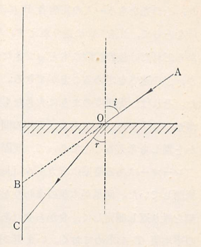
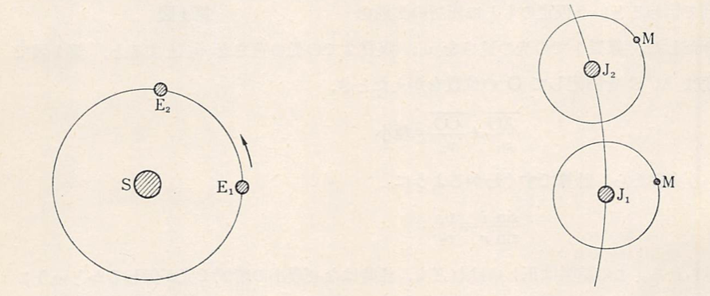

# 歴史的背景

この章では、光学がどのように発達してきたか、そのあらましを述べる。もとより専門的な歴史が目的なのではなく、次章以降の理解を容易にするための補助的な解説にすぎない。
　光学現象の観察とその応用との歴史は、数千年の昔にさかのぼる。その意味で光学は最も古い科学の一分野である。人間の外界についての認識は、大部分が視覚をとおして得られることを思えば、これは当然のことであるといえよう。
　古代エジプトには既にガラスの製造と研磨の技術が発達していた。一方、ニネヴェの廃墟には凸レンズが見出されているし、金属製の鏡についての記事は旧約聖書にも散見する。またギリシャ時代にも凸レンズは早くから知られていたらしい。
　自然界にみられる光学現象の観察や、簡単な実験からまず得られるのは、光線という概念である。これは雲の間からもれる太陽の光や、暗い部屋に小さな穴を通して差し込む光を観察して思いつかれたにちがいない。この概念はきわめて簡単なものとはいえ、光の光学的研究の第一歩となる大切なものである。光線の性質としてただちに認められるのは、まず一様な媒質中におけるその直進性であり、次にそれが平面にあたって反射される場合の規則性である。この直進性および入射角と反射角とが等しいという反射の法則は、既にプラトン学派にも認識されていた。もっと複雑な場合、すなわち曲面による反射はアレクサンドリア時代のニウクレィデス（ユークリッド、約330B.C-275.B.C.）が取り扱っている。その著とされる「反射光学」（Catoptrics）の中には、光の入射した点における切平面に対して、入射角と反射角とが等しいことを示す図がのせられている。また、太陽光線を凹面鏡で一点に集め、ここに置いた物体に火をつけることができるという記述もあるが、まだ焦点と球面の中心とが混同して取り扱われている。
　以上の直進と反射の現象とともに、光がある物質から別の物質に入る場合に屈折するという現象も古くから知られていたにちがいないが、正しい屈折の法則は古代には知られていなかった。エウクレィデスの著書には、容器の底に小さい物体を置き、これが容器のふちで隠されてみえないようなときでも、水をそそいでやるとそれが見えるようになるという、よく知られた実験が記されているが、定量的な記述はみあたらない。その後、有名な天文学者プトレマイオス（トレミー、？~168）は、実際に入射角と屈折角を測定し、この二つが互いに比例するとした。もちろんこれは両方の角が小さいときにしか成り立たない。
　これらの光学現象の実際的な研究とならんで、光の本性についての考察も行われたが、それらは科学というより思弁または推測の範囲をでないものであった。たとえば、エムペドクレス、プラトン学派、エウクレィデスたちは、物が見えるのは眼から視覚を生ずるあるものが放出され、これが物体にとどいたとき、それが眼に見えるようになるのであるという説を唱えていた。エウクレィデスは、「もし物体から光が放出されて我々の眼に届いたとき視覚を生ずるならば、床の上に落ちているピンを見つけそこなうようなことはないはずである」と言っている。現在の考え方すれば、ずいぶん奇妙な感じがするが、たとえば暗いところで手をのばして物に触って初めて触覚を生ずる経験からの類推であるとすれば、うなずけないことはない。この説はtactile theory と呼ばれる。ピタゴラスや原子論者たちは、これと反対に物体からある種の粒子が放出されて、それが眼に入ると視覚を生ずると考えていたようである。また、アリストテレスはtactile theory が正しければ、暗いところでも物が見えるはずだとしてこの説を否定し、視覚は見るものと見られるものとの間にある媒体の運動によって生ずる、と言っている。当時の学説は表現が曖昧なため、かなり勝手な解釈ができるであろうが、後世の光の粒子説（または放出説、emission theory）と媒質中の運動を前提とする波動説、これら二つの相対立する説の萌芽が既にあったと考えても良いであろう。
　ヨーロッパの暗黒時代の間、科学はアラビア人によって受け継がれ、発展させられた。その中でも光学に関するものはよく知られており、フル・ハゼン（Al Hazen,965~1038）の「光学」の中に集成されている。この書物の中で彼は、反射の法則について、入射光線と反射光線とは垂線とともに同じ平面内にあるという事実を付け加えて、この法則に完全な表現を与えた。また、さらに進んで、球面鏡や放物面鏡における光線の反射もとり扱っており、エウクレィデスが球の中心と混同した焦点の位置を正しく認識している。そればかりでなく、すべての光線が同じ点に収束するのではないということ、すなわち球面収差の存在にも気付いていたらしい。
　一方、光の屈折については、プトレマイオスと同じような実験を行って、彼は入射角と屈折角との比は一定でないことを見出し、プトレマイオスの誤りを明らかにしたが、まだ正しい屈折の法則を発見するまでには至らなかった。また、アル・ハゼンは人間の眼の解剖図をその書物にのせ、生理光学についても記述している。ガラス体（Humor vieus, vitrous humor）、角膜（Cornea）、網膜（Retina）などの名前は、彼の用いたアラビア語のラテン訳からでている。
　文芸復興期における光学史上の特筆すべき事件は望遠鏡と顕微鏡との発明である。レンズが古くから作られていたことは、前にも述べた通りである。それなのに、この二つを組み合わせただけの、一見簡単な器械が発明されるまで、実に数千年のときを経過している。これはあまりにも遅すぎるのではなかろうか。だが、考えてみると、この頃まではガラスの製造および研磨の技術がそれほど進歩しておらず、そのような技術で作られたレンズの組み合わせで生じた拡大された像は、ぼやけたり、ひずんだりしていたため、それが役に立つことになかなか気が付けなかったのであろう。しかし、一方から言えば、マッハのことばのように、幾何光学（特に屈折光学）のまだ発達していない時期に、このような光学器械が発明されたのは注目に値することと言わなくてはならない。この事実は、基礎になる理論がまだ存在せず、手探りで実験を進めなくてはならないときは、簡単な発見にも長い時間と手間がかかるという、一つの例と言ってよいかもしれない。
　望遠鏡と顕微鏡との発明については、ヨーロッパの各国が自分の国の発明者の優先権を主張しており、色々な説があって明らかではない、しかし、一般に認められているところでは、望遠鏡は1608年にオランダ人ハンス・リッペルスハイ（Hans Lippershy,?~1619）がはじめて製作したものとされている。これは彼が申請した特許の記録にも基づく。顕微鏡は望遠鏡とほとんど同時に発明された。現在、その発明者はザカリアス・ヨハニデス（Zacharias Jojannides）とその父であるとされているが、ハイゲンスによるとコルネリウス・ドレッベル（Cornelius Drebbel）であるという。最初、接眼鏡が凹レンズからできていた。これを凸レンズに替えたのは、ナポリのフランチスカス・フォンターナ（Franciscus Fontana）であるらしい。ケプラー（Johann Kepler,1571~1630）は同じことを望遠鏡の場合に提案した。
　これらの新しい光学器械は、ただちにヨーロッパで広く使用されるようになった。その中でもガリレイは、オランダでの望遠鏡の発明を伝え聞き、自分の屈折光学の知識をもとにして、独立に望遠鏡を組み立てることに成功した。彼はそれを用いて、天文学上多くの画期的な発見をしたが、その主なものは、太陽の黒点、月の表面の山々、木星の衛星、金星の満ち欠け、銀河が無数の星の集まりであること、などである。これらの発見は天文学に飛躍的な進歩をもたらすものであったが、光学史上の意義は次のケプラーの研究ほどに大きくはない。
　ケプラーは元々光学の研究に熱心だったのであるが、望遠鏡発明のニュースに刺激されてさらに新たな努力を重ねて、1611年に「屈折光学」（Dioptrica）という書物を著し、望遠鏡の理論に体系を与えようとした。こうして、それまでは単なる数学に過ぎなかった幾何光学が、光学器械設計の基礎となる実用的な学問に転換することになった。彼が近世光学の創始者と呼ばれるのも理由のないことではない。ケプラーのような企てには、もちろん屈折の法則の正しい認識が必要である。彼はプトレマイオスやアル・ハゼンと同じように、正確な法則を発見できなかったので、近似的な法則 $$ i=nr（i：入射角、r：屈折角、n：屈折率） $$
を用いた。この法則は $$ i<30° $$ であればかなりよい結果を与える。その当時はこの程度の近軸光線を取り扱えば十分であり、得られた結論は実際たしかに役に立つものであった。

17世紀にはいって正確な屈折の法則がスネル（Willebrord Snell、1591~1626）によって発見された。彼はこの法則を現在のように、入射角と屈折角との正弦の比が一定という形には表していない。以下の図で、光が第1の媒質でAOの方向に進み、O点で境界面にあたって屈折し、第２の媒質をOC方向に進むとき、垂直な壁BCを考え、BをAOの延長がこれと交わる点、CをOCがこれと交わる点とする。

このとき、OC:OB が一定であるということが、スネルの表し方であった。これは  が一定というのと同じであることはすぐ証明できる。この後の形で屈折法則を表現したのはデカルト（Ren'{e} Descartes、1596～1650）が最初である。彼はこの法則を理論的に証明できたと信じていたが、それは正しくない仮定がもとになっていた。しかし、その証明はある意味では光の粒子説を考えた興味あるものであって、ニュートン（Isaac Newton、1642～1727）の光学の研究に関連して後で改めて述べることにする。

フェルマー（Pierre de Fermat、1601～1665）は、デカルトとは別に、光は2点の間を最小の時間で伝わるという仮定のもとに屈折の法則を導き出した。媒質1での光の速さを$$ v_{1} $$
、媒質2での光の速さを $$ v_{2} $$ とすると、第1図で今度はA、Cを固定してOの位置をかえたとき、

$$ \frac{\overline{AO}}{v_{1}}+\frac{\overline{CO}}{v_{2}}=極小 $$

という条件から、計算ですぐわかるように

$$ \frac{\sin i}{\sin r}=\frac{v_{1}}{v_{2}} $$

が得られる。この結果は正しいけれども、当時はなぜ最小の時間で光が伝わるということに対して、あいまいな哲学的な根拠しかなかったため、この考えはその後の光学の発達には、長い間まったく影響することがなかった

17世紀には、いろいろの新しい光学的事実が発見された。レーマー（Olaf R"omer、1644~1710）による光速度の有限性の発見はその一つである。光が極めて速く伝わることは日常の経験からもすぐわかるが、それが一体どのくらいの速さなのかはそのころまでは全く予想することができず、ときにはケプラーやデカルトのように無限大であると想像した人々さえあった。それが有限であることを明らかにし、その大きさを測定することができたのは、光というものの性質を理解する上で大きな進歩であった。

光速度を実験で測定しようとしたのは、ガリレイが最初であるといわれている。彼は次のような実験を行った。彼は次のような実験を行った。ランプを持った実験者Aがある瞬間にランプの覆いをとり去り、その光をもう一人の実験者Bに送る。B はその光を見たらすぐに自分のランプの覆いをとって、光を A に送り返す。Aはその光を観測して、それが自分が覆いをとってからどれだけ後の時間に戻ってきたかを測定すれば、AB間の距離が分かっているとき、光の速さを求めることができる。容易に想像されるように、この実験は失敗に終わった。それは、光速度のように大きなものをこのように単純な方法で測るには、AB 間の距離が小さすぎたからである。天体の間のような大きな距離を使えば、成功するのではないかと誰しも考えることであって、実際レーマーがその測定を行ったのである。

レーマーはある時期にピカール（Jean Picard、1620~1682） と一緒に木星の衛星の食を観測していた。衛星が木星のまわりを回るとき、食が終わって木星の蔭から現れる時刻を繰り返し測定して、食から食（あるいは食の終わりから次の食の終わり）までの時間に平均値 $$ T $$ を求めておく。いま以下の図で S を太陽、E を地球、J を木星、M をその衛星とする。 

最初地球が$$ E_{1} $$ の位置にあり、木星が $$ J_{1} $$の位置にあったとき、M の食が終わって木星のかげから現れた時刻を$$ t_{s]} $$とすれば、それより$$ n $$ 回後食が終わって M の現れる時刻は$$ t_{s}+nT $$ となるはずである。
