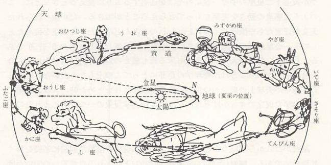

# 古典力学

　昔々、まだ夜道を照らす灯もなく、人々の住まいは一日の半ば近くも真っ暗な闇の中に閉ざされ、その闇の奥から時折狼の遠吠えが、野原を渡る風の音に混じって気味悪く聞こえて来ていた頃、恐らく星は人々にとって今よりも遥かに身近で重要な存在だった。一日の仕事を終えて粗末な褥（しとね）に身を横たえる前のひとときや、東の空の白むのももどかしく眠りから目覚めた時、彼らが決まって振り仰ぐ星空には幾つもの親しみやすい図形が待ち受けていた。その或るものは美しい乙女が天に舞う姿を思わせたし、また或るものは大きな獅子となって頭上から彼らを威圧するかのように見えた。

　そのような図形や相互の配置のおおよそを、恐らく多くの人々はそらんじていたのであろう。実際、満足なあかりも、そしてまた、その下で読むべき何物をも持たなかった人々にとって、星空は彼らの涯しない夢を育むただ一つの、そしてそれ故にこそ何回となく読み古された物語のようなものだった。

　月日の流れを知る目安として、子は親から、親はまたその親から教えられたことであっただろうが、夜明け前の東の空や日没間もない西の空に輝く星の一団は、何故か季節によっていつも決まっているように見えた。天球上の太陽の通り道としての**黄道**（地球の公転軌道面と天球との公転）は、このようにしていつとはなしに人々の知るところとなった。

    

　上図のような**黄道十二星座**が、その通り道をたどる道しるべとして人々の間に根をおろしたのは、今からもう五千年以上も昔、バビロニア地方でのことといわれている。この黄道近く、これらの十二の星座を横切って、時には後戻りを交えながら、夜毎に少しづつその位置を変える幾つかの明るい星があった。こうして先ず、水星、金星、火星、木星、土星と呼ばれる比較的明るい5つの**惑星**が人々の前にその姿をあらわした。これらに大きな関心を示すようになったのは、占星術上の必要もあったであろうが、多分に宗教的意味も込められていたと考えられている。

    

　今日、我々は例えば上図に示された一連の写真のように、いくつかの惑星がたまたま天球上の一か所に集まるように見えたり、あるいは惑星の一つが黄道十二星座の中の一等星のそばを通過するように見えるときなどに、このような惑星の動きを実感をもって捉えることができる。だが極く限られた天文愛好家たちを除けば、今日われわれのほとんどは、たとえ夜空を眺めたとしても、金星以外の惑星の存在には気づかずに見落としてしまうのが普通である。だから、古代の人々が来る夜も星との対話の時間を十分に持ち合わせたということは、物理学の萌芽にとってこの上もなく大事なことだった。彼らが天球上の幾つかの星の不思議な動きに目をとめた時、人は後年古典力学の成立のきっかけとなった。この天球上の動きというのは、実は身近な物体の動きと同じ法則に基づいているため、以降では最初に身近な物体の運動について論じていくことにしよう。
