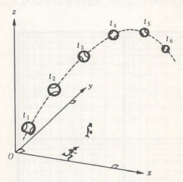

## 運動の表現方法

　我々は間口と奥行きと高さを持った3次元空間の中に住んでおり、物体の運動もその中で起こっている。運動とは物体の位置が時間とともに変化することであるから、ある運動を記述するためには、例えば以下の図のように時々刻々における物体の位置を追いかけていけばよい。

    

物体の位置を記述するとき、必ずなんらかの基準から見たものとなる。例えばAさんとBさんの二人がいて、AさんがBさんに床に置かれた物体の位置を伝えようとすると「**Bさんから見て**右側」というようになることからも伺えるであろう。それを聞いたBさんも右側を見て、自分を基準として目分量で物体の位置がこれぐらいだと把握するであろう。このように、物体の位置を把握するためには基準点O（Bさん自身の地点）を中心として座標系K（Bさんの目分量）を用意する必要がある。さらに物体自体が点ではなく大きさを持つことから、その位置を指定できるよう**質点**（質量を持つ点）というものに置き換える必要がある。仮に質点が地点Pにある場合、その位置は基準点O（または**原点**）から見た位置として記号 $\vec{\rm OP}$ で表記される。あるいは、太文字で $\bm{r}$ と表すと長さOPは $|\bm{r}|$ または単に $r$ と書くため、一般的に太文字で書くと長さに加えて向きまで含めたものとなる。このときの $\bm{r}$ を**位置ベクトル**という（ベクトルの中でも長さしか持たない量は**スカラー量**と呼ばれる）。また、ここでは座標系KをBさんの目分量としていたが、それだと見る人によって大きさが異なってしまうため、一般的に下図のように直交直線座標（デカルト座標）が多く用いられる。

    

このときのP点の位置ベクトル $\bm{r}$ は座標 $(x,y,z)$ を用いて

$$ \bm{r}=(x,y,z) $$

で与えられる。例として、上図でもあるように $x,y,z$ 軸の正の方向に向かう単位の大きさのベクトル（基本ベクトル）をそれぞれ $\bm{e}_x,\bm{e}_y,\bm{e}_z$ とすると

$$
    \bm{e}_x=(1,0,0)、 
    \bm{e}_y=(0,1,0)、
    \bm{e}_z=(0,0,1)
$$

と表されるが、これを用いると位置ベクトル $\bm{r}$ は

$$ \bm{r}=x\bm{e}_x+y\bm{e}_y+z\bm{e}_z $$

と書くこともできる。このようにすると、後にも出てくるが別の座標系に変更した際にどの座標系で表現されているか区別しやすくなる。また、このときの原点から質点までの距離 $r$ は

$$ 
    r=|\bm{r}|=\sqrt{x^2+y^2+z^2} 
$$

で与えられる（三平方の定理により求めることが可能）。

　ここまで位置ベクトルについて述べたが、これは質点の運動において時刻 $t$ ごと変化するため $\boldsymbol{r}(t)$ というように $t$ の関数として表すことができる。そのため、仮に時刻 $t$ で位置ベクトル $\boldsymbol{r}(t)$ なるA点にあった質点が、時間 $\Delta t$ の後に $\boldsymbol{r}(t+\Delta t)$ なるB点まで動いたとする。このときの質点の変位（displacement）$\Delta\boldsymbol{r}$ は、以下の図に図示されたようなベクトル算法を用いて

$$ 
    \Delta\bm{r}=\bm{r}(t+\Delta t)-\bm{r}(t) 
$$

と書ける。また、変位 $\Delta\bm{r}$ の長さも

$$
    \Delta r=|\bm{r}(t+\Delta t)-\bm{r}(t) |
$$

となるが、同じ $\Delta t$ という時間でも変位が大きければ大きいほど速いということになり、同じ $\Delta r$ という変位でも時間が短ければ短いほど速くなるので、速さを表す度合い（**速度**）は $\bm{v}$ として

$$
    \bm{v} \equiv 
    \frac{\bm{r}(t+\Delta t)-\bm{r}(t)}{\Delta t}=
    \frac{\Delta\bm{r}}{\Delta t}
$$

と定義すればよいと考えられる（$\equiv$は定義することを指しており、右側にその内容を記載する）。この方向は変位 $\Delta\bm{r}$ と同じであり、細かく言うと**平均速度**と呼ばれる量となる。一方で、速度というのは一般的に各時刻ごとに異なる（極端に短い時間で変化する）量であるため

$$
    \bm{v} \equiv
    \lim_{\Delta t\to 0}
    \frac{\bm{r}(t+\Delta t)-\bm{r}(t)}{\Delta t}=
    \frac{{\rm d}\bm{r}}{{\rm d}t}
$$

というように記載すると厳密なものとなる（こちらは**瞬間速度**と呼ばれる）。この方向は先ほどと異なり、下図のようにA点において引かれた質点の軌道に対する接線の方向に等しく、その大きさは軌道に沿っての質点の速さ（speed）に等しくなる。

    

ちなみに、先ほどのデカルト座標を用いると速度は以下の通りに書ける。

$$
    \bm{v}\equiv
    (v_x,v_y,v_z)=
    \left(
        \frac{{\rm d}x}{{\rm d}t},
        \frac{{\rm d}y}{{\rm d}t},
        \frac{{\rm d}z}{{\rm d}t}
    \right)
$$

　ここまで運動をどのように表現するかを述べたが、次からは実際に運動がどのような法則に従ってなされるのかを見ていくことにする。