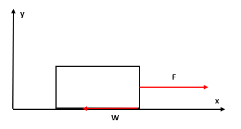
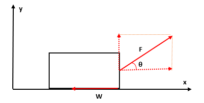
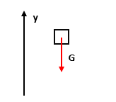
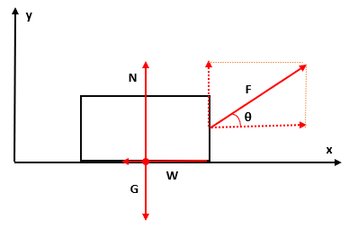

## 力を用いた運動の記述

　ここからは、実際の運動から運動方程式をどのように取り扱うのかを見ていくことにする。

1. 水平な地面に置かれた物体

    

何もしていない状態だと静止し続ける。そこに下図のように力をかけ続けると動き始め、この様子を運動方程式を用いてみる。
$$
    m\bm{a}=\bm{F}
    \leftrightarrow
    \begin{cases}
        ma_x=F_x=F \\
        ma_y=F_y=0
    \end{cases}
$$
このことから、$x$方向に対しては $F/m$ の加速度で進むが、$y$ 方向へは一定の速度（今は静止したまま）で動くことが分かる。だが、すぐ動き出すわけではなく最初はある程度静止し続けてから動き出す。これは、摩擦力 $W$ が働いているものと考える。
$$
    m\bm{a}=\bm{F}
    \leftrightarrow
    \begin{cases}
        ma_x=F_x=F-W=0 \\
        ma_y=F_y=0
    \end{cases}
$$

1. 上記と同様な状況で角度 $\theta$ だけ傾けて力をかけた場合

    

先ほどと同様な考え方で
$$
    m\bm{a}=\bm{F}
    \leftrightarrow
    \begin{cases}
        ma_x=F_x=F\cos\theta-W=0 \\
        ma_y=F_y=F\sin\theta
    \end{cases}
$$
となるわけだが、もしこの力だけ存在するならば$x,y$方向へ加速していくものと考えられる。しかし、実際はそうはならず静止したままである。そのため、下向きにも力が働くことが予想される。ただ、この場合だと地面が邪魔でどのような力が働いているかわからないため、次に持ち上げた状態から離した場合にどのような力が働くのかを見てみる。

1. 落下運動と2と同様の運動

    

　物体を持ち上げて離すと落下するわけだが、このとき重力 $G$ が働いている。これは、質量がある物体間で働く万有引力の一種であり、今の場合では地球と物体の間にかかるものとなっている。
そのため、このときの運動方程式は以下の形になることが分かる。
$$
    m\bm{a}=\bm{F}
    \leftrightarrow
    \begin{cases}
        ma_x=F_x=0 \\
        ma_y=F_y=-G
    \end{cases}
$$

この重力が働くということを踏まえて、改めて先ほどの状況を考えてみる。この場合だと、重力と上にひく力が釣り合っていると思えるが、すると何も力が働いていないときに静止していることの説明がつかない。そのため、重力により下へ引き付けることで地面へ力がかかり地面から反発力（反作用）が働くものと考えられる。

$$
m\bm{a}=\bm{F}
\leftrightarrow
\begin{cases}
    ma_x=F_x=0 \\
    ma_y=F_y=N-G=0
\end{cases}
$$

そのため、先ほど角度をつけた場合にも以下のようになる。

$$
    m\bm{a}=\bm{F}
    \leftrightarrow
    \begin{cases}
        ma_x=F_x=F\cos\theta-W=0 \\
        ma_y=F_y=F\sin\theta+N-G=0
    \end{cases}
$$

    

　以上のように、運動を観測することでどのような力が働いているのか予測することが可能ではあるが、実際にどのような値をとるかは調べる必要が出てくる。例えば、重力 $G$ の場合だと重力加速度 $g$ により $mg$ という形になっており、摩擦力 $W$ については静止している場合には静止摩擦係数 $\mu$ により $\mu N$、動き出した後には動摩擦係数 $\mu'$ により $\mu' N$になることが分かっている（ただ、この形というのは地面の表面の状態などで変化するもので実際にこのようになる理由はいまだにわかっていない）。