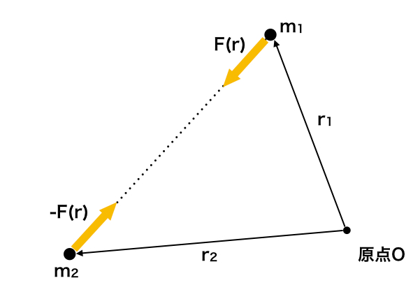
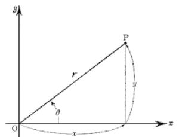

## 二体問題（惑星の運動）

　ここまでは一つの物体のみ取り扱っていたが、もしもう一体物体がある場合は万有引力が働くことも考慮する必要がある。例として物体1と物体2の質量、位置ベクトルを $m_1,\bm{r}_1,m_2,\bm{r}_2$ とすると、物体1にかかる力は

$$
    \bm{F}=
    G\frac{m_1m_2}{|\bm{r}_2-\bm{r}_1|^2}
    \left(
    \frac{\bm{r}_2-\bm{r}_1}{|\bm{r}_2-\bm{r}_1|}
    \right)
$$

というように書ける（$G$：重力定数）。

    

そして、この２体の運動方程式を記載すると以下の通りとなる。

$$
    m_1
    \frac{\mathrm{d}^2\bm{r}_1}{\mathrm{d}t^2}=
    \bm{F}、
    m_2
    \frac{\mathrm{d}^2\bm{r}_2}{\mathrm{d}t^2}=
    -\bm{F}
$$

ここで二つの式の和をとった場合には

$$
    (m_1+m_2)
    \frac{\mathrm{d}^2}{\mathrm{d}t^2}
    \left(
        \frac{m_1\bm{r}_1+m_2\bm{r}_2}{m_1+m_2}
    \right)=
    0
$$

というように全体の運動方程式となり、このときの質量 $m_G$ と位置 $\bm{r}_G$ は

$$
    m_G = m_1+m_2、
    \bm{r}_G=
    \frac{m_1\bm{r}_1+m_2\bm{r}_2}{m_1+m_2}
$$ 

とおけることから、全体的に見た場合には以下の式が成り立つ。

$$
    m_G\frac{\mathrm{d}^2\bm{r}_G}{\mathrm{d}t^2}=0
$$

一方で、万有引力の形を踏まえて2つの方程式を

$$
    \frac{\mathrm{d}^2\bm{r}_1}{\mathrm{d}t^2}=
    \frac{\bm{F}}{m_1}、
    \frac{\mathrm{d}^2\bm{r}_2}{\mathrm{d}t^2}=
    -\frac{\bm{F}}{m_2}
$$

として2番目の式から1番目の式を差し引くと以下の式が得られる。

$$
    \left(
        \frac{m_1m_2}{m_1+m_2}
    \right)
    \frac{\mathrm{d}^2}{\mathrm{d}t^2}
    (\bm{r}_2-\bm{r}_1)=
    -\bm{F}
$$

この式は物体1から見た物体2の運動方程式となっており、質量 $\mu$（換算質量） と相対位置 $\bm{r}$ は

$$
    \mu=\frac{m_1m_2}{m_1+m_2}、
    \bm{r}=\bm{r}_2-\bm{r}_1
$$

と書ける。そのため、上記の運動方程式は以下のようになる。

$$
    \mu\frac{\mathrm{d}^2\bm{r}}{\mathrm{d}t^2}=
    -G\frac{m_1m_2}{r^3}\bm{r}
$$

    

仮に二次元の場合で考えてみると、直交座標系 $x,y$ で記述すると

$$
    \mu\frac{\mathrm{d}^2x}{\mathrm{d}t^2}=
    -G\frac{m_1m_2}{r^2}
    \frac{x}{r}、
    \mu\frac{\mathrm{d}^2y}{\mathrm{d}t^2}=
    -G\frac{m_1m_2}{r^2}
    \frac{y}{r}
$$

となるが、ここで上図にもあるように

$$
    \frac{x}{r}=\cos\theta、
    \frac{y}{r}=\sin\theta
    \leftrightarrow
    x=r\cos\theta、
    y=r\sin\theta
$$

という関係にあるため、極座標 $r,\theta$ に変換すると

$$
\begin{align*}
    \frac{\mathrm{d}^2}
    {\mathrm{d}t^2}
    (r\cos\theta)
    &=
    \frac{\mathrm{d}}
    {\mathrm{d}t}
    \left(
        \frac{\mathrm{d}r}
        {\mathrm{d}t}
        \cos\theta-
        r
        \frac{\mathrm{d}\theta}
        {\mathrm{d}t}
        \sin\theta
    \right)\\
    &=
    \frac{\mathrm{d}^2r}
    {\mathrm{d}t^2}
    \cos\theta-
    2\frac{\mathrm{d}r}
    {\mathrm{d}t}
    \frac{\mathrm{d}\theta}
    {\mathrm{d}t}
    \sin\theta-
    r
    \frac{\mathrm{d}^2\theta}
    {\mathrm{d}t^2}
    \sin\theta-
    r
    \left(
    \frac{\mathrm{d}\theta}
    {\mathrm{d}t}
    \right)^2
    \cos\theta
\end{align*}
$$
$$
\begin{align*}
    \frac{\mathrm{d}^2}
    {\mathrm{d}t^2}
    (r\sin\theta)
    &=
    \frac{\mathrm{d}}
    {\mathrm{d}t}
    \left(
        \frac{\mathrm{d}r}
        {\mathrm{d}t}
        \sin\theta+
        r
        \frac{\mathrm{d}\theta}
        {\mathrm{d}t}
        \cos\theta
    \right)\\
    &=
    \frac{\mathrm{d}^2r}
    {\mathrm{d}t^2}
    \sin\theta+
    2\frac{\mathrm{d}r}
    {\mathrm{d}t}
    \frac{\mathrm{d}\theta}
    {\mathrm{d}t}
    \cos\theta+
    r
    \frac{\mathrm{d}^2\theta}
    {\mathrm{d}t^2}
    \cos\theta-
    r
    \left(
    \frac{\mathrm{d}\theta}
    {\mathrm{d}t}
    \right)^2
    \sin\theta
\end{align*}
$$

であるから、以下のような形になる。

$$
    \mu
    \left[
        \frac{\mathrm{d}^2r}
        {\mathrm{d}t^2}
        \cos\theta-
        2\frac{\mathrm{d}r}
        {\mathrm{d}t}
        \frac{\mathrm{d}\theta}
        {\mathrm{d}t}
        \sin\theta-
        r
        \frac{\mathrm{d}^2\theta}
        {\mathrm{d}t^2}
        \sin\theta-
        r
        \left(
        \frac{\mathrm{d}\theta}
        {\mathrm{d}t}
        \right)^2
        \cos\theta
    \right]
    =
    -G\frac{m_1m_2}{r^2}
    \cos\theta
$$
$$
    \mu
    \left[
        \frac{\mathrm{d}^2r}
        {\mathrm{d}t^2}
        \sin\theta+
        2\frac{\mathrm{d}r}
        {\mathrm{d}t}
        \frac{\mathrm{d}\theta}
        {\mathrm{d}t}
        \cos\theta+
        r
        \frac{\mathrm{d}^2\theta}
        {\mathrm{d}t^2}
        \cos\theta-
        r
        \left(
        \frac{\mathrm{d}\theta}
        {\mathrm{d}t}
        \right)^2
        \sin\theta
    \right]
    =
    -G\frac{m_1m_2}{r^2}
    \sin\theta
$$

ここで、$x,y$ 方向の方程式にそれぞれ $\cos\theta,\sin\theta$ をかけて和をとると

$$
    \mu
    \left[
        \frac{\mathrm{d}^2r}
        {\mathrm{d}t^2}-
        r
        \left(
        \frac{\mathrm{d}\theta}
        {\mathrm{d}t}
        \right)^2
    \right]
    =
    -G\frac{m_1m_2}{r^2}
$$

となり、一方で $\sin\theta,\cos\theta$ をかけて差をとると

$$
    \mu
    \left[
        2\frac{\mathrm{d}r}
        {\mathrm{d}t}
        \frac{\mathrm{d}\theta}
        {\mathrm{d}t}+
        r
        \frac{\mathrm{d}^2\theta}
        {\mathrm{d}t^2}
    \right]
    =0
$$

となる。ここで２番目の式に $r$ をかけることで

$$
    \mu r^2
    \frac{\mathrm{d}^2\theta}{\mathrm{d}t^2}+
    2\mu r
    \frac{\mathrm{d}r}{\mathrm{d}t}
    \frac{\mathrm{d}\theta}{\mathrm{d}t}=
    \frac{\mathrm{d}L}{\mathrm{d}t}=0、
    L=\mu r^2
    \frac{\mathrm{d}\theta}{\mathrm{d}t}  
$$

と変形できることから、$L$（角運動量）という量が保存されている（定数になる）ことが分かる。そこで、これを変形して
$$
    \frac{\mathrm{d}\theta}{\mathrm{d}t}=
    \frac{L}{\mu r^2}
$$
として、一つ目の式に代入してみる。
$$
    \mu\frac{\mathrm{d}^2r}{\mathrm{d}t^2}=
    \frac{L^2}{\mu r^3}-
    G\frac{m_1m_2}{r^2}
$$
次に、一つ目の式の両辺に $r^2$ を乗じて $u=1/r$ と置き換えてみると
$$
    \mu\frac{1}{u^2}
    \frac{\mathrm{d}^2r}{\mathrm{d}t^2}=
    \frac{L^2}{\mu}u-Gm_1m_2、
    \frac{\mathrm{d}\theta}{\mathrm{d}t}=
    \frac{L}{\mu}u^2
$$
となるが、ここで $r$ の時間微分がどうなるか見てみると
$$
    \frac{\mathrm{d}r}{\mathrm{d}t}=
    -\frac{1}{u^2}
    \frac{\mathrm{d}u}{\mathrm{d}t}=
    -\frac{L}{\mu}
    \frac{\mathrm{d}t}{\mathrm{d}\theta}
    \frac{\mathrm{d}u}{\mathrm{d}t}=
    -\frac{L}{\mu}
    \frac{\mathrm{d}u}{\mathrm{d}\theta}
$$
であることから、二階微分は次の通りとなる。
$$
    \frac{\mathrm{d}^2r}{\mathrm{d}t^2}=
    -\frac{L}{\mu}
    \frac{\mathrm{d}}{\mathrm{d}t}
    \left(
    \frac{\mathrm{d}u}{\mathrm{d}\theta}
    \right)=
    -\frac{L}{\mu}
    \frac{\mathrm{d}\theta}{\mathrm{d}t}
    \frac{\mathrm{d}^2u}{\mathrm{d}\theta^2}=
    -\frac{L^2}{\mu^2}u^2
    \frac{\mathrm{d}^2u}{\mathrm{d}\theta^2}
$$
そのため、運動方程式は以下の形に整理される。
$$
    \frac{\mathrm{d}^2u}{\mathrm{d}\theta^2}=
    -u+\frac{Gm_1m_2\mu}{L^2}
$$
この解は以下の通りとなる。
$$
    u=
    A\cos(\theta-\theta_0)+
    \frac{Gm_1m_2\mu}{L^2}
$$
そのため、$r$ は以下のように表される（$\epsilon$：離心率、$l$：半直弦）。
$$
    r=
    \frac{l}
    {1+\epsilon\cos(\theta-\theta_0)}、
    \epsilon=
    \frac{AL^2}{Gm_1m_2\mu}、
    l=\frac{L^2}{Gm_1m_2\mu}

$$
この軌道は離心率 $\epsilon$ の大きさによって決まる。
$$
（1） \epsilon = 0（円）、
（2）0 < \epsilon < 1（楕円）
$$
$$
（3）\epsilon = 1（放物線）、
（4）\epsilon > 1（双曲線）
$$

　以上のことを踏まえて、二体運動の一例として惑星の運動を考えるとKeplerの法則というものがあり、以下の3つの法則が存在している。

1. 惑星の軌道は太陽を1焦点とする楕円である。
1. 太陽と惑星とを結ぶ動径の描く面積速度は常に一定である。
1. 惑星の公転周期の2乗は太陽からの平均距離（=軌道の長半径）の3乗に比例する。

先ほどの物体について、物体1を太陽、物体2を地球として考えると、離心率は0.0167になり範囲内にあることはわかる。次に、面積速度については以下のように動径によらずに一定になることが分かる。
$$
    \frac{\mathrm{d}S}{\mathrm{d}t}=
    \frac{1}{2}r^2
    \frac{\mathrm{d}\theta}{\mathrm{d}t}=
    \frac{L}{2\mu}
$$
そして、公転周期については楕円の面積が長半径が $a$ 、短半径 $b$ により $S=\pi ab$ と書けるが、ここでの長半径、短半径が $r$ が最大と最小のときの長さの相加平均、相乗平均であることから
$$
    a=
    \frac{1}{2}
    \left(
        \frac{l}{1-\epsilon}+
        \frac{l}{1+\epsilon}
    \right)=
    \frac{l}{1-\epsilon^2}、
    b=
    \sqrt{
    \left(
        \frac{l}{1-\epsilon}
    \right)
    \left(
        \frac{l}{1+\epsilon}
    \right)}=
    \frac{l}{\sqrt{1-\epsilon^2}}
$$
というように書けるため、面積は以下の通りとなる。
$$
    S=\frac{l^2\pi}{(1-\epsilon^2)^{3/2}}
$$
一方で、面積速度から面積を求めた際には
$$
    S=
    \int_0^T
    \frac{\mathrm{d}S}{\mathrm{d}t}\mathrm{d}t=
    \frac{1}{2}
    \int_0^T r^2
    \left(
    \frac{\mathrm{d}\theta}{\mathrm{d}t}
    \right)
    \mathrm{d}t=
    \frac{LT}{2\mu}
$$
であるため、以下の式が成り立つ。
$$
    \frac{l^2\pi}{(1-\epsilon^2)^{3/2}}=
    \frac{LT}{2\mu}
    \rightarrow
    \frac{l^4\pi^2}{(1-\epsilon^2)^3}=
    \frac{L^2T^2}{4\mu^2}
$$
ここで、$L^2=Gm_1m_2\mu l、a=l/(1-\epsilon^2)$ であるから、
$$
    \frac{l^3\pi^2}{(1-\epsilon^2)^3}=
    \frac{Gm_1m_2T^2}{4\mu}
    \rightarrow
    \frac{a^3}{T^2}=
    \frac{Gm_1m_2}{4\pi^2\mu}
$$
となる。ただ、太陽に比べて地球の質量が軽いものとできるため近似的に以下の式で計算ができる。
$$
    \frac{a^3}{T^2}\simeq
    \frac{Gm_1}{4\pi^2}、
    （\mu\simeq m_2）
$$