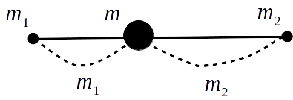
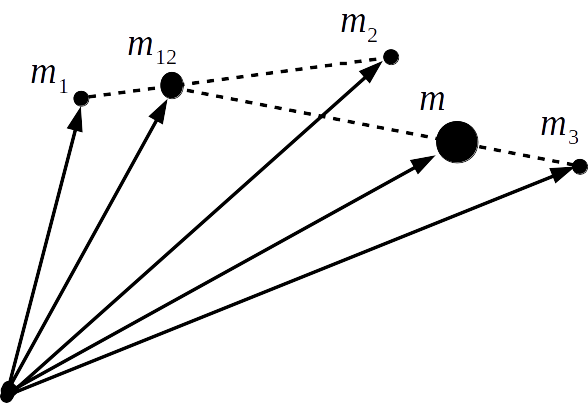
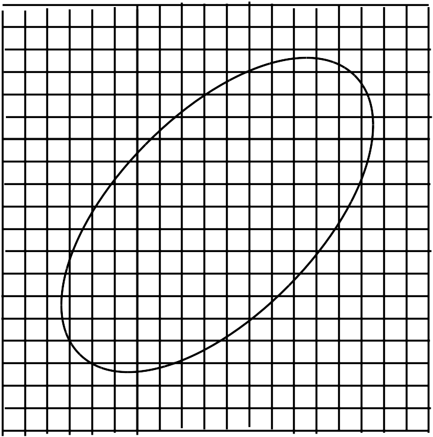

## 質点系の力学

　Newton力学では、物体を質点におきかえて正確に位置を指定してから、その時間変化を見ることで物体の運動を調べていた。このとき、質点を置く地点は物体内であれば何処でもよく、特に決められていないが場合によっては問題になることがあると考えられる。

    

例えば図のように質点が矢印に沿って運動を行ったものとすると、左の図では他の位置に質点を指定しても同じ矢印のような運動を行うので、全体的に物体は並進運動していることになる。しかし、右図にあるように途中で引っかかり回転運動をした場合には質点の位置によって変異が異なりという矛盾が起こってしまうため、単純に質点として扱えないことが分かる、同様に、変形する場合でも場所ごとに運動方向が違うことがわかる。以上のように、質点の力学では説明できない事象があるわけだが、このような運動はどのよう にして記述すれば良いのだろうか？考えてみると、まず質点を指定する位置ごとに運動が違うことから各場面ごとに別々の力が働いていることが予想される。これは言い換えると、各場面での質点は異なる運動方程式に従っていることになり、もし全体（物体）の運動を表すとなると、それらを全て見ていく必要があることになる。そこで、物体を質点の集まりとしてみなすこれは、物体の質点を置く位置により同じ力であるのに変位が異なる（運動状態が違う）ことによる。そこで、それぞれの質点がそもそも別の運動方程式に従うものとしてそれらをすべて見ることが物体全体の運動を記述するという方法をとる。

　今、物体を質点の集合体としてその内 $i$ 番目の運動方程式を記述すると
$$
    m_i
    \frac{\mathrm{d}^2\bm{r}_i}
    {\mathrm{d}t^2}=
    \bm{F}_{i}+
    \sum_{j=1(j\neq i)}^{N}\bm{F}_{ij}
$$
と書ける。ここで、$m_i、\bm{r}_i、\bm{F}_i、\bm{F}_{ij}、$ はそれぞれ質点の位置ベクトル、 位置ベクトル、外部からの力（外力）、別の $j$ 番目の質点との間に働く力（内力）を表している。さて、内力に関して作用・反作用の法則 $\bm{F}_{ij}=-\bm{F}_{ji}$ が成り立つため、先ほどの式を $i$ に対して総和をとると以下のように内力の項が相殺されて0となる。
$$
    \sum_{i=1}^N
    \left(
    m_i
    \frac{\mathrm{d}^2\bm{r}_i}
    {\mathrm{d}t^2}
    \right)=
    \sum_{i=1}^N
    \bm{F}_{i}
$$
ここで、右辺が質点全体にかかる力（合力）であることから全体的に見て
$$
    m\frac{\mathrm{d}^2\bm{r}}{\mathrm{d}t^2}=
    \bm{F}
$$
という形になっていると考えられる。そこで、$m$ を質点全体（物体自体）の質量として
$$
    \sum_{i=1}^N
    \left(
    m_i\frac{\mathrm{d}^2\bm{r}_i}
    {\mathrm{d}t^2}
    \right)=
    m
    \frac{\mathrm{d}^2}
    {\mathrm{d}t^2}
    \left(
    \frac{1}{m}\sum_{i=1}^N m_i\bm{r}_i
    \right)
$$
というように変形して比較してみると、$\bm{r}$ は以下の形で置くことができる。
$$
    \bm{r}=\frac{1}{m}\sum_{i=1}^N m_i\bm{r}_i
$$
この位置ベクトルが指す地点は、例として質点が2個（$N=2$）の場合だと
$$
    \bm{r}=
    \frac{m_1\bm{r}_1+m_2\bm{r}_2}{m_1+m_2}
$$
となっているため、内分点の公式と同じ形になっていることが見て取れる。

    

そのため、$\bm{r}$ は質点1と2の間を内分する地点の位置を指しており、この位置を物体の位置として扱うことになる。言い換えれば、物体を地点 $\bm{r}$ にある質量 $m(=m_1+m_2)$ の質点に置き換えるという操作を行っており、従来のときとほぼ同様なことをしていることが分かる。ただ、その位置はどこでもよいわけではなく、上式で制限されているところが従来と異なる。同じように、質点が3個の場合でも質量 $m$ の質点の位置は以下のようになる。
$$
    \bm{r}=
    \frac{m_1\bm{r}_1+m_2\bm{r}_2+m_3\bm{r}_3}
    {m_1+m_2+m_3}=
    \frac{(m_1+m_2)\bm{r}_{12}+m_3\bm{r}_3}
    {(m_1+m_2)+m_3}、
    \bm{r}_{12}=
    \frac{m_1\bm{r}_1+m_2\bm{r}_2}{m_1+m_2}
$$

    

以上が物体を質点系とみなしたときの話であるが、これを見ても分かるように質点の力学と同様、物体を位置$\bm{r}$ にある質量 $m$ の質点として扱うことができ、並進運動にも通じる考え方であると言える。そのため、ここからは物体を質点系として議論を進めていくことにする…と言いたいところだが、ここで質点系の質量 $m_i$ がどのような値になるかが分かっていない（Newton力学での質点系では惑星などをそのまま質点として扱っていたため、質量をそのまま適用できていた）ので、ここからはその疑問について議論していくことにする。

質点系の力学において、別々の物体を質点として それらの運動を記述していたことを考えると、物体自体を質点系とみなす場合にも同様な操作ができるものと思われる。そこで、物体を図のように小さい領域に分割して各領域を別々の物体として質点とおいてみる。普通に考えれば細かく分割していった方が点に近づいて良いように思えるが, このときあまりにも内部領域を小さくしてしまうと $1\mathrm{\AA}$ ぐらいの大きさで原子が観測されるため、古典力学の範囲を超えた議論をする必要が出てきてしまう（量子力学を参照）。このことから、分割した内部領域の大きさは原子が観測されない程度にする必要があり、さらには物体全体から見ても十分小さいもの（点に近いもの）でないといけないことになる。このことを踏まえながら物体を分割して質点系とみなすと、物体内で質点は連続的に分布しているので、元々の質点系（質点同士が離れている系）とは違うものとなっている。そのため、これと区別するために連続的に分布した質点系（あるいはこうみなした物体）のことを一般に**連続体**と呼ぶことが多い。
  

    

では、物体を連続体とみなすと運動はどのように記述されるかを見てみることにしよう。この場合も１つの質点に関する運動方程式は式で与えられるが、このときの質量 $m_i$ は内部領域の質量と同じものとなっている。この値は領域が物体の一部分であることをふまえると、全体の質量のうちどれだけ占めているかを見ると良いように思われる。言い換えると、どれだけ物体が内部領域内で密に詰まっているかということになるので、それを表すのに密度を用いてみると、以下のように書ける。
$$
    \rho_i=\frac{m_i}{V_i}　
    \rightarrow　m_i=\rho_i V_i
$$
これを見ると、密度が体積分だけあると質量になることが分かるので、１つの地点での値としてみなしても良く $\rho(\bm{r}_i)$ と書くことができる（言い換えれば、密度は内部領域内の質量の平均を表していると言える）。