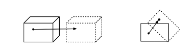
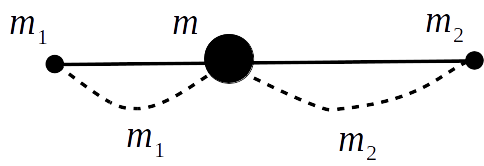
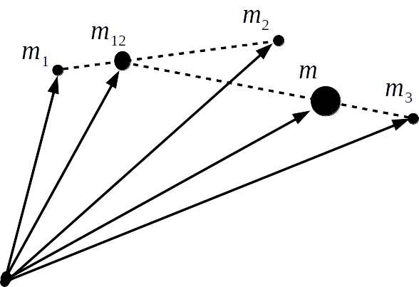

## 質点系の力学

　ここまでは単に物体を質点におきかえて正確に位置を指定してから、その時間変化を見ることで物体の運動を調べていた。このとき、質点を置く地点は物体内であれば何処でもよく特に指定があるわけではないが、場合によっては問題となってしまうことがある。

    

　例えば、上図のように質点が矢印に沿って運動を行ったものとすると、左側（並進運動）では他の位置に質点を指定しても矢印と同じ運動を行うので、全体的に物体は並進運動していることになる。しかし、右側（回転運動）にあるように途中で引っかかり回転した場合には質点の位置によって運動が異なるため、単純に質点として扱えないことが分かる、同様に、変形する場合でも場所ごとで運動の様子が違うことがわかる。このような運動はどのようにすればよいのか考えてみると、視点を変えてそもそも質点の指定する位置ごとで運動が違っているものと予想できる。言うなれば、それぞれの地点での質点は異なる運動方程式に従っており、全体（物体）の運動を表す際はそれら全て見ていく必要があることになる。そこで、それぞれの地点の質点が別の運動方程式に従うものとして、それらを踏まえて物体全体の運動を記述してみよう。

　今、物体を質点の集合体としてその内 $i$ 番目の運動方程式を記述すると

$$
    m_i
    \frac{\mathrm{d}^2\bm{r}_i}
    {\mathrm{d}t^2}=
    \bm{F}_{i}+
    \sum_{j=1(j\neq i)}^{N}\bm{F}_{ij}
$$

と書ける。ここで、$m_i、\bm{r}_i、\bm{F}_i、\bm{F}_{ij}、$ はそれぞれ質点の位置ベクトル、 位置ベクトル、外部からの力（外力）、別の $j$ 番目の質点との間に働く力（内力）を表している。さて、内力に関して作用・反作用の法則 $\bm{F}_{ij}=-\bm{F}_{ji}$ が成り立つため、先ほどの式を $i$ に対して総和をとると以下のように内力の項が相殺されて0となる。

$$
    \sum_{i=1}^N
    \left(
    m_i
    \frac{\mathrm{d}^2\bm{r}_i}
    {\mathrm{d}t^2}
    \right)=
    \sum_{i=1}^N
    \bm{F}_{i}
$$

ここで、右辺が質点全体にかかる力（合力）であることから全体的に見て

$$
    m\frac{\mathrm{d}^2\bm{r}}{\mathrm{d}t^2}=
    \bm{F}
$$

という形になっていると考えられる。そこで、$m$ を質点全体（物体自体）の質量として

$$
    \sum_{i=1}^N
    \left(
    m_i\frac{\mathrm{d}^2\bm{r}_i}
    {\mathrm{d}t^2}
    \right)=
    m
    \frac{\mathrm{d}^2}
    {\mathrm{d}t^2}
    \left(
    \frac{1}{m}\sum_{i=1}^N m_i\bm{r}_i
    \right)
$$

というように変形して比較してみると、$\bm{r}$ は以下の形で置くことができる。

$$
    \bm{r}=\frac{1}{m}\sum_{i=1}^N m_i\bm{r}_i
$$

　この位置ベクトルが指す地点は、例として質点が2個（$N=2$）の場合だと

$$
    \bm{r}=
    \frac{m_1\bm{r}_1+m_2\bm{r}_2}{m_1+m_2}
$$

となっているため、内分点の公式と同じ形になっていることが見て取れる（前回の $\bm{r}_G$ に相当）。

    

そのため、$\bm{r}$ は質点1と2の間を内分する地点の位置を指しており、この位置を物体の位置として扱うことになる。言い換えれば、物体を地点 $\bm{r}$ にある質量 $m(=m_1+m_2)$ の質点に置き換えるという操作を行っており、従来のときとほぼ同様なことをしていることが分かる。ただし、その位置はどこでもよいわけではなく、上式で制限されているところが従来と異なる。同じように、質点が3個の場合でも質量 $m$ の質点の位置は以下のようになる。このように、複数の質点をまとめて見た時に中心となる位置のことを一般的に **重心** と呼ぶ。

$$
    \bm{r}=
    \frac{m_1\bm{r}_1+m_2\bm{r}_2+m_3\bm{r}_3}
    {m_1+m_2+m_3}=
    \frac{(m_1+m_2)\bm{r}_{12}+m_3\bm{r}_3}
    {(m_1+m_2)+m_3}、
    \bm{r}_{12}=
    \frac{m_1\bm{r}_1+m_2\bm{r}_2}{m_1+m_2}
$$

    

　以上が物体を質点系とみなしたときの話であるが、これを見ても分かるように、物体の重心 $\bm{r}$ に質量 $m$ の質点があるものとみなすと、以前と同じように並進運動を扱うことができることが分かる。そのため、ここからは物体を質点系として議論を進めていくことにする。