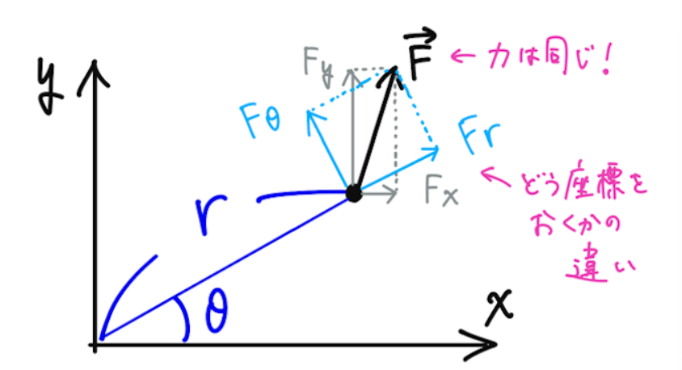
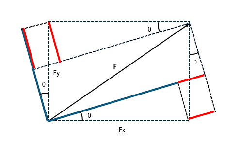

## 回転運動について

　前回までに単に質点としておけない運動として回転運動を挙げたので、まず簡単に質点が回転している場合の運動がどのようになるかを見てみよう。まず、回転というのはある一点を軸にその周囲を運動することを言う。それを見るときにちょうど二体問題で扱った極座標が便利なので、これを見ていくことにする。まず、通常の運動方程式は直交座標系を用いて

$$
    m\frac{\mathrm{d}^2x}{\mathrm{d}t^2}=
    F_x、
     m\frac{\mathrm{d}^2y}{\mathrm{d}t^2}=
    F_y
$$

となり、これを極座標におきかえると

$$
    x=r\cos\theta、
    y=r\sin\theta
$$

であることを踏まえて

$$
    \frac{\mathrm{d}^2x}{\mathrm{d}t^2}=
    \frac{\mathrm{d}^2r}
    {\mathrm{d}t^2}
    \cos\theta-
    2\frac{\mathrm{d}r}
    {\mathrm{d}t}
    \frac{\mathrm{d}\theta}
    {\mathrm{d}t}
    \sin\theta-
    r
    \frac{\mathrm{d}^2\theta}
    {\mathrm{d}t^2}
    \sin\theta-
    r
    \left(
    \frac{\mathrm{d}\theta}
    {\mathrm{d}t}
    \right)^2
    \cos\theta
$$
$$
     \frac{\mathrm{d}^2y}{\mathrm{d}t^2}=
     \frac{\mathrm{d}^2r}
    {\mathrm{d}t^2}
    \sin\theta+
    2\frac{\mathrm{d}r}
    {\mathrm{d}t}
    \frac{\mathrm{d}\theta}
    {\mathrm{d}t}
    \cos\theta+
    r
    \frac{\mathrm{d}^2\theta}
    {\mathrm{d}t^2}
    \cos\theta-
    r
    \left(
    \frac{\mathrm{d}\theta}
    {\mathrm{d}t}
    \right)^2
    \sin\theta
$$

と計算されることから、以下の方程式が得られる。

$$
    m\frac{\mathrm{d}^2x}{\mathrm{d}t^2}
    \cos\theta+
    m\frac{\mathrm{d}^2y}{\mathrm{d}t^2}
    \sin\theta=
    m\left[
        \frac{\mathrm{d}^2r}
        {\mathrm{d}t^2}-
        r
        \left(
        \frac{\mathrm{d}\theta}
        {\mathrm{d}t}
        \right)^2
    \right]=
    F_x\cos\theta+F_y\sin\theta
$$
$$
    -m\frac{\mathrm{d}^2x}{\mathrm{d}t^2}
    \sin\theta+
    m\frac{\mathrm{d}^2y}{\mathrm{d}t^2}
    \cos\theta=
    m\left(
        2\frac{\mathrm{d}r}
        {\mathrm{d}t}
        \frac{\mathrm{d}\theta}
        {\mathrm{d}t}+
        r
        \frac{\mathrm{d}^2\theta}
        {\mathrm{d}t^2}
    \right)=
    -F_x\sin\theta+F_y\cos\theta
$$

ここで右辺の力に関しては、それぞれ以下の図にある通り極座標の各成分の力になっていることが分かる（$F_r$ に関しては赤線と青線の長さを足したもの、$F_\theta$ については 青線から赤線を引いた長さになっている）。

$$
    F_r=F_x\cos\theta+F_y\sin\theta、
    F_\theta=F_y\cos\theta-F_x\sin\theta
$$

    
    

つまり、先ほどの方程式はそれぞれ極座標の各成分の運動方程式になっていることが分かる。

$$
    m\left[
        \frac{\mathrm{d}^2r}
        {\mathrm{d}t^2}-
        r
        \left(
        \frac{\mathrm{d}\theta}
        {\mathrm{d}t}
        \right)^2
    \right]=F_r、
    m\left(
        2\frac{\mathrm{d}r}
        {\mathrm{d}t}
        \frac{\mathrm{d}\theta}
        {\mathrm{d}t}+
        r
        \frac{\mathrm{d}^2\theta}
        {\mathrm{d}t^2}
    \right)=F_\theta
$$

ここで各成分を見てみると、動径方向については

$$
    m\frac{\mathrm{d}^2r}{\mathrm{d}t^2}=
    F_r+f、
    f=
    mr
    \left(
        \frac{\mathrm{d}\theta}{\mathrm{d}t}
    \right)^2
$$

といように通常の運動方程式にあたかも力 $f$ （遠心力）が遠ざかる方向に加わった形になっている。次に、角度方向に着目すると二体問題と同じように $r$ を書けて整理すると

$$
    \frac{\mathrm{d}L}{\mathrm{d}t}=
    rF_\theta、
    L=
    mr^2\frac{\mathrm{d}\theta}{\mathrm{d}t}
$$

というように角運動量 $L$ を用いて書ける。二体問題の場合は動径方向の力のみであったため、角運動量が保存されている状態であった。また、回転する場合には条件として周期 $T$ のときに同じ角度に戻る