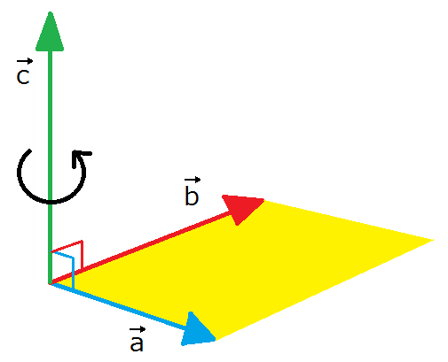

## 回転運動について

　ここからは、どのように回転運動を扱うかを述べていくことにする。そもそも回転というのは、ある一点を軸にその周囲を運動することを言う。その様子を記述するとき、ちょうど二体問題で扱った極座標が便利であるため、通常の運動方程式

$$
    m\frac{\mathrm{d}^2x}{\mathrm{d}t^2}=F_x、
    m\frac{\mathrm{d}^2y}{\mathrm{d}t^2}=F_y
$$

を以下のように置き換えてみることにする。

$$
    x=r\cos\theta、
    y=r\sin\theta
$$

まず、各方向の速度を置き換えると

$$
    v_x=
    \frac{\mathrm{d}x}{\mathrm{d}t}=
    \frac{\mathrm{d}r}{\mathrm{d}t}\cos\theta-
    r\frac{\mathrm{d}\theta}{\mathrm{d}t}\sin\theta
$$
$$
    v_y=
    \frac{\mathrm{d}y}{\mathrm{d}t}=
    \frac{\mathrm{d}r}{\mathrm{d}t}\sin\theta+
    r\frac{\mathrm{d}\theta}{\mathrm{d}t}\cos\theta
$$

となるが、ここで極座標での速度 $v_r,v_\theta$ は以下の図のように $r,\theta$ が増加する方向を正とした成分で表されることから

$$
    v_r=v_x\cos\theta+v_y\sin\theta、
    v_\theta=v_y\cos\theta-v_x\sin\theta
$$

    
    

である（$v_r$ に関しては赤線と青線の長さを足したもの、$v_\theta$ については 青線から赤線を引いた長さになっている）ことを踏まえ、この左辺に先ほど求めた速度を代入すると以下の式が求められる。

$$
    v_r=
    \frac{\mathrm{d}r}{\mathrm{d}t}、
    v_\theta=
    r\frac{\mathrm{d}\theta}{\mathrm{d}t}
$$

この形については、以下のように各方向の微小変化を見ることで正しいものと確認できる。

    

次に、加速度についても同様に

$$
    a_x=
    \frac{\mathrm{d}^2x}{\mathrm{d}t^2}=
    \frac{\mathrm{d}^2r}
    {\mathrm{d}t^2}
    \cos\theta-
    2\frac{\mathrm{d}r}
    {\mathrm{d}t}
    \frac{\mathrm{d}\theta}
    {\mathrm{d}t}
    \sin\theta-
    r
    \frac{\mathrm{d}^2\theta}
    {\mathrm{d}t^2}
    \sin\theta-
    r
    \left(
    \frac{\mathrm{d}\theta}
    {\mathrm{d}t}
    \right)^2
    \cos\theta
$$
$$
    a_y=
    \frac{\mathrm{d}^2y}{\mathrm{d}t^2}=
    \frac{\mathrm{d}^2r}
    {\mathrm{d}t^2}
    \sin\theta+
    2\frac{\mathrm{d}r}
    {\mathrm{d}t}
    \frac{\mathrm{d}\theta}
    {\mathrm{d}t}
    \cos\theta+
    r
    \frac{\mathrm{d}^2\theta}
    {\mathrm{d}t^2}
    \cos\theta-
    r
    \left(
    \frac{\mathrm{d}\theta}
    {\mathrm{d}t}
    \right)^2
    \sin\theta
$$

と置き換えたうえで、極座標での加速度 $a_r,a_\theta$ との関係が

$$
    a_r=a_x\cos\theta+a_y\sin\theta、
    a_\theta=a_y\cos\theta-a_x\sin\theta
$$

であることから、求めた加速度を代入してみると

$$
    a_r=
    \frac{\mathrm{d}^2r}
    {\mathrm{d}t^2}-
    r
    \left(
        \frac{\mathrm{d}\theta}{\mathrm{d}t}
    \right)^2、
    a_\theta=
    2\frac{\mathrm{d}r}
    {\mathrm{d}t}
    \frac{\mathrm{d}\theta}
    {\mathrm{d}t}+
    r
    \frac{\mathrm{d}^2\theta}
    {\mathrm{d}t^2}
$$

となるが、一方で力についても加速度と同様に

$$
    F_r=
    F_x\cos\theta+F_y\sin\theta、
    F_\theta=
    F_y\cos\theta-F_x\sin\theta
$$

が成り立つことから、極座標での運動方程式は以下の通りになっていることが分かる。

$$
    m\left[
        \frac{\mathrm{d}^2r}
        {\mathrm{d}t^2}-
        r
        \left(
        \frac{\mathrm{d}\theta}
        {\mathrm{d}t}
        \right)^2
    \right]=F_r、
    m\left(
        2\frac{\mathrm{d}r}
        {\mathrm{d}t}
        \frac{\mathrm{d}\theta}
        {\mathrm{d}t}+
        r
        \frac{\mathrm{d}^2\theta}
        {\mathrm{d}t^2}
    \right)=F_\theta
$$

これらの式を詳しく見ていくと、動径方向については

$$
    m\frac{\mathrm{d}^2r}{\mathrm{d}t^2}=
    F_r+f_{r,\theta}、
    f_{r,\theta}=
    mr
    \left(
        \frac{\mathrm{d}\theta}{\mathrm{d}t}
    \right)^2
$$

というように、通常の運動方程式にあたかも力 $f_{r,\theta}$ （遠心力）が遠ざかる方向に加わった形になっている。次に、角度方向については二体問題と同じように $r$ をかけて整理すると

$$
    \frac{\mathrm{d}L}{\mathrm{d}t}=
    rF_\theta、
    L=
    mr^2\frac{\mathrm{d}\theta}{\mathrm{d}t}
$$

というように $L$ を用いて書ける。ここで回転する条件を考えたとき、角度方向に動いていれば回転することから角度の時間微分（**角速度**）が常に0でないものと思われる。そこで、角速度を $\omega$ として先ほどの式を表記し直すと

$$
    f_{r,\theta}=
    mr\omega^2、
    L=mr^2\omega、
    \omega=
    \frac{\mathrm{d}\theta}{\mathrm{d}t}
$$

となるが、このうち $L$ は従来の運動量が質量（慣性質量）と速度の掛け算であったことを踏まえ

$$
    L=I\omega、
    I=mr^2
$$

というように $I$（**慣性モーメント**）を用いると、$L$ は角度方向の運動量（**角運動量**）として扱うことができる。すると、$rF_\theta$ は回転運動を変化させる量として $N$（**モーメント**）としてみなすことができ、

$$
    \frac{\mathrm{d}L}{\mathrm{d}t}=N、
    L=I\omega、N=rF_\theta
$$

というように回転の運動方程式として記述される。ここで、$N$ について詳しく見ていくために直交座標系で書くと

$$
    N=rF_\theta=
    r\cos\theta F_y - r\sin\theta F_x =
    xF_y - yF_x 
$$

となるが、これは外積と呼ばれる関係になっていることが予想される。例えば、ベクトル $\bm{a},\bm{b}$ が以下の図のようになっており
$$
    \bm{a}=(a_x,a_y,0)、\bm{b}=(b_x,b_y,0)
$$

とすると、外積 $\bm{c}$ は以下の形で表される。

$$
    \bm{c}=\bm{a}\times\bm{b}=
    (0,0,a_xb_y-a_yb_x)
$$

    

試しに $\bm{a}=\bm{r},\bm{b}=\bm{F}$ として外積をとると、以下の通り $z$ 成分が先ほどの $N$ と一致していることが分かる。

$$
    \bm{r}\times\bm{F}=
    (0,0,xF_y-yF_x)=
    (0,0,N)
$$

そのため、回転方向については $z$ 成分に関する方程式になっていると考えられる。そこで、運動方程式

$$
    m\frac{\mathrm{d}\bm{v}}{\mathrm{d}t}=\bm{F}
$$

に外積をとることで一般的に回転の運動方程式がどのようになるかを見てみることにする。まず、両辺に $\bm{r}$ と外積をとると

$$
    m
    \left(
    \bm{r}\times
    \frac{\mathrm{d}\bm{v}}{\mathrm{d}t}
    \right)
    =\bm{N}、
    \bm{N} = \bm{r}\times\bm{F}
$$

というように右辺がモーメント $\bm{N}$ となるので、左辺を変形してみると

$$
    \left(
    \bm{r}\times
    \frac{\mathrm{d}\bm{v}}{\mathrm{d}t}
    \right)=
    \frac{\mathrm{d}}{\mathrm{d}t}
    (\bm{r}\times\bm{v})-
    (\bm{v}\times\bm{v})=
    \frac{\mathrm{d}}{\mathrm{d}t}
    (\bm{r}\times\bm{v})
$$

となるので以下の通りになる。

$$
    m
    \frac{\mathrm{d}}{\mathrm{d}t}
    (\bm{r}\times\bm{v})=
    \bm{N}
$$

そして、左辺を極座標で整理することで

$$
    m(\bm{r}\times\bm{v})=
    \left(
        0,0,
        mx
        \frac{\mathrm{d}y}{\mathrm{d}t}-
        my
        \frac{\mathrm{d}x}{\mathrm{d}t}
    \right)=
    I\bm{\omega}、
    \bm{\omega}=(0,0,\omega)
$$

というように角運動量 $L$ の $z$ 成分と同じ形になっていることが分かる。そのため、最終的に回転の運動方程式は以下の通りになる。

$$
    m\frac{\mathrm{d}^2r}{\mathrm{d}t^2}=
    F_r+f_{r,\theta}、
    f_{r,\theta}=
    mr\omega^2
$$
$$
    \frac{\mathrm{d}\bm{L}}
    {\mathrm{d}t}=
    \bm{N}、
    \bm{L}=
    m(\bm{r}\times\bm{v})=
    I\bm{\omega}、
    \bm{N}=\bm{r}\times\bm{F}
$$

ここまでは話を簡単にするため2次元を扱ってきたが、同様に3次元においても成立するかを見てみる。まず、直交座標系 $(x,y,z)$ と極座標 $(r,\theta,\phi)$ に置き換えると

$$
    x=r\sin\theta\cos\phi、
    y=r\sin\theta\sin\phi、
    z=r\cos\theta
$$

であるため、まず各成分の速度を求めると

$$
    v_x=
    \frac{\mathrm{d}x}{\mathrm{d}t}=
    \frac{\mathrm{d}r}{\mathrm{d}t}
    \sin\theta\cos\phi+
    r
    \frac{\mathrm{d}\theta}{\mathrm{d}t}
    \cos\theta\cos\phi-
    r\sin\theta
    \frac{\mathrm{d}\phi}{\mathrm{d}t}
    \sin\phi
$$
$$
    v_y=
    \frac{\mathrm{d}y}{\mathrm{d}t}=
    \frac{\mathrm{d}r}{\mathrm{d}t}
    \sin\theta\sin\phi+
    r
    \frac{\mathrm{d}\theta}{\mathrm{d}t}
    \cos\theta\sin\phi+
    r\sin\theta
    \frac{\mathrm{d}\phi}{\mathrm{d}t}
    \cos\phi
$$
$$
    v_z=
    \frac{\mathrm{d}z}{\mathrm{d}t}=
    \frac{\mathrm{d}r}{\mathrm{d}t}
    \cos\theta-
    r
    \frac{\mathrm{d}\theta}{\mathrm{d}t}
    \sin\theta
$$

となる。一方で極座標での速度 $v_r,v_\theta,v_\phi$ は二次元のときの関係式を利用すると、まず

$$
    v_{x,y}=v_x\cos\phi+v_y\sin\phi、
    v_\phi=v_y\cos\phi-v_x\sin\phi
$$

というように $x,y$ 平面上の動径 $r_{x,y}$ 方向および角度 $\phi$ 方向の速度になり、動径 $r$ 方向と角度 $\phi$ 方向の速度も

$$
    v_r=v_z\cos\theta+v_{x,y}\sin\theta、
    v_\theta=v_{x,y}\cos\theta-v_z\sin\theta
$$

    

となることから、求めた速度を代入してみると

$$
    v_{x,y}=
    \frac{\mathrm{d}r}{\mathrm{d}t}
    \sin\theta+
    r
    \frac{\mathrm{d}\theta}{\mathrm{d}t}
    \cos\theta、
    v_\phi=
    r\sin\theta
    \frac{\mathrm{d}\phi}{\mathrm{d}t}、
    v_r=
    \frac{\mathrm{d}r}{\mathrm{d}t}、
    v_\theta=
    r\frac{\mathrm{d}\theta}{\mathrm{d}t}
$$

このうち、速度 $v_r,v_\theta,v_\phi$ については以下のように微小変化を見ることで正しいことが分かる。

    

そして、加速度についても

$$
    \begin{align*}
        a_x=\frac{\mathrm{d}^2x}{\mathrm{d}t^2}
        &=
        \frac{\mathrm{d}}{\mathrm{d}t}
        \left(
            \frac{\mathrm{d}r}{\mathrm{d}t}
            \sin\theta\cos\phi+
            r\frac{\mathrm{d}\theta}{\mathrm{d}t}
            \cos\theta\cos\phi-
            r\frac{\mathrm{d}\phi}{\mathrm{d}t}
            \sin\theta\sin\phi
        \right)\\
        &=
        \frac{\mathrm{d}^2r}{\mathrm{d}t^2}
        \sin\theta\cos\phi+
        2\frac{\mathrm{d}r}{\mathrm{d}t}
        \frac{\mathrm{d}\theta}{\mathrm{d}t}
        \cos\theta\cos\phi-
        2\frac{\mathrm{d}r}{\mathrm{d}t}
        \frac{\mathrm{d}\phi}{\mathrm{d}t}
        \sin\theta\sin\phi\\
        &+
        r\frac{\mathrm{d}^2\theta}{\mathrm{d}t^2}
        \cos\theta\cos\phi-
        r
        \left(
            \frac{\mathrm{d}\theta}{\mathrm{d}t}
        \right)^2
        \sin\theta\cos\phi-
        2r\frac{\mathrm{d}\theta}{\mathrm{d}t}
        \frac{\mathrm{d}\phi}{\mathrm{d}t}
        \cos\theta\sin\phi\\
        &-
        r\frac{\mathrm{d}^2\phi}{\mathrm{d}t^2}
        \sin\theta\sin\phi-
        r
        \left(
            \frac{\mathrm{d}\phi}{\mathrm{d}t}
        \right)^2
        \sin\theta\cos\phi
    \end{align*}
$$
$$
    \begin{align*}
        a_y=\frac{\mathrm{d}^2y}{\mathrm{d}t^2}
        &=
        \frac{\mathrm{d}}{\mathrm{d}t}
        \left(
            \frac{\mathrm{d}r}{\mathrm{d}t}
            \sin\theta\sin\phi+
            r\frac{\mathrm{d}\theta}{\mathrm{d}t}
            \cos\theta\sin\phi+
            r\frac{\mathrm{d}\phi}{\mathrm{d}t}
            \sin\theta\cos\phi
        \right)\\
        &=
        \frac{\mathrm{d}^2r}{\mathrm{d}t^2}
        \sin\theta\sin\phi+
        2\frac{\mathrm{d}r}{\mathrm{d}t}
        \frac{\mathrm{d}\theta}{\mathrm{d}t}
        \cos\theta\sin\phi+
        2\frac{\mathrm{d}r}{\mathrm{d}t}
        \frac{\mathrm{d}\phi}{\mathrm{d}t}
        \sin\theta\cos\phi\\
        &+
        r\frac{\mathrm{d}^2\theta}{\mathrm{d}t^2}
        \cos\theta\sin\phi-
        r
        \left(
            \frac{\mathrm{d}\theta}{\mathrm{d}t}
        \right)^2
        \sin\theta\sin\phi+
        2r\frac{\mathrm{d}\theta}{\mathrm{d}t}
        \frac{\mathrm{d}\phi}{\mathrm{d}t}
        \cos\theta\cos\phi\\
        &+
        r\frac{\mathrm{d}^2\phi}{\mathrm{d}t^2}
        \sin\theta\cos\phi-
        r
        \left(
            \frac{\mathrm{d}\phi}{\mathrm{d}t}
        \right)^2
        \sin\theta\sin\phi
    \end{align*}
$$
$$
    \begin{align*}
        a_z=\frac{\mathrm{d}^2z}{\mathrm{d}t^2}
        &=
        \frac{\mathrm{d}}{\mathrm{d}t}
        \left(
            \frac{\mathrm{d}r}{\mathrm{d}t}
            \cos\theta-
            r\frac{\mathrm{d}\theta}{\mathrm{d}t}
            \sin\theta
        \right)\\
        &=
        \frac{\mathrm{d}^2r}{\mathrm{d}t^2}
        \cos\theta-
        2\frac{\mathrm{d}r}{\mathrm{d}t}
        \frac{\mathrm{d}\theta}{\mathrm{d}t}
        \sin\theta-
        r\frac{\mathrm{d}^2\theta}{\mathrm{d}t^2}
        \sin\theta-
        r
        \left(
            \frac{\mathrm{d}\theta}{\mathrm{d}t}
        \right)^2
        \cos\theta
    \end{align*}
$$

となるが、先ほどの速度と同じように極座標において

$$
    a_{x,y}=a_x\cos\phi+a_y\sin\phi、
    a_\phi=a_y\cos\phi-a_x\sin\phi
$$
$$
    a_r=a_z\cos\theta+a_{x,y}\sin\theta、
    a_\theta=a_{x,y}\cos\theta-a_z\sin\theta
$$

が成り立つものとして代入してみると

$$
    a_{x,y}=
    \frac{\mathrm{d}^2r}{\mathrm{d}t^2}
    \sin\theta+
    2\frac{\mathrm{d}r}{\mathrm{d}t}
    \frac{\mathrm{d}\theta}{\mathrm{d}t}
    \cos\theta+
    r\frac{\mathrm{d}^2\theta}{\mathrm{d}t^2}
    \cos\theta-
    r
    \left(
        \frac{\mathrm{d}\theta}{\mathrm{d}t}
    \right)^2
    \sin\theta-
    r
    \left(
        \frac{\mathrm{d}\phi}{\mathrm{d}t}
    \right)^2
    \sin\theta
$$
$$
    a_\phi=
    2\frac{\mathrm{d}r}{\mathrm{d}t}
    \frac{\mathrm{d}\phi}{\mathrm{d}t}
    \sin\theta+
    2r\frac{\mathrm{d}\theta}{\mathrm{d}t}
    \frac{\mathrm{d}\phi}{\mathrm{d}t}
    \cos\theta+
    r\frac{\mathrm{d}^2\phi}{\mathrm{d}t^2}
    \sin\theta
$$
$$
    a_r=
    \frac{\mathrm{d}^2r}{\mathrm{d}t^2}-
    r
    \left(
        \frac{\mathrm{d}\theta}{\mathrm{d}t}
    \right)^2-
    r
    \left(
        \frac{\mathrm{d}\phi}{\mathrm{d}t}
    \right)^2
    \sin^2\theta
$$
$$
    a_\theta=
    r
    \frac{\mathrm{d}^2\theta}{\mathrm{d}t^2}+
    2
    \frac{\mathrm{d}r}{\mathrm{d}t}
    \frac{\mathrm{d}\theta}{\mathrm{d}t}-
    r
    \left(
        \frac{\mathrm{d}\phi}{\mathrm{d}t}
    \right)^2
    \sin\theta\cos\theta
$$

となる。そのため、極座標での各成分の運動方程式は

$$
    v_r=
    \left(
        \frac{\mathrm{d}r}{\mathrm{d}t}
    \right)、
    \omega_\theta=
     \left(
        \frac{\mathrm{d}\theta}{\mathrm{d}t}
    \right)、
    \omega_\phi=
     \left(
        \frac{\mathrm{d}\phi}{\mathrm{d}t}
    \right)
$$

と置くことで、以下の通りになる。

$$
    m\frac{\mathrm{d}v_r}{\mathrm{d}t}-
    mr\omega_\theta^2-
    mr\omega_\phi^2\sin^2\theta=
    \left(
        F_x\cos\phi+
        F_y\sin\phi
    \right)
    \sin\theta+
    F_z\cos\theta
$$
$$
    mr
    \frac{\mathrm{d}\omega_\theta}{\mathrm{d}t}+
    2mv_r\omega_\theta-
    mr\omega_\phi^2\sin\theta\cos\theta=
    \left(
        F_x\cos\phi+
        F_y\sin\phi
    \right)
    \cos\theta-
    F_z\sin\theta
$$
$$
    mr
    \frac{\mathrm{d}\omega_\phi}{\mathrm{d}t}
    \sin\theta+
    2mr\omega_\theta\omega_\phi\cos\theta+
    2mv_r\omega_\phi\sin\theta=
    -F_x\sin\phi+
    F_y\cos\phi
$$

ここで、2次元のときの力の関係式を踏まえると

$$
    F_{x,y}=
    F_x\cos\phi+F_y\sin\phi、
    F_\phi=
    F_y\cos\phi-F_x\sin\phi
$$

というように $x,y$ 平面上の動径 $r_{x,y}$ 方向および角度 $\phi$ 方向の力になり、動径 $r$ 方向と角度 $\theta$ 方向の力も

$$
    F_r=
    F_z\cos\theta+
    F_{x,y}\sin\theta、
    F_\theta=
    F_{x,y}\cos\theta-
    F_z\sin\theta
$$

という関係にあることから、最終的に以下の形になる。

$$
    m\frac{\mathrm{d}v_r}{\mathrm{d}t}-
    mr\omega_\theta^2-
    mr\omega_\phi^2\sin^2\theta=
    F_r
$$
$$
    mr
    \frac{\mathrm{d}\omega_\theta}{\mathrm{d}t}+
    2mv_r\omega_\theta-
    mr\omega_\phi^2\sin\theta\cos\theta=
    F_\theta
$$
$$
    mr
    \frac{\mathrm{d}\omega_\phi}{\mathrm{d}t}
    \sin\theta+
    2mr\omega_\theta\omega_\phi\cos\theta+
    2mv_r\omega_\phi\sin\theta=
    F_\phi
$$

ここで、動径方向の運動方程式を整理すると

$$
    m\frac{\mathrm{d}v_r}{\mathrm{d}t}-
    \left(
        mr\omega_\theta^2+
        mr\omega_\phi^2\sin^2\theta
    \right)=
    F_r
$$

となるが、括弧内の部分は遠心力となっている。実際、第１項目については、$x,y$ と $z$ 平面での遠心力となるため、

$$
    f_{r,\theta}=
    mr\omega_\theta^2
$$

となる。第2項目については、$x,y$ 平面上での遠心力が

$$
    f_{x,y}=
    m(r\sin\theta)\omega_\phi^2
$$

であり、先ほどの動径方向の関係式を利用すると 

$$
    f_{r,\phi}=
    F_z\cos\theta+
    F_{x,y}\sin\theta=
    0+f_{x,y}\sin\theta=
    mr\omega_\phi^2\sin^2\theta
$$

というように第2項目の力になっていることが分かる。そのため、動径方向については以下のようになると思われる。

$$
    m\frac{\mathrm{d}v_r}{\mathrm{d}t}=
    F_r+
    (f_{r,\theta}+f_{r,\phi})、
    f_{r,\theta}=
    mr\omega_\theta^2、
    f_{r,\phi}=
    [m(r\sin\theta)\omega_\phi^2]\sin\theta
$$

このことからも伺えるように $\theta$ の方向には $r$ 、$\phi$ の方向には $r\sin\theta$ の位置で回転することから

$$
    L_\theta=
    mr^2\omega_\theta、
    L_\phi=
    m(r\sin\theta)^2\omega_\phi
$$

と角運動量をおき、これらを微分してみると $\theta,\phi$ の運動方程式も利用することで

$$
    \frac{\mathrm{d}L_\theta}{\mathrm{d}t}
    =
    r\left(
    mr
    \frac{\mathrm{d}\omega_\theta}{\mathrm{d}t}+
    2mv_r\omega_\theta
    \right)=
    r
    \left(
        F_\theta+
        mr\omega_\phi^2\sin\theta\cos\theta
    \right)
$$
$$
    \frac{\mathrm{d}L_\phi}{\mathrm{d}t}
    =
    r\sin\theta
    \left(
    mr
    \frac{\mathrm{d}\omega_\phi}{\mathrm{d}t}
    \sin\theta+
    2mr\omega_\theta\omega_\phi\cos\theta+
    2mv_r\omega_\phi\sin\theta
    \right)=
    r\sin\theta F_\phi
$$

が得られる。ここで、$L_\theta$ に関する式の第二項目については、$\phi$ 方向の回転に対する遠心力の $\theta$ 方向の成分であり、実際

$$
    f_{\theta,\phi}=
    F_{x,y}\cos\theta-
    F_z\sin\theta=
    m(r\sin\theta)\omega_\phi^2\cos\theta+0=
    mr\omega_\phi^2\sin\theta\cos\theta
$$

となることからも分かる。以上のことから、以下の形にまとめられることが分かる。

$$
    m\frac{\mathrm{d}v_r}{\mathrm{d}t}=
    F_r+
    (f_{r,\theta}+f_{r,\phi})、
    f_{r,\theta}=
    mr\omega_\theta^2、
    f_{r,\phi}=
    [m(r\sin\theta)\omega_\phi^2]\sin\theta
$$
$$
    \frac{\mathrm{d}L_\theta}{\mathrm{d}t}
    =
    r(F_\theta+f_{\theta,\phi})、
    L_\theta=
    mr^2\omega_\theta、
    f_{\theta,\phi}=
    [m(r\sin\theta)\omega_\phi^2]\cos\theta
$$
$$
    \frac{\mathrm{d}L_\phi}{\mathrm{d}t}
    =
    r\sin\theta F_\phi、
    L_\phi=
    m(r\sin\theta)^2\omega_\phi
$$

ここで $L_\theta$ と $L_\phi$ の関係式が

$$
    \frac{\mathrm{d}\bm{L}}{\mathrm{d}t}=
    \bm{N}、
    \bm{L}=(\bm{r}\times\bm{v})、
    \bm{N}=\bm{r}\times\bm{F}
$$

に対応しているか見てみよう。まず、角運動量が直交座標系において

$$
    L_x=m(yv_z-zv_y)、
    L_y=m(zv_x-xv_z)、
    L_z=m(xv_y-yv_x)
$$

となることから、極座標では以下のようになる。

$$
    L_x=
    -mr^2
    (
        \omega_\theta\sin\phi+
        \omega_\phi\sin\theta\cos\theta\cos\phi
    )
$$
$$
    L_y=
    mr^2
    (
        \omega_\theta\cos\phi-
        \omega_\phi\sin\theta\cos\theta\sin\phi
    )
    
$$
$$
    L_z=
    mr^2\omega_\phi\sin^2\theta
$$

また、$x,y$ 平面上において動径 $r_{x,y}$ 方向および $r_{x,y}$ に垂直な方向（角度 $\theta$ に垂直な方向）の角運動量が

$$
    L_{x,y}=
    L_x\cos\phi+L_y\sin\phi、
    L_\theta=
    L_y\cos\phi-L_x\sin\phi
$$

であり、動径 $r$ 方向と $r$ に垂直な方向についても

$$
    L_r=
    L_z\cos\theta+
    L_{x,y}\sin\theta、
    L_{r_\perp}=
    L_{x,y}\cos\theta-
    L_z\sin\theta
$$

であることから、これらに代入すると

$$
    L_{x,y}=
    -mr^2\omega_\phi
    \sin\theta\cos\theta、
    L_\theta=
    mr^2\omega_\theta、
    L_r=0、
    L_{r_\perp}=
    -mr^2\omega_\phi\sin\theta
$$

    

となる。このうち、$L_\theta$ は先ほど運動方程式から求めた形と一致していることが分かる。$L_\phi$ については、形を見比べると $L_\phi=L_z$ であるため、確認のため時間微分をとり

$$
    \frac{\mathrm{d}L_\phi}{\mathrm{d}t}=
    \frac{\mathrm{d}L_z}{\mathrm{d}t}=
    xF_y-yF_x
$$

とすると、極座標において

$$
    x=r\sin\theta\cos\phi、
    y=r\sin\theta\sin\phi、
    F_\phi=F_y\cos\phi-F_x\sin\phi
$$

となることを踏まえて整理すると

$$
    \frac{\mathrm{d}L_\phi}{\mathrm{d}t}=
    r\sin\theta
    (F_y\cos\phi-F_x\sin\phi)=
    r\sin\theta F_\phi
$$

となる。そのため、3次元においても回転の運動方程式

$$
    \frac{\mathrm{d}\bm{L}}{\mathrm{d}t}=
    \bm{N}、
    \bm{L}=(\bm{r}\times\bm{v})、
    \bm{N}=\bm{r}\times\bm{F}
$$

が成り立つことが分かる。あるいは角速度 $\bm{\omega}$ に関して角運動量と同じように

$$
    \omega_{x,y}=
    \omega_x\cos\phi+\omega_y\sin\phi、
    \omega_\theta=
    \omega_y\cos\phi-\omega_x\sin\phi
$$
$$
    \omega_r=
    \omega_z\cos\theta+
    \omega_{x,y}\sin\theta、
    \omega_{r_\perp}=
    \omega_{x,y}\cos\theta-
    \omega_z\sin\theta
$$

とすると、$\omega_\theta$ に関して $L_\theta$ が

$$
    L_\theta=mr^2\omega_\theta=
    L_y\cos\phi-L_x\sin\phi
$$

であることから、

$$
    \omega_x=
    \frac{L_x}{mr^2}=
    -(\omega_\theta\sin\phi+
    \omega_\phi\sin\theta\cos\theta\cos\phi)
$$
$$
    \omega_y=
    \frac{L_y}{mr^2}=
    \omega_\theta\cos\phi-
    \omega_\phi\sin\theta\cos\theta\sin\phi
$$

であり、これを $\omega_{x,y}$ の式に代入すると以下の通りになる。

$$
    \omega_{x,y}=
    -\omega_\phi\sin\theta\cos\theta
$$

さらに、動径方向の回転成分がないことから $\omega_r=0$ であるため、$\omega_r$ の式から

$$
    \omega_z=\omega_\phi\sin^2\theta
$$

であり、これを最後の式に代入すると

$$
    \omega_{r_\perp}=
    -\omega_\phi\sin\theta
$$

であることになる。このことから、$I=mr^2$ とすることで $\bm{L}=I\bm{\omega}$ と表されることが分かる。