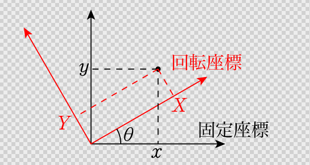
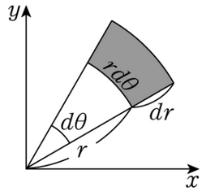
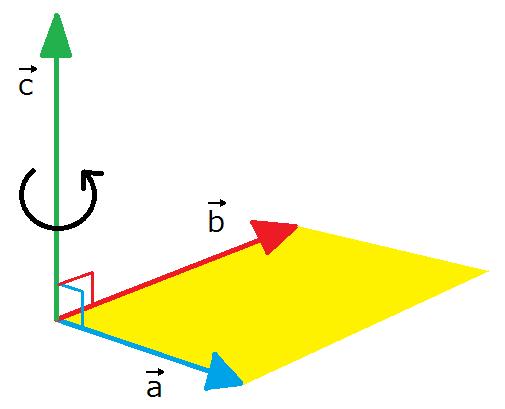
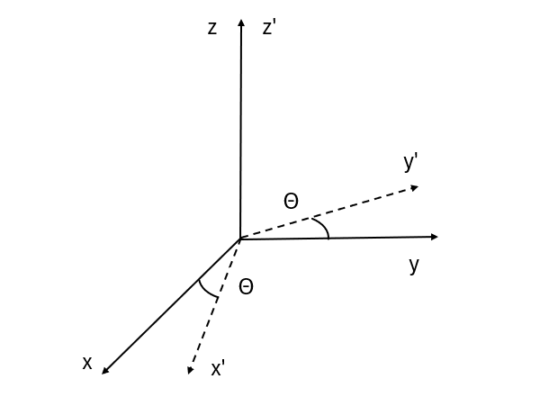
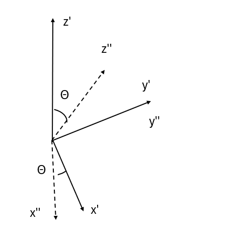
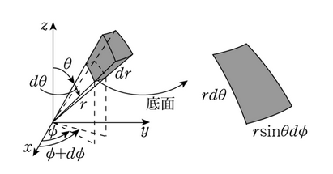
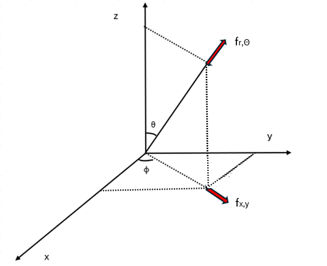

## 回転運動について

　ここからは、どのように回転運動を扱うかを述べていくことにする。そもそも回転というのは、ある一点を軸にその周囲を運動することを言う。その様子を記述するとき、ちょうど二体問題で扱った極座標 $(r,\theta)$ が便利であるため、試しに運動方程式

$$
    m\frac{\mathrm{d}^2\bm{r}}{\mathrm{d}t^2}=\bm{F}
    
$$

を変形してどのように記述されるかを見てみよう。ここで、$\bm{r}$ は質点の位置、$\bm{F}$ は質点に働く力、 $m$ は質点の質量としている 。まず、直交座標系 $(x,y)$ を用いて

$$
    m\frac{\mathrm{d}^2x}{\mathrm{d}t^2}=F_x、
    m\frac{\mathrm{d}^2y}{\mathrm{d}t^2}=F_y
$$

となるが、ここで直交座標系と極座標との間では以下の関係式が成り立つ。

$$
    x=r\cos\theta、
    y=r\sin\theta
$$

この関係式というのは、座標を回転させたときに得られる変換式の一つの応用例となっている。実際、原点Oを軸に座標系 $(x,y)$ を角度 $\theta$ だけ回転させて座標系 $(X,Y)$ に変換した際、

    

$$
    X=x\cos\theta+y\sin\theta、
    Y=-x\sin\theta+y\cos\theta
$$

となるが、この逆変換を求めると

$$
    x=X\cos\theta-Y\sin\theta、
    y=X\sin\theta+Y\cos\theta
$$

であるため、$X=r,Y=r_\theta=0$ とすると極座標の形になること分かる。このことを踏まえたうえで、まず各方向の速度を極座標であらわすと

$$
    v_x=
    \frac{\mathrm{d}x}{\mathrm{d}t}=
    \frac{\mathrm{d}r}{\mathrm{d}t}\cos\theta-
    r\frac{\mathrm{d}\theta}{\mathrm{d}t}\sin\theta
$$
$$
    v_y=
    \frac{\mathrm{d}y}{\mathrm{d}t}=
    \frac{\mathrm{d}r}{\mathrm{d}t}\sin\theta+
    r\frac{\mathrm{d}\theta}{\mathrm{d}t}\cos\theta
$$

となるが、回転座標の逆変換の式と見比べてみると以下のようになっているものと予想される。

$$
    v_r=
    \frac{\mathrm{d}r}{\mathrm{d}t}、
    v_{r_\theta}=
    r\frac{\mathrm{d}\theta}{\mathrm{d}t}
$$

この形については、以下の図のように各方向の微小変化を見ることで正しいものと確認できる。

    

次に、加速度についても同様に

$$
    a_x=
    \frac{\mathrm{d}^2x}{\mathrm{d}t^2}=
    \left[
        \frac{\mathrm{d}^2r}{\mathrm{d}t^2}-
        r
        \left(
            \frac{\mathrm{d}\theta}{\mathrm{d}t}
        \right)^2
    \right]
    \cos\theta-
    \left[
        2\frac{\mathrm{d}r}{\mathrm{d}t}
        \frac{\mathrm{d}\theta}{\mathrm{d}t}+
        r
        \frac{\mathrm{d}^2\theta}{\mathrm{d}t^2}
    \right]
    \sin\theta
$$
$$
    a_y=
    \frac{\mathrm{d}^2y}{\mathrm{d}t^2}=
    \left[
        \frac{\mathrm{d}^2r}{\mathrm{d}t^2}-
        r
        \left(
            \frac{\mathrm{d}\theta}{\mathrm{d}t}
        \right)^2
    \right]
    \sin\theta+
    \left[
        2\frac{\mathrm{d}r}{\mathrm{d}t}
        \frac{\mathrm{d}\theta}{\mathrm{d}t}+
        r
        \frac{\mathrm{d}^2\theta}{\mathrm{d}t^2}
    \right]
    \cos\theta
$$

となるため、こちらも回転座標の逆変換の式と見比べると以下のようになっていることが分かる。

$$
    a_r=
    \frac{\mathrm{d}^2r}
    {\mathrm{d}t^2}-
    r
    \left(
        \frac{\mathrm{d}\theta}{\mathrm{d}t}
    \right)^2、
    a_{r_\theta}=
    2\frac{\mathrm{d}r}
    {\mathrm{d}t}
    \frac{\mathrm{d}\theta}
    {\mathrm{d}t}+
    r
    \frac{\mathrm{d}^2\theta}
    {\mathrm{d}t^2}
$$

そのため、運動方程式は

$$
    m\left[
        \frac{\mathrm{d}^2r}
        {\mathrm{d}t^2}-
        r
        \left(
        \frac{\mathrm{d}\theta}
        {\mathrm{d}t}
        \right)^2
    \right]=F_x\cos\theta+F_y\sin\theta
$$
$$
    m\left(
        2\frac{\mathrm{d}r}
        {\mathrm{d}t}
        \frac{\mathrm{d}\theta}
        {\mathrm{d}t}+
        r
        \frac{\mathrm{d}^2\theta}
        {\mathrm{d}t^2}
    \right)=-F_x\sin\theta+F_y\cos\theta
$$

となるが、このときの右辺が回転座標の変換式（逆変換ではない）と見比べて

$$
    F_x=F_r\cos\theta-F_{r_\theta}\sin\theta、
    F_y=F_r\sin\theta+F_{r_\theta}\cos\theta
$$

となっていることから、以下の通りになっていることが分かる。

$$
    m\left[
        \frac{\mathrm{d}^2r}
        {\mathrm{d}t^2}-
        r
        \left(
        \frac{\mathrm{d}\theta}
        {\mathrm{d}t}
        \right)^2
    \right]=F_r、
    m\left(
        2\frac{\mathrm{d}r}
        {\mathrm{d}t}
        \frac{\mathrm{d}\theta}
        {\mathrm{d}t}+
        r
        \frac{\mathrm{d}^2\theta}
        {\mathrm{d}t^2}
    \right)=F_{r_\theta}
$$

これらの式を詳しく見ていくと、動径方向については

$$
    m\frac{\mathrm{d}^2r}{\mathrm{d}t^2}=
    F_r+f_{r,\theta}、
    f_{r,\theta}=
    mr
    \left(
        \frac{\mathrm{d}\theta}{\mathrm{d}t}
    \right)^2
$$

というように、通常の運動方程式にあたかも力 $f_{r,\theta}$ （遠心力）が遠ざかる方向に加わった形になっている。次に、角度方向については二体問題と同じように $r$ をかけて整理すると

$$
    \frac{\mathrm{d}L}{\mathrm{d}t}=
    rF_{r_\theta}、
    L=
    mr^2\frac{\mathrm{d}\theta}{\mathrm{d}t}
$$

というように $L$ を用いて書ける。ここで回転する条件を考えたとき、角度方向に動いていれば回転することから角度の時間微分（**角速度**）が常に0でないものと思われる。そこで、角速度を $\omega$ として先ほどの式を表記し直すと

$$
    f_{r,\theta}=
    mr\omega^2、
    L=mr^2\omega、
    \omega=
    \frac{\mathrm{d}\theta}{\mathrm{d}t}
$$

となるが、このうち $L$ は従来の運動量が質量（慣性質量）と速度の掛け算であったことを踏まえ

$$
    L=I\omega、
    I=mr^2
$$

というように $I$（**慣性モーメント**）を用いると、$L$ は角度方向の運動量（**角運動量**）として扱うことができる。すると、$rF_{r_\theta}$ は回転運動を変化させる量として $N$（**モーメント**）としてみなすことができ、

$$
    \frac{\mathrm{d}L}{\mathrm{d}t}=N、
    L=I\omega、N=rF_{r_\theta}
$$

というように回転の運動方程式として記述される。ここで、$N$ について詳しく見ていくために直交座標系で書くと

$$
    N=rF_{r_\theta}=
    r\cos\theta F_y - r\sin\theta F_x =
    xF_y - yF_x 
$$

となるが、これは外積と呼ばれる関係になっていることが予想される。例えば、ベクトル $\bm{a},\bm{b}$ が以下の図のようになっており
$$
    \bm{a}=(a_x,a_y,0)、\bm{b}=(b_x,b_y,0)
$$

とすると、外積 $\bm{c}$ は以下の形で表される。

$$
    \bm{c}=\bm{a}\times\bm{b}=
    (0,0,a_xb_y-a_yb_x)
$$

    

試しに $\bm{a}=\bm{r},\bm{b}=\bm{F}$ として外積をとると、以下の通り $z$ 成分が先ほどの $N$ と一致していることが分かる。

$$
    \bm{r}\times\bm{F}=
    (0,0,xF_y-yF_x)=
    (0,0,N)
$$

そのため、回転方向については $z$ 成分に関する方程式になっていると考えられる。そこで、運動方程式

$$
    m\frac{\mathrm{d}\bm{v}}{\mathrm{d}t}=\bm{F}
$$

に外積をとることで一般的に回転の運動方程式がどのようになるかを見てみることにする。まず、両辺に $\bm{r}$ と外積をとると

$$
    m
    \left(
    \bm{r}\times
    \frac{\mathrm{d}\bm{v}}{\mathrm{d}t}
    \right)
    =\bm{N}、
    \bm{N} = \bm{r}\times\bm{F}
$$

というように右辺がモーメント $\bm{N}$ となるので、左辺を変形してみると

$$
    \left(
    \bm{r}\times
    \frac{\mathrm{d}\bm{v}}{\mathrm{d}t}
    \right)=
    \frac{\mathrm{d}}{\mathrm{d}t}
    (\bm{r}\times\bm{v})-
    (\bm{v}\times\bm{v})=
    \frac{\mathrm{d}}{\mathrm{d}t}
    (\bm{r}\times\bm{v})
$$

となるので以下の通りになる。

$$
    m
    \frac{\mathrm{d}}{\mathrm{d}t}
    (\bm{r}\times\bm{v})=
    \bm{N}
$$

そして、左辺を極座標で整理することで

$$
    m(\bm{r}\times\bm{v})=
    \left(
        0,0,
        mx
        \frac{\mathrm{d}y}{\mathrm{d}t}-
        my
        \frac{\mathrm{d}x}{\mathrm{d}t}
    \right)=
    I\bm{\omega}、
    \bm{\omega}=(0,0,\omega)
$$

というように角運動量 $L$ の $z$ 成分と同じ形になっていることが分かる。そのため、最終的に回転の運動方程式は以下の通りになる。

$$
    m\frac{\mathrm{d}^2r}{\mathrm{d}t^2}=
    F_r+f_{r,\theta}、
    f_{r,\theta}=
    mr\omega^2
$$
$$
    \frac{\mathrm{d}\bm{L}}
    {\mathrm{d}t}=
    \bm{N}、
    \bm{L}=
    m(\bm{r}\times\bm{v})=
    I\bm{\omega}、
    \bm{N}=\bm{r}\times\bm{F}
$$

ここまでは話を簡単にするため2次元を扱ってきたが、同様に3次元においても成立するかを見てみる。まず、直交座標系 $(x,y,z)$ と極座標 $(r,\theta,\phi)$ に置き換えると

$$
    x=r\sin\theta\cos\phi、
    y=r\sin\theta\sin\phi、
    z=r\cos\theta
$$

であるが、これも3次元回転座標系の一例となっている。実際、まず以下の図のようにz軸を中心に角度 $\phi$ だけ回転させると

    

$$
    x'=x\cos\phi+y\sin\phi、
    y'=-x\sin\phi+y\cos\phi、
    z'=z
$$

というような変換になる。そして、$y'$ 軸を中心に角度 $\theta$ だけ回転させると以下のような変換になる。

    

$$
    z''=z'\cos\theta+x'\sin\theta=
    x\sin\theta\cos\phi+y\sin\theta\sin\phi+z\cos\theta

$$
$$
    x''=-z'\sin\theta+x'\cos\theta=
    x\cos\theta\cos\phi+y\cos\theta\sin\phi-z\sin\theta
$$
$$
    y''=y'=
    -x\sin\phi+y\cos\phi
$$

そのため、この逆変換を求めると

$$
    x=x''\cos\theta\cos\phi
    -y''\sin\phi+z''\sin\theta\cos\phi
$$
$$
    y=x''\cos\theta\sin\phi
    +y''\cos\phi+z''\sin\theta\sin\phi
$$
$$
    z=-x''\sin\theta+z''\cos\theta
$$

となることから、 $z''=r、x''=r_\theta=0、y''=r_\phi=0$ とすると極座標の変換になっていることが分かる。そのため、速度なども同じ形で変換されることになる。それを踏まえたうえで、まず各成分の速度を求めると

$$
    v_x=
    \frac{\mathrm{d}x}{\mathrm{d}t}=
    r
    \frac{\mathrm{d}\theta}{\mathrm{d}t}
    \cos\theta\cos\phi-
    r\sin\theta
    \frac{\mathrm{d}\phi}{\mathrm{d}t}
    \sin\phi+
    \frac{\mathrm{d}r}{\mathrm{d}t}
    \sin\theta\cos\phi
$$
$$
    v_y=
    \frac{\mathrm{d}y}{\mathrm{d}t}=
    r
    \frac{\mathrm{d}\theta}{\mathrm{d}t}
    \cos\theta\sin\phi+
    r\sin\theta
    \frac{\mathrm{d}\phi}{\mathrm{d}t}
    \cos\phi+
    \frac{\mathrm{d}r}{\mathrm{d}t}
    \sin\theta\sin\phi
$$
$$
    v_z=
    \frac{\mathrm{d}z}{\mathrm{d}t}=
    -r
    \frac{\mathrm{d}\theta}{\mathrm{d}t}
    \sin\theta+
    \frac{\mathrm{d}r}{\mathrm{d}t}
    \cos\theta
$$

となる。こららと回転座標の逆変換を見比べてみると以下のようになっていることが予想される。

$$
    v_r=
    \frac{\mathrm{d}r}{\mathrm{d}t}、
    v_{r_\theta}=
    r\frac{\mathrm{d}\theta}{\mathrm{d}t}、
    v_{r_\phi}=
    r\sin\theta
    \frac{\mathrm{d}\phi}{\mathrm{d}t}
$$

これらの速度は、以下の図のように微小変化を見ることで正しいことが分かる。

    

そして、加速度についても

$$
    \begin{align*}
        a_x=\frac{\mathrm{d}^2x}{\mathrm{d}t^2}
        &=
        \frac{\mathrm{d}}{\mathrm{d}t}
        \left(
            \frac{\mathrm{d}r}{\mathrm{d}t}
            \sin\theta\cos\phi+
            r\frac{\mathrm{d}\theta}{\mathrm{d}t}
            \cos\theta\cos\phi-
            r\frac{\mathrm{d}\phi}{\mathrm{d}t}
            \sin\theta\sin\phi
        \right)\\
        &=
        \left[
            r\frac{\mathrm{d}^2\theta}{\mathrm{d}t^2}+
            2\frac{\mathrm{d}r}{\mathrm{d}t}
            \frac{\mathrm{d}\theta}{\mathrm{d}t}
        \right]
        \cos\theta\cos\phi\\
        &-
        \left[
            r\frac{\mathrm{d}^2\phi}{\mathrm{d}t^2}
            \sin\theta+
            2\frac{\mathrm{d}r}{\mathrm{d}t}
            \frac{\mathrm{d}\phi}{\mathrm{d}t}
            \sin\theta+
            2r\frac{\mathrm{d}\theta}{\mathrm{d}t}
            \frac{\mathrm{d}\phi}{\mathrm{d}t}
            \cos\theta
        \right]
        \sin\phi\\
        &+
        \left[
            \frac{\mathrm{d}^2r}{\mathrm{d}t^2}-
            r
            \left(
                \frac{\mathrm{d}\theta}{\mathrm{d}t}
            \right)^2-
            r
            \left(
                \frac{\mathrm{d}\phi}{\mathrm{d}t}
            \right)^2
        \right]
        \sin\theta\cos\phi
    \end{align*}
$$
$$
    \begin{align*}
        a_y=\frac{\mathrm{d}^2y}{\mathrm{d}t^2}
        &=
        \frac{\mathrm{d}}{\mathrm{d}t}
        \left(
            \frac{\mathrm{d}r}{\mathrm{d}t}
            \sin\theta\sin\phi+
            r\frac{\mathrm{d}\theta}{\mathrm{d}t}
            \cos\theta\sin\phi+
            r\frac{\mathrm{d}\phi}{\mathrm{d}t}
            \sin\theta\cos\phi
        \right)\\
        &=
        \left[
            r\frac{\mathrm{d}^2\theta}{\mathrm{d}t^2}+
            2\frac{\mathrm{d}r}{\mathrm{d}t}
            \frac{\mathrm{d}\theta}{\mathrm{d}t}
        \right]
        \cos\theta\sin\phi\\
        &+ 
        \left[
            r\frac{\mathrm{d}^2\phi}{\mathrm{d}t^2}
            \sin\theta+
            2\frac{\mathrm{d}r}{\mathrm{d}t}
            \frac{\mathrm{d}\phi}{\mathrm{d}t}
            \sin\theta+
            2r\frac{\mathrm{d}\theta}{\mathrm{d}t}
            \frac{\mathrm{d}\phi}{\mathrm{d}t}
            \cos\theta
        \right]
        \cos\phi\\
        &+
        \left[
            \frac{\mathrm{d}^2r}{\mathrm{d}t^2}-
            r
            \left(
                \frac{\mathrm{d}\theta}{\mathrm{d}t}
            \right)^2-
            r
            \left(
                \frac{\mathrm{d}\phi}{\mathrm{d}t}
            \right)^2
        \right]
        \sin\theta\sin\phi
    \end{align*}
$$
$$
    \begin{align*}
        a_z=\frac{\mathrm{d}^2z}{\mathrm{d}t^2}
        &=
        \frac{\mathrm{d}}{\mathrm{d}t}
        \left(
            \frac{\mathrm{d}r}{\mathrm{d}t}
            \cos\theta-
            r\frac{\mathrm{d}\theta}{\mathrm{d}t}
            \sin\theta
        \right)\\
        &=
        -\left[
            r\frac{\mathrm{d}^2\theta}{\mathrm{d}t^2}+
            2\frac{\mathrm{d}r}{\mathrm{d}t}
            \frac{\mathrm{d}\theta}{\mathrm{d}t}
        \right]
        \sin\theta+
        \left[
            \frac{\mathrm{d}^2r}{\mathrm{d}t^2}-
            r
            \left(
                \frac{\mathrm{d}\theta}{\mathrm{d}t}
            \right)^2
        \right]
        \cos\theta
    \end{align*}
$$

となるが、このまま回転座標の逆変換と見比べてもどう対応しているか分からないので、変換式

$$
    a_r=
    a_x\sin\theta\cos\phi+
    a_y\sin\theta\sin\phi+
    a_z\cos\theta
$$
$$
    a_{r_\theta}=
    a_x\cos\theta\cos\phi+
    a_y\cos\theta\sin\phi-
    a_z\sin\theta
$$
$$
    a_{r_\phi}=
    -a_x\sin\phi+a_y\cos\phi
$$

に代入して整理すると、

$$
    a_r=
    \frac{\mathrm{d}^2r}{\mathrm{d}t^2}-
    r
    \left(
        \frac{\mathrm{d}\theta}{\mathrm{d}t}
    \right)^2-
    r
    \left(
        \frac{\mathrm{d}\phi}{\mathrm{d}t}
    \right)^2
    \sin^2\theta
$$
$$
    a_{r_\theta}=
    r
    \frac{\mathrm{d}^2\theta}{\mathrm{d}t^2}+
    2
    \frac{\mathrm{d}r}{\mathrm{d}t}
    \frac{\mathrm{d}\theta}{\mathrm{d}t}-
    r
    \left(
        \frac{\mathrm{d}\phi}{\mathrm{d}t}
    \right)^2
    \sin\theta\cos\theta
$$
$$
    a_{r_\phi}=
    2\frac{\mathrm{d}r}{\mathrm{d}t}
    \frac{\mathrm{d}\phi}{\mathrm{d}t}
    \sin\theta+
    2r\frac{\mathrm{d}\theta}{\mathrm{d}t}
    \frac{\mathrm{d}\phi}{\mathrm{d}t}
    \cos\theta+
    r\frac{\mathrm{d}^2\phi}{\mathrm{d}t^2}
    \sin\theta
$$

となる。そのため、極座標での各成分の運動方程式は

$$
    v_r=
    \left(
        \frac{\mathrm{d}r}{\mathrm{d}t}
    \right)、
    \omega_{\theta}=
     \left(
        \frac{\mathrm{d}\theta}{\mathrm{d}t}
    \right)、
    \omega_{\phi}=
     \left(
        \frac{\mathrm{d}\phi}{\mathrm{d}t}
    \right)
$$

と置くことで、以下の通りになる。

$$
    m\frac{\mathrm{d}v_r}{\mathrm{d}t}-
    mr\omega_{\theta}^2-
    mr\omega_{\phi}^2\sin^2\theta=
    F_x\sin\theta\cos\phi+
    F_y\sin\theta\sin\phi+
    F_z\cos\theta
$$
$$
    mr
    \frac{\mathrm{d}\omega_{\theta}}{\mathrm{d}t}+
    2mv_r\omega_{\theta}-
    mr\omega_{\phi}^2\sin\theta\cos\theta=
    F_x\cos\theta\cos\phi+
    F_y\cos\theta\sin\phi-
    F_z\sin\theta
$$
$$
    mr
    \frac{\mathrm{d}\omega_{\phi}}{\mathrm{d}t}
    \sin\theta+
    2mr\omega_{\theta}\omega_{\phi}\cos\theta+
    2mv_r\omega_{\phi}\sin\theta=
    -F_x\sin\phi+
    F_y\cos\phi
$$

ここで、右辺に関しては回転座標の変換（逆変換ではない）を力に置き換えた式

$$
    F_r=
    F_x\sin\theta\cos\phi+
    F_y\sin\theta\sin\phi+
    F_z\cos\theta

$$
$$
    F_{r_\theta}=
    F_x\cos\theta\cos\phi+
    F_y\cos\theta\sin\phi-
    F_z\sin\theta
$$
$$
    F_{r_\phi}=
    -F_x\sin\phi+F_y\cos\phi
$$

と同じであることから、最終的に以下の形になる。

$$
    m\frac{\mathrm{d}v_r}{\mathrm{d}t}-
    mr\omega_{\theta}^2-
    mr\omega_{\phi}^2\sin^2\theta=
    F_r
$$
$$
    mr
    \frac{\mathrm{d}\omega_{\theta}}{\mathrm{d}t}+
    2mv_r\omega_{\theta}-
    mr\omega_{\phi}^2\sin\theta\cos\theta=
    F_{r_\theta}
$$
$$
    mr
    \frac{\mathrm{d}\omega_{\phi}}{\mathrm{d}t}
    \sin\theta+
    2mr\omega_{\theta}\omega_{\phi}\cos\theta+
    2mv_r\omega_{\phi}\sin\theta=
    F_{r_\phi}
$$

ここで、動径方向の運動方程式を整理すると

$$
    m\frac{\mathrm{d}v_r}{\mathrm{d}t}-
    \left(
        mr\omega_{\theta}^2+
        mr\omega_{\phi}^2\sin^2\theta
    \right)=
    F_r
$$

となるが、括弧内の部分は遠心力となっている。実際、第１項目については、位置 $r$ において角度 $\theta$ で回転したことによる遠心力であり、

$$
    f_{r,\theta}=
    mr\omega_{\theta}^2
$$

となる（動径方向にしかかからない）。第2項目については、位置 $r\sin\theta$ において角度 $\phi$ で回転した時の遠心力であり

$$
    f_{x,y}=
    m(r\sin\theta)\omega_{\phi}^2
$$

となるが、以下の図のように　$x,y$ 平面上でしか働かないため、

    

$$
    f_x=f_{x,y}\cos\phi、
    f_y=f_{x,y}\sin\phi、
    f_z=0
$$

というような成分を持つ力となっている。そのため、極座標においては先ほどの力の変換を用いると

$$
    f_r=
    f_x\sin\theta\cos\phi+
    f_y\sin\theta\sin\phi+
    f_z\cos\theta=
    f_{x,y}\sin\theta
$$
$$
    f_{r_\theta}=
    f_x\cos\theta\cos\phi+
    f_y\cos\theta\sin\phi-
    f_z\sin\theta=
    f_{x,y}\cos\theta
$$
$$
    f_{r_\phi}=
    -f_x\sin\phi+f_y\cos\phi=0
$$

というように動径方向に対して $f_r$ の分だけ働いていることになる。そのため、動径方向に対する運動方程式は以下の通りになる。

$$
    m\frac{\mathrm{d}v_r}{\mathrm{d}t}=
    F_r+f_{r,\theta}+f_{r,\phi}、
    f_{r,\theta}=mr\omega_{\theta}^2、
    f_{r,\phi}=
    [m(r\sin\theta)\omega_{\phi}^2]\sin\theta
$$

一方で、角度 $\theta$ に関する運動方程式は先ほどの遠心力で $f_{r_\theta}$ が存在することから

$$
    mr
    \frac{\mathrm{d}\omega_{\theta}}{\mathrm{d}t}+
    2mv_r\omega_{\theta}=
    F_{r_\theta}+f_{\theta,\phi}、
    f_{\theta,\phi}=
    m(r\sin\theta)\omega_{\phi}^2\cos\theta
$$

として、両辺に $r$ をかけて整理することで以下のようになる。この式は角度 $\theta$ に関する回転の運動方程式となっている。

$$
    \frac{\mathrm{d}L_{\theta}}{\mathrm{d}t}=
    r(F_{r_\theta}+f_{\theta,\phi})、
    L_{\theta}=mr^2\omega_{\theta}、
    f_{\theta,\phi}=
    [m(r\sin\theta)\omega_{\phi}^2]\cos\theta
$$

同じ要領で角度 $\phi$ に関して位置 $r\sin\theta$ で回転していることを踏まえて両辺に $r\sin\theta$ をかけて整理してみると

$$
    \frac{\mathrm{d}L_\phi}{\mathrm{d}t}
    =
    r\sin\theta F_{r_\phi}、
    L_\phi=
    m(r\sin\theta)^2\omega_{\phi}
$$

というように角度 $\phi$ に対する回転の運動方程式になる。ここで $L_\theta$ と $L_\phi$ の関係式が

$$
    \frac{\mathrm{d}\bm{L}}{\mathrm{d}t}=
    \bm{N}、
    \bm{L}=\bm{r}\times\bm{p}、
    \bm{N}=\bm{r}\times\bm{F}
$$

に対応しているか見てみよう。まず、角運動量が直交座標系において

$$
    L_x=m(yv_z-zv_y)、
    L_y=m(zv_x-xv_z)、
    L_z=m(xv_y-yv_x)
$$

となることから、極座標では以下のようになる。

$$
    L_x=
    -mr^2
    (
        \omega_{\theta}\sin\phi+
        \omega_{\phi}\sin\theta\cos\theta\cos\phi
    )
$$
$$
    L_y=
    mr^2
    (
        \omega_{\theta}\cos\phi-
        \omega_{\phi}\sin\theta\cos\theta\sin\phi
    )
    
$$
$$
    L_z=
    mr^2\omega_{\phi}\sin^2\theta
$$

一方で、角運動量を極座標に置き換えると

$$
    L_r=
    L_x\sin\theta\cos\phi+
    L_y\sin\theta\sin\phi+
    L_z\cos\theta

$$
$$
    L_{r_\theta}=
    L_x\cos\theta\cos\phi+
    L_y\cos\theta\sin\phi-
    L_z\sin\theta
$$
$$
    L_{r_\phi}=
    -L_x\sin\phi+L_y\cos\phi
$$

となるため、これに先ほどの式を代入すると以下のようになる。

$$
    L_r=0、
    L_{r_\theta}=
    -mr^2\omega_\phi\sin\theta、
    L_{r_\phi}=mr^2\omega_\theta
$$

ここで、この式と $L_\theta,L_\phi$ と比較すると

$$
    L_r=0、
    L_{r_\theta}\sin\theta=-L_\phi、
    L_{r_\phi}=L_\theta
$$

という関係になっていることが分かるため、$L_\theta,L_\phi$ は $L_x,L_y,L_z$ により

$$
    L_\theta=
    -L_x\sin\phi+L_y\cos\phi、
    L_\phi=L_z
$$

という関係式が成り立つことが分かる。そこで、これを時間微分して先ほどの式が得られるかを確認してみる。まず、時間微分すると

$$
    \frac{\mathrm{d}L_\theta}{\mathrm{d}t}=
    -\frac{\mathrm{d}L_x}{\mathrm{d}t}\sin\phi-
    L_x\omega_\phi\cos\phi+
    \frac{\mathrm{d}L_y}{\mathrm{d}t}\cos\phi-
    L_y\omega_\phi\sin\phi、
    \frac{\mathrm{d}L_\phi}{\mathrm{d}t}=
    \frac{\mathrm{d}L_z}{\mathrm{d}t}
$$

となるが、$L_x,L_y,L_z$ の時間微分

$$
    \frac{\mathrm{d}L_x}{\mathrm{d}t}=
    yF_z-zF_y、
    \frac{\mathrm{d}L_y}{\mathrm{d}t}=
    zF_x-xF_z、
    \frac{\mathrm{d}L_z}{\mathrm{d}t}=
    xF_y-yF_x
$$

を代入すると以下の通りになる。

$$
    \frac{\mathrm{d}L_\theta}{\mathrm{d}t}=
    z(F_x\cos\phi+
    F_y\sin\phi)-
    (y\sin\phi+x\cos\phi)F_z-
    (L_x\cos\phi+L_y\sin\phi)\omega_\phi
$$
$$
    \frac{\mathrm{d}L_\phi}{\mathrm{d}t}=
    \frac{\mathrm{d}L_z}{\mathrm{d}t}=
    xF_y-yF_x
$$

そして $x,y,z$ を極座標の形になおすと

$$
    \frac{\mathrm{d}L_\theta}{\mathrm{d}t}=
    r
    (F_x\cos\theta\cos\phi+
    F_y\cos\theta\sin\phi-
    F_z\sin\theta)-
    (L_x\cos\phi+L_y\sin\phi)\omega_\phi
$$
$$
    \frac{\mathrm{d}L_\phi}{\mathrm{d}t}=
    \frac{\mathrm{d}L_z}{\mathrm{d}t}=
    r\sin\theta(-F_x\sin\phi+F_y\cos\phi)
$$

であるため、以前求めた変換式から

$$
    F_x\cos\theta\cos\phi+
    F_y\cos\theta\sin\phi-
    F_z\sin\theta=
    F_{r_\theta}
$$
$$
    -F_x\sin\phi+F_y\cos\phi=F_{r_\phi}
$$
$$
    L_x\cos\phi+L_y\sin\phi=
    -mr^2\omega_{\phi}\sin\theta\cos\theta
$$

となる。そのため、3次元においても回転の運動方程式

$$
    \frac{\mathrm{d}\bm{L}}{\mathrm{d}t}=
    \bm{N}、
    \bm{L}=m(\bm{r}\times\bm{v})、
    \bm{N}=\bm{r}\times\bm{F}
$$

が成り立つことが分かる。あるいは角速度 $\bm{\omega}$ に関しては二次元と同じように $\bm{L}=I\bm{\omega}=mr^2\bm{\omega}$ とすると

$$
    \omega_x=
    -\omega_{\theta}\sin\phi-
    \omega_{\phi}\sin\theta\cos\theta\cos\phi
$$
$$
    \omega_y=
    \omega_{\theta}\cos\phi-
    \omega_{\phi}\sin\theta\cos\theta\sin\phi
$$
$$
    \omega_z=
    \omega_{\phi}\sin^2\theta
$$

となるが、これを角速度の変換式

$$
    \omega_r=
    \omega_x\sin\theta\cos\phi+
    \omega_y\sin\theta\sin\phi+
    \omega_z\cos\theta

$$
$$
    \omega_{r_\theta}=
    \omega_x\cos\theta\cos\phi+
    \omega_y\cos\theta\sin\phi-
    \omega_z\sin\theta
$$
$$
    \omega_{r_\phi}=
    -\omega_x\sin\phi+\omega_y\cos\phi
$$

に代入すると、以下の式が得られる。

$$
    \omega_r=0、
    \omega_{r_\theta}=
    -\omega_\phi\sin\theta、
    \omega_{r_\phi}=\omega_\theta
$$

この両辺に $mr^2$ をかけて角速度での関係式と比べて合致していることがわかり、改めて $\bm{L}=I\bm{\omega}$ となることが確認できる。

　以上のように、回転運動を取り扱うには通常の運動方程式とは異なる方程式を利用する必要があることが分かる。そのため、次項で改めて物体自体の回転運動を取り扱うことにする。

