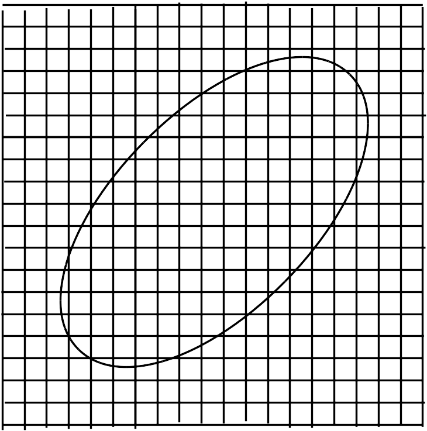

## 連続体力学

<!-- 
　質点系の力学において、別々の物体を質点として それらの運動を記述していたことを考えると、物体自体を質点系とみなす場合にも同様な操作ができるものと思われる。そこで、物体を図のように小さい領域に分割して各領域を別々の物体として質点とおいてみる。普通に考えれば細かく分割していった方が点に近づいて良いように思えるが, このときあまりにも内部領域を小さくしてしまうと $1\mathrm{\AA}$ ぐらいの大きさで原子が観測されるため、古典力学の範囲を超えた議論をする必要が出てきてしまう（量子力学を参照）。このことから、分割した内部領域の大きさは原子が観測されない程度にする必要があり、さらには物体全体から見ても十分小さいもの（点に近いもの）でないといけないことになる。このことを踏まえながら物体を分割して質点系とみなすと、物体内で質点は連続的に分布しているので、元々の質点系（質点同士が離れている系）とは違うものとなっている。そのため、これと区別するために連続的に分布した質点系（あるいはこうみなした物体）のことを一般に**連続体**と呼ぶことが多い。
  

    

では、物体を連続体とみなすと運動はどのように記述されるかを見てみることにしよう。この場合も１つの質点に関する運動方程式は式で与えられるが、このときの質量 $m_i$ は内部領域の質量と同じものとなっている。この値は領域が物体の一部分であることをふまえると、全体の質量のうちどれだけ占めているかを見ると良いように思われる。言い換えると、どれだけ物体が内部領域内で密に詰まっているかということになるので、それを表すのに密度を用いてみると、以下のように書ける。
$$
    \rho_i=\frac{m_i}{V_i}　
    \rightarrow　m_i=\rho_i V_i
$$
これを見ると、密度が体積分だけあると質量になることが分かるので、１つの地点での値としてみなしても良く $\rho(\bm{r}_i)$ と書くことができる（言い換えれば、密度は内部領域内の質量の平均を表していると言える）。だが、ここでは話がややこしくなるので、
$$
    \rho=\frac{m}{V}（一定値）
$$
として運動を記述することが多い。

一方で、作用する力は接触して働く力と離れていても働くものとの二種類あると考えられるため、それぞれ次のようにして作用しているものとする。
  \[
  \left\{
  \begin{aligned}
    &\cdot 接触力\cdots 他の内部領域との接触面に働く力\\
    &\cdot 遠隔力\cdots 内部領域全体の質量などの状態で働く力
  \end{aligned}
  \right.
  \]
  これらの力は接触面全体あるいは内部領域全体に作用するものであるが、このうち前者の方は作用・反作用の法則により１つの面を境に２つの内部領域には同じ大きさの力が逆向きに働くので、各面ごとに異なる力が働くものと思われる。対して後者の方は、内部領域ごとに違う（質量など）ものであるため、先ほどの密度と同様な考え方で面全体あるいは内部領域全体にかかる力を$\bm{F}_{\mr{face}},\bm{F}_{\mr{body}}$として
  \[
  \left\{
  \begin{aligned}
    &\cdot \bm{S}(\bm{r}_{1})=\frac{\bm{F}_{\mr{face}}}{A}　（A:接触面の面積）\\
    &\cdot \bm{B}(\bm{r}_{2})=\frac{\bm{F}_{\mr{body}}}{V}　（V:内部領域の体積）
  \end{aligned}
  \right.
  \]
  というように、面積力$\bm{S}$と体積力$\bm{B}$を定義してみる（このようにすると、図のように位置を指定することができる）。このようにした上で、内部領域に働く力を議論してみることにしよう。まず、面積力の方は内部領域を多面体（平面で囲まれている）と考えると以下のような力があると考えられる。剪断（せんだん）応力と垂直応力のふたつ。ただ、そうなると面の傾きが必要となり
  \begin{equation}
    \bm{S}=\bm{P}+\bm{T}=（垂直応力）+（剪断応力）
  \end{equation}
  \begin{equation}
    \bm{P}=-(\bm{S}\cdot\bm{n})\cdot\bm{n}　\bm{T}=\bm{S}-\bm{P}=\bm{S}+(\bm{S}\cdot\bm{n})\cdot\bm{n}
  \end{equation}
もし、多面体が立方体であれば

  
  \begin{align*}
    \bm{S}
   &=
    \bm{S}_{\mr{l}}+\bm{S}_{\mr{r}}+\bm{S}_{\mr{f}}+\bm{S}_{\mr{b}}+
    \bm{S}_{\mr{u}}+\bm{S}_{\mr{d}}\\
   &=
    \LR{\bm{S}(-\bm{e}_{y})+\bm{S}(\bm{e}_{y})}
    \Delta x_{\mi}\Delta z_{\mi}+
    \LR{\bm{S}(-\bm{e}_{x})+\bm{S}(\bm{e}_{x})}\\
    &\Delta y_{\mi}\Delta z_{\mi}+
    \LR{\bm{S}(-\bm{e}_{z})+\bm{S}(\bm{e}_{z})}
    \Delta x_{\mi}\Delta y_{\mi}
  \end{align*}
  であり、中には内部領域の外側に行くと傾きを持つものも出てくるため、
  
  
  
  
  
  \begin{equation}
    \lr{\rho(\bm{r}_{\mi})V_{\mi}}\dd{^2\bm{r}_{\mi}}{t^2}=
    \sum_{\mi=1(\neq\mj)}^{\mr{N}}
    \bm{F}_{\mr{ij}}+
    \bm{F}_{\mi}　　
    \lr{\ \mi=1,\cdots,\mr{N}\ }
  \end{equation}
そこで、変形する物体も扱えるようにするために\tb{連続体力学}が誕生したのである。

まず、第1章

  \chapter{連続体による記述}
  ここに連続体とみなせる物体があったとする。すると、物体は質点が連続的に集まったものであ
  るものとしてみなせるわけだが、その形は物体内で連続的に引き詰められるようなものでなければならないので、図のような形にとる（引き詰められる形であれば何でも良いので、ここでは直交座標と対応させ易くするため直方体にしている）。そして、ある一つの質点の位置を$\bm{r}$というように位置ベクトルで指定すると、このときの質量は分布関数$\rho(\bm{r})$により指定することができる。この値自体は内部領域内で共通しており、
  \begin{equation}
    m=\rho(\bm{r})
  \end{equation}

  １つの質点で成立する運動方程式を質点系の力学と同様な考えで
  \begin{equation}
      m_{\mi}\dd{^2\bm{r}_{\mi}}{t^2}=
      \sum_{\mj\ne\mi}\bm{F}_{\mr{ij}}+\bm{F}_{\mi}
  \end{equation}
  とする。ここで質点の質量$m_{\mi}$は内部領域の質量であり、各内部領域ごとに
  異なる値をとるものとなっている。そのため、単純に

というように、物体の運動を代表点の位置$\bm{r}_{\mr{G}}$の動きで論じていたが、ここで質量が密度で
\begin{equation}
  m=\int_{\Omega}\rho(\bm{r})\md\bm{r}　
  \lr{\ \Omega:物体内の全内部領域\ }
\end{equation}
というように書けることから、
()式を$\Omega$の範囲で積分してみると()式の形になると考えられる。
そこで実際に、
\begin{equation}
  \int_{\Omega}\lr{\rho(\bm{r})\dd{^2\bm{r}}{t^2}}\md\bm{r}=
  \int_{\Omega}\bm{f}(\bm{r})\md\bm{r}
\end{equation}
とすると、右辺は全質点にかかる力を重ねあわせたものとなっており

すると、これは物体自体の運動方程式になっているものとみなせるため、
\begin{equation}
  \bm{r}_{\mr{G}}=
  \frac{1}{m}\int_{\Omega}\rho(\bm{r})\bm{r}\md\bm{r}　　
  \bm{F}_{\mr{G}}=\int_{\Omega}\bm{F}(\bm{r})\md\bm{r}
\end{equation}
とおくと、位置$\bm{r}_{\mr{G}}$にいる質点（質量$m$）に関する運動方程式になる。
つまり、物体にかかる力は全て$\bm{r}_{\mr{G}}$にかかるものと考えることができる。
この地点を\tb{重心}と呼び、これを古典力学では代表点として議論していた。そのため、
この運動方程式を見ていくというのは、前に述べたことを再び辿ることと等価であると言える
（重心の動きで物体の運動を論じる）。ただ、ここで重心の動きと言えども物体の視点からすると
位置は変化しておらず、変形していないと考えていると言える。

  質点系で回転運動を論じるなら古典力学。
  質点系で変形を論じるなら連続体力学。

では、次に質点の運動を記述してみることにしよう。例えば、図のようになっていた場合、最初に考えられることが他の質点と衝突することで接触力が働く（運動量が変化することで、力を及ぼす）ことである。このときには、他の質点から及ぼした力と同じ逆方向の力が働き（作用・反作用の法則）、力がかかっていないように見て取ることができる。もし、古典力学と同じように物体が変形しなければ全ての力は運動に寄与するが、

\[
\begin{cases}
  ・　剛体\ \cdots\ 力を加えても変形しない物体（補足）\\
  ・弾性体\ \cdots\ 力を加えている間だけ変形する物体\\
  ・塑性体\ \cdots\ 力を加えた後にも変形している物体
\end{cases}
\]
\begin{enumerate}
  \item 流体
  \[
  \begin{cases}
    \cdot\ {\rm Newton流体}(線形) \\
    \cdot\ {\rm 非Newton流体}(非線形)
  \end{cases}
  \]
\end{enumerate}  
 （塑性体と非Newton流体の中間的なものをチキソトロピーと呼び、この物体を扱う分野をレオロジーと言う）
 
平均自由行程：物体で言う原子間距離みたいなもの
 

例)質点の力学の応用(弦の振動)

古典力学においては、物体の運動を位置と速度により記述していたが、ここに質点という概念を取り入れると、それをより正確に行うことができる。そのため、弦を質点とみなせるほど細かく分けて、その一つ一つを質点として扱っていくことにする。 そして、そのうちの一つに着目して運動方程式を立ててから、その高さを求めるということをするのだが、この結果は全ての質点で共通していることなので、全ての質点をわざわざ見る必要がないことは予め言っておく。

以上のことをふまえた上で、まずある一つの質点の運動方程式を質量$m$,外力$\bm{F}$、位置ベクトル$\bm{r}$により表すと 
\begin{equation}
   m\dd{^2\bm{r}}{t^2}=\bm{F}
   \label{eq:string1}
\end{equation}
となる（ここで、$m$は質点によらず一定であるとしているが、これは糸の質量の分布が一様という仮定から来ている）。次に、この式を各成分に分けて書くと、次の通りになる。
\begin{equation*}
  \left\{
  \begin{aligned}
    &\cdot\ m\dd{^2 x}{t^2}=F_{x}
   =T_{x}(x+\Delta x)-T_{x}(x)\cdots (X)\\
    &\cdot\ m\dd{^2 y}{t^2}=F_{y}
   =T_{y}(x+\Delta x)-T_{y}(x)\cdots (Y)
  \end{aligned}
  \right.
\end{equation*}
（右図は質点を拡大したものであり、外力は$\bm{T}(x)$と$\bm{T}(x+\Delta x)$が働いているものとしている）

そして、各成分ごとに運動方程式を解くと、以下のようになる。
\begin{enumerate}
  \item $x$成分(\ (X)式\ )
  
  この方向には動かないことから
  \begin{equation}
    T_{x}(x+\Delta x)-T_{x}(x)=0
    \ \rightarrow\ 
    T_{x}(x+\Delta x)=T_{x}(x)=T
  \end{equation}
  となるので、次の関係式が成り立つ。
  \begin{equation}
    T(x+\Delta x)\cos\theta_{+}=T
    \ \rightarrow\ 
    T(x+\Delta x)=\frac{T}{\cos\theta_{+}}
  \end{equation}
  \begin{equation}
    T(x)\cos\theta_{-}=T
    \ \rightarrow\ 
    T(x)=\frac{T}{\cos\theta_{-}}
  \end{equation}
  ただし、ここで$\theta_{+},\theta_{-}$はどちらも$(-\pi/2,\pi/2)$の範囲の値しかとらないものとしている。
  
  \item $y$成分（(Y)式）
  
  $x$成分の式の方で見てきたことをふまえて、
  \begin{equation}
    m\dd{^2 y}{t^2}=
    T(x+\Delta x)\sin\theta_{+}-
    T(x)\sin\theta_{-}=
    T(\tan\theta_{+}-\tan\theta_{-})
  \end{equation}
  としてから、タンジェントの部分を
  \begin{equation}
      \tan\theta_{+}=
      {\lr{\DD{y}{x}}\vline}_{\ x+\Delta x}
      　　      
      \tan\theta_{-}=
      {\lr{\DD{y}{x}}\vline}_{\ x}
  \end{equation}
  とすることで、以下のようになる。
  \begin{equation}
    m\dd{^2 y}{t^2}=T\LR{{
    \lr{\dd{y}{x}}\vline}_{\ x+\Delta x}-
    {\lr{\dd{y}{x}}\vline}_{\ x}}
  \end{equation}
  そして、さらに弦の線密度を$\sigma$とすると
  \begin{equation}
    m=\sigma\Delta l
   =\sigma\lr{\frac{\Delta x}{\cos\theta_{-}}}
  \end{equation}
　　となるので、仮に\tb{弦の振動が小さい}場合には次式が得られる。
  \begin{equation}
    \lr{\pp{^2 y}{t^2}}=\frac{T}{\sigma}
    \lr{\pp{^2 y}{x^2}}
  \end{equation}
\end{enumerate}
  
\section{物体の伸縮(弾性体)}
質点の力学を用いると物体
  
仮に その大体の大きさを$r$（原子間距離と比べ易くするために長さを用いる）、原子間距離を$l$とすると$r>>l$というように表される。さらに、その大きさ（$r$）は観測する物体の大体の大きさ（長さ）$L$に比べて十分小さい（質点とみなせるほど小さい）ものとして$L>>r$とする（図）。したがって、物体を質点の集まりとして扱うことができる条件は、
\begin{equation*}
  L>>r>>l　\mr{or}　L>>l
\end{equation*}
となると考えられる。ここで、二番目の不等式に対して
\begin{equation}
  K\lr{\equiv\frac{l}{L}}<<1
\end{equation}
というように\tb{クヌーセン数}$K$を定義すると、これが物体を質点の集まりとして扱えるかの目安となる。通常この$K$の値は大体0.01（10$^{-2}$）以下の値をとることが多い。例として、結晶などの物体だと大体$l\simeq 1.0\times10^{-10}\ [\mr{m}]$、$L\simeq 1.0\times10^{-3}\ [\mr{m}]$（小さく見積もっている）となるため、連続体（質点の集まりとみなせる物体）として扱えることが分かる。 -->
