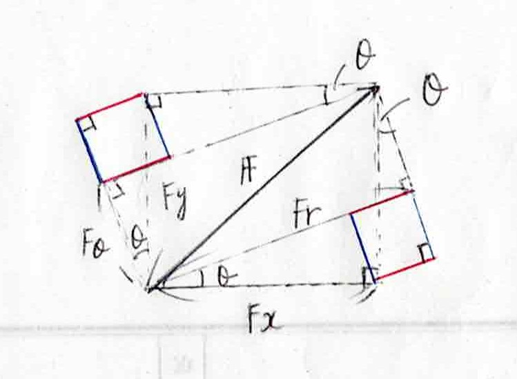

## 回転運動について

　前回までに単に質点としておけない運動の一例として回転運動を挙げたが、実際にこの運動を見ていくことにしよう。

　例えば、棒を糸でつるした状態を考えると、運動方程式としては重心にかかる重力と張力がつりあうことで静止しているものと思われる。実際、運動方程式においても

$$
    m
    \frac{\mathrm{d}^2y}
    {\mathrm{d}t^2}=
    T-mg=0
$$

となる。ところが、糸をつるすところによっては同じ運動方程式が成り立っても棒が回転して止まる状況になってしまう。これについては、物体の重心以外に吊るすことで起きることで、力とは別に回転の作用が働いたことで回転したものと思われる。

　先ほどまで質点の運動について論じてきたが、回転運動に関して言えば $i$ 番目の質点の運動方程式は
$$
  m_i
  \frac{\mathrm{d}^2\bm{r}_i}
  {\mathrm{d}t^2}=
  \bm{F}_i
$$

であったが、これを 直交座標系 $x,y$ で表現すると以下の通りになる。

$$
  m_i
  \frac{\mathrm{d}^2x_i}
  {\mathrm{d}t^2}=
  F_{x_i}、
  m_i
  \frac{\mathrm{d}^2y_i}
  {\mathrm{d}t^2}=
  F_{y_i}
$$

これを極座標 $r,\theta$ に変換すると

$$
    m_i
    \left[
        \frac{\mathrm{d}^2r_i}
        {\mathrm{d}t^2}
        \cos\theta_i-
        2\frac{\mathrm{d}r_i}
        {\mathrm{d}t}
        \frac{\mathrm{d}\theta_i}
        {\mathrm{d}t}
        \sin\theta_i-
        r_i
        \frac{\mathrm{d}^2\theta_i}
        {\mathrm{d}t^2}
        \sin\theta_i-
        r_i
        \left(
        \frac{\mathrm{d}\theta_i}
        {\mathrm{d}t}
        \right)^2
        \cos\theta_i
    \right]
    =
    F_{x_i}
$$
$$
    m_i
    \left[
        \frac{\mathrm{d}^2r_i}
        {\mathrm{d}t^2}
        \sin\theta_i+
        2\frac{\mathrm{d}r_i}
        {\mathrm{d}t}
        \frac{\mathrm{d}\theta_i}
        {\mathrm{d}t}
        \cos\theta_i+
        r_i
        \frac{\mathrm{d}^2\theta_i}
        {\mathrm{d}t^2}
        \cos\theta_i-
        r_i
        \left(
        \frac{\mathrm{d}\theta_i}
        {\mathrm{d}t}
        \right)^2
        \sin\theta_i
    \right]
    =
    F_{y_i}
$$

となり、先ほどと同じように$x,y$ 方向の方程式にそれぞれ $\cos\theta,\sin\theta$ をかけて和をとると

$$
    m_i
    \left[
        \frac{\mathrm{d}^2r_i}
        {\mathrm{d}t^2}-
        r_i
        \left(
        \frac{\mathrm{d}\theta_i}
        {\mathrm{d}t}
        \right)^2
    \right]
    =
    F_{x_i}\cos\theta_i+
    F_{y_i}\sin\theta_i
$$

となり、一方で $\sin\theta,\cos\theta$ をかけて差をとると

$$
    m_i
    \left[
        2\frac{\mathrm{d}r_i}
        {\mathrm{d}t}
        \frac{\mathrm{d}\theta_i}
        {\mathrm{d}t}+
        r_i
        \frac{\mathrm{d}^2\theta_i}
        {\mathrm{d}t^2}
    \right]
    =-F_{x_i}\sin\theta_i+
    F_{y_i}\cos\theta_i
$$

となる。ここでの力の関係については、下図から以下の通り担っていることがわかる。

$$
    F_r=
    F_{x}\cos\theta+
    F_{y}\sin\theta、
    F_\theta=
    F_{y}\cos\theta-
    F_{x}\sin\theta
$$

    
    

そのため、力も極座標で表記した上で角度 $\theta$ に関する式に $r$ をかけると角運動量 $L$ になることから

$$
    m_i
    \left[
        \frac{\mathrm{d}^2r_i}
        {\mathrm{d}t^2}-
        r_i
        \left(
        \frac{\mathrm{d}\theta_i}
        {\mathrm{d}t}
        \right)^2
    \right]
    =F_{r_i}
$$
$$
    \frac{\mathrm{d}L_i}
    {\mathrm{d}t}
    =F_{\theta_i}r_i、
    L_i=
    m_ir_i^2
    \frac{\mathrm{d}^2\theta_i}
    {\mathrm{d}t^2}
$$

となる。ここで、角度成分の方程式の右辺が何かを見てみると