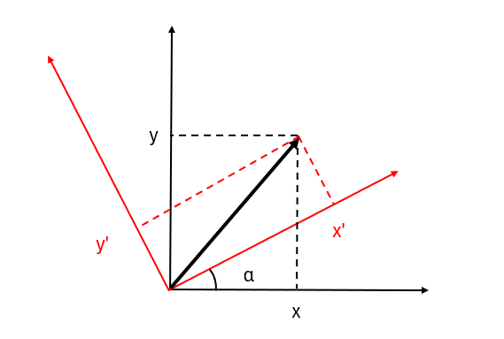
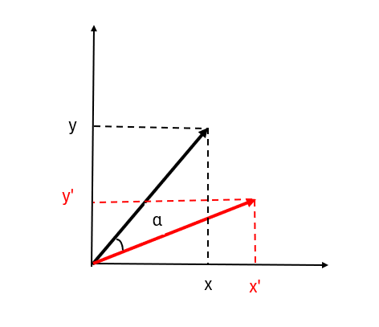

## 見かけの運動

前回までは極座標を扱ってきたが、今度は一般的な回転座標だとどうなるかを見ていくことにする。まず原点を軸に座標系 $(x,y)$ を角度 $\alpha$ だけ回転させて座標系 $({x'},{y'})$ に変換したものとすると

    

$$
    {x'}=x\cos\alpha+y\sin\alpha、
    {y'}=-x\sin\alpha+y\cos\alpha
$$

という変換式が成り立つ。一方で、この逆変換を求めると

$$
    x=x'\cos\alpha-y'\sin\alpha、
    y=x'\sin\alpha+y'\cos\alpha
$$

であり、この一例が極座標であることは先ほども見たとおりである。では、この状態で速度を求めてみるとどうなるかというと
 $\omega_\alpha=\dot{\alpha}$ として以下のように求められる。

$$
    v_x=
    v_{x'}\cos\alpha-
    v_{y'}\sin\alpha-
    x'\omega_\alpha\sin\alpha-
    y'\omega_\alpha\cos\alpha=
    (v_{x'}-y'\omega_\alpha)\cos\alpha-
    (v_{y'}+x'\omega_\alpha)\sin\alpha
$$
$$
    v_y=
    v_{x'}\sin\alpha+
    v_{y'}\cos\alpha+
    x'\omega_\alpha\cos\alpha-
    y'\omega_\alpha\sin\alpha=
    (v_{x'}-y'\omega_\alpha)\sin\alpha+
    (v_{y'}+x'\omega_\alpha)\cos\alpha
$$

このことから、実際の質点の速度とは別に $\omega_\alpha$ による速度が加わっていることが分かる。これについては質点が座標系 $(x,y)$ に対して静止している（$v_x=0,v_y=0$）場合を考えると理解できる。具体的には、座標系からすると自分が動いているとは感じなく対象の質点が以下の図のように逆回転しているように見える。

    

このときの座標変換は同じだが、速度に関しては $v_x=0,v_y=0$ であることから
 
$$
    (v_{x'}-y'\omega_\alpha)\cos\alpha-
    (v_{y'}+x'\omega_\alpha)\sin\alpha=0
$$
$$
    (v_{x'}-y'\omega_\alpha)\sin\alpha+
    (v_{y'}+x'\omega_\alpha)\cos\alpha=0
$$

であり、これから変換式を求めると以下のようになる。

$$
    v_{x'}=y'\omega_\alpha、
    v_{y'}=-x'\omega_\alpha
$$

この運動は質点までの位置が固定（動径 $r$ が一定）されたまま回転していることから円運動となっており、実際極座標において一定として
