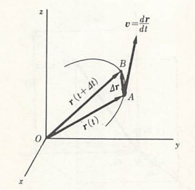

## 物体の運動とその法則

　先ず物体の運動に関して、長さと時間の概念だけを使って理解できる。比較的単純な物理量から話を進めていくことにしょう。我々は間口と奥行きと高さを持った3次元空間の中に住んでいる。物体の運動もその中で起こっている。運動とは、物体の位置が時間とともに変化することであるから、ある運動を記述するためには、例えば以下の図のように直交する3本の座標軸を採って、それを基準として時々刻々における物体の位置を追いかけていけばよい。

ところで、われわれの目に映る物体は全て大きさを持っているから、その位置をどの地点にするか初めに指定する必要がある。直感的には物体内のある一点になると思われるが、この点について少し考えてみよう。例えば上図のように物体内の一点が矢印のように移動したものとすると、左図（並進運動）では他の地点に指定しても同じような動きをすることが分かる。しかし、右図のように途中で引っ掛かり回転運動した場合だと質点の位置によって位置の変化が異なる（異なる運動をする）ため、単純に地点を指定することができないことが伺える。同様なことが変形した場合でも言える。

以上のことから、まずは話を簡単にするため物体を質量だけを備えた点、すなわち**質点**（particle、point mass、material point）とみなして並進運動のみ取り扱っていくことにする。

　物体の位置を記述するとき、必ずなんらかの基準から見たものとなる。例えば、AさんとBさんの二人がいて、AさんがBさんに床に置かれた物体の位置を伝えようとすると「**Bさんから見て**右側」というようになることからも伺えるであろう。それを聞いたBさんも右側を見て、自分を基準として目分量で物体の位置がこれぐらいだと把握するであろう。このように、物体の位置を把握するためには基準点Oを中心として基準系K（目分量）を用意する必要がある。さらに物体のある地点Pに質点を考えると、その位置は基準点Oから見た位置として記号 \\(\vec{\rm OP}\\) で表記することができる。あるいは太文字で \\(\boldsymbol{r}\\) と表すと、\\(r、|\boldsymbol{r}|\\)は長さOPを示し、太文字で書くと長さに加えて向きまで含めたものとなる。このときの \\(\boldsymbol{r}\\) を**位置ベクトル**という。

　図のように空間に直交直線座標系を設定しよう。

原点Oから見た質点Pの位置はOを始点としてPを終点とするベクトル r を用いて表すことができる。これを質点Pの位置ベクトルという。その成分は、P点の座標  (x,y,z) として

$$ {\bm r}=(x,y,z) $$

で与えられる。ここで更に図に示されているように、それぞれ x、y、z 軸の正の方向に向かう単位の大きさのベクトル

$$
    {\bm e_{x}}=(1,0,0)、 
    {\bm e_{y}}=(0,1,0)、
    {\bm e_{z}}=(0,0,1)
$$

を基本ベクトルとして導入すると、位置ベクトル r はまた、

$$ {\bm r}=x{\bm e_{x}}+y{\bm e_{y}}+z{\bm e_{z}} $$

と書くこともできる。この r の大きさ、すなわち原点から質点までの距離 r は

$$ r\equiv|{\bm r}|=\sqrt{x^2+y^2+z^2} $$

で与えられ、また r の方向がいわゆる方向余弦

$$ (l,m,n)=(x/r,y/r,z/r) $$

によって与えられることは既に諸君もご存じのことであろう。記号 ≡ は両辺が定義などにより恒等的に等しい場合にしばしば用いられる。
　この本では基本ベクトルの大きさ（=1）を、単位を持たない数、すなわち無次元の量であると考えることにする。そうすると r は長さ（length）の単位、メートル（m）を用いて表される量であるから、r の各要素 x、y、z もまた長さの単位を持つことになる。これを よく知られた次元（dimension）の起動で表せば

$$ [r]=[x]=[y]=[z]=[L] $$

ということになる。ここで  は長さの次元を表す記号である。このように基本ベクトルの大きさを無次元の量と考えておくと、同じ基本ベクトルを用いて様々な単位を持つベクトル量を書き下すことができて便利である。
　質点Pが運動を行う場合には、その位置ベクトル r は時刻（time）t の関数となる。以下、このことを明瞭に表す必要があるときは、特に r(t) と記すことにする。さて、時刻 t で位置ベクトル r(t) なるA点にあった質点が、極く短い時間 Δt ののちに  r(t+Δt) なるB点まで動いたとする。こんときの質点の変位（displacement）Δr は、以下の図に図示されたようなベクトル算法を用いて

$$ \Delta{\bm r}\equiv{\bm r}(t+\Delta t)-{\bm r}(t) $$

と書ける。

したがって、この時間帯における質点単位時間あたりの平均の変位は Δr/Δt である。今、時間幅 Δt を限りなくゼロに近づけた極限での、単位時間あたりの平均の変位を

$$ 
    {\bm v}\equiv\frac{{\rm d}{\bm r}}{{\rm d}t}\equiv
    \lim_{\Delta t\to 0}\frac{{\bm r}(t+\Delta t)-{\bm r}(t)}{\Delta t} 
$$

と書けば、上図からも明らかなように、その方向はA点において引かれた質点の軌道に対する接線の方向に等しく、その大きさは軌道に沿っての質点の速さ（speed）に等しくなる。この v のことを質点の速度（velocity）の成分は

$$ 
    {\bm v}\equiv(v_{x},v_{y},v_{z})=
    \left(\frac{{\rm d}x}{{\rm d}t},\frac{{\rm d}y}{{\rm d}t},\frac{{\rm d}z}{{\rm d}t}\right) 
$$

である。特に v = c （c：定ベクトル）のとき、この質点の運動はベクトル c の方向に向かう等速直線運動となる。
　次に、速度が時間とともに変化する、より一般的な運動について考えよう。