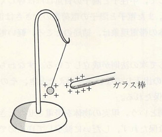
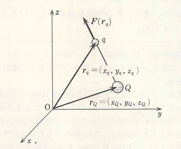

## 静電気

　コハクをこするとチリを引き付けることは、既に紀元前600年もの昔から知られていた。そのため、物同士をこすることでその間に何らかの力が発生するのではないかと予想される。そこで試しに、ガラス棒を絹布あるいは樹脂棒を乾燥した毛皮でこすってみると、どちらの棒も紙片などをよく引き付けるようになる。このとき、これらの棒は目に見えない何かが帯びたと考えることができる。この何かを**電荷**と呼び、電荷を帯びることを**帯電**するという。電荷の性質を調べるとき、よく**電気振り子**が利用されている。具体的には、下図で示すように軽いコルク球を絹糸でガラスの支柱につるしたものとなっている。絹でこすったガラス棒をコルク球に近づけると、はじめはコルク球は棒に引き付けられるが、それがガラス棒に触れた瞬間にコルク球は勢いよく反発して、ガラス棒から遠ざかろうとする。これと同じことをガラス棒の代わりに樹脂棒で試しても同様な現象を示す。

    

ところが、ガラス棒と樹脂棒に帯電している電荷が同じものかというとそうではない。実際、ガラス棒に触れたコルク球に帯電した樹脂棒を近づけると、ガラス棒とは反対にコルク球が引き付けられることが確認できる。さらに、そのコルク球に樹脂棒が触れると、それら2つの電荷は失われる。このことからも、2つの棒に帯電した電荷は異なることが分かるため、ガラス棒に帯びた電荷を正、樹脂棒の帯びた電荷を負と定義してみると、上記の現象を説明できる（同符号の電荷間には斥力、異符号の電荷の間には斥力、また正負の電荷が代数的な数のように加え合わさった和が0となると電荷が失われた**ように見える**と考える）。このとき正負の電荷間で働く力がどのくらいになるかについては、1785年にColmonbが行った実験により

> 2個の点電荷間の力は、両者を結ぶ直線上に働き、その大きさはそれぞれの電荷の量に比例し、またそれらの間の距離の2乗に反比例する

ことが確認されている。この法則を**クーロンの法則**と呼び、このときの力を**クーロン力**という。さて、二つの点電荷の電荷量をそれぞれ $q$ および $Q$ とし、それらの間の距離を $r$ とすると、その間に働く力の大きさ $F$ は

$$
    F=k\frac{qQ}{r^2}
$$

と表わされる。ここで $k$ は正の比例定数であり、$qQ>0$ なら $F>0$ で斥力を示し、$qQ<0$ なら $F<0$ で引力を示す。比例定数 $k$ を決めるには、電荷量、距離および力の単位を決めておく必要がある。現在ではSI単位系の下で単位が決められており、1Cの電荷を持つ2個の点電荷を真空中で1mの距離を置いて静止させたとき、これらの間に働く力が $8.9876\times 10^9\ \mathrm{N}$ であるから

$$
    k=8.9876\times 10^9\ 
    \mathrm{N・m^2/C^2}
$$

となる。また、この力は万有引力の法則での重力

$$
    F_G=G\frac{mM}{r^2}、
    G=6.7\times 10^{-11}\ \mathrm{N\cdot m^2/kg^2}
$$

と同じ形をしており、こちらも点電荷の間で働いていると考えられる（ $m$ と $M$ は各点電荷の質量で、$r$ はその間の距離としている）。そのため、どれぐらいの大きさか比較して見てみると、簡単に1Cの電荷をもつ1kgの点電荷の場合だと比をとることで

$$
    \frac{F}{F_G}=
    \frac{k}{G}\approx
    1.3\times 10^{20}
$$
という、とてつもない巨大な値になる。このように、クーロン力は重力と比較して圧倒的に大きく、電荷がある場合だとほぼ重力の効果は無視できる。それにも関わらず地球上の物体あるいは天体間に重力が作用する理由は、正と負の電荷が互いに打ち消しあうことで見かけ上電荷がなくなり、クーロン力が生じる状態にならなくなったことによるものと考えられる。

クーロン力というのは、その方向をも指定して決まるベクトル量である。そのため、以下の図において電荷 $Q$ が電荷 $q$ に作用する力をベクトルを用いて表すと次のようになる。

<table>
<tr><td align="center">
    
</td>
<td>
    $$
    \bm{F}(\bm{r}_q)=
    k\frac{qQ}{|\bm{r}_q-\bm{r}_Q|^2}
    \frac{(\bm{r}_q-\bm{r}_Q)}{|\bm{r}_q-\bm{r}_Q|}
    $$
</td></tr>
</table>

ここで、ベクトル $\bm{r}_q=(x_q,y_q,z_q)$ と $\bm{r}_Q=(x_Q,y_Q,z_Q)$ は、それぞれ図の原点Oから測った電荷 $q$ と $Q$ の位置ベクトルであり、$\bm{F}(\bm{r}_q)$ は電荷 $q$ に作用する力を表す。