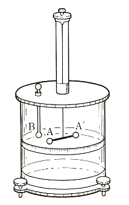

## 静電気

　コハクをこするとチリを引き付けることは、既に紀元前600年もの昔から知られていた。この種の現象は、冬の日にセーターを脱ぐときに起きる火花などとともに日常よく経験することである。これらの現象を詳しく調べるため、ガラス棒を絹布でこするか、あるいは樹脂棒を乾燥した毛皮でこすってみる。すると、これらの棒は紙片などをよく引き付ける。このときこれらの棒は、目に見えないが、何かを帯びたと考えられる。この何かを**電気**または**電荷**とよび、電気を帯びることを**帯電**するという。

<table>
<tr><td>
    電気の性質を調べるには、<b>電気振り子</b>を用いると便利である。それは右図に示すように、軽いコルク球を絹糸でガラスの支柱につるしたものである。絹でこすったガラス棒をコルク球に近づけると、はじめはコルク球は棒に引き付けられるが、それがガラス棒に触れた瞬間にコルク球は勢いよく反発して、ガラス棒から遠ざかろうとする。これと同じことをガラス棒の代わりに樹脂棒で試しても同様な現象を示す。
</td>
<td width="35%">
    
</td></tr>
</table>

ところが、ガラス棒と樹脂棒に帯電している電荷が同じものかというとそうではない。実際、ガラス棒に触れたコルク球に帯電した樹脂棒を近づけると、ガラス棒とは反対にコルク球が引き付けられることが確認できる。さらに、そのコルク球に樹脂棒が触れると、それら2つの電気的性質は失われる。このことからも、2つの棒に帯電した電荷は異なることが分かるため、ガラス棒に帯びた電荷を正、樹脂棒の帯びた電荷を負と定義してみると、上記の現象を説明できる（同符号の電荷間には斥力、異符号の電荷間には斥力、また正負の電荷が代数的な数のように加え合わさった和が0となると電気的性質が失われると考える）。

　以上のように、正負の電荷を定義することで一種の電気的性質を説明することができるわけだが、ここで電荷間で働く力はどれくらいなのかというと1785年にColmonbが行った実験により確認されている。具体的には、以下の図に示すような装置を作り、点電荷間に作用する力の性質を調べた結果、次の法則が成立することを発見した。これを**クーロンの法則**と呼び、この力を**クーロン力**という。

> 2個の点電荷間の力は、両者を結ぶ直線上に働き、その大きさはそれぞれの電荷の量に比例し、またそれらの間の距離の2乗に反比例する。

<table>
<tr><td width="25%">
    
</td>
<td>
    <u>Coulombが行った実験の装置</u> 
    水晶の糸で吊るした絶縁体の棒の一端の小金属球Aに電荷を与え、また別に固定した絶縁体の下端の小金属球Bにも電荷を与えて、その間の力の大きさを糸のねじれとすり合わせることにより測った。このときの両球間の距離の決め方にあいまいさが生じ、それによる実験誤差が約10％にもなってしまう。しかし、現在ではほかの方法を用いたより精密な実験によって、上のCoulombの法則がきわめて正確に成立していることが確かめられている。
</td></tr>
</table>

さて、二つの点電荷の電荷量をそれぞれ $q$ および $Q$ とし、それらの間の距離を $r$ とすると、その間に働く力の大きさ $F$ は
$$
    F=k\frac{qQ}{r^2}
$$
と表わされる。ここで$k$は正の比例定数であり、$qQ>0$なら$F>0$で斥力を示し、$qQ<0$なら$F<0$で引力を示す。比例定数 $k$ を決めるには、電荷量、距離および力の単位を決めておく必要がある。現在ではSI単位系の下で単位が決められており、1Cの電荷を持つ2個の点電荷を真空中で1mの距離を置いて静止させたとき、これらの間に働く力が $8.9876\times 10^9\ \mathrm{N}$ であるから
$$
    k=8.9876\times 10^9\ 
    \mathrm{N・m^2/C^2}
$$
となる（実際に測るのはクーロン力ではなく、真空中の光の速さであるが、この点については後述）。

　ここで、クーロン力の大きさがどれくらいのものかを知るために、同じ形で表される万有引力の法則
$$
    F_G=G\frac{mM}{r^2}
$$
で与えられる重力とクーロン力を比較してみよう。ここで$m$と$M$は2個の質点の重量で、$r$はその間の距離、また $G=6.7\times 10^{-11}\ \mathrm{N\cdot m^2/kg^2}$ は万有引力定数である。2個の質点として電子を考えると、電子の質量 $m=9,1\times 10^{-21}\ \mathrm{kg}$、その電荷量 $e=-1.6\times 10^{-19}\ \mathrm{C}$ を用いて、二つの力の大きさの比をとると
$$
    \frac{F}{F_G}=
    \frac{ke^2}{Gm^2}\approx
    4.2\times 10^{42}
$$
という、とてつもない巨大な値になる。このように、クーロン力は重力と比較して圧倒的に大きく、原子や分子の世界では重力の効果は無視できる。それにも関わらず地球上の物体あるいは天体間に重力が作用する理由は、原子や分子のほとんどすべてが電気的に中性であって、電気的な引力と斥力とが相殺してしまうからである。

　クーロン力というのは、その方向をも指定して決まるベクトル量である。そのため、以下の図において電荷 $Q$ が電荷 $q$ に作用する力をベクトルを用いて表すと次のようになる。

<table>
<tr><td align="center">
    
</td>
<td>
    $$
    \bm{F}(\bm{r}_q)=
    k\frac{qQ}{|\bm{r}_q-\bm{r}_Q|^2}
    \frac{(\bm{r}_q-\bm{r}_Q)}{|\bm{r}_q-\bm{r}_Q|}
    $$
</td></tr>
</table>

ここで、ベクトル $\bm{r}_q=(x_q,y_q,z_q)$ と $\bm{r}_Q=(x_Q,y_Q,z_Q)$ は、それぞれ図の原点Oから測った電荷 $q$ と $Q$ の位置ベクトルであり、$\bm{F}(\bm{r}_q)$ は電荷 $q$ に作用する力を表す。