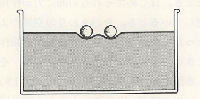
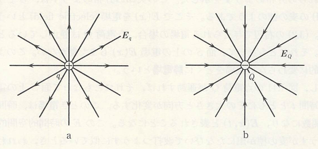
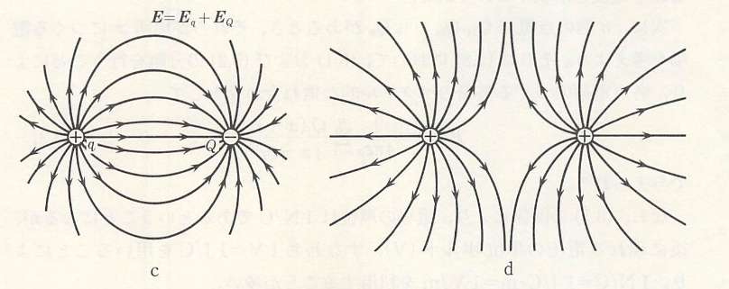
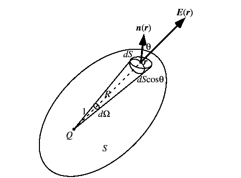

## 電磁気学での力の考え方

　前回クーロンの法則が万有引力の法則と同じ形で書けることを述べたが、そもそも万有引力というのは物体間にその力を伝える物体（糸など）があるわけでなく、空間を通して直接物体間に作用する力であると考えられる。このような力を**遠隔作用**の力という。そのため、クーロン力も同じ遠隔作用の力であるものと考えることができる。しかし、この考え方だと帯電した物体（**帯電体**）間にある空気などのものに影響を与えず別の帯電体に力を及ぼすというのは如何にも不自然であるため、別の考えがFaradayによってなされた。彼は以下のような例を考えて、その力について考察を行った。

    

今、水を容器に入れて、その上に水をはじくようロウを塗ったコルク球を2個浮かべてみる。すると、コルク球の周りの水面はへこんでゆがんだ状態になる。この2つのコルク球を数mm程度まで近づけて手を離すと、コルク球は互いに引き寄せられ、そして接触する。これは、水がその表面張力によって表面積をできるだけ小さくしようとするためである。今、仮に人間にこの水が見えないものとすると、我々には2個のコルク球間に引力が作用しているように感じられるだろう。このようにコルク球がその周りの水面をゆがめ、その歪みが次々と水面上を伝わって、ほかのコルク球に力を与えるとする考え方を**近接作用**という（相対性理論になると、重力も同じように考えることができるが難解なためここでは述べないことにする）。

　以上の考え方により、帯電体があると周囲の空間はそれ自身の性質によりゆがむと電磁気学では考える（先ほどで言う水がコルク球でへこんだ状態になったことに相当する）。この歪みを**電場**（電気工学系では電界）という。結局、電磁気学とはこの空間内に実在する電場（と磁場）の性質を研究する学問である。そして、電場の中に別の帯電体を置くことでクーロン力が生じるわけだが、ここで

$$
    \bm{F}(\bm{r}_q)=q\bm{E}_Q
    (\bm{r}=\bm{r}_q)
$$
$$
    \bm{E}_Q(\bm{r})=
    \frac{kQ}{|\bm{r}-\bm{r}_{Q}|^2}
    \frac{(\bm{r}-\bm{r}_Q)}{|\bm{r}-\bm{r}_{Q}|}
$$

と表わすと次のように考えることができる。点電荷 $q$ のあるなしに関わらず、位置 $\bm{r}_Q$ にある点電荷 $Q$ は空間のあらゆる場所 $\bm{r}$ に電場 $\bm{E}$ を作り、$\bm{r}=\bm{r}_q$ の位置にもう一つの点電荷 $q$ があると、それに $\bm{F}$ の力が作用する。

　電場がどのように発生するかを見るのに**電気力線**がよく用いられる。これは以下の図に示すように。その接線方向が電場の方向と一致するように線を描いたもので、一つの電荷の場合だと始点か終点のどちらかが無限遠に伸びた形になる。

    

これが2つになると、二つの電荷の電場を足したものになり、電荷の符号が同じか異なるかで電気力線の形が違ってくる（同じ電荷量であれば同じ本数だけ放出、吸収する、符号が反転すれば向きが逆になる）。

$$
    \bm{E}=\bm{E}_q(\bm{r})+\bm{E}_Q(\bm{r})=
    k
    \left[
        q\frac{(\bm{r}-\bm{r}_q)}
        {|\bm{r}-\bm{r}_{q}|^3}+
        Q\frac{(\bm{r}-\bm{r}_Q)}
        {|\bm{r}-\bm{r}_{Q}|^3}
    \right]
$$

    

以上のように、電荷が複数個あることで様々な形で電場が発生するわけだが、実際のところ電荷が物体内にあることを考えると物体表面から電場が生じるものと思われる。そこで、一つの電荷（電荷量 $Q$ ）の周囲に閉曲面があることを考えてみると、閉曲面が半径 $r$ の球面の場合は
$$
    E(r)4\pi r^2=4\pi kQ
$$
だけの電場が放出される。これが、任意の形状になると閉曲面 $S$ の微小面積が
$$
    \mathrm{d}S'=
    r^2\sin\phi\ \mathrm{d}\theta\mathrm{d}\phi
$$
となるのだが、実際は電場と平面に垂直な単位ベクトル $\bm{n}$ のなす角度 $\alpha$ により
$$
    \mathrm{d}S=
    \frac{\mathrm{d}S'}{\cos\alpha}
$$
だけの面積を貫く。

    

一方で、電場と $\bm{n}$ の内積が

$$
    \bm{E}\cdot\bm{n}=E\cos\alpha
$$

であるが、面上の $E$ の合計（積分）を求めるのに $\cos\alpha$ が余計なので

$$
    \oint(\bm{E}\cdot\bm{n})\mathrm{d}S=
    \oint E\ \mathrm{d}S'=
    kQ\int_{0}^{2\pi}\mathrm{d}\theta
    \int_{0}^{\pi}\sin\phi\ \mathrm{d}\phi=
    4\pi k Q
$$

というようにすると、面上の電場の総和を求めることができる。ここで、左辺については一般的に

$$
    \oint(\bm{E}\cdot\bm{n})\mathrm{d}S=
    \oint\bm{E}\cdot\mathrm{d}\bm{S}
$$

というように面積分と呼ばれる形で書かれる。

　任意の閉曲面の結果から、閉曲面の形によらず電場の総量は電荷量に比例していることが予想される。そのため、２個の電荷がある場合にも

$$
    \oint\bm{E}\cdot\mathrm{d}\bm{S}=
    \oint\bm{E}_q\cdot\mathrm{d}\bm{S}+
    \oint\bm{E}_Q\cdot\mathrm{d}\bm{S}=
    4\pi k (q+Q)
$$

というようになる。少しひねくれて、もし閉曲面の外部に電荷がある場合は電場が地点1から地点2に向けて出入りした場合は、

$$
    \oint\bm{E}\cdot\mathrm{d}\bm{S}=
    E_1\cos(\pi-\alpha_1)
    \mathrm{d}S_1+
    E_2\cos(\alpha_2)
    \mathrm{d}S_2=
    -E_1\mathrm{d}S'_1+E_2\mathrm{d}S'_2=0
$$

である。したがって、閉曲面から出てくる電場というのは、その閉曲面内にある電荷量 $Q$ に比例することになる。これを**Gaussの法則**と呼ぶ。

$$
    \oint\bm{E}\cdot\mathrm{d}\bm{S}=
    4\pi k Q
$$