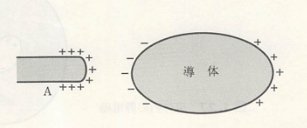

## 導体

 物体内に電荷があるものと考え、その電荷が出す電場について述べていた。では、実際に電荷がどのように分布しているのかを考えてみよう。電気振り子に話を戻すと、正と負のコルク球と棒をくっつけると互いに電荷をなくすため、先ほどのGaussの法則からも分かるように電気を持たない（電場を出さない）物体は電荷がないか中の正負の電荷の数が同じであると考えられる。そのため、そこに電場を充てると正と負で電荷が別れるのではないか（**静電誘導**）と考えられる。そのようにして誘起された電荷を**誘導電荷**、静電誘導を示す物体を**導体**と呼ぶ。

 

    

導体内では内部の電場はどうなっているだろうか。帯電体 A 上の電荷は、導体の内外を問わず、そのまわりの空間に電場をつくり、その作用により導体表面上に誘導電荷を発生させる。この正負の誘導電荷も導体内で電場を作ることで、導体内では外部と比べて弱くなる。これを繰り返していくと、やがて導体内の電場がなくなったときに静電誘導が止まるものと考えられる。