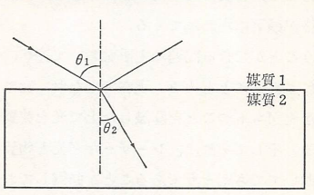
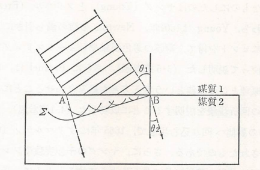
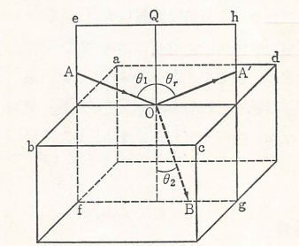

## 幾何光学

　光に関する研究は既に遠くギリシャ時代においても行われ、例えば紀元前300年頃、Euclidは光学に関する本を著している。この本の中で、彼は光の直進性や反射の法則を自身の幾何学と結び付けて論じており、光の本性は問題とせずに光の進路を純粋に幾何学的に扱う分野（**幾何光学**）を開拓した。それから幾何光学は中世の間にも大いに進歩し、球面鏡や放物面鏡、レンズなどを生み出し、老人用の眼鏡の発明なども行われた。これらは近代物理学の誕生期へと引き継がれていき、Galileoによる屈折望遠鏡の製作（1609年）、Snellによる屈折の法則の発見（1621年）、Fermatによる光の進路を決める原理の確立（1657年）、Newtonによる反射望遠鏡の発明（1668年）などへとつながっていった。

　光の本性が本格的に問題とされるようになったのは、17世紀に入ってからであり、よく知られているように、光を微小な粒子の流れとみる粒子説と媒質中を伝搬する波動とみる波動説の間で、長い期間にわたって激しい論争が行われた。これは、例えばSnellの方に関しても、このどちらの考え方でも尤もらしい説明をすることが可能だからである。この法則は、二つの媒質の境界面に光が入射し、一部が屈折して別の媒質に侵入する場合、以下の関係式が $\theta_1$ によらず媒質が固定されていれば決まった値をとるというものである。

<table>
<tr><td>
    
</td>
<td>
    $$
        \frac{\sin\theta_1}{\sin\theta_2}=n_{12}
    $$
</td></tr>
</table>

これに対する粒子説の説明は次のように行われる。すなわち、二つの媒質ではポテンシャルエネルギーの差があり、このために粒子は境界面の所で面に垂直な方向に力を受ける。しかしこの場合、面に平行な方向の速度成分は変わらないから、それぞれの媒質中での光の速さを $v_1,v_2$ として、
$$
    v_1\sin\theta_1=v_2\sin\theta_2
$$
が成立する。したがって、$\sin\theta_1,\sin\theta_2$ の比は $\theta_1$ に依存せず
$$
    \frac{\sin\theta_1}{\sin\theta_2}=\frac{v_2}{v_1}
$$
というようにSnellの法則での $n_{12}$（**相対屈折率**）は速度の比 $v_2/v_1$ に等しいということになる。

　一方で、Huygensの原理を用いた波動説による説明は以下のとおりである。すなわち、図のように平面波が上方からやってきたとして、平面波が点Aから点Bに届くまでの時間 $\Delta t$ を考えてみると、その間にできる波面というのは $\Sigma$ のようになり、関係としては
$$
    \overline{AB}\sin\theta_1=v_1\Delta t、
    \overline{AB}\sin\theta_2=v_2\Delta t
$$
が成り立つ。従って、それぞれの比をとることで
$$
    \frac{\sin\theta_1}{\sin\theta_2}=\frac{v_1}{v_2}
$$
となり、先ほどとは逆の関係（$n_{12}=v_1/v_2$）になることが分かる。

    

どちらが正しいかどうかは空気中と水中での光の速さを比較すれば、粒子説と波動説のどちらが正しいか決めることができる筈である。実際、光が空気から水の中へと屈折する場合 $n_{12}>1$ であるが、1850年、Foucaultは水中での光速が空気中でのそれよりも遅いこと（$v_2<v_1$）を確かめ、これにより波動説が勝利をおさめる結果となった。

　上記のことをふまえて反射、屈折の法則をまとめると次のようになる。すなわち、入射光線と境界面との交点Oに立てた境界面に対する法線（接平面に垂直な直線）OQと、入射光線AOとで作られる平面を光の入射面と呼ぶが、反射光線も屈折光線もともにこの平面内にある。

    

そこで、この面内で図のように角度を決めると、入射角 $\theta_1$ と反射角 $\theta_r$ とは等しく、入射角 $\theta_1$ と屈折角 $\theta_2$ の間には入射側と屈折側それぞれの**屈折率**を $n_1、n_2$ として、次の関係（Snellの法則）が成り立つ。

$$
    n_1\sin\theta_1=n_2\sin\theta_2
$$

ここで屈折率 $n$ は媒質中の光速 $v$ 、真空中の光速 $c$ と $n=c/v$ という関係があるため、光速に置き換えてみると先ほどの波動説の説明のところに出てきた式と同じ形になっていることが分かる。

$$
    \frac{\sin\theta_1}{\sin\theta_2}=\frac{v_1}{v_2}
$$

また、屈折率は様々な色の光に対して異なった値を持つが、その違いというのは僅かであるから通常は光に対する媒質の屈折率は一定としても差支えがない。また、真空の屈折率が1であるが、空気の屈折率が1.00029であるから1として見なしてもよい。

　ここまでは $n_2>n_1$ に限った話であったが、一方で $n_2<n_1$ の場合だと入射角よりも屈折角の方が大きくなるから、入射角が大きくなると屈折角が90°をこえる場合も考えられる。しかし、そのように屈折することはなく、実際は全て反射（**全反射**）されることになる。また、全反射が始める入射角のことを**臨界角**（critical angle）と呼ばれる。この角度は屈折角が90°となったときの以下の式から求められる。
$$
    \theta_{c}=\arcsin\left(\frac{n_2}{n_1}\right)、
    \frac{n_2}{n_1}<1
$$
例えば、媒質1を水、媒質2を空気とすると $n_1\approx 4/3,n_2\approx 1$ であるから、臨界角は約50°になる。
$$
    \theta_{c}=\arcsin\left(\frac{3}{4}\right)=
    48.59\cdots\approx 50°
$$
したがって、例えば以下の図のように水中に沈めた10円玉Pに光が反射し、その光が水中から空気中に出る際に屈折して目に届いたとする（このとき10円玉Pは点線で描いたように浮いて見えた状態になっている）。仮に $-50°<r<50°$ の範囲であれば屈折して10円玉が見えるが、それを超えると全反射をしてしまうため見えなくなることが分かる。 

    

