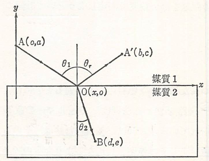

## Fermatの原理

　屈折率が場所によって僅かずつ異なるような物質中を光がとおるときには、光線は曲がるがその場合の光の進路を決める法則は**Fermatの原理**として知られている。これは、光の進む道はその近傍の経路と比べて光学距離が極値（正しくは停留値）になるようなものであるという表現される。**光学距離**とは、屈折率を経路に沿って積分したもので、$\bm{r}$を空間座標、$ds$を経路に沿った不精な線要素とすると、A点からB点までの経路では、
$$
    L(A,B)=\int_A^B n(\bm{r})ds
$$
と書くことができる、これは、AB間の経路の距離が光学的には真空中を伝わる平面波に換算して $L(A,B)$ であること、つまりB点の位相のA点のそれに比べた遅れが、真空中を平面波が距離 $L(A,B)$ だけ行ったときの億例に等しいことを意味している。この原理は、実際の経路についてはそれからの任意の無限小のずれに対して光学距離の変化分が零、つまり
$$
    \delta L(A,B)=0
$$
が成り立つと表現することもできる。さらに、光の速さは媒質の屈折率に反比例するから、もっと簡単には実際に光がとおる道はそれに少し変えた経路と比較して、同じ2点間を行くのに要する時間が極値（ないしは停留値）になるようなものである。といってもよい。

　Fermatの原理は、幾何光学の公理ともいうべきものであり、前節で述べた光線の可逆性や均一な媒質中での光の直進性はもちろん、光の反射や屈折の法則もこの原理の中に含まれる。すなわち、反射光線と屈折光線が入射面内にあることは、この原理から自明であるから、二つの媒質（屈折率$n_1,n_2$）の境界面が$xz$面（$x$軸を含む紙面に垂直な面）であり、光の入射面が$xy$面であるとして、以下の図のように座標を決める。

    

このとき反射、屈折のそれぞれの場合の経路AOA'およびAOBの光学距離は
$$
    L(A,A')=
    n_1\left(
        \sqrt{x^2+a^2}+\sqrt{(b-x)^2+c^2}
    \right)
$$
$$
    L(A,B)=
    n_1\left(
        \sqrt{x^2+a^2}+\sqrt{(d-x)^2+e^2}
    \right)
$$
となる。そこで、$x$を変えた時にこれらが極値となることから、それぞれ
$$
    \delta L(A,A')=
    n_1\left(
        \frac{x}{\sqrt{x^2+a^2}}-
        \frac{b-x}{\sqrt{(b-x)^2+c^2}}
    \right)\delta x = 0
$$
$$
    \delta L(A,B)=
    \left(
        \frac{n_1x}{\sqrt{x^2+a^2}}-
        \frac{n_2(d-x)}{\sqrt{(d-x)^2+e^2}}
    \right)\delta x = 0
$$
となり、これらについて以下の関係が成り立つ。
$$
    \sin\theta_1=\frac{x}{\sqrt{x^2+a^2}}、
    \sin\theta_r=\frac{b-x}{\sqrt{(b-x)^2+c^2}}、
    \sin\theta_2=\frac{(d-x)}{\sqrt{(d-x)^2+e^2}}
$$
そのため、以下のように反射・屈折の法則が導かれる。
$$
    \sin\theta_1=\sin\theta_r（\theta_1=\theta_r）、
    n_1\sin\theta_1=n_2\sin\theta_2
$$

