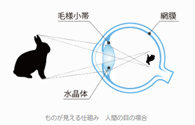

## レンズの仕組み

　ところで、そもそも人の目というのは物体から反射された光をどのようにして認識しているであろうか。構造としては以下の左図のようになっており、角膜・水晶体のところで屈折をして、網膜上に光が集まることで、網膜上にはっきり画像が映し出される。その映し出された画像情報が脳に伝達されることで、物体がはっきり見えるという流れになる。この構造というのはレンズで再現することが可能であり、実際にカメラなどでは以下の右図のようになっている。

<table>
<tr align="center"><td>
    
</td>
<td>
    
</td></tr>
</table>

このことからも分かるように、レンズの仕組みを理解することが重要なため、順を追ってそのことについて述べていくことにする。まず曲面のガラスに光が当たるとどうなるかを考察してみる。曲面に光線があたると、光は以下の赤線のような軌道で反射をすると考えられる。

    

今の場合、点Aから点Mを介して点Bへ通る状況を考えているが、同じように点Pを介しても点Bに到達することができる（どちらも、Fermatの原理で言う $\delta L(A,B)=0$ を満たす）。すると、これら2つの光学距離は同じものとなるため、以下の式が成り立つ。
$$
    \sqrt{(a-y)^2+x^2}+\sqrt{(b-y)^2+x^2}=a+b
$$
しかし、この式は大変複雑であるため、簡略化するため$a$や$b$に比べて$x$や$y$の絶対値が十分に小さい範囲の光線のみについて考えてみる。すると、左辺の各項目が
$$
    \sqrt{(a-y)^2+x^2}=
    a\sqrt{1+\frac{x^2+y^2-2ay}{a^2}}\approx
    a+\frac{x^2+y^2-2ay}{2a}
$$
$$
    \sqrt{(b-y)^2+x^2}=
    b\sqrt{1+\frac{x^2+y^2-2by}{b^2}}\approx
    b+\frac{x^2+y^2-2ay}{2b}
$$
となることから、以下の式に置き換えることができる。
$$
    x^2+y^2-\frac{4ab}{a+b}y=0
$$
そして、さらにこの式を変形して
$$
    x^2+\left(y-R\right)^2=R^2、
    \left(R=\frac{2ab}{a+b}\right)
$$
とすることで円の方程式になっていることがわかるため、曲面鏡が半径 $R$ の球の一辺とみなせるものと考えられる。このときの $R$ というのは**曲率半径**と呼ばれ、