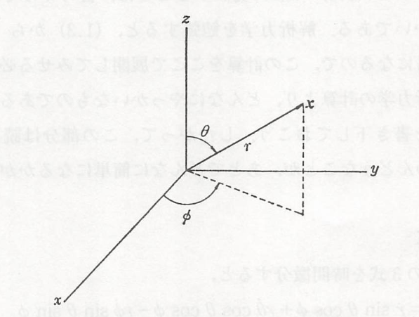
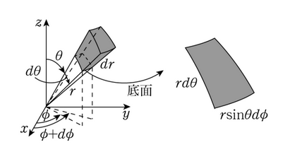

## Newton形式

　質量 $m$ の質点を考えよう。この質点の位置を示すのに、通常は $(X,y,z)$ 座標を用いる。それを太字 $\bm{r}$ で表すと、Newtonの運動方程式は

$$
    m\frac{\mathrm{d}^2\bm{r}}{\mathrm{d}t^2}=
    \bm{F}
$$

と書かれる。ここに右辺の $\bm{F}$ はこの質点に働く力である。これを適当な初期条件のもとに解くと、質点の位置ベクトル $\bm{r}$ が定まる。この式は時間に関して2階の微分を含んでいるから、初期条件としてある条件 $t_0$ における質点の位置と速度の二つを与えるやると、$\bm{r}$ が定まることになる。運動方程式を含む時間微分の数と、初期条件として与えなければならない物理量の数とがこのように常に一致することは周知であろう。

    

　今まで、$(x,y,z)$ 座標を用いて粒子を表してきたが、球面極座標 $(r,\theta,\phi)$ を用いて粒子の位置を表すこともできる。これらの関係は、

$$
    x=r\sin\theta\cos\phi、
    y=r\sin\theta\sin\phi、
    z=r\cos\theta
$$

で結ばれているから、運動方程式が

$$
    m\frac{\mathrm{d}^2x}{\mathrm{d}t^2}=F_x、
    m\frac{\mathrm{d}^2y}{\mathrm{d}t^2}=F_y、
    m\frac{\mathrm{d}^2z}{\mathrm{d}t^2}=F_z
$$

であることから、まず一階微分を計算してみると、以下の通りになる。

$$
    v_x=
    \frac{\mathrm{d}x}{\mathrm{d}t}=
    \frac{\mathrm{d}r}{\mathrm{d}t}
    \sin\theta\cos\phi+
    r\frac{\mathrm{d}\theta}{\mathrm{d}t}
    \cos\theta\cos\phi-
    r\frac{\mathrm{d}\phi}{\mathrm{d}t}
    \sin\theta\sin\phi
$$
$$
    v_y=
    \frac{\mathrm{d}y}{\mathrm{d}t}=
     \frac{\mathrm{d}r}{\mathrm{d}t}
    \sin\theta\sin\phi+
    r\frac{\mathrm{d}\theta}{\mathrm{d}t}
    \cos\theta\sin\phi+
    r\frac{\mathrm{d}\phi}{\mathrm{d}t}
    \sin\theta\cos\phi
$$
$$
    v_z=
    \frac{\mathrm{d}z}{\mathrm{d}t}=
    \frac{\mathrm{d}r}{\mathrm{d}t}
    \cos\theta-
    r\frac{\mathrm{d}\theta}{\mathrm{d}t}
    \sin\theta
$$

    

ここで、極座標における各成分の速度に関して上図にあるように

$$
    v_r=
    \frac{\mathrm{d}r}{\mathrm{d}t}、
    v_\theta=
    r
    \frac{\mathrm{d}\theta}{\mathrm{d}t}、
    v_\phi=
    r\sin\theta
    \frac{\mathrm{d}\phi}{\mathrm{d}t}
$$

であるため、直交座標系の速度の以下の関係にあると考えられる。

$$
    v_x=
    v_r\sin\theta\cos\phi+
    v_\theta\cos\theta\cos\phi-
    v_\phi\sin\phi
$$
$$
    v_y=
    v_r\sin\theta\sin\phi+
    v_\theta\cos\theta\sin\phi+
    v_\phi\cos\phi
$$
$$
    v_z=
    v_r\cos\theta-
    v_\theta\sin\theta
$$

二階微分の部分を計算してみると以下の通りになる。

$$
\begin{align*}
    \frac{\mathrm{d}v_x}{\mathrm{d}t}
    &=
    \frac{\mathrm{d}v_r}{\mathrm{d}t}
    \sin\theta\cos\phi+
    v_r
    \frac{\mathrm{d}\theta}{\mathrm{d}t}
    \cos\theta\cos\phi-
    v_r
    \frac{\mathrm{d}\phi}{\mathrm{d}t}
    \sin\theta\sin\phi\\
    &+
    \frac{\mathrm{d}v_\theta}{\mathrm{d}t}
    \cos\theta\cos\phi-
    v_\theta
    \frac{\mathrm{d}\theta}{\mathrm{d}t}
    \sin\theta\cos\phi-
    v_\theta
    \frac{\mathrm{d}\phi}{\mathrm{d}t}
    \cos\theta\sin\phi\\
    &-
    \frac{\mathrm{d}v_\phi}{\mathrm{d}t}
    \sin\phi-
    v_\phi
    \frac{\mathrm{d}\phi}{\mathrm{d}t}
    \cos\phi
\end{align*}
$$
$$
\begin{align*}
    \frac{\mathrm{d}v_y}{\mathrm{d}t}
    &=
    \frac{\mathrm{d}v_r}{\mathrm{d}t}
    \sin\theta\sin\phi+
    v_r
    \frac{\mathrm{d}\theta}{\mathrm{d}t}
    \cos\theta\sin\phi+
    v_r
    \frac{\mathrm{d}\phi}{\mathrm{d}t}
    \sin\theta\cos\phi\\
    &+
    \frac{\mathrm{d}v_\theta}{\mathrm{d}t}
    \cos\theta\sin\phi-
    v_\theta
    \frac{\mathrm{d}\theta}{\mathrm{d}t}
    \sin\theta\sin\phi+
    v_\theta
    \frac{\mathrm{d}\phi}{\mathrm{d}t}
    \cos\theta\cos\phi\\
    &+
    \frac{\mathrm{d}v_\phi}{\mathrm{d}t}
    \cos\phi-
    v_\phi
    \frac{\mathrm{d}\phi}{\mathrm{d}t}
    \sin\phi
\end{align*}
$$
$$
    \frac{\mathrm{d}v_z}{\mathrm{d}t}
    =
    \frac{\mathrm{d}v_r}{\mathrm{d}t}
    \cos\theta-
    v_r
    \frac{\mathrm{d}\theta}{\mathrm{d}t}
    \sin\theta-
    \frac{\mathrm{d}v_\theta}{\mathrm{d}t}
    \sin\theta-
    v_\theta
    \frac{\mathrm{d}\theta}{\mathrm{d}t}
    \cos\theta
$$

ここで $x$ と $y$ の二階微分の計算結果を並べてみると、それぞれ $\cos\phi$、$\sin\phi$ をかけて足し合わせることで

$$
\begin{align*}
    \frac{\mathrm{d}^2x}{\mathrm{d}t^2}
    \cos\phi+
    \frac{\mathrm{d}^2y}{\mathrm{d}t^2}
    \sin\phi
    &=
    \frac{\mathrm{d}^2r}{\mathrm{d}t^2}
    \sin\theta+
    2
    \frac{\mathrm{d}r}{\mathrm{d}t}
    \frac{\mathrm{d}\theta}{\mathrm{d}t}
    \cos\theta\\
    &+
    r\frac{\mathrm{d}^2\theta}{\mathrm{d}t^2}
    \cos\theta-
    r
    \left(
        \frac{\mathrm{d}\theta}{\mathrm{d}t}
    \right)^2
    \sin\theta-
    r
    \left(
        \frac{\mathrm{d}\phi}{\mathrm{d}t}
    \right)^2
    \sin\theta\
\end{align*}
$$

となり、さらに $z$ を二階微分したものを見比べてみると、それぞれ $\sin\theta,\cos\theta$ をかけることで

$$
    \left(
        \frac{\mathrm{d}^2x}{\mathrm{d}t^2}
        \cos\phi+
        \frac{\mathrm{d}^2y}{\mathrm{d}t^2}
        \sin\phi
    \right)
    \sin\theta+
    \frac{\mathrm{d}^2z}{\mathrm{d}t^2}
    \cos\theta=
    \frac{\mathrm{d}^2r}{\mathrm{d}t^2}-
    r
    \left(
        \frac{\mathrm{d}\theta}{\mathrm{d}t}
    \right)^2-
    r
    \left(
        \frac{\mathrm{d}\phi}{\mathrm{d}t}
    \right)^2
    \sin^2\theta
$$

が得られる。