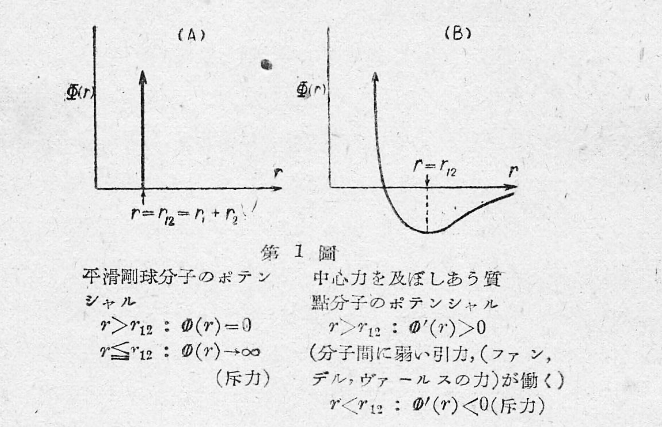

# 統計力学

　これから学ぼうとする統計理論では、物質が多数の分子から成り立つことを前提とし、これらの分子が古典力学に従うものとし、互いに力を作用しあって運動するときどのような性質を表すかを研究する。扱う対象は気体・液体・固体に渡り扱う性質も熱容量、状態方程式から電気的・磁気的性質もあり、また平衡状態を扱うことはもちろん、非平衡状態も扱う。

　我々は以下、気体について観察される諸性質を数学的な方法によって説明しようとする。その基礎になる仮定は二つあって、その第一は気体は連続ではなくて、分子（又は原子）と呼ばれる有限ではあるが、非常に多くの小さい粒子からできているというのである。実際には、これらの分子（原子）は更に複雑な内部構造、および相互作用を持つ。しかしこれらを一々考慮すると、より複雑になってしまうから、我々は実際の気体分子から問題に重要な性質を抽象して、体系を理想化して気体の諸性質を導き出そうとする。それゆえに体系の理想化は必然的に、理論の適用範囲を制限する。以下分子に関しては、次のような理想化を行う。分子は半径 $r_1$ の滑らかな表面を持った剛体弾性球であると考え、二つの分子は距離が半径の和 $r_{12}=r_1+r_2$ に接近したときにのみ斥力が働くとする。二分子間のポテンシャルを相互距離 $r$ の関数とすれば、以下のグラフのようになる。しかしこの剛体平滑分子の模型はあまりにも素朴すぎるかもしれないので、次のような模型を考えることもある。分子を質点とみなし、中心力を及ぼしあうことを考える。二つの分子間の距離 $r$ のみの関数であるポテンシャルエネルギーを $U(r)$ とすれば以下のグラフのようになる。

    

　次にこれらの分子は、その温度の高低によって、あるいは速やかに、あるいは緩やかに運動している。そして互いに衝突しあい作用を及ぼしあう（運動量およびエネルギーを交換し合っている）。仮定の第２は、これらの気体分子の全体としての平均の並進エネルギーを除いた、分s二の運動エネルギーが気体の熱エネルギーであるということである。なお、気体分子が回転、振動などの内部自由度をもつならば、その運動エネルギー、ポテンシャルエネルギーもまた熱エネルギーに含まれるものとする。しあｋしいわゆる気体運動論の立場で計算が最後まで行われているのは、内部自由度のない単原子分子の場合であるから、一応我々は上のような剛球分子の並進運動のみに話を制限しておくのである。

 　以上の二つの仮定をもとに、通常の力学のように与えられた初期条件の下で運動方程式を積分すればよいのであるが、今考えている体系では非常に多くの分子から成り立っており、個々の分子に対して一々初期条件を知ることも、運動方程式を解くことも不可能である。それゆえに我々の問題は、適当な微小時間において平均化された、ある容積の中に存在する分子の平均数、平均エネルギー、あるいはこれらの量の時間的変化というような平均的な量のみ考えることにする。これは単に数学的な面ばかりでなく、物理的にも我々の測定しうる量は、このような平均的な量のみであることからもうなずける。このような問題を解くためには、後で分かるように統計的な考察を必要とする。おおよそ、上のような考え方で物質、気体の物理的性質を説明しようとする原子論の立場は、古くはギリシャ時代にまでさかのぼるのであるが、定量的な理論の形を取り始めたのは、もちろんNewton力学のできた後である。特に19世紀半ば頃MaxwellやBoltzmannによって一応完結された。その基礎に立って詳しい計算を行ったのは、EnskogおよびChapmanである。これらの理論の基底となっているのは、もちろん古典力学であるが、原子級の問題では量子力学を使わなければいけない。それで以下に述べる理論もその意味で改良しなければならいないのであるが、改良の結果は大したことでないようであるから説明を省く。この量子力学を取り入れ方は統計力学の場合と同じように二重である。一つは統計法の変化にあり、もう一つは衝突の確率に関することである。後者に関する限りは、古典理論に取り入れることはやさしい。理論の大部分が衝突の確率の詳しい知識には関係なく組み立てられるからである。気体運動論の方法を金属の中の自由電子の気体に応用しようとする場合には、上の二つの量子論的効果を十分に考慮しなければならない。