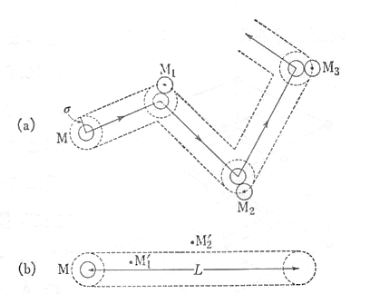

## 気体分子運動論

　気体が分子で構成されているものとみなした場合、容器内ではまず壁への衝突による力（圧力）が働くことが考えられる。そのため容器の壁に及ぼす圧力を考えると、圧力 $P$ は壁の単位面積が受ける力（撃力）の垂直成分の時間平均として定義される。そのため力の時間平均は分子の受ける力積の単位時間内総量に等しく、更にこれは運動量の変化の単位時間内総量に等しい。速さ $v$ の分子が壁に衝突して、**弾性的に反発されるとすれば**分子の運動量変化は壁に垂直に $2mv_{\perp}$ となる。そのため、単位時間当たりの力は以下のようになる。
$$
    \bar{F}=\frac{2mv_{\perp}}{\Delta t}、
    (\bm{v}=\bm{v}_{\perp}+\bm{v}_{//})
$$
ただ、実際は一つの分子による力のみがかかるわけではなく、同じ速度の分子の数（ $N(v_{\perp})$ ）だけ力が働く。この個数というのは時間 $\Delta t$ の間に範囲 $\Delta S$ に力が生じるものとして、数密度 $n(v_{\perp})$ により
$$
    N(v_{\perp})=
    n(v_{\perp})
    \left(
    \frac{1}{2}v_{\perp}\Delta t
    \Delta S
    \right)
$$
となるため、全体の力は以下の通りとなる。
$$
    F(v_{\perp})=
    \overline{F}N(v_{\perp})=
    mn(v_{\perp})v_{\perp}^2
    \Delta S
$$
最終的な圧力は、全ての速度に対する力の合計を面積で割ったものであるため次のように書ける。
$$
    P=
    \frac{1}{\Delta S}
    \sum_{v_{\perp}>0}F(v_{\perp})=
    m\sum_{v_{\perp}>0}
    n(v_{\perp})v_{\perp}^2
$$
ここで、単位体積内の分子数を $n$ としたとき
$$
    P=mn\braket{v_{\perp}^2}、
    \braket{v_{\perp}^2}=
    \sum_{v_{\perp}>0}
    v_{\perp}^2 f(v_{\perp})、
    \left(
        f(v_{\perp})=
        \frac{n(v_{\perp})}{n}
    \right)
$$
となる。ここで $\braket{v_{\perp}^2}$ がどのくらいの値になるかは式を変形することで求めることができる（数密度：$n\ (=N/V)$、全質量：$M$、体積：$V$ ）。
$$
    P=\frac{mN\braket{v_{\perp}^2}}{V}=
    \frac{M\braket{v_{\perp}^2}}{V}
    \rightarrow
    \braket{v_{\perp}^2}=\frac{PV}{M}
$$
例として、標準状態（0℃、1気圧）における1モルの気体を考えると、
$$
    P=1.013\times 10^5\ \mathrm{N/m^2}、
    V=0.0224\ \mathrm{m^3}
$$
であるため、各分子ごとに以下のようになる。

|分子名|$M$（kg）|$\braket{v_{\perp}^2}$|
|-|-|-|
|H$_2$|0.0020|1134560|
|He   |0.0040|567280|
|N$_2$|0.0280|81040|
|O$_2$|0.0320|70910|

そのため、分子の平均速度はおおよそ $100～300\ \mathrm{m/s}$ となるわけだが、実際の気体の拡散速度（1 m/s程度以下）と比べるとずっと遅いため矛盾があるように感じる。これは衝突を繰り返すことで**平均自由行路**が短くなり、全体的な速度が遅くなるということによるものと考えられる。そのため、衝突に関して考察していくことにする。

　気体の分子には大きさがあるために必ず衝突する。分子の直径を $\sigma$ とし、一つの分子 M が M$_1$、M$_2$、M$_3$,・・・と次々に衝突して運動を変えていくありさまを想像したものが図である。

    

　さて、この場合に衝突の数を知るためにはMが半径 $\sigma$ の球、その他が半径0になったとしても、全く同じである。そこで、Mが全行程 $L$ を通過し終える間に何回他の分子と衝突するかということは、切り口の半径が $\sigma$で中心軸の全長 $L$ の円柱の中に何個の分子中心がああるかということに一致する。そこで、いま数密度が $n$ であったとすると、円柱の体積が $\pi\sigma^2 L$であるから、
$$
    衝突回数=n\pi\sigma^2 L
$$
となる。ここで、衝突回数が1に相当する距離 $L$ は一つの衝突から次の衝突までの平均距離と考えられる。この距離を**平均自由工程**という。
$$
    l=\frac{1}{n\pi\sigma^2}
$$
Maxwellは自身で導いた粘性係数 $\eta$ と平均自由工程の関係式
$$
    \eta=\frac{1}{3}\rho l\bar{v}、
    \left(
        \bar{v}=
        \sqrt{\braket{v_{\perp}^2}}
    \right)
$$
を用いて、常温での平均自由工程の値を以下の値で推定している。
$$
    l\simeq 5.7\times 10^{-8}\ 
    \mathrm{m}
$$
そのため、1sの間に分子が100m進んだ場合には
$$
    衝突回数=\frac{L}{l}=
    \frac{100}{10^{-8}}=10^{10}回
$$
というように多くの衝突が起きていることがうかがえる。さらに、Loschmidtは1m$^3$の気体を圧縮して液体にしたときの体積 $V_0$ は、気体の分子の数密度（1m$^3$に含まれる分子の個数）を用いて
$$
    V_0\simeq n\cdot\frac{4}{3}\pi
    \left(
        \frac{\sigma}{2}
    \right)^2
$$
となると考え、空気分子1個の直径は
$$
    \sigma\simeq 10^{-9}\ \mathrm{m}
    （10\mathrm{\AA}）
$$
となることを推定している。これを踏まえると、数密度も
$$
    n\simeq
    2\times 10^{24}\ \mathrm{m}^{-3}
$$
となるわけだが、0℃、1気圧での1m$^3$中での分子数は**ロシュミット数**と呼ばれている。この値を見ても分かるように、かなり多くの分子が存在していることが伺える（この値だと不正確であるため、現在ではより正確な値であるアボガドロ数が用いられる）。

では、これを進めて議論していきたいところであるが、まともに議論すると複数個の質点全ての運動を見ることに相当するので、現実的に解けるような問題でないことは予想できるであろう。そのため、これからは統計集団という考えを用いて複数個の分子を取り扱っていくことにする。
