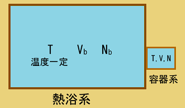

## 正準集団（カノニカルアンサンブル）

　前回までは分子の集団が孤立している状態を考えていたが、実際のところ孤立系というのは現実にはなく最低でも外部と熱のやり取りをしていることが多い。そのため、以下の図ような系を考えてみる。

    

ここでの容器系の状態を見てみると、熱力学第一法則と第二法則により
$$
    \mathrm{d}U=
    \mathrm{d}'Q+\mathrm{d}'W=
    \mathrm{d}'Q、
    \frac{\mathrm{d}'Q}{T} 
    \le \mathrm{d}S
$$
となるため、先ほどと異なりエネルギーが一定とならないため状態数を求めることができない。一方で、熱浴系においても
$$
    \mathrm{d}U_{b}=
    \mathrm{d}'Q_{b}+\mathrm{d}'W_{b}=
    \mathrm{d}'Q_{b}、
    \frac{\mathrm{d}'Q_{b}}{T_{b}} 
    \le \mathrm{d}S_{b}
$$
となるわけだが、全体としては孤立系であることを踏まえると、全体の内部エネルギーが保存しており尚且つ熱浴系と容器系の間でしか熱のやりとりしないことになる。
$$
    \mathrm{d}U_{t}=
    \mathrm{d}U_{b}+\mathrm{d}U=0、
    \mathrm{d}'Q_{b}=-\mathrm{d}'Q
$$
ここで熱力学第二法則の二式の和をとるとエントロピーに関して
$$
    \frac{\mathrm{d}'Q}{T}+
    \frac{\mathrm{d}'Q_{b}}{T_{b}} =
    \left(
        \frac{1}{T}-
        \frac{1}{T_{b}}
    \right)\mathrm{d}'Q \le
    \mathrm{d}S + \mathrm{d}S_{b}
$$
となるわけだが、ここで熱と温度の関係を見てみると
$$
    \begin{cases}
        ・T < T_{b}\ 
        (1/T-1/T_{b}>0)\ の場合 &
        \rightarrow　
        \mathrm{d}'Q>0\\
        ・T > T_{b}\ 
        (1/T-1/T_{b}<0)\ の場合 &
        \rightarrow　
        \mathrm{d}'Q<0
    \end{cases}
$$
というように互いに同符号になっていることから、以下の関係が成り立つことが分かる。
$$
    0\le\left(
        \frac{1}{T}-
        \frac{1}{T_{b}}
    \right)\mathrm{d}'Q
    \le\mathrm{d}S + \mathrm{d}S_{b}
$$
ここでBoltzmannの原理よりエントロピーを状態数で置き換えると
$$
    \mathrm{d}S + \mathrm{d}S_{b}=
    \mathrm{d}
    (k_{\mathrm{B}}\ln\mathcal{W})+
    \mathrm{d}
    (k_{\mathrm{B}}\ln\mathcal{W}_{b})=
    \mathrm{d}
     (k_{\mathrm{B}}
     \ln\mathcal{W}\mathcal{W}_{b})
$$
となり、一つのエントロピー $S_{\mathrm{x}}$ としてこれが増大し続けることが分かる。
$$
    S_\mathrm{x}=
    k_{\mathrm{B}}
    \ln\mathcal{W}\mathcal{W}_{b}
    \rightarrow
    0\le\mathrm{d}S_\mathrm{x}
$$
そして、そのまま放置するとやがて熱平衡になり熱の移動が緩やかになることから、準静的変化をするようになり近似的に以下の式が成り立つ。
$$
    \mathrm{d}S\simeq
    \frac{\mathrm{d}'Q}{T}
    、
    \mathrm{d}S_b\simeq
    \frac{\mathrm{d}'Q_b}{T_b}
$$
そのため、内部エネルギーに関する式もエントロピーを含めた形で表現することができる。
$$
    \mathrm{d}S=
    \frac{1}{T}\mathrm{d}U+
    \frac{P}{T}\mathrm{d}V
    \rightarrow
    \left(
        \frac{\partial S}
        {\partial U}
    \right)_V=
    \frac{1}{T}、
    \left(
        \frac{\partial S}
        {\partial V}
    \right)_U=
    \frac{P}{T}
$$
$$
    \mathrm{d}S_b=
    \frac{1}{T_b}\mathrm{d}U_b+
    \frac{P_b}{T_b}\mathrm{d}V_b
    \rightarrow
    \left(
        \frac{\partial S_b}
        {\partial U_b}
    \right)_{V_b}=
    \frac{1}{T_b}、
    \left(
        \frac{\partial S_b}
        {\partial V_b}
    \right)_{U_b}=
    \frac{P_b}{T_b}
$$
また、二つのエントロピーの和（$S_{\mathrm{x}}$）も熱平衡（$T\simeq T_b$）の状態になると
$$
    \mathrm{d}S+\mathrm{d}S_b=
    \left(
        \frac{1}{T}-
        \frac{1}{T_{b}}
    \right)\mathrm{d}'Q\simeq 0
    \rightarrow
    \mathrm{d}S_{\mathrm{x}}=0
$$ 
と増大しなくなり、極大値をとると考えられる。
ここで $\mathcal{W}_{\mathrm{x}}$ は熱浴系も容器系も孤立系の場合だと、互いに独立していることから全体の状態数になるものと思われる。
$$
    \mathcal{W}_t=
    \mathcal{W}_\mathrm{x}=
    \mathcal{W}\mathcal{W}_{b}
$$
しかし、今の場合だと各々でエネルギーが様々な値をとることから、全体のエネルギーが一定の条件の下で以下のような総和をとった形になると考えられる。
$$
    \mathcal{W}_t(U_t)=
    \sum_{Ut=U+U_b}
    \mathcal{W}(U)
    \mathcal{W}_{b}(U_b)=
    \sum_{U}
    \mathcal{W}(U)
    \mathcal{W}_{b}(U_t-U)
$$
ここで、左辺で右辺を割るとあたかも確率のようになることが分かる。
$$
    1=\sum_{U}f(U)、
    f(U)=
    \frac{\mathcal{W}(U)
    \mathcal{W}_{b}(Ut-U)}
    {\mathcal{W}_t(U_t)}
$$
そして、右辺の $\mathcal{W}_b$ のエントロピーに関して
$$
    S_b(U_t-U)\simeq S_b(U_t)-
    \left(
        \frac{\partial S_b}{\partial U_b}    
    \right)_V U=
    S_b(U_t)-\frac{U}{T_b}
$$
であることから、状態数に関しては以下のように書ける。
$$
    \mathcal{W}_b(U_t-U)=
    \mathcal{W}_b(U_t)
    e^{-U/k_{\mathrm{B}}T_b}
$$
そして、熱平衡（$T_b\simeq T$）であることを踏まえると確率は次の通りになる。
$$
    f(U)=
    \frac{\mathcal{W}_b(U_t)}
    {\mathcal{W}_t(U_t)}
    \mathcal{W}(U)
    e^{-\beta U}、
    \beta=\frac{1}{k_{\mathrm{B}}T}
$$
ここで、この総和をとったときに
$$
    \frac{\mathcal{W}_b(U_t)}
    {\mathcal{W}_t(U_t)}=
    \frac{1}{Z}、
    Z=
    \sum_U
    \mathcal{W}(U)
    e^{-\beta U}
$$
とすることで、以下のように置くこともできる。
$$
    f(U)=\frac{1}{Z}
    \mathcal{W}(U)
    e^{-\beta U}
$$
あるいは、状態数をエントロピーの形に置き換えることで
$$
    f(U)=\frac{1}{Z}e^{-\beta F}、
    F=U-TS
$$
とHelmholtzの自由エネルギー $F$ で表現することもできる。この関数は微小変化をとると
$$
    \mathrm{d}F=
    \mathrm{d}U
    -S\mathrm{d}T-T\mathrm{d}S=
    -S\mathrm{d}T-P\mathrm{d}V
$$
であるから、以下の関係式が成り立つ。
$$
    S=-
    \left(
        \frac{\partial F}
        {\partial T}
    \right)_{V}、
    P=-
    \left(
        \frac{\partial F}
        {\partial V}
    \right)_{T}、
    U=F+TS=
    -T^2\left[
        \frac{\partial}{\partial T}
        \left(
            \frac{F}{T}
        \right)
    \right]_V
$$
このことから、自由エネルギーの形で表示できることが分かる。そのため、期待値の方も
$$
    \braket{S}=
    -\frac{1}{T}
    \left(
        \frac{\partial}{\partial\beta}
        \ln Z
    \right)_V-
    \frac{\braket{F}}{T}
$$
$$
    \braket{P}=
    -\frac{1}{\beta}
    \left(
        \frac{\partial}{\partial V}\ln Z
    \right)_T、
    \braket{U}=
    -\left(
        \frac{\partial}{\partial\beta}
        \ln Z
    \right)_V
$$
となるが、エントロピーについては状態数の対数でも書けたため、
$$
    \braket{S}=
    k_{\mathrm{B}}\braket{\ln\mathcal{W}}=
    k_{\mathrm{B}}\braket{\ln f}+
    k_{\mathrm{B}}\ln Z+
    \frac{\braket{U}}{T}
$$
であることから、ヘルムホルツの自由エネルギーとエントロピーは以下の通りになる。
$$
    \braket{F}=
    -\frac{1}{\beta}
    \left(
        \braket{\ln f}+\ln Z
    \right)、
    \braket{S}=
    k_{\mathrm{B}}\braket{\ln f}+
    \left[
    \frac{\partial}{\partial T}
    \left(
    \frac{1}{\beta}\ln Z
    \right)
    \right]_V
$$

一方で、分配関数の方についてはエネルギーが連続していることから
$$
    \int_0^\infty 
    f(U)\mathrm{d}U=
    \frac{1}{Z}
    \int_0^\infty
    \mathcal{W}(U)e^{-\beta U}
    \mathrm{d}U=1
$$
と積分の形で書けるため、整理すると以下のようになっていることが分かる。
$$
    Z=
    \int_0^\infty
    \mathcal{W}(U)
    e^{-\beta U}
    \mathrm{d}U
$$
ただ、少し考えるとこの分配関数にはエネルギーの次元がついてしまい、先ほどの分配関数との違いが生じてしまう。そこで、エントロピーの式をエネルギーで偏微分すると
$$
    \left(
        \frac{\partial S}
        {\partial U}
    \right)_V=
    \frac{k_{\mathrm{B}}}{\mathcal{W}}
    \left(
        \frac{\partial \mathcal{W}}
        {\partial U}
    \right)_V
    \rightarrow
     \mathcal{W}=
     \frac{1}{\beta}
     \left(
        \frac{\partial \mathcal{W}}
        {\partial U}
    \right)_V
$$
であることを利用して、確率を次のように置きなおしてみる。
$$
    f(U)=\frac{1}{\beta Z}\mathcal{D}(U)e^{-\beta U}、
    \mathcal{D}(U)=
    \left(
        \frac{\partial \mathcal{W}}
        {\partial U}
    \right)_V、
    \beta Z=
    \int_0^{\infty}f(U)\mathrm{d}U
$$
このようにすることで、積分の形にした場合でも無次元になることが分かる。

　以上のことを理想気体に適用してみると、エネルギーが連続していることから
$$
    \mathcal{D}(U)=
    \left(
        \frac{\partial \mathcal{W}}
        {\partial U}
    \right)_V=
    \frac{CV^N}{\Gamma(3N/2-1)}
    \left(
        \frac{2\pi}{m}
    \right)^{3N/2}
    U^{3N/2-2}、
    (C：定数)
$$
となり、分配関数と期待値は以下の通りとなる。
$$
    Z=CV^N
    \left(
        \frac{2\pi}{m\beta}
    \right)^{3N/2}
    \rightarrow
    \braket{U}=
    \frac{3}{2}Nk_{\mathrm{B}}T、
    \braket{P}=
    \frac{Nk_{\mathrm{B}}T}{V}
$$
これらは、小正準集団のときの結果と一致していることが分かる。