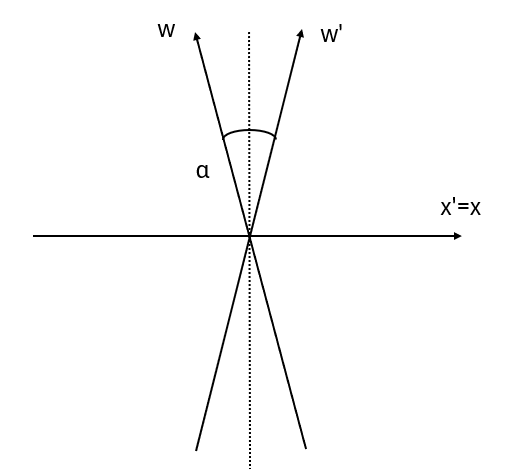
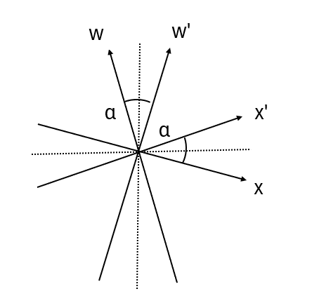

であることを利用すると、変換後の内積は

$$
    \boldsymbol{u}_x\cdot\boldsymbol{u}_x=
    \boldsymbol{u}_X\cdot\boldsymbol{u}_X=1
$$
$$
    \boldsymbol{u}_y\cdot\boldsymbol{u}_y=
    \frac{1}{2}
    \left(
        \boldsymbol{u}_X\cdot\boldsymbol{u}_X+
        2(\boldsymbol{u}_X\cdot\boldsymbol{u}_Y)+
        \boldsymbol{u}_Y\cdot\boldsymbol{u}_Y
    \right)=1
$$

となることから、基底ベクトルの大きさは以下の通りとなる。

$$
    |\boldsymbol{u}_X|=
    \sqrt{\boldsymbol{u}_X\cdot\boldsymbol{u}_X}=1、
    |\boldsymbol{u}_Y|=
    \sqrt{\boldsymbol{u}_Y\cdot\boldsymbol{u}_Y}=1
$$
$$
    |\boldsymbol{u}_x|=
    \sqrt{\boldsymbol{u}_x\cdot\boldsymbol{u}_x}=1、
    |\boldsymbol{u}_y|=
    \sqrt{\boldsymbol{u}_y\cdot\boldsymbol{u}_y}=1
$$

そのため、全ての基本ベクトルと基底ベクトルが一致していることが分かる。

　以上のことをふまえると、各座標系の基底ベクトルの関係とそれらの内積により座標系の変換ができることになるため、今度は前回までに登場した変換（Galielei変換、Lorentz変換）を見てみよう。まず、Galiei変換は

$$
    w'=w、x=-\beta w+x、y'=y、z'=z、
    \left(\beta=\frac{V}{c}\right)
$$
$$
    \leftrightarrow
    w=w'、x=x'+\beta w'、y=y'、z=z'
$$

という変換であるため、ベクトル $\boldsymbol{s}$ は直交座標系の基本ベクトル $\boldsymbol{e}_w,\boldsymbol{e}_x,\boldsymbol{e}_y,\boldsymbol{e}_z$ とGalilei変換後の基本ベクトル $\boldsymbol{e}_w',\boldsymbol{e}_x',\boldsymbol{e}_y',\boldsymbol{e}_z'$ を用いて以下の通りに書ける。

$$
    \boldsymbol{s}=
    w\boldsymbol{e}_w+
    x\boldsymbol{e}_x+
    y\boldsymbol{e}_y+
    z\boldsymbol{e}_z=
    w'\boldsymbol{e}_w'+
    x'\boldsymbol{e}_x'+
    y'\boldsymbol{e}_y'+
    z'\boldsymbol{e}_z'
$$

そして、この微小変化をとったものは直交座標系の基底ベクトル $\boldsymbol{u}_w,\boldsymbol{u}_x,\boldsymbol{u}_y,\boldsymbol{u}_z$ とGalilei変換後の基底ベクトル $\boldsymbol{u}_w',\boldsymbol{u}_x',\boldsymbol{u}_y',\boldsymbol{u}_z'$ を用いて以下の通りに書ける。

$$
    \mathrm{d}\boldsymbol{s}=
    \mathrm{d}w\boldsymbol{u}_w+
    \mathrm{d}x\boldsymbol{u}_x+
    \mathrm{d}y\boldsymbol{u}_y+
    \mathrm{d}z\boldsymbol{u}_z=
    \mathrm{d}w'\boldsymbol{u}_w'+
    \mathrm{d}x'\boldsymbol{u}_x'+
    \mathrm{d}y'\boldsymbol{u}_y'+
    \mathrm{d}z'\boldsymbol{u}_z'
$$

そして、基底ベクトルの変換式は

$$
    \boldsymbol{u}_w=
    \frac{\partial \boldsymbol{s}}{\partial w}=
    \left(
        \frac{\partial w'}{\partial w}
    \right)
    \boldsymbol{u}_w'+
    \left(
        \frac{\partial x'}{\partial w}
    \right)
    \boldsymbol{u}_x'+
    \left(
        \frac{\partial y'}{\partial w}
    \right)
    \boldsymbol{u}_y'+
    \left(
        \frac{\partial z'}{\partial w}
    \right)
    \boldsymbol{u}_z'
$$
$$
    \boldsymbol{u}_x=
    \frac{\partial \boldsymbol{s}}{\partial x}=
    \left(
        \frac{\partial w'}{\partial x}
    \right)
    \boldsymbol{u}_w'+
    \left(
        \frac{\partial x'}{\partial x}
    \right)
    \boldsymbol{u}_x'+
    \left(
        \frac{\partial y'}{\partial x}
    \right)
    \boldsymbol{u}_y'+
    \left(
        \frac{\partial z'}{\partial x}
    \right)
    \boldsymbol{u}_z'
$$
$$
    \boldsymbol{u}_y=
    \frac{\partial \boldsymbol{s}}{\partial y}=
    \left(
        \frac{\partial w'}{\partial y}
    \right)
    \boldsymbol{u}_w'+
    \left(
        \frac{\partial x'}{\partial y}
    \right)
    \boldsymbol{u}_x'+
    \left(
        \frac{\partial y'}{\partial y}
    \right)
    \boldsymbol{u}_y'+
    \left(
        \frac{\partial z'}{\partial y}
    \right)
    \boldsymbol{u}_z'
$$
$$
    \boldsymbol{u}_z=
    \frac{\partial \boldsymbol{s}}{\partial z}=
    \left(
        \frac{\partial w'}{\partial z}
    \right)
    \boldsymbol{u}_w'+
    \left(
        \frac{\partial x'}{\partial z}
    \right)
    \boldsymbol{u}_x'+
    \left(
        \frac{\partial y'}{\partial z}
    \right)
    \boldsymbol{u}_y'+
    \left(
        \frac{\partial z'}{\partial z}
    \right)
    \boldsymbol{u}_z'
$$
$$
    \boldsymbol{u}_w'=
    \frac{\partial \boldsymbol{s}}{\partial w'}=
    \left(
        \frac{\partial w}{\partial w'}
    \right)
    \boldsymbol{u}_w+
    \left(
        \frac{\partial x}{\partial w'}
    \right)
    \boldsymbol{u}_x+
    \left(
        \frac{\partial y}{\partial w'}
    \right)
    \boldsymbol{u}_y+
    \left(
        \frac{\partial z}{\partial w'}
    \right)
    \boldsymbol{u}_z
$$
$$
    \boldsymbol{u}_x'=
    \frac{\partial \boldsymbol{s}}{\partial x'}=
    \left(
        \frac{\partial w}{\partial x'}
    \right)
    \boldsymbol{u}_w+
    \left(
        \frac{\partial x}{\partial x'}
    \right)
    \boldsymbol{u}_x+
    \left(
        \frac{\partial y}{\partial x'}
    \right)
    \boldsymbol{u}_y+
    \left(
        \frac{\partial z}{\partial x'}
    \right)
    \boldsymbol{u}_z
$$
$$
    \boldsymbol{u}_y'=
    \frac{\partial \boldsymbol{s}}{\partial y'}=
    \left(
        \frac{\partial w}{\partial y'}
    \right)
    \boldsymbol{u}_w+
    \left(
        \frac{\partial x}{\partial y'}
    \right)
    \boldsymbol{u}_x+
    \left(
        \frac{\partial y}{\partial y'}
    \right)
    \boldsymbol{u}_y+
    \left(
        \frac{\partial z}{\partial y'}
    \right)
    \boldsymbol{u}_z
$$
$$
    \boldsymbol{u}_z'=
    \frac{\partial \boldsymbol{s}}{\partial z'}=
    \left(
        \frac{\partial w}{\partial z'}
    \right)
    \boldsymbol{u}_w+
    \left(
        \frac{\partial x}{\partial z'}
    \right)
    \boldsymbol{u}_x+
    \left(
        \frac{\partial y}{\partial z'}
    \right)
    \boldsymbol{u}_y+
    \left(
        \frac{\partial z}{\partial z'}
    \right)
    \boldsymbol{u}_z
$$

となるため、変換式を代入すると以下の式が得られる。

$$
    \boldsymbol{u}_w=
    \boldsymbol{u}_w'-\beta\boldsymbol{u}_x'、
    \boldsymbol{u}_x=\boldsymbol{u}_x'、
    \boldsymbol{u}_y=\boldsymbol{u}_y'、
    \boldsymbol{u}_z=\boldsymbol{u}_z'
$$
$$
    \boldsymbol{u}_w'=
    \boldsymbol{u}_w+\beta\boldsymbol{u}_x、
    \boldsymbol{u}_x'=\boldsymbol{u}_x、
    \boldsymbol{u}_y'=\boldsymbol{u}_y、
    \boldsymbol{u}_z'=\boldsymbol{u}_z
$$

ここで、変換前の座標系が直交座標系であることを踏まえて**時間軸w以外**の内積

$$
    \boldsymbol{u}_x=\boldsymbol{e}_x、
    \boldsymbol{u}_y=\boldsymbol{e}_y、
    \boldsymbol{u}_z=\boldsymbol{e}_z
$$
$$
    \boldsymbol{u}_x\cdot\boldsymbol{u}_x=1、
    \boldsymbol{u}_y\cdot\boldsymbol{u}_x=0、
    \boldsymbol{u}_z\cdot\boldsymbol{u}_x=0
$$
$$
    \boldsymbol{u}_x\cdot\boldsymbol{u}_y=0、
    \boldsymbol{u}_y\cdot\boldsymbol{u}_y=1、
    \boldsymbol{u}_z\cdot\boldsymbol{u}_y=0
$$
$$
    \boldsymbol{u}_x\cdot\boldsymbol{u}_z=0、
    \boldsymbol{u}_y\cdot\boldsymbol{u}_z=0、
    \boldsymbol{u}_z\cdot\boldsymbol{u}_z=1
$$

を利用して変換後の内積を求めると

$$
    \boldsymbol{u}_x'\cdot\boldsymbol{u}_x'=1、
    \boldsymbol{u}_y'\cdot\boldsymbol{u}_x'=0、
    \boldsymbol{u}_z'\cdot\boldsymbol{u}_x'=0
$$
$$
    \boldsymbol{u}_x'\cdot\boldsymbol{u}_y'=0、
    \boldsymbol{u}_y'\cdot\boldsymbol{u}_y'=1、
    \boldsymbol{u}_z'\cdot\boldsymbol{u}_y'=0
$$
$$
    \boldsymbol{u}_x'\cdot\boldsymbol{u}_z'=0、
    \boldsymbol{u}_y'\cdot\boldsymbol{u}_z'=0、
    \boldsymbol{u}_z'\cdot\boldsymbol{u}_z'=1
$$

となる。ここで、**時間軸wのみ**の変換式について

$$
    \boldsymbol{u}_w'\cdot\boldsymbol{u}_w'=
    (\boldsymbol{u}_w\cdot\boldsymbol{u}_w)+
    2\beta(\boldsymbol{u}_w\cdot\boldsymbol{u}_x)+
    \beta^2、
    \boldsymbol{u}_w'\cdot\boldsymbol{u}_x'=
    (\boldsymbol{u}_w\cdot\boldsymbol{u}_x)+
    \beta
$$
$$
    \boldsymbol{u}_w\cdot\boldsymbol{u}_w=
    (\boldsymbol{u}_w'\cdot\boldsymbol{u}_w')-
    2\beta(\boldsymbol{u}_w'\cdot\boldsymbol{u}_x')+
    \beta^2、
    \boldsymbol{u}_w\cdot\boldsymbol{u}_x=
    (\boldsymbol{u}_w'\cdot\boldsymbol{u}_x')-
    \beta
$$

となるが、仮に

$$
    \boldsymbol{u}_w'\cdot\boldsymbol{u}_w'=
    \boldsymbol{u}_w\cdot\boldsymbol{u}_w=1
$$

となるとすれば、

$$
    \boldsymbol{u}_w'\cdot\boldsymbol{u}_x'=
    \frac{1}{2}\beta、
    \boldsymbol{u}_w\cdot\boldsymbol{u}_x=
    -\frac{1}{2}\beta
$$

となる。これを踏まえて変換前のベクトルの大きさは

$$
    |\boldsymbol{u}_w|=
    \sqrt{\boldsymbol{u}_w\cdot\boldsymbol{u}_w}=1、
    |\boldsymbol{u}_x|=
    \sqrt{\boldsymbol{u}_x\cdot\boldsymbol{u}_x}=1
$$
$$
    |\boldsymbol{u}_y|=
    \sqrt{\boldsymbol{u}_y\cdot\boldsymbol{u}_y}=1、
    |\boldsymbol{u}_z|=
    \sqrt{\boldsymbol{u}_z\cdot\boldsymbol{u}_z}=1、
$$

であり、変換後の基底ベクトルの大きさは以下の通りになる。

$$
    |\boldsymbol{u}_w'|=
    \sqrt{\boldsymbol{u}_{w}'\cdot\boldsymbol{u}_{w}'}=1、
    |\boldsymbol{u}_x'|=
    \sqrt{\boldsymbol{u}_{x}'\cdot\boldsymbol{u}_{x}'}=1、
$$
$$
    |\boldsymbol{u}_y'|=
    \sqrt{\boldsymbol{u}_{y}'\cdot\boldsymbol{u}_{y}'}=1、
    |\boldsymbol{u}_z'|=
    \sqrt{\boldsymbol{u}_{z}'\cdot\boldsymbol{u}_{z}'}=1
$$

そのため、Galilei変換後の基本ベクトルは

$$
    \boldsymbol{e}_w'=
    \boldsymbol{e}_w+\beta\boldsymbol{e}_x、
    \boldsymbol{e}_x'=
    \boldsymbol{e}_x'=\boldsymbol{e}_x、
    \boldsymbol{e}_y'=\boldsymbol{e}_y、
    \boldsymbol{e}_z''=\boldsymbol{e}_z'
$$

となる。ここまでで内積について変換前が

$$
    \boldsymbol{e}_w\cdot\boldsymbol{e}_w=1、
    \boldsymbol{e}_x\cdot\boldsymbol{e}_w=-\frac{1}{2}\beta、
    \boldsymbol{e}_y\cdot\boldsymbol{e}_w=0、
    \boldsymbol{e}_z\cdot\boldsymbol{e}_w=0
$$
$$
    \boldsymbol{e}_w\cdot\boldsymbol{e}_x=-\frac{1}{2}\beta、
    \boldsymbol{e}_x\cdot\boldsymbol{e}_x=1、
    \boldsymbol{e}_y\cdot\boldsymbol{e}_x=0、
    \boldsymbol{e}_z\cdot\boldsymbol{e}_x=0
$$
$$
    \boldsymbol{e}_w\cdot\boldsymbol{e}_y=0、
    \boldsymbol{e}_x\cdot\boldsymbol{e}_y=0、
    \boldsymbol{e}_y\cdot\boldsymbol{e}_y=1、
    \boldsymbol{e}_z\cdot\boldsymbol{e}_y=0
$$
$$
    \boldsymbol{e}_w\cdot\boldsymbol{e}_z=0、
    \boldsymbol{e}_x\cdot\boldsymbol{e}_z=0、
    \boldsymbol{e}_y\cdot\boldsymbol{e}_z=0、
    \boldsymbol{e}_z\cdot\boldsymbol{e}_z=1
$$

であり、変換後についても

$$
    \boldsymbol{e}_w'\cdot\boldsymbol{e}_w'=1、
    \boldsymbol{e}_x'\cdot\boldsymbol{e}_w'=
    \frac{1}{2}\beta、
    \boldsymbol{e}_y'\cdot\boldsymbol{e}_w'=0、
    \boldsymbol{e}_z'\cdot\boldsymbol{e}_w'=0
$$
$$
    \boldsymbol{e}_w'\cdot\boldsymbol{e}_x'=
    \frac{1}{2}\beta、
    \boldsymbol{e}_x'\cdot\boldsymbol{e}_x'=1、
    \boldsymbol{e}_y'\cdot\boldsymbol{e}_x'=0、
    \boldsymbol{e}_z'\cdot\boldsymbol{e}_x'=0
$$
$$
    \boldsymbol{e}_w'\cdot\boldsymbol{e}_y'=0、
    \boldsymbol{e}_x'\cdot\boldsymbol{e}_y'=0、
    \boldsymbol{e}_y'\cdot\boldsymbol{e}_y'=1、
    \boldsymbol{e}_z'\cdot\boldsymbol{e}_y'=0
$$
$$
    \boldsymbol{e}_w'\cdot\boldsymbol{e}_z'=0、
    \boldsymbol{e}_x'\cdot\boldsymbol{e}_z'=0、
    \boldsymbol{e}_y'\cdot\boldsymbol{e}_z'=0、
    \boldsymbol{e}_z'\cdot\boldsymbol{e}_z'=1
$$

としていたが、ここで時間軸 $w$ と $x$ の内積について値を持つのは以下の図のような関係にあるためと考えられる。

    

　次にLorentz変換の場合、変換式は以下の通りであった。
$$
    w'=\gamma(w-\beta x)、
    x'=\gamma(-\beta w+x)、
    y'=y、
    z'=z、
    \left(
        \gamma=\frac{1}{\sqrt{1-\beta^2}}
    \right)
$$
$$
    \leftrightarrow
    w=\gamma(w'+\beta x')、
    x=\gamma(\beta w'+x')、
    y=y'、
    z=z'
$$

このときの基底ベクトルをGalilei変換と同様に求めてみると

$$
    \boldsymbol{u}_w=
    \gamma (\boldsymbol{u}_w'+\beta\boldsymbol{u}_x')、
    \boldsymbol{u}_x=
    \gamma (\boldsymbol{u}_x'+\beta\boldsymbol{u}_w')
$$
$$
    \boldsymbol{u}'_w=
    \gamma (\boldsymbol{u}_w-\beta\boldsymbol{u}_x)、
    \boldsymbol{u}'_x=
    \gamma (\boldsymbol{u}_x-\beta\boldsymbol{u}_w)
$$

であり、このうち**時間軸wを含む**内積をとると

$$
    (\boldsymbol{u}_w'\cdot\boldsymbol{u}_w')=
    \gamma^2[
        (\boldsymbol{u}_w\cdot\boldsymbol{u}_w)+
        2\beta(\boldsymbol{u}_w\cdot\boldsymbol{u}_x)+
        \beta^2(\boldsymbol{u}_x\cdot\boldsymbol{u}_x)
    ]
$$
$$
    (\boldsymbol{u}_w'\cdot\boldsymbol{u}_x')=
    \gamma^2[
        (\boldsymbol{u}_w\cdot\boldsymbol{u}_x)+
        (1+\beta^2)
        (\boldsymbol{u}_w\cdot\boldsymbol{u}_w)+
        \beta(\boldsymbol{u}_x\cdot\boldsymbol{u}_x)
    ]
$$
$$
    (\boldsymbol{u}_x'\cdot\boldsymbol{u}_x')=
    \gamma^2[
        1+
        2\beta(\boldsymbol{u}_x\cdot\boldsymbol{u}_w)+
        \beta^2
        (\boldsymbol{u}_w\cdot\boldsymbol{u}_w)
    ]
$$

となるが、**時間軸wを除いた分**の内積が

$$
    \boldsymbol{e}_x\cdot\boldsymbol{e}_x=1、
    \boldsymbol{e}_y\cdot\boldsymbol{e}_x=0、
    \boldsymbol{e}_z\cdot\boldsymbol{e}_x=0
$$
$$
    \boldsymbol{e}_x\cdot\boldsymbol{e}_y=0、
    \boldsymbol{e}_y\cdot\boldsymbol{e}_y=1、
    \boldsymbol{e}_z\cdot\boldsymbol{e}_y=0
$$
$$
    \boldsymbol{e}_x\cdot\boldsymbol{e}_z=0、
    \boldsymbol{e}_y\cdot\boldsymbol{e}_z=0、
    \boldsymbol{e}_z\cdot\boldsymbol{e}_z=1
$$

であるから以下の式が得られる。

$$
    (\boldsymbol{u}_w'\cdot\boldsymbol{u}_w')=
    \gamma^2[
        (\boldsymbol{u}_w\cdot\boldsymbol{u}_w)+
        2\beta(\boldsymbol{u}_w\cdot\boldsymbol{u}_x)+
        \beta^2
    ]
$$
$$
    (\boldsymbol{u}_w'\cdot\boldsymbol{u}_x')=
    \gamma^2[
        (\boldsymbol{u}_w\cdot\boldsymbol{u}_x)+
        (1+\beta^2)
        (\boldsymbol{u}_w\cdot\boldsymbol{u}_w)+
        \beta
    ]
$$
$$
    \gamma^2[
        1+
        2\beta(\boldsymbol{u}_x\cdot\boldsymbol{u}_w)+
        \beta^2
        (\boldsymbol{u}_w\cdot\boldsymbol{u}_w)
    ]=
    1
$$

このうち、3つ目の式から

$$
    2(\boldsymbol{u}_x\cdot\boldsymbol{u}_w)=
    \beta
    \left[
       (\boldsymbol{u}_w\cdot\boldsymbol{u}_w)-1
    \right]
$$

をそれ以外の式に適用すると

$$
    (\boldsymbol{u}_w'\cdot\boldsymbol{u}_w')=
    (\boldsymbol{u}_w\cdot\boldsymbol{u}_w)
$$
$$
    (\boldsymbol{u}_w'\cdot\boldsymbol{u}_x')=
    \gamma^2[
        (\boldsymbol{u}_w\cdot\boldsymbol{u}_x)+
        (1+\beta^2)
        (\boldsymbol{u}_w\cdot\boldsymbol{u}_w)+
        \beta
    ]
$$

変換前の内積が以下のようになっていたとする。

$$
    \boldsymbol{e}_w\cdot\boldsymbol{e}_w=1、
    \boldsymbol{e}_x\cdot\boldsymbol{e}_w=-\frac{1}{2}\beta、
    \boldsymbol{e}_y\cdot\boldsymbol{e}_w=0、
    \boldsymbol{e}_z\cdot\boldsymbol{e}_w=0
$$
$$
    \boldsymbol{e}_w\cdot\boldsymbol{e}_x=-\frac{1}{2}\beta、
    \boldsymbol{e}_x\cdot\boldsymbol{e}_x=1、
    \boldsymbol{e}_y\cdot\boldsymbol{e}_x=0、
    \boldsymbol{e}_z\cdot\boldsymbol{e}_x=0
$$
$$
    \boldsymbol{e}_w\cdot\boldsymbol{e}_y=0、
    \boldsymbol{e}_x\cdot\boldsymbol{e}_y=0、
    \boldsymbol{e}_y\cdot\boldsymbol{e}_y=1、
    \boldsymbol{e}_z\cdot\boldsymbol{e}_y=0
$$
$$
    \boldsymbol{e}_w\cdot\boldsymbol{e}_z=0、
    \boldsymbol{e}_x\cdot\boldsymbol{e}_z=0、
    \boldsymbol{e}_y\cdot\boldsymbol{e}_z=0、
    \boldsymbol{e}_z\cdot\boldsymbol{e}_z=1
$$

というように内積が不変になるところがあるか見てみると

、基本ベクトルの関係とそれらの内積を求めてみると
$$
    \boldsymbol{e}'_w=
    \gamma (\boldsymbol{e}_w+\beta\boldsymbol{e}_x)、
    \boldsymbol{e}'_x=
    \gamma (\boldsymbol{e}_x+\beta\boldsymbol{e}_w)
$$
$$
    \boldsymbol{e}_w\cdot\boldsymbol{e}_w=1、
    \boldsymbol{e}_w\cdot\boldsymbol{e}_x=
    \boldsymbol{e}_x\cdot\boldsymbol{e}_w=-\beta=
    \cos\left(
        \frac{\pi}{2}+\alpha
    \right)
$$
$$
    \boldsymbol{e}_w'\cdot\boldsymbol{e}_w'=1、
    \boldsymbol{e}_w'\cdot\boldsymbol{e}_x'=
    \boldsymbol{e}_x'\cdot\boldsymbol{e}_w'=\beta=
    \cos\left(
        \frac{\pi}{2}-\alpha
    \right)
$$
となり、座標も記載すると以下の図（ローデル図）の通りになる。

    

　このように既存の座標系の基本ベクトル（$\boldsymbol{e}_x,\boldsymbol{e}_y,\boldsymbol{e}_z$など）から基底ベクトル $\boldsymbol{u}$ とその内積 $\boldsymbol{u}\cdot\boldsymbol{u}$ から基本ベクトルを求めることで変換前と後の座標系がどのような関係にあるか分かることになる。ただ、そもそも基底ベクトルは微小ベクトル $\mathrm{d}\boldsymbol{s}$ で関連つけられていたため、
$$
    w=x^0、x=x^1、y=x^2、z=x^3、
    \boldsymbol{u}_w=\boldsymbol{u}_0、
    \boldsymbol{u}_x=\boldsymbol{u}_1、
    \boldsymbol{u}_y=\boldsymbol{u}_2、
    \boldsymbol{u}_z=\boldsymbol{u}_3
$$
とおき、$\mathrm{d}\boldsymbol{s}$ を以下のように書く。
$$
    \mathrm{d}\boldsymbol{s}=
    \sum_{\mu}\mathrm{d}x^\mu\boldsymbol{u}_\mu=
    \sum_{\mu'}\mathrm{d}x^{\mu'}\boldsymbol{u}_{\mu'}
$$
$$
    (\mathrm{d}s)^2=
    \mathrm{d}\boldsymbol{s}\cdot\mathrm{d}\boldsymbol{s}=
    \sum_{\mu,\nu=0}^{3}
    (\boldsymbol{u}_\mu\cdot\boldsymbol{u}_\nu)
    \mathrm{d}x^\mu\mathrm{d}x^\nu=
    \sum_{\mu',\nu'=0}^{3}
    (\boldsymbol{u}_{\mu'}\cdot\boldsymbol{u}_{\nu'})
    \mathrm{d}x^{\mu'}\mathrm{d}x^{\nu'}
$$
ここで片方の内積が分かることで、もう片方の内積や返還前後の関係が分かるため、これはリーマン計量と呼ばれている。

　一方で、相対論的力学でもあったようにLorentz変換においては以下の形で不変となっていた。
$$
    (\mathrm{d}w)^2-
    (\mathrm{d}x)^2-
    (\mathrm{d}y)^2-
    (\mathrm{d}z)^2=
    (\mathrm{d}w')^2-
    (\mathrm{d}x')^2-
    (\mathrm{d}y')^2-
    (\mathrm{d}z')^2
$$
そのため、これを内積として定義した空間（Minkofsky空間）を考えると、内積の形が不変となって便利であることがうかがえる。

これを見ても分かるように内積から求めると変換式がおかしくなってしまうため、逆に

あるいは、これをさらに扱い易くするよう添え字に行列の番号を振って
$$
\begin{pmatrix}
    x'^0 \\
    x'^1 \\
    x'^2 \\
    x'^3
\end{pmatrix}
=
\begin{pmatrix}
    \alpha_{ 0}^0 & \alpha_{ 1}^0 & 
    \alpha_{ 2}^0 & \alpha_{ 3}^0 \\
    \alpha_{ 0}^1 & \alpha_{ 1}^1 & 
    \alpha_{ 2}^1 & \alpha_{ 3}^1 \\
    \alpha_{ 0}^2 & \alpha_{ 1}^2 & 
    \alpha_{ 2}^2 & \alpha_{ 3}^2 \\
    \alpha_{ 0}^3 & \alpha_{ 1}^3 & 
    \alpha_{ 2}^3 & \alpha_{ 3}^3 
\end{pmatrix}
\begin{pmatrix}
    x^0 \\
    x^1 \\
    x^2 \\
    x^3
\end{pmatrix}
$$
とおくと、各成分ごと（ベクトルではない）に簡略化して書ける。
$$
    x'^\mu=
    \sum_{\nu=0}^{3}\alpha_{ \nu}^\mu x^\nu　
    (\mu=0,1,2,3)
$$
あるいは、今ここで $\nu$ に対して総和をとっているが、行列においては下付き添え字（行）と上付き添え字（列）の掛け算は足し合わせることになるので、以下のように総和記号を省いた表記（**Einsteinの縮約記法**）がよく用いられている。
$$
    x'^\mu=\alpha_{ \nu}^\mu x^\nu　
    (\mu=0,1,2,3)
$$
一方で、Lorentz変換においても
$$
    w'=\gamma(w-\beta x)、
    x'=\gamma(-\beta w+x)、
    y'=y、
    z'=z、
    \left(
        \gamma=\frac{1}{\sqrt{1-\beta^2}}
    \right)
$$
となるため、同じように行列にしてみると
$$
\begin{pmatrix}
    w' \\
    x' \\
    y' \\
    z'
\end{pmatrix}
=
\begin{pmatrix}
    \gamma & -\gamma\beta & 0 & 0 \\
    -\gamma\beta & \gamma & 0 & 0 \\
    0 & 0 & 1 & 0 \\
    0 & 0 & 0 & 1
\end{pmatrix}
\begin{pmatrix}
    w \\
    x \\
    y \\
    z
\end{pmatrix}
$$
であるため、先ほどと同様に $\alpha$ を用いた表記をすることができる。ところが、つい先ほど扱った加速度の系の場合だと
$$
    w'=w、x'=-\frac{a}{2c^2}w^2+x、
    y'=y,z'=z
$$
というように、$w^2$ が関わってきてしまうため、一概に同じような関係式で表せないことが分かる。そこで、一般的に以下のような関数で表されるものとする。
$$
    w'=w'(w,x,y,z)、
    x'=x'(w,x,y,z)、
    y'=y'(w,x,y,z)、
    z'=z'(w,x,y,z)
$$
そして、これらの微小変化をとると
$$
    \mathrm{d}w'=
    \left(
        \frac{\partial w'}{\partial w}
    \right)
    \mathrm{d}w+
    \left(
        \frac{\partial w'}{\partial x}
    \right)
    \mathrm{d}x+
    \left(
        \frac{\partial w'}{\partial y}
    \right)
    \mathrm{d}y+
    \left(
        \frac{\partial w'}{\partial z}
    \right)
    \mathrm{d}z
$$
$$
    \mathrm{d}x'=
    \left(
        \frac{\partial x'}{\partial w}
    \right)
    \mathrm{d}w+
    \left(
        \frac{\partial x'}{\partial x}
    \right)
    \mathrm{d}x+
    \left(
        \frac{\partial x'}{\partial y}
    \right)
    \mathrm{d}y+
    \left(
        \frac{\partial x'}{\partial z}
    \right)
    \mathrm{d}z
$$
$$
    \mathrm{d}y'=
    \left(
        \frac{\partial y'}{\partial w}
    \right)
    \mathrm{d}w+
    \left(
        \frac{\partial y'}{\partial x}
    \right)
    \mathrm{d}x+
    \left(
        \frac{\partial y'}{\partial y}
    \right)
    \mathrm{d}y+
    \left(
        \frac{\partial y'}{\partial z}
    \right)
    \mathrm{d}z
$$
$$
    \mathrm{d}z'=
    \left(
        \frac{\partial z'}{\partial w}
    \right)
    \mathrm{d}w+
    \left(
        \frac{\partial z'}{\partial x}
    \right)
    \mathrm{d}x+
    \left(
        \frac{\partial z'}{\partial y}
    \right)
    \mathrm{d}y+
    \left(
        \frac{\partial z'}{\partial z}
    \right)
    \mathrm{d}z
$$
であるのだが、これ書き直すと以下のような形で書けることが分かる。
$$
\begin{pmatrix}
    \mathrm{d}w' \\
    \mathrm{d}x' \\
    \mathrm{d}y' \\
    \mathrm{d}z'
\end{pmatrix}
=
\begin{pmatrix}
    \frac{\partial w'}{\partial w} & 
    \frac{\partial w'}{\partial x} & 
    \frac{\partial w'}{\partial y} & 
    \frac{\partial w'}{\partial z} \\
    \frac{\partial x'}{\partial w} & 
    \frac{\partial x'}{\partial x} & 
    \frac{\partial x'}{\partial y} & 
    \frac{\partial x'}{\partial z} \\
    \frac{\partial y'}{\partial w} & 
    \frac{\partial y'}{\partial x} & 
    \frac{\partial y'}{\partial y} & 
    \frac{\partial y'}{\partial z} \\
    \frac{\partial z'}{\partial w} & 
    \frac{\partial z'}{\partial x} & 
    \frac{\partial z'}{\partial y} & 
    \frac{\partial z'}{\partial z} \\
\end{pmatrix}
\begin{pmatrix}
    \mathrm{d}w \\
    \mathrm{d}x \\
    \mathrm{d}y \\
    \mathrm{d}z
\end{pmatrix}
$$
これは先ほどの各成分ごとの表記と同様な形で
$$
    \mathrm{d}x'^\mu=
    \left(
        \frac{\partial x'^\mu}{\partial x^\nu}
    \right)
    \mathrm{d}x^\nu　
    (\mu=0,1,2,3)
$$
と記述できるため、先ほどの一定加速度での行列は次の通りになる。
$$
\begin{pmatrix}
    \mathrm{d}x'^0 \\
    \mathrm{d}x'^1 \\
    \mathrm{d}x'^2 \\
    \mathrm{d}x'^3
\end{pmatrix}
=
\begin{pmatrix}
    1 & 0 & 0 & 0 \\
    -ax^0/c^2 & 1 & 0 & 0 \\
    0 & 0 & 1 & 0 \\
    0 & 0 & 0 & 1
\end{pmatrix}
\begin{pmatrix}
    \mathrm{d}x^0 \\
    \mathrm{d}x^1 \\
    \mathrm{d}x^2 \\
    \mathrm{d}x^3
\end{pmatrix}
$$
さらに、ここでの偏微分の部分を分母の添え字を用いて簡潔に表現すると以下のようになる。
$$
    e_{\nu}^\mu=
    \partial_\nu x'^\mu=
    \left(
        \frac{\partial x'^\mu}{\partial x^\nu}
    \right)
    \rightarrow
    \mathrm{d}x'^\mu=
    e_{\nu}^\mu\mathrm{d}x^\nu
$$
あるいは、行列の見方を変えると
$$
\begin{pmatrix}
    \mathrm{d}w' \\
    \mathrm{d}x' \\
    \mathrm{d}y' \\
    \mathrm{d}z'
\end{pmatrix}
=
\mathrm{d}w
\begin{pmatrix}
    \frac{\partial w'}{\partial w} \\
    \frac{\partial x'}{\partial w} \\
    \frac{\partial y'}{\partial w} \\
    \frac{\partial z'}{\partial w} 
\end{pmatrix}+
\mathrm{d}x
\begin{pmatrix}
    \frac{\partial w'}{\partial x} \\
    \frac{\partial x'}{\partial x} \\
    \frac{\partial y'}{\partial x} \\
    \frac{\partial z'}{\partial x} 
\end{pmatrix}+
\mathrm{d}y
\begin{pmatrix}
    \frac{\partial w'}{\partial y} \\
    \frac{\partial x'}{\partial y} \\
    \frac{\partial y'}{\partial y} \\
    \frac{\partial z'}{\partial y} 
\end{pmatrix}+
\mathrm{d}z
\begin{pmatrix}
    \frac{\partial w'}{\partial z} \\
    \frac{\partial x'}{\partial z} \\
    \frac{\partial y'}{\partial z} \\
    \frac{\partial z'}{\partial z} 
\end{pmatrix}
$$
というように、基本ベクトルの和の形にもなるため、次のように書くこともできる。
$$
    \mathrm{d}\boldsymbol{s}'=
    \mathrm{d}x^{\nu}\boldsymbol{e}_{\nu}　
    \left(
        \boldsymbol{e}_{\nu}=
        \frac{\partial \boldsymbol{s}'}
        {\partial x^\nu}
    \right)

$$
そして、この大きさを求めるために内積をとると
$$
    \mathrm{d}s^2=
    \mathrm{d}\boldsymbol{s}'\cdot\mathrm{d}\boldsymbol{s}'=
    (\boldsymbol{e}_\mu\cdot\boldsymbol{e}_\nu)\ 
    \mathrm{d}x^\mu\mathrm{d}x^\nu=
    g_{\mu\nu}
    \mathrm{d}x^\mu\mathrm{d}x^\nu　
    (g_{\mu\nu}=\boldsymbol{e}_\mu\cdot\boldsymbol{e}_\nu)
$$
となるが、ここで現れる $g_{\mu\nu}$ が**計量**と呼ばれており、Riemann幾何学では重要な役目を果たすものとなっている。実際、この大きさを次の通りにすると互いに不変な形で記載することができる。
$$
    \mathrm{d}s^2=
    g'_{\mu\nu}
    \mathrm{d}x'^\mu\mathrm{d}x'^\nu=
    g_{\lambda\tau}
    \mathrm{d}x^\lambda\mathrm{d}x^\tau、
    （g'_{\mu\nu}=
    \boldsymbol{e}'_\mu\cdot\boldsymbol{e}'_\nu、
    g_{\lambda\tau}=
    \boldsymbol{e}_\lambda\cdot\boldsymbol{e}_\tau
    ）
$$
この関係が成り立つかどうかは、まず
$$
    \mathrm{d}x'^\mu\mathrm{d}x'^\nu=
    \partial_\lambda x'^{\mu}
    \mathrm{d}x^\lambda
    \partial_\tau x'^{\nu}
    \mathrm{d}x^\tau=
    \partial_\lambda x'^{\mu}
    \partial_\tau x'^{\nu}
    \mathrm{d}x^\lambda\mathrm{d}x^\tau
$$
と展開することができ、これに計量 $g'_{\mu\nu}$ をかけると
$$
    g'_{\mu\nu}
    \mathrm{d}x'^\mu\mathrm{d}x'^\nu=
    g'_{\mu\nu}
    \partial_\lambda x'^{\mu}
    \partial_\tau x'^{\nu}
    \mathrm{d}x^\lambda\mathrm{d}x^\tau
$$
であり、同じように $g_{\lambda\tau}\mathrm{d}x^\lambda\mathrm{d}x^\tau$ も展開してみると
$$
    g_{\lambda\tau}
    \mathrm{d}x^\lambda\mathrm{d}x^\tau=
    g_{\lambda\tau}
    \partial'_\mu x^{\lambda}
    \partial'_\nu x^{\tau}
    \mathrm{d}x'^\mu\mathrm{d}x'^\nu
$$
というようになるため、以下の関係式が成り立ち互いに代入することで元の $\mathrm{d}s^2$ の関係式を満たしていることが確認できる。
$$
    g'_{\mu\nu}=
    g_{\lambda\tau}
    \partial'_\mu x^{\lambda}
    \partial'_\nu x^{\tau}、
    g_{\lambda\tau}=
    g'_{\mu\nu}
    \partial_\lambda x'^{\mu}
    \partial_\tau x'^{\nu}
$$
ここまでで、$\mathrm{d}s^2$ の式というは今までのベクトルの積の形をしていないように見えるが
$$
    \mathrm{d}x_\mu=
    g_{\mu\nu}\mathrm{d}x^{\nu}、
    \mathrm{d}x_\nu=
    g_{\mu\nu}\mathrm{d}x^{\mu}
$$
というように定義することで、次のように積の形で表記することもできる。
$$
    \mathrm{d}s^2=
    \mathrm{d}x'^\mu\mathrm{d}x'_\mu=
    \mathrm{d}x'_\nu\mathrm{d}x'^\nu=
    \mathrm{d}x^\lambda\mathrm{d}x_\lambda=
    \mathrm{d}x_\tau\mathrm{d}x^\tau
$$
また、$g_{\mu\nu}$ の逆行列で $g^{\mu\nu}$ というように書くと
$$
    \mathrm{d}x^{\nu}=
    g^{\nu\lambda}\mathrm{d}x_{\lambda} 、
    \mathrm{d}x^{\mu}=
    g^{\mu\tau}\mathrm{d}x_{\tau}
$$
であるから、以下のように逆行列の性質を利用して等式が成り立つことが分かる。
$$
    \mathrm{d}x_\mu=
    g_{\mu\nu}\mathrm{d}x^{\nu}=
    g_{\mu\nu}g^{\nu\lambda}
    \mathrm{d}x_{\lambda}=
    \delta_\mu^\lambda\mathrm{d}x_{\lambda}=
    \mathrm{d}x_{\mu}
$$
$$
    \mathrm{d}x_\nu=
    g_{\mu\nu}\mathrm{d}x^{\mu}=
    g_{\mu\nu}g^{\mu\tau}
    \mathrm{d}x_{\tau}=
    \delta_\nu^\tau\mathrm{d}x_{\tau}=
    \mathrm{d}x_{\nu}
$$

実は、この関係が成り立つことは相対論的力学でも出てきており、このときは
$$
    \mathrm{d}t'
    \sqrt{1-\frac{\boldsymbol{v'}^2}{c^2}}=
    \mathrm{d}t
    \sqrt{1-\frac{\boldsymbol{v}^2}{c^2}}
$$
であったが、変位の形に整理して二乗にすると不変な形をしていることが分かる（Galilei変換、等加速度系の変換でも別の形で不変な形になる）。
$$
    \mathrm{d}w'^2-
    \mathrm{d}x'^2-
    \mathrm{d}y'^2-
    \mathrm{d}z'^2=
    \mathrm{d}w^2-
    \mathrm{d}x^2-
    \mathrm{d}y^2-
    \mathrm{d}z^2
$$
そのため、このときの計量は以下の形をしているものと考えられる。
$$
    g_{\mu\nu}=
    \begin{pmatrix}
        1 & 0 & 0 & 0 \\
        0 & -1 & 0 & 0 \\
        0 & 0 & -1 & 0 \\
        0 & 0 & 0 & -1
    \end{pmatrix}
$$
しかし、このままだと各座標ごとの基本ベクトルが
$$
    \boldsymbol{e}_0=
    \begin{pmatrix}
        \gamma \\ -\gamma\beta \\ 0 \\ 0
    \end{pmatrix}、
    \boldsymbol{e}_1=
    \begin{pmatrix}
        -\gamma\beta \\ \gamma \\ 0 \\ 0
    \end{pmatrix}、
    \boldsymbol{e}_2=
    \begin{pmatrix}
        0 \\ 0 \\ 1 \\ 0
    \end{pmatrix}、
    \boldsymbol{e}_3=
    \begin{pmatrix}
        0 \\ 0 \\ 0 \\ 1
    \end{pmatrix}
$$
であることから、計量の値は
$$
    g_{00}=\boldsymbol{e}_0\cdot\boldsymbol{e}_0=
    \frac{1+\beta^2}{1-\beta^2}\neq 1、
    g_{11}\cdots
$$
というように別の値がでてきてしまう。そこで、
Lorentz変換の形を虚時間を用いて
$$
    x'^0=
    \gamma(x^0-\mathrm{i}\beta x^1)、
    x'^1=
    \gamma(x^1+\mathrm{i}\beta x^0)、
    x'^2=x^2、x'^3=x^3、
    (x^0=\mathrm{i}w)
$$
というようにすると、基本ベクトルが
$$
    \boldsymbol{e}_0=
    \begin{pmatrix}
        \gamma \\ 
        \mathrm{i}\gamma\beta \\ 
        0 \\ 0
    \end{pmatrix}、
    \boldsymbol{e}_1=
    \begin{pmatrix}
        -\mathrm{i}\gamma\beta \\ 
        \gamma \\ 
        0 \\ 0
    \end{pmatrix}、
    \boldsymbol{e}_2=
    \begin{pmatrix}
        0 \\ 0 \\ 1 \\ 0
    \end{pmatrix}、
    \boldsymbol{e}_3=
    \begin{pmatrix}
        0 \\ 0 \\ 0 \\ 1
    \end{pmatrix}
$$
となり、このときの計量は以下の形になる。
$$
    g_{\mu\nu}=
    \begin{pmatrix}
        1 & 0 & 0 & 0 \\
        0 & 1 & 0 & 0 \\
        0 & 0 & 1 & 0 \\
        0 & 0 & 0 & 1
    \end{pmatrix}
$$
この場合だと、以下の形で不変な形になることが分かる。
$$
    -\mathrm{d}w'^2+
    \mathrm{d}x'^2+
    \mathrm{d}y'^2+
    \mathrm{d}z'^2=
    -\mathrm{d}w^2+
    \mathrm{d}x^2+
    \mathrm{d}y^2+
    \mathrm{d}z^2
$$

以上のことから、座標に含まれた虚数によってあたかも計量が別の形になっているように見えていたことが考えられ、この見かけの計量はよく**Minkofsky計量**と呼ばれている。
$$
    \eta_{\mu\nu}=
    \begin{pmatrix}
        1 & 0 & 0 & 0 \\
        0 & -1 & 0 & 0 \\
        0 & 0 & -1 & 0 \\
        0 & 0 & 0 & -1
    \end{pmatrix}
    または\ 
    \eta_{\mu\nu}=
    \begin{pmatrix}
        -1 & 0 & 0 & 0 \\
        0 & 1 & 0 & 0 \\
        0 & 0 & 1 & 0 \\
        0 & 0 & 0 & 1
    \end{pmatrix}
$$

このように、特殊相対性理論にもRieman幾何学との間に計量を通じて関係しているため、以降ではこれを用いて一般相対性理論について述べていくことにする。 -->