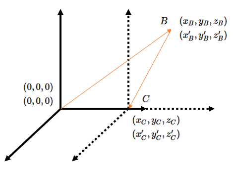

## 同時の定義

　物体の運動を扱うとき、その位置（座標）と発生した時刻を観測する必要がある。各物理量は観測者のいる地点を原点として、座標は原点からの距離、時間は原点にて観測者が時計を用いて測定を行う。ただ原点から離れた地点で発生した事象を観測した場合だと、観測者の目に光が届くまでに時間を要する場合も考えられるため、厳密には事象が発生した地点でなければ同時に測定できないものと思われる（座標についても同時であることを確認しなければならない）。さらにそれらの時計が原点の時計と常に同時である（同期している）かを確認しなければならない。同期した状態で時計を持っていくにしても、動かすことで観測者と異なる状態になるため時間がずれる可能性があるため、動かして置いた後で再度時計を合わせる必要がある。そこで、一定の速度で移動する信号を往復させることで確認を行う。

$$
    t_{\rm C}-t_{\rm B}=t_{\rm B}-t_{\rm A}
$$

この信号としては光がある（真空中でも伝わる）。さらに過去の実験結果を踏まえて、観測者ごとに光の速度が同じように見える（**光速度不変の原理**）ものとして観測者間の関係を見てみよう。

まず、下図のように観測者Kと観測者K'が同じ位置にいてKから見てK'が時刻0にて速さ $V$ で $x$ 軸に沿って動いたとする。同時に光を原点から放出して地点Bにて折り返す。このとき、各観測者から見てどのような式が成り立つか見てみると以下のようになる。

    

$$
    \left[c(t_{\rm C}-t_{\rm B})\right]^2=
    (ct_{\rm B})^2+(Vt_{\rm C})^2-2cVt_{\rm B}t_{\rm C}\left(\frac{x_{\rm B}}{ct_{\rm B}}\right)
$$
$$
    x^2_{\rm B}+y^2_{\rm B}+z^2_{\rm B}=(ct_{\rm B})^2、
    x_{\rm B}'^2+y_{\rm B}'^2+z_{\rm B}'^2=(ct_{\rm B}')^2
$$
$$
    x_{\rm C}-Vt_{\rm C}=y_{\rm C}=z_{\rm C}=0、
    x_{\rm C}'=y_{\rm C}'=z_{\rm C}'=0
$$
$$
    t_{\rm C}=2\frac{c^2}{c^2-V^2}
    \left(t_{\rm B}-\frac{V}{c^2}x_{\rm B}\right)、
    t_{\rm C}'=2t_{\rm B}'
$$

ここでC点において各観測者の間で
$$
    x_{\rm C}'\Leftrightarrow x_{\rm C}-Vt_{\rm C}、
    y_{\rm C}'\Leftrightarrow y_{\rm C}、
    z_{\rm C}'\Leftrightarrow z_{\rm C}、
    t_{\rm C}'\Leftrightarrow t_{\rm C}、

    t_{\rm B}'\Leftrightarrow 
    \frac{c^2}{c^2-V^2}\left(t_{\rm B}-\frac{V}{c^2}x_{\rm B}\right)
$$
という対応をしているものとして以下のように置いてみる。
$$
    x'=x-Vt、y'=y、z'=z、
    t'=\frac{c^2}{c^2-V^2}\left(t-\frac{V}{c^2}x\right)
$$
しかし、B点での関係式は満たさないという問題が起きる。
$$
    x'^2-(ct')^2\ne x^2-(ct)^2
$$
ここで、この式以外で成立していることと上記が二次の方程式であることから
$$
    x'=ax+bt、t'=dx+et　（a、b、d、e：定数）
$$
というようにおいてみて、その他に成立する形がないか確認してみることにする。単純に代入して計算してみると
$$
    a^2-c^2d^2=1、ab-c^2de=0、c^2e^2-b^2=c^2
$$
というようになるが、ここで条件として各観測者の原点で
$$
    x'(x=Vt)=0
$$
という関係になっていることから
$$
    b=-aV
$$
であることから以下の通りになる。
$$
    a^2-c^2d^2=1、-a^2V-c^2de=0、c^2e^2-a^2V^2=c^2
$$
そして、このうちの2式において
$$
    a^2=1+c^2d^2、e=-\frac{Va^2}{c^2d}
$$
というようにすると、これらを代入することで以下の式が得られる。
$$
    d^2=\frac{V^2}{c^2(c^2-V^2)}
$$
すると、これにつられて他の定数も以下の形にかける。
$$
    a^2=\frac{c^2}{c^2-V^2}
$$
ここで $V$ が0となったときに、$x'$ と $x$ が一致していないといけないことから、
$$
    a=\frac{c}{\sqrt{c^2-V^2}}
$$
となる。一方で、$d$ と $e$ の方は
$$
    d=\pm\frac{V}{c\sqrt{c^2-V^2}}、e=\mp\frac{c}{\sqrt{c^2-V^2}}
$$
となるが、こちらも $V$ が0となったときに、$t'$ と $t$ が一致しないといけないことから、
$$
    e=\frac{c}{\sqrt{c^2-V^2}}、d=-\frac{V}{c\sqrt{c^2-V^2}}
$$
となる。以上のことから変換式を改めて記述すると以下の通りになる。
$$
    x'=\gamma(x-Vt)、y'=y、z'=z、
    t'=\gamma\left(t-\frac{V}{c^2}x\right)　
    \left(\gamma=\frac{1}{\sqrt{1-V^2/c^2}}\right)
$$
このようにすると全ての関係式を満たすことが分かるが、ここで一つ気になるものとして
$$
    t_{\rm C}'=\sqrt{1-\frac{V^2}{c^2}}t_{\rm C}
$$
が出てくるため、ここで導いた変換式について論じた後で確認していくことにする。

