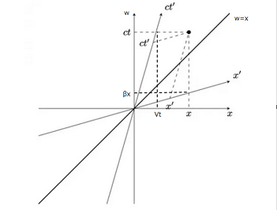

## Lorentz変換

先ほど導いた変換式を改めて記載してみると
$$
    x'=\gamma(x-Vt)、y'=y、z'=z、
    t'=\gamma\left(t-\frac{V}{c^2}x\right)　
    \left(\gamma=\frac{1}{\sqrt{1-V^2/c^2}}\right)
$$
となるわけだが、これらが何を意味しているのか考えてみることにする。従来から変換式としてはGalilei変換が利用されており
$$
    x'=x-Vt、y'=y、z'=z、t'=t
$$
という形であるが、 $V/c\to 0$ と観測者が光速に比べて低速で動いている場合は近似的にこの形になることが分かる。そのため、変換式を以下のように変形してみる。
$$
    x'=\gamma(x-\beta ct)、y'=y、z'=z、
    ct'=\gamma\left(ct-\beta x\right)　
    \left(\gamma=\frac{1}{\sqrt{1-\beta^2}}、\beta=\frac{V}{c}\right)
$$
すると、$ct$ が $x$ と同じような座標の一部としてみなせるので $w$ として
$$
    x'=\gamma(x-\beta w)、w'=\gamma\left(w-\beta x\right)
$$
とおき、試しに $x$ と $w$ との関係を座標で描いてみると以下の図の通りになる。

    

この図を見ても分かる通り、$\gamma$ が付いていない状態だと観測者K'の状況を観測者Kは自分自身の座標で見ている状態になっており、正しく同じ立場で見るためにはこの定数が付く必要があることが分かる。また、前回の最後のところででてきた
$$
    t_{\rm C}'=\sqrt{1-\frac{V^2}{c^2}}t_{\rm C}
$$
については以下のようにして導くことができる。また、時間だけではなく変位についても確認してみると同様な事象を確認することができる。

### 時間の遅れ

観測者K、K'がおり、Kから見てK'がx軸に速度Vで移動しているものとする。このとき、K'においてある一つの地点Pでの時間を計測したとき

$$
    x_{\rm A}'=x_{\rm B}'、t_{\rm B}'-t_{\rm A}'=\Delta t'
$$
が成立する。一方で、Lotentz変換に基づいてKからK'の立場で考えてみると
$$
    x_{\rm B}'-x_{\rm A}'=
    \gamma\left[
        \left(x_{\rm B}-x_{\rm A}\right)-V\left(t_{\rm B}-t_{\rm A}\right)
    \right]=0
$$
$$
    t_{\rm B}'-t_{\rm A}'=
    \gamma\left[
        \left(t_{\rm B}-t_{\rm A}\right)-
        \frac{V}{c^2}\left(x_{\rm B}-x_{\rm A}\right)
    \right]=\Delta t'
$$
となる。ただし、$\gamma=\left(1-V^2/c^2\right)^{-1/2}$である。すると、以下の関係式が得られる。
$$
    \left(x_{\rm B}-x_{\rm A}\right)=V\left(t_{\rm B}-t_{\rm A}\right)=
    V\Delta t
$$
$$
    \Delta t'=\sqrt{1-\frac{V^2}{c^2}}\Delta t<\Delta t
$$
というように短く感じることになる。これが時間の短縮と呼ばれるものとなる。
先ほどの式は時刻0から時間を計測しており $\Delta t = t_{\rm C}$ となるため、この事象によることが分かる。

### Lorentz収縮

観測者K、K'がおり、Kから見てK'がx軸に速度Vで移動しているものとする。このとき、K'においてx軸に沿って地点Aから地点Bに置かれている棒があるとすると
$$
    x_{\rm B}'-x_{\rm A}'=L'、t_{\rm A}'=t_{\rm B}'
$$
が成立する。一方で、Lotentz変換に基づいてKからK'の立場で考えてみると
$$
    x_{\rm B}'-x_{\rm A}'=
    \gamma\left[
        \left(x_{\rm B}-x_{\rm A}\right)-V\left(t_{\rm B}-t_{\rm A}\right)
    \right]=L'
$$
$$
    t_{\rm B}'-t_{\rm A}'=
    \gamma\left[
        \left(t_{\rm B}-t_{\rm A}\right)-
        \frac{V}{c^2}\left(x_{\rm B}-x_{\rm A}\right)
    \right]=0
$$
となる。ただし、$\gamma=\left(1-V^2/c^2\right)^{-1/2}$ である。すると、以下の関係式が得られる。
$$
    V\left(t_{\rm B}-t_{\rm A}\right)=
    \frac{V^2}{c^2}\left(x_{\rm B}-x_{\rm A}\right)=
    \frac{V^2}{c^2}L
$$
$$
    L'=\sqrt{1-\frac{V^2}{c^2}}L<L
$$
このことから、K'から見てKの視点で棒は短く見えることになる。これがLorentz収縮と呼ばれるものとなる。ここで違いとしては、片方は静止している棒の長さを計測したのに対して、もう片方では運動している棒の長さを計測している。
