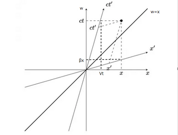
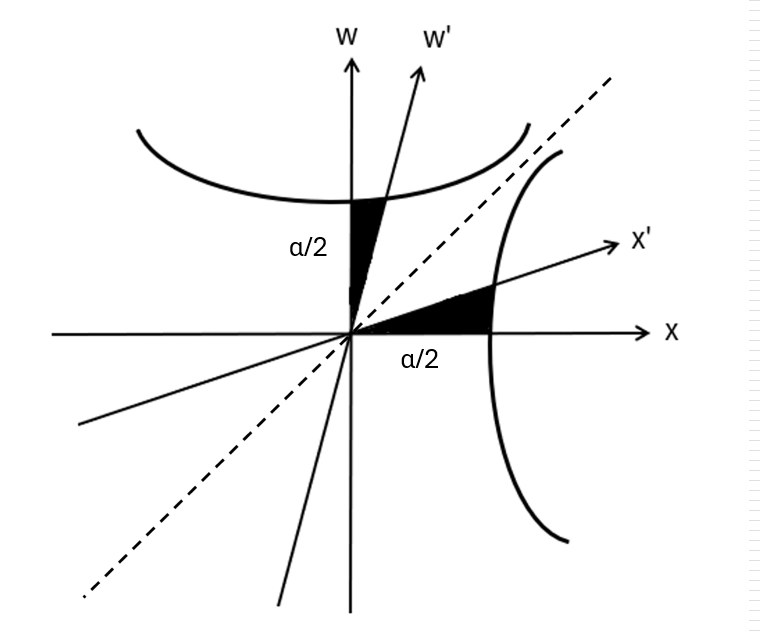

## Lorentz変換

先ほど導いた変換式を改めて記載してみると

$$
    x'=\gamma(x-Vt)、y'=y、z'=z、
    t'=\gamma\left(t-\frac{V}{c^2}x\right)　
    \left(\gamma=\frac{1}{\sqrt{1-V^2/c^2}}\right)
$$

となるわけだが、これらが何を意味しているのか考えてみることにする。従来から変換式としてはGalilei変換が利用されており

$$
    x'=x-Vt、y'=y、z'=z、t'=t
$$

という形であるが、 $V/c\to 0$ と観測者が光速に比べて低速で動いている場合は近似的にこの形になることが分かる。そのため、変換式を以下のように変形してみる。

$$
    x'=\gamma(x-\beta ct)、y'=y、z'=z、
    ct'=\gamma\left(ct-\beta x\right)　
    \left(\gamma=\frac{1}{\sqrt{1-\beta^2}}、\beta=\frac{V}{c}\right)
$$

すると、$ct$ が $x$ と同じような座標の一部としてみなせるので $w$ として

$$
    x'=\gamma(x-\beta w)、
    w'=\gamma\left(w-\beta x\right)
$$

とおき、試しに $x$ と $w$ との関係を座標で描いてみると以下の図の通りになる。

    

この形を見ると斜交座標の形をしていることから仮に $x$ 軸と $x'$ 軸あるいは $w'$ 軸とのなす角をそれぞれ$\theta$、$\phi$とすると

$$
    w=w'\sin\phi+x'\sin\theta、
    x=w'\cos\phi+x'\cos\theta
$$

となるため、Lorentz変換を逆変換したもの

$$
    w=\gamma\left(w'+\beta x'\right)、
    x=\gamma(x'+\beta w')
    
$$

と比較すると以下の関係が成り立つことが予想される。

$$
    \sin\phi=\gamma、
    \sin\theta=\gamma\beta、
    \cos\phi=\gamma\beta、
    \cos\theta=\gamma
$$

しかし、これだと三角関数の公式を満たさない。

$$
    \sin^2\theta+\cos^2\theta=
    \frac{1+\beta^2}{1-\beta^2}\neq 1、
    \sin^2\phi+\cos^2\phi=
    \frac{1+\beta^2}{1-\beta^2}\neq 1
$$

ところが、ここでもし分子の $\beta^2$ の符号が反転すると

$$
    \gamma^2-(\gamma\beta)^2=
    \frac{1-\beta^2}{1-\beta^2}=
    1
$$

というようになることから三角関数ではなく、双曲線関数の関係式

$$
    \cosh^2\theta-\sinh^2\theta=1
$$

を満たすものと思われる。実際、先ほどの三角関数と同じように

$$
    \sinh\phi=\gamma、
    \sinh\theta=\gamma\beta、
    \cosh\phi=\gamma\beta、
    \cosh\theta=\gamma
$$

としてみると、以下の関係式が成り立つことが分かる。

$$
    \cosh^2\theta-\sinh^2\theta=1、
    \cosh^2\phi-\sinh^2\phi=-1
$$

そのため、Lonrentz変換は以下のように書けることになる。

$$
    w=w'\sinh\phi+x'\sinh\theta、
    (\sinh\phi=\gamma、
    \sinh\theta=\gamma\beta)
$$
$$
    x=w'\cosh\phi+x'\cosh\theta、
    (\cosh\phi=\gamma\beta、
    \cosh\theta=\gamma)
$$

この変換自体は以下の図のように双曲線に沿って回転するものとなっており、通常の回転とは異なっていることが分かる。一例として $w$ 軸が回転することで点線（漸近線）に近づいていき、やがて $w'$ 軸は $w=x$ の直線と一致する。このとき、角度 $\phi$ に関しては $\phi\to\infty$ であることから,
$\beta\to 1\ (V\to c)$ というように観測者の速度が光速を上限とした値になっていると考えられる（ $\theta$ も $\beta$ に依存するため同じようになっているといえる）。

    

ここまでは変換自体の話であるので、次に前回でも出てきた

$$
    t_{\rm C}'=\sqrt{1-\frac{V^2}{c^2}}t_{\rm C}
$$

について考えてみると、この式というのはある一つの地点 C についての関係式であるため、今度は一つの地点での時間変換がどうなるかを見てみよう。観測者K、K'がおり、K' 系に対して地点Pで静止している時計の時間経過を考える。このとき、時刻 $t_1'$ から 時刻 $t_2'$ と時間 $\Delta t'$ だけ経過したものとすると、各時刻での位置 $x_1',x_2'$ は時計が静止していることから

$$
    x_{2}'-x_{1}'=0、t_{2}'-t_{1}'=\Delta t'
$$

が成立する。一方で、K 系の座標では時刻 $t_1$ に位置 $x_1$、時刻 $t_2$ に位置 $x_2$ にあるものとすると

$$
    x_{2}-x_{1}=\Delta x、t_{2}-t_{1}=\Delta t
$$

となることから、Lorentz変換の式は各時刻での差分をとることで

$$
    x_{2}'-x_{1}'=
    \gamma\left[
        \left(x_{2}-x_{1}\right)-V\left(t_{2}-t_{1}\right)
    \right]
$$
$$
    t_{2}'-t_{1}'=
    \gamma\left[
        \left(t_{2}-t_{1}\right)-
        \frac{V}{c^2}\left(x_{2}-x_{1}\right)
    \right]
$$

であるため、以下の関係式が得られる。

$$
    \Delta x=V\Delta t、
    \Delta t'=\sqrt{1-\frac{V^2}{c^2}}\Delta t<\Delta t
$$

一つ目の式は K' 系から見て静止している時計のため K 系から同じ速度 $V$ で移動することは分かるが、2つ目の式については同じ時間にならないことから違和感を感じるであろう。これについては、 K' 系の立場から見て静止している時計の時間経過を表しているのに対し、K 系の方では別の地点に置かれている時計の時刻を見ているためである。同時に、動いているものの立場K'で見るとその速度に応じて時間が遅れているように見えることになる。そのため、

$$
    t_{\rm C}'=\sqrt{1-\frac{V^2}{c^2}}t_{\rm C}
$$

という式は、地点 C が K' 系に対して時刻 0 に地点Aを出た光が同じ場所に戻ってきたときの地点であり $x′=0$ を満たす、いわば今回の地点Pに相当する点とみなせる。すなわち、

$$
    \Delta t'= t_{\rm C}' - 0 = t_{\rm C}'、
    \Delta t = t_{\rm C} - 0 = t_{\rm C}
$$

となることから得られるものである。

　以上のことから、各地点においてLorentz変換が成り立つことが分かるが、そうなると片方の座標系において同時であったことがもう片方の座標系で同時でないことにも注意する必要がある。実際、K' の立場で二つの地点A,B間で同時であるかを確認した時、位置と時間に関して

$$
    x_{\rm B}'-x_{\rm A}'=\Delta x'、t_{\rm B}'-t_{\rm A}'=0
$$

が成立する。一方で、K 系の座標において地点 A が時刻 $t_A$ に位置 $x_A$、地点 B が時刻 $t_2$ に位置 $x_2$ にあるものとすると

$$
    x_{\rm B}-x_{\rm A}=\Delta x、
    t_{\rm B}-t_{\rm A}=\Delta t
$$

となることから、Lorentz変換の式は各時刻での差分をとることで

$$
    x_{\rm B}'-x_{\rm A}'=
    \gamma\left[
        \left(x_{\rm B}-x_{\rm A}\right)-V\left(t_{\rm B}-t_{\rm A}\right)
    \right]=\Delta x'
$$
$$
    t_{\rm B}'-t_{\rm A}'=
    \gamma\left[
        \left(t_{\rm B}-t_{\rm A}\right)-
        \frac{V}{c^2}\left(x_{\rm B}-x_{\rm A}\right)
    \right]=0
$$
となり、以下の関係式が得られる。
$$
    V\left(t_{\rm B}-t_{\rm A}\right)=
    \beta^2 \Delta x、
    \Delta x'=\sqrt{1-\frac{V^2}{c^2}}\Delta x<\Delta x
$$
このことから、まず片方で同時に測ったとしてももう片方が同じ立場で見たときはそうではなく $\beta^2 \Delta x$ だけ移動しており、その分を $\Delta x$ から引いて $\gamma$ をかけることでKはK'と同じ立場で見れるが長さが短く見えてしまうという結果が得られる。