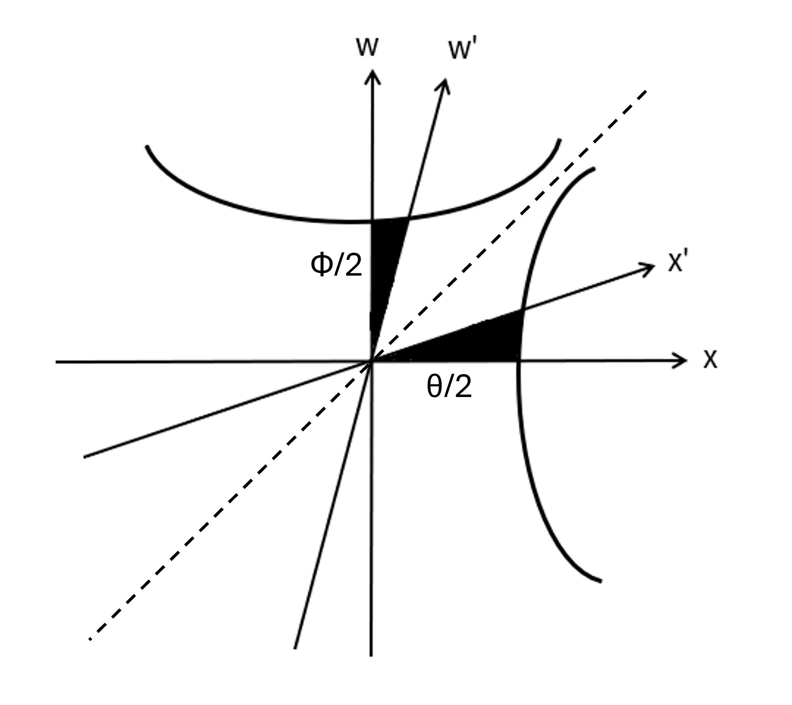

## Lorentz変換

先ほど導いた変換式を改めて記載してみると
$$
    x'=\gamma(x-Vt)、y'=y、z'=z、
    t'=\gamma\left(t-\frac{V}{c^2}x\right)　
    \left(\gamma=\frac{1}{\sqrt{1-V^2/c^2}}\right)
$$
となるわけだが、これらが何を意味しているのか考えてみることにする。従来から変換式としてはGalilei変換が利用されており
$$
    x'=x-Vt、y'=y、z'=z、t'=t
$$
という形であるが、 $V/c\to 0$ と観測者が光速に比べて低速で動いている場合は近似的にこの形になることが分かる。そのため、変換式を以下のように変形してみる。
$$
    x'=\gamma(x-\beta ct)、y'=y、z'=z、
    ct'=\gamma\left(ct-\beta x\right)　
    \left(\gamma=\frac{1}{\sqrt{1-\beta^2}}、\beta=\frac{V}{c}\right)
$$
すると、$ct$ が $x$ と同じような座標の一部としてみなせるので $w$ として
$$
    x'=\gamma(x-\beta w)、
    w'=\gamma\left(w-\beta x\right)
$$
とおき、試しに $x$ と $w$ との関係を座標で描いてみると以下の図の通りになる。

    

この形を見ると斜交座標の形をしていることから仮に $x$ 軸と $x'$ 軸あるいは $w'$ 軸とのなす角をそれぞれ$\theta$、$\phi$とすると
$$
    w=w'\sin\phi+x'\sin\theta、
    x=w'\cos\phi+x'\cos\theta
$$
となるため、Lorentz変換を逆変換したもの
$$
    w=\gamma\left(w'+\beta x'\right)、
    x=\gamma(x'+\beta w')
    
$$
と比較すると以下の関係が成り立つことが予想される。
$$
    \sin\phi=\gamma、
    \sin\theta=\gamma\beta、
    \cos\phi=\gamma\beta、
    \cos\theta=\gamma
$$
しかし、これでは三角関数の公式を満たさない。
$$
    \sin^2\theta+\cos^2\theta=
    \frac{\beta^2+1}{1-\beta^2}\neq 1、
    \sin^2\phi+\cos^2\phi=
    \frac{1+\beta^2}{1-\beta^2}\neq 1
$$

そこで分子と分母の符号が反対であることを踏まると、双曲線関数であれば等式が成り立つことが分かる。実際、先ほどの三角関数と同じように
$$
    \sinh\phi=\gamma、
    \sinh\theta=\gamma\beta、
    \cosh\phi=\gamma\beta、
    \cosh\theta=\gamma
$$
としてみると、以下の関係式が成り立つことが分かる。
$$
    \cosh^2\theta-\sinh^2\theta=1、
    \cosh^2\phi-\sinh^2\phi=-1
$$
そのため、Lonrentz変換は以下のように書けることになる。
$$
    w=w'\sinh\phi+x'\sinh\theta、
    (\sinh\phi=\gamma、
    \sinh\theta=\gamma\beta)
$$
$$
    x=w'\cosh\phi+x'\cosh\theta、
    (\cosh\phi=\gamma\beta、
    \cosh\theta=\gamma)
$$
この変換自体は以下の図のように双曲線に沿って回転するものとなっており、通常の回転とは異なっていることが分かる。一例として $w$ 軸が回転することで点線（漸近線）に近づいていき、やがて $w'$ 軸は $w=x$ の直線と一致する。このとき、角度 $\phi$ に関しては $\phi\to\infty$ であることから,
$\beta\to 1\ (V\to c)$ というように観測者の速度が光速を上限とした値になっていると考えられる（ $\theta$ も $\beta$ に依存するため同じようになっているといえる）。

    

　以上が変換自体の話であるが、前回観測者ごとに光速度が不変となるには座標と時間が短くなる必要があるということを述べていたことや最後のところででてきた式
$$
    t_{\rm C}'=\sqrt{1-\frac{V^2}{c^2}}t_{\rm C}
$$
も説明なしに出てきたため、まずはある地点での時間に関する変換を見ていくことにする。

### 時間の遅れ
　観測者K、K'がおり、Kから見てK'がx軸に速度Vで移動しているものとする。このとき、K'においてある一つの地点Pでの時間を計測したとき

$$
    x_{1}'=x_{2}'、t_{2}'-t_{1}'=\Delta t'
$$
が成立する。一方で、Lotentz変換に基づいてKからK'の立場で考えてみると
$$
    x_{2}'-x_{1}'=
    \gamma\left[
        \left(x_{2}-x_{1}\right)-V\left(t_{2}-t_{1}\right)
    \right]=0
$$
$$
    t_{2}'-t_{1}'=
    \gamma\left[
        \left(t_{2}-t_{1}\right)-
        \frac{V}{c^2}\left(x_{2}-x_{1}\right)
    \right]=\Delta t'
$$
となる。ただし、$\gamma=\left(1-V^2/c^2\right)^{-1/2}$である。すると、以下の関係式が得られる。
$$
    \left(x_{2}-x_{1}\right)=V\left(t_{2}-t_{1}\right)=
    V\Delta t
$$
$$
    \Delta t'=\sqrt{1-\frac{V^2}{c^2}}\Delta t<\Delta t
$$
一つ目の式は点Pが動いていることから分かるが、2つ目の式については違和感を感じであろう。$\Delta t'$ の方はK'の立場から見て静止している地点（同じ地点で）の時間経過を表しているのに対し、$\Delta t$ は別の地点で測定した時間を表している。つまり、動いているものの立場K'で見るとその速度に応じて時間が遅れているように見えることになる。先ほど出てきた式も時刻0から時間を計測しており $\Delta t = t_{\rm C}$ となるため、この事象によるものとなっている。 

### Lorentz収縮
　次に2点ABで上記と同様に時間を計測すると、その2点間において同時であることから
$$
    x_{\rm B}'-x_{\rm A}'=L'、t_{\rm A}'=t_{\rm B}'
$$
が成立する。一方で、Lotentz変換に基づいてKからK'の立場で考えてみると
$$
    x_{\rm B}'-x_{\rm A}'=
    \gamma\left[
        \left(x_{\rm B}-x_{\rm A}\right)-V\left(t_{\rm B}-t_{\rm A}\right)
    \right]=L'
$$
$$
    t_{\rm B}'-t_{\rm A}'=
    \gamma\left[
        \left(t_{\rm B}-t_{\rm A}\right)-
        \frac{V}{c^2}\left(x_{\rm B}-x_{\rm A}\right)
    \right]=0
$$
となり、以下の関係式が得られる。
$$
    V\left(t_{\rm B}-t_{\rm A}\right)=
    \frac{V^2}{c^2}\left(x_{\rm B}-x_{\rm A}\right)=
    \frac{V^2}{c^2}L=
    \beta^2 L
$$
$$
    L'=\sqrt{1-\frac{V^2}{c^2}}L<L
$$
このことから、まず片方で同時に測ったとしてももう片方が同じ立場で見たときはそうではなく $\beta^2 L$ だけ移動しており、その分を $L$ から引いて $\gamma$ をかけることでKはK'と同じ立場で見れるが長さが短く見えてしまうという結果が得られる。