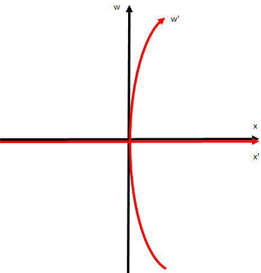

## 特殊相対論から一般相対論へ

　ここまで観測者同士が等速直線運動をしているものとして考えてきたわけだが、実際は重力の影響を受けており等加速度運動しているものと思われる。そのため、等加速度している系同士での変換がどのようになるか考えてみる。例えば、今 $x$ 方向に一定加速度 $a$ で移動しているものとすると、
$$
    \frac{\mathrm{d}^2x}{\mathrm{d}t^2}=a、
    \frac{\mathrm{d}^2x'}{\mathrm{d}t'^2}=0、
    w'=w
$$
となるため、以下の関係が成り立つものと考えられる。
$$
    x'=x-\frac{1}{2}at^2=x-\frac{a}{2c^2}w^2、
    w'=w
$$
これをLorentz変換のところでも見せた時空図で描写すると以下のようになる。

    

このことから、加速する座標への変換というのは曲がったものになることが予想される。

　この曲がった座標に変換する方法というのは、Riemann幾何学があることが知られている。だが、この分野はかなり難解であるものであるため、まずはその橋渡しとしてGalielei変換、Lorentz変換を数学的にどのように取り扱うことができるか見てみることにする。まず、Galiei変換は
$$
    w'=w、x'=-\beta w+x、y'=y、z'=z、
    \left(\beta=\frac{V}{c}\right)
$$
となるわけだが、行列でまとめて以下のように記載することもできる。
$$
\begin{pmatrix}
    w' \\
    x' \\
    y' \\
    z'
\end{pmatrix}
=
\begin{pmatrix}
    1 & 0 & 0 & 0 \\
    -\beta & 1 & 0 & 0 \\
    0 & 0 & 1 & 0 \\
    0 & 0 & 0 & 1
\end{pmatrix}
\begin{pmatrix}
    w \\
    x \\
    y \\
    z
\end{pmatrix}
$$
あるいは、これをさらに扱い易くするよう添え字に行列の番号を振って
$$
\begin{pmatrix}
    x'^0 \\
    x'^1 \\
    x'^2 \\
    x'^3
\end{pmatrix}
=
\begin{pmatrix}
    \alpha_{\ \  0}^0 & \alpha_{\ \  1}^0 & 
    \alpha_{\ \  2}^0 & \alpha_{\ \  3}^0 \\
    \alpha_{\ \  0}^1 & \alpha_{\ \  1}^1 & 
    \alpha_{\ \  2}^1 & \alpha_{\ \  3}^1 \\
    \alpha_{\ \  0}^2 & \alpha_{\ \  1}^2 & 
    \alpha_{\ \  2}^2 & \alpha_{\ \  3}^2 \\
    \alpha_{\ \  0}^3 & \alpha_{\ \  1}^3 & 
    \alpha_{\ \  2}^3 & \alpha_{\ \  3}^3 
\end{pmatrix}
\begin{pmatrix}
    x^0 \\
    x^1 \\
    x^2 \\
    x^3
\end{pmatrix}
$$
とおくと、ベクトルを用いて書くこともできる。
$$
    x'^\mu=
    \sum_{\nu=0}^{3}\alpha_{\ \  \nu}^\mu x^\nu　
    (\mu=0,1,2,3)
$$
あるいは、今ここで $\nu$ に対して総和をとっているが、行列においては下付き添え字（行）と上付き添え字（列）の掛け算は足し合わせることになるので、以下のように総和記号を省いた表記（**Einsteinの縮約記法**）がよく用いられている。
$$
    x'^\mu=\alpha_{\ \  \nu}^\mu x^\nu　
    (\mu=0,1,2,3)
$$
一方で、Lorentz変換においても
$$
    w'=\gamma(w-\beta x)、
    x'=\gamma(-\beta w+x)、
    y'=y、
    z'=z、
    \left(
        \gamma=\frac{1}{\sqrt{1-\beta^2}}
    \right)
$$
となるため、同じように行列にしてみると
$$
\begin{pmatrix}
    w' \\
    x' \\
    y' \\
    z'
\end{pmatrix}
=
\begin{pmatrix}
    \gamma & -\gamma\beta & 0 & 0 \\
    -\gamma\beta & \gamma & 0 & 0 \\
    0 & 0 & 1 & 0 \\
    0 & 0 & 0 & 1
\end{pmatrix}
\begin{pmatrix}
    w \\
    x \\
    y \\
    z
\end{pmatrix}
$$
であるため、先ほどと同様に $\alpha$ を用いた表記をすることができる。ところが、つい先ほど扱った加速度の系の場合だと
$$
    w'=w、x'=-\frac{a}{2c^2}w^2+x、
    y'=y,z'=z
$$
というように、$w^2$ が関わってきてしまうため、一概に同じような関係式で表せないことが分かる。そこで、一般的に以下のような関数で表されるものとする。
$$
    w'=w'(w,x,y,z)、
    x'=x'(w,x,y,z)、
    y'=y'(w,x,y,z)、
    z'=z'(w,x,y,z)
$$
そして後で加速度運動を取り扱うことを考慮して、まず速度を求めてみると
$$
    \frac{\mathrm{d}w'}{\mathrm{d}t'}=
    \frac{\mathrm{d}w}{\mathrm{d}t'}
    \left(
        \frac{\partial w'}{\partial w}
    \right)+
    \frac{\mathrm{d}x}{\mathrm{d}t'}
    \left(
        \frac{\partial w'}{\partial x}
    \right)+
    \frac{\mathrm{d}y}{\mathrm{d}t'}
    \left(
        \frac{\partial w'}{\partial y}
    \right)+
    \frac{\mathrm{d}z}{\mathrm{d}t'}
    \left(
        \frac{\partial w'}{\partial z}
    \right)
$$
$$
    \frac{\mathrm{d}x'}{\mathrm{d}t'}=
    \frac{\mathrm{d}w}{\mathrm{d}t'}
    \left(
        \frac{\partial x'}{\partial w}
    \right)+
    \frac{\mathrm{d}x}{\mathrm{d}t'}
    \left(
        \frac{\partial x'}{\partial x}
    \right)+
    \frac{\mathrm{d}y}{\mathrm{d}t'}
    \left(
        \frac{\partial x'}{\partial y}
    \right)+
    \frac{\mathrm{d}z}{\mathrm{d}t'}
    \left(
        \frac{\partial x'}{\partial z}
    \right)
$$
$$
    \frac{\mathrm{d}y'}{\mathrm{d}t'}=
    \frac{\mathrm{d}w}{\mathrm{d}t'}
    \left(
        \frac{\partial y'}{\partial w}
    \right)+
    \frac{\mathrm{d}x}{\mathrm{d}t'}
    \left(
        \frac{\partial y'}{\partial x}
    \right)+
    \frac{\mathrm{d}y}{\mathrm{d}t'}
    \left(
        \frac{\partial y'}{\partial y}
    \right)+
    \frac{\mathrm{d}z}{\mathrm{d}t'}
    \left(
        \frac{\partial y'}{\partial z}
    \right)
$$
$$
    \frac{\mathrm{d}z'}{\mathrm{d}t'}=
    \frac{\mathrm{d}w}{\mathrm{d}t'}
    \left(
        \frac{\partial z'}{\partial w}
    \right)+
    \frac{\mathrm{d}x}{\mathrm{d}t'}
    \left(
        \frac{\partial z'}{\partial x}
    \right)+
    \frac{\mathrm{d}y}{\mathrm{d}t'}
    \left(
        \frac{\partial z'}{\partial y}
    \right)+
    \frac{\mathrm{d}z}{\mathrm{d}t'}
    \left(
        \frac{\partial z'}{\partial z}
    \right)
$$
であるのだが、これ書き直すと以下のような形で書けることが分かる。
$$
\begin{pmatrix}
    \frac{\mathrm{d}w'}{\mathrm{d}t'} \\
    \frac{\mathrm{d}x'}{\mathrm{d}t'} \\
    \frac{\mathrm{d}y'}{\mathrm{d}t'} \\
    \frac{\mathrm{d}z'}{\mathrm{d}t'}
\end{pmatrix}
=
\begin{pmatrix}
    \frac{\partial w'}{\partial w} & 
    \frac{\partial w'}{\partial x} & 
    \frac{\partial w'}{\partial y} & 
    \frac{\partial w'}{\partial z} \\
    \frac{\partial x'}{\partial w} & 
    \frac{\partial x'}{\partial x} & 
    \frac{\partial x'}{\partial y} & 
    \frac{\partial x'}{\partial z} \\
    \frac{\partial y'}{\partial w} & 
    \frac{\partial y'}{\partial x} & 
    \frac{\partial y'}{\partial y} & 
    \frac{\partial y'}{\partial z} \\
    \frac{\partial z'}{\partial w} & 
    \frac{\partial z'}{\partial x} & 
    \frac{\partial z'}{\partial y} & 
    \frac{\partial z'}{\partial z} \\
\end{pmatrix}
\begin{pmatrix}
    \frac{\mathrm{d}w}{\mathrm{d}t'} \\
    \frac{\mathrm{d}x}{\mathrm{d}t'} \\
    \frac{\mathrm{d}y}{\mathrm{d}t'} \\
    \frac{\mathrm{d}z}{\mathrm{d}t'}
\end{pmatrix}
$$
そのため、ベクトルで以下のように記述できる。
$$
    \frac{\mathrm{d}x'^\mu}{\mathrm{d}t'}=
    \left(
        \frac{\partial x'^\mu}{\partial x^\nu}
    \right)
    \frac{\mathrm{d}x^\nu}{\mathrm{d}t'}
$$
ここで一つ、時間の項を除いて座標の微小量の関係で表す（と
$$
    \mathrm{d}x'^\mu=
    \left(
        \frac{\partial x'^\mu}{\partial x^\nu}
    \right)
    \mathrm{d}x^\nu
$$
であるので、先ほどの一定加速度での行列は次の通りになる。
$$
\begin{pmatrix}
    \mathrm{d}x'^0 \\
    \mathrm{d}x'^1 \\
    \mathrm{d}x'^2 \\
    \mathrm{d}x'^3
\end{pmatrix}
=
\begin{pmatrix}
    1 & 0 & 0 & 0 \\
    -ax^0/c^2 & 1 & 0 & 0 \\
    0 & 0 & 1 & 0 \\
    0 & 0 & 0 & 1
\end{pmatrix}
\begin{pmatrix}
    \mathrm{d}x^0 \\
    \mathrm{d}x^1 \\
    \mathrm{d}x^2 \\
    \mathrm{d}x^3
\end{pmatrix}
$$
さらに、ここでの偏微分の部分は接線ベクトルにあたるため、これを基本ベクトル $e$ 以下のように書くこともできる（偏微分のほうも、分母の添え字を用いて簡潔に表現する）。
$$
    e_{\ \ \nu}^\mu=
    \left(
        \frac{\partial x'^\mu}{\partial x^\nu}
    \right)=
    \partial_\nu x'^\mu
$$
そのため、先ほどと同様に以下のように表される。
$$
    \mathrm{d}x'^\mu=
    e_{\ \ \nu}^\mu\mathrm{d}x^\nu
$$
そして、この大きさというのは2乗にして表すことが多く、
$$
    \mathrm{d}s'^2=
    \mathrm{d}x'_\mu\mathrm{d}x'^\mu=
    (e_{\mu\nu}\mathrm{d}x^\nu)
    (e_{\ \ \xi}^{\mu}\mathrm{d}x^\xi)=
    g_{\nu\xi}\mathrm{d}x^\nu\mathrm{d}x^\xi、
    (g_{\nu\xi}=e_{\mu\nu}e_{\ \ \xi}^{\mu})
$$
となるが、ここで現れる $g_{\nu\xi}$ が**計量**と呼ばれており、Riemann幾何学では重要な役目を果たすものとなっている。