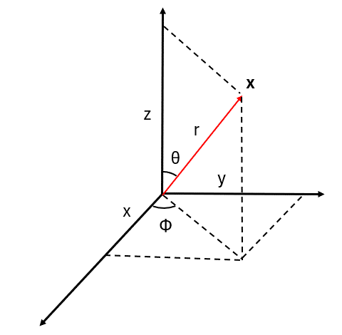

## 特殊相対論から一般相対論へ

　ここまで観測者同士が等速直線運動をしているものとして考えてきたわけだが、実際は重力の影響を受けており等加速度運動しているものと思われる。そのため、等加速度している系同士での変換がどのようになるか考えてみる。例えば、今 $x$ 方向に一定加速度 $a$ で移動しているものとすると、
$$
    \frac{\mathrm{d}^2x}{\mathrm{d}t^2}=a、
    \frac{\mathrm{d}^2x'}{\mathrm{d}t'^2}=0、
    t'=t
$$
となるため、以下の関係が成り立つものと考えられる。
$$
    x'=x-\frac{1}{2}at^2=x-\frac{a}{2c^2}w^2、
    w'=w、
    (w=ct)
$$
これをLorentz変換のところでも見せた時空図で描写すると以下のようになる。

    

このことから、加速する座標への変換というのは曲がったものになることが予想される。この曲がった座標へ変換する理論としてRiemann幾何学というものがある。だが、この分野はかなり難解であるため、まずRiemann幾何学の記法について述べていくことにする。

　一般的にベクトルは $\bm{x}$ というように太字で表記されるが、用いる座標系によってその中身の表記が異なってくる。例えば以下の図のように、よく用いられている3次元直交座標系の場合だと $\bm{x}=(x,y,z)$ というようになるが、3次元極座標を用いると $\bm{x}=(r,\theta,\phi)$ と表記される。

    

ここで注意することは、左から順に $x=r、\cdots$ というように等式が成り立つわけではなく、比較する座標系の関係で変化する。上記の場合だと
$$
    x=r\sin\theta\cos\phi、
    y=r\sin\theta\sin\phi、
    z=r\cos\theta
$$
というようになるが、この関係をベクトルで表すときに先ほどの表記のままだとどの座標系を用いているか分からないという問題が起こる。そこで、座標系ごとに基本ベクトル（各方向の単位ベクトル）というものを用意し、
$$
    \bm{x}=
    x\bm{e}_x+y\bm{e}_y+z\bm{e}_z=
    r\sin\theta\cos\phi\bm{e}_x+
    r\sin\theta\sin\phi\bm{e}_y+
    r\cos\theta\bm{e}_z
$$
とすることで、直交座標系での関係式であることが見て分かる形になる。

    

同じように、上図の通り極座標系における基本ベクトルを $\bm{e}_r,\bm{e}_\theta,\bm{e}_\phi$ とすると
$$
    \bm{x}=
    r\bm{e}_r+
    r_\theta\bm{e}_\theta+
    r_\phi\bm{e}_\phi=
    x\bm{e}_x+y\bm{e}_y+z\bm{e}_z
$$
となるが、このままだと各座標系での基本ベクトルの関係がどのようになっているか見ることができない。そこで、 $\bm{x}$ の各成分が $r,\theta,\phi$ あるいは $x,y,z$ の変数を持つ関数であることから
$$
    \mathrm{d}\bm{x}=
    \bm{u}_r\mathrm{d}r+
    \bm{u}_\theta\mathrm{d}\theta+
    \bm{u}_\phi\mathrm{d}\phi=
    \bm{u}_x\mathrm{d}x+
    \bm{u}_y\mathrm{d}y+
    \bm{u}_z\mathrm{d}z
$$
$$
    \bm{u}_r=
    \frac{\partial \bm{x}}{\partial r}、
    \bm{u}_\theta=
    \frac{\partial \bm{x}}{\partial \theta}、
    \bm{u}_\phi=
    \frac{\partial \bm{x}}{\partial \phi}、
    \bm{u}_x=
    \frac{\partial \bm{x}}{\partial x}、
    \bm{u}_y=
    \frac{\partial \bm{x}}{\partial y}、
    \bm{u}_z=
    \frac{\partial \bm{x}}{\partial z}
$$
と展開すると、前の式と同じように各成分のベクトルの和になっていることが分かる。そのため、$\bm{u}$ を基底ベクトル（大きさが1でない各成分のベクトル）と考え
$$
    \bm{e}_r=
    \frac{\bm{u}_r}{\left|\bm{u}_r\right|}、
    \bm{e}_\theta=
    \frac{\bm{u}_\theta}
    {\left|\bm{u}_\theta\right|}、
    \bm{e}_\phi=
    \frac{\bm{u}_\phi}
    {\left|\bm{u}_\phi\right|}、
    \bm{e}_x=
    \frac{\bm{u}_x}{\left|\bm{u}_x\right|}、
    \bm{e}_y=
    \frac{\bm{u}_y}{\left|\bm{u}_y\right|}、
    \bm{e}_z=
    \frac{\bm{u}_z}{\left|\bm{u}_z\right|}
$$
という関係を満たしているとすると、直交座標系での基本ベクトル同士の内積が
$$
    \bm{e}_x\cdot\bm{e}_x=1、
    \bm{e}_x\cdot\bm{e}_y=0、
    \bm{e}_x\cdot\bm{e}_z=0
$$
$$
    \bm{e}_y\cdot\bm{e}_x=0、
    \bm{e}_y\cdot\bm{e}_y=1、
    \bm{e}_y\cdot\bm{e}_z=0
$$
$$
    \bm{e}_z\cdot\bm{e}_x=0、
    \bm{e}_z\cdot\bm{e}_y=0、
    \bm{e}_z\cdot\bm{e}_z=1
$$
と**なるように設定されている**ことから、各成分の基底ベクトルは
$$
    \bm{u}_r=
    \sin\theta\cos\phi\bm{e}_x+
    \sin\theta\sin\phi\bm{e}_y+
    \cos\phi\bm{e}_z、
    \left|\bm{u}_r\right|=1
$$
$$
    \bm{u}_\theta=
    r\cos\theta\cos\phi\bm{e}_x+
    r\cos\theta\sin\phi\bm{e}_y-
    r\sin\theta\bm{e}_z、
    \left|\bm{u}_\theta\right|=r
$$
$$
    \bm{u}_\phi=
    -r\sin\theta\sin\phi\bm{e}_x+
    r\sin\theta\cos\phi\bm{e}_y、
    \left|\bm{u}_\phi\right|=
    r\sin\theta
$$

となり、基本ベクトルの関係は以下の通りになる。
$$
    \bm{e}_r=
    \sin\theta\cos\phi\bm{e}_x+
    \sin\theta\sin\phi\bm{e}_y+
    \cos\phi\bm{e}_z=
    \frac{\bm{x}}{r}
$$
$$
    \bm{e}_\theta=
    \cos\theta\cos\phi\bm{e}_x+
    \cos\theta\sin\phi\bm{e}_y-
    \sin\theta\bm{e}_z
$$
$$
    \bm{e}_\phi=
    -\sin\phi\bm{e}_x+\cos\phi\bm{e}_y
$$
そして、極座標系の基本ベクトル同士の内積（互いに直交していることからも分かるが…）は
$$
    \bm{e}_r\cdot\bm{e}_r=1、
    \bm{e}_r\cdot\bm{e}_\theta=0、
    \bm{e}_r\cdot\bm{e}_\phi=0
$$
$$
    \bm{e}_\theta\cdot\bm{e}_r=0、
    \bm{e}_\theta\cdot\bm{e}_\theta=1、
    \bm{e}_\theta\cdot\bm{e}_\phi=0
$$
$$
    \bm{e}_\phi\cdot\bm{e}_r=0、
    \bm{e}_\phi\cdot\bm{e}_\theta=0、
    \bm{e}_\phi\cdot\bm{e}_\phi=1
$$
となるため、角度方向の大きさ $r_\theta,r_\phi$ はどちらも0になることが分かる。
$$
    r_\theta=
    (\bm{x}\cdot\bm{e}_\theta)-
    r(\bm{e}_r\cdot\bm{e}_\theta)-
    r_\phi(\bm{e}_r\cdot\bm{e}_\phi)=0
$$
$$
    r_\phi=
    (\bm{x}\cdot\bm{e}_\phi)-
    r(\bm{e}_r\cdot\bm{e}_\phi)-
    r_\theta(\bm{e}_\theta\cdot\bm{e}_\phi)=0
$$

　このように、基本ベクトルの内積を計算することで各成分の変換式を求めることができることになる。追加で試しに以前までに登場した変換（Galielei変換、Lorentz変換）を見て行くことにする。まず、Galiei変換は
$$
    w'=w、x'=-\beta w+x、y'=y、z'=z、
    \left(\beta=\frac{V}{c}\right)
$$
という変換であったため、ベクトル $\bm{x}$ は以下の通りに書ける。
$$
    \bm{x}=
    w\bm{e}_w+x\bm{e}_x+y\bm{e}_y+z\bm{e}_z=
    w'\bm{e}_w+
    (x'+\beta w')\bm{e}_x+
    y'\bm{e}_y+z\bm{e}_z
$$
一方で、変換先の座標を用いて
$$
    \bm{x}=
    w'\bm{e}_w'+x'\bm{e}_x'+
    y'\bm{e}_y'+z'\bm{e}_z'=
    w\bm{e}_w+x\bm{e}_x+y\bm{e}_y+z\bm{e}_z
$$
となるが、直交座標系での関係を用いて同じように見ていきたいのだが、ここで $\bm{e}_w\cdot\bm{e}_x$ など $\bm{e}_w$ が関わる内積がどのような値になるか分からない。そこで、
$$
    w'\bm{e}_w'+x'\bm{e}_x'+
    y'\bm{e}_y'+z'\bm{e}_z'=
    w(\bm{e}_w'-\beta\bm{e}_x')+
    x\bm{e}_x'+y\bm{e}_y'+z\bm{e}_z'
$$
であることから以下の関係があるものする。
$$
    \bm{e}_w=\bm{e}_w'-\beta\bm{e}_x'、
    \bm{e}_x=\bm{e}_x'、
    \bm{e}_y=\bm{e}_y'、
    \bm{e}_z=\bm{e}_z'
$$
そうすると、変換後の内積が
$$
    \bm{e}_w'\cdot\bm{e}_w'=
    \bm{e}_w\cdot\bm{e}_w+
    2\beta(\bm{e}_w\cdot\bm{e}_x)+\beta^2
$$
$$
    \bm{e}_w'\cdot\bm{e}_x'=
    \bm{e}_w\cdot\bm{e}_x+\beta、
    \bm{e}_y'\cdot\bm{e}_w'=
    \bm{e}_y\cdot\bm{e}_w、
    \bm{e}_z'\cdot\bm{e}_w'=
    \bm{e}_z\cdot\bm{e}_w
$$
というようになるが、今までと同様な考えで以下のようになっているものとする。
$$
    \bm{e}_w'\cdot\bm{e}_w'=1、
    \bm{e}_w'\cdot\bm{e}_x'=
    \frac{1}{2}\beta、
    \bm{e}_w'\cdot\bm{e}_y'=0、
    \bm{e}_w'\cdot\bm{e}_z'=0
$$
$$
    \bm{e}_x'\cdot\bm{e}_w'=
    \frac{1}{2}\beta、
    \bm{e}_x'\cdot\bm{e}_x'=1、
    \bm{e}_x'\cdot\bm{e}_y'=0、
    \bm{e}_x'\cdot\bm{e}_z'=0
$$
$$
    \bm{e}_y'\cdot\bm{e}_w'=0、
    \bm{e}_y'\cdot\bm{e}_x'=0、
    \bm{e}_y'\cdot\bm{e}_y'=1、
    \bm{e}_y'\cdot\bm{e}_z'=0
$$
$$
    \bm{e}_z'\cdot\bm{e}_w'=0、
    \bm{e}_z'\cdot\bm{e}_x'=0、
    \bm{e}_z'\cdot\bm{e}_y'=0、
    \bm{e}_z'\cdot\bm{e}_z'=1
$$
同様に変換前の内積も以下の通りになる。
$$
    \bm{e}_w\cdot\bm{e}_w=1、
    \bm{e}_w\cdot\bm{e}_x=
    -\frac{1}{2}\beta、
    \bm{e}_w\cdot\bm{e}_y=0、
    \bm{e}_w\cdot\bm{e}_z=0
$$
$$
    \bm{e}_x\cdot\bm{e}_w=
    -\frac{1}{2}\beta、
    \bm{e}_x\cdot\bm{e}_x=1、
    \bm{e}_x\cdot\bm{e}_y=0、
    \bm{e}_x\cdot\bm{e}_z=0
$$
$$
    \bm{e}_y\cdot\bm{e}_w=0、
    \bm{e}_y\cdot\bm{e}_x=0、
    \bm{e}_y\cdot\bm{e}_y=1、
    \bm{e}_y\cdot\bm{e}_z=0
$$
$$
    \bm{e}_z\cdot\bm{e}_w=0、
    \bm{e}_z\cdot\bm{e}_x=0、
    \bm{e}_z\cdot\bm{e}_y=0、
    \bm{e}_z\cdot\bm{e}_z=1
$$
上記の関係式から、以下の式でも等式が成り立つことが分かる。
$$
    w'=
    (\bm{x}\cdot\bm{e}_w')-
    x'(\bm{e}_x'\cdot\bm{e}_w')-
    y'(\bm{e}_y'\cdot\bm{e}_w')-
    z'(\bm{e}_z'\cdot\bm{e}_w')=w
$$
$$
    x'=
    (\bm{x}\cdot\bm{e}_x')-
    w'(\bm{e}_w'\cdot\bm{e}_x')-
    y'(\bm{e}_y'\cdot\bm{e}_x')-
    z'(\bm{e}_z'\cdot\bm{e}_x')=
    x-\beta\omega
$$
これを見ても分かるように内積から求めると変換式がおかしくなってしまうため、逆に

あるいは、これをさらに扱い易くするよう添え字に行列の番号を振って
$$
\begin{pmatrix}
    x'^0 \\
    x'^1 \\
    x'^2 \\
    x'^3
\end{pmatrix}
=
\begin{pmatrix}
    \alpha_{ 0}^0 & \alpha_{ 1}^0 & 
    \alpha_{ 2}^0 & \alpha_{ 3}^0 \\
    \alpha_{ 0}^1 & \alpha_{ 1}^1 & 
    \alpha_{ 2}^1 & \alpha_{ 3}^1 \\
    \alpha_{ 0}^2 & \alpha_{ 1}^2 & 
    \alpha_{ 2}^2 & \alpha_{ 3}^2 \\
    \alpha_{ 0}^3 & \alpha_{ 1}^3 & 
    \alpha_{ 2}^3 & \alpha_{ 3}^3 
\end{pmatrix}
\begin{pmatrix}
    x^0 \\
    x^1 \\
    x^2 \\
    x^3
\end{pmatrix}
$$
とおくと、各成分ごと（ベクトルではない）に簡略化して書ける。
$$
    x'^\mu=
    \sum_{\nu=0}^{3}\alpha_{ \nu}^\mu x^\nu　
    (\mu=0,1,2,3)
$$
あるいは、今ここで $\nu$ に対して総和をとっているが、行列においては下付き添え字（行）と上付き添え字（列）の掛け算は足し合わせることになるので、以下のように総和記号を省いた表記（**Einsteinの縮約記法**）がよく用いられている。
$$
    x'^\mu=\alpha_{ \nu}^\mu x^\nu　
    (\mu=0,1,2,3)
$$
一方で、Lorentz変換においても
$$
    w'=\gamma(w-\beta x)、
    x'=\gamma(-\beta w+x)、
    y'=y、
    z'=z、
    \left(
        \gamma=\frac{1}{\sqrt{1-\beta^2}}
    \right)
$$
となるため、同じように行列にしてみると
$$
\begin{pmatrix}
    w' \\
    x' \\
    y' \\
    z'
\end{pmatrix}
=
\begin{pmatrix}
    \gamma & -\gamma\beta & 0 & 0 \\
    -\gamma\beta & \gamma & 0 & 0 \\
    0 & 0 & 1 & 0 \\
    0 & 0 & 0 & 1
\end{pmatrix}
\begin{pmatrix}
    w \\
    x \\
    y \\
    z
\end{pmatrix}
$$
であるため、先ほどと同様に $\alpha$ を用いた表記をすることができる。ところが、つい先ほど扱った加速度の系の場合だと
$$
    w'=w、x'=-\frac{a}{2c^2}w^2+x、
    y'=y,z'=z
$$
というように、$w^2$ が関わってきてしまうため、一概に同じような関係式で表せないことが分かる。そこで、一般的に以下のような関数で表されるものとする。
$$
    w'=w'(w,x,y,z)、
    x'=x'(w,x,y,z)、
    y'=y'(w,x,y,z)、
    z'=z'(w,x,y,z)
$$
そして、これらの微小変化をとると
$$
    \mathrm{d}w'=
    \left(
        \frac{\partial w'}{\partial w}
    \right)
    \mathrm{d}w+
    \left(
        \frac{\partial w'}{\partial x}
    \right)
    \mathrm{d}x+
    \left(
        \frac{\partial w'}{\partial y}
    \right)
    \mathrm{d}y+
    \left(
        \frac{\partial w'}{\partial z}
    \right)
    \mathrm{d}z
$$
$$
    \mathrm{d}x'=
    \left(
        \frac{\partial x'}{\partial w}
    \right)
    \mathrm{d}w+
    \left(
        \frac{\partial x'}{\partial x}
    \right)
    \mathrm{d}x+
    \left(
        \frac{\partial x'}{\partial y}
    \right)
    \mathrm{d}y+
    \left(
        \frac{\partial x'}{\partial z}
    \right)
    \mathrm{d}z
$$
$$
    \mathrm{d}y'=
    \left(
        \frac{\partial y'}{\partial w}
    \right)
    \mathrm{d}w+
    \left(
        \frac{\partial y'}{\partial x}
    \right)
    \mathrm{d}x+
    \left(
        \frac{\partial y'}{\partial y}
    \right)
    \mathrm{d}y+
    \left(
        \frac{\partial y'}{\partial z}
    \right)
    \mathrm{d}z
$$
$$
    \mathrm{d}z'=
    \left(
        \frac{\partial z'}{\partial w}
    \right)
    \mathrm{d}w+
    \left(
        \frac{\partial z'}{\partial x}
    \right)
    \mathrm{d}x+
    \left(
        \frac{\partial z'}{\partial y}
    \right)
    \mathrm{d}y+
    \left(
        \frac{\partial z'}{\partial z}
    \right)
    \mathrm{d}z
$$
であるのだが、これ書き直すと以下のような形で書けることが分かる。
$$
\begin{pmatrix}
    \mathrm{d}w' \\
    \mathrm{d}x' \\
    \mathrm{d}y' \\
    \mathrm{d}z'
\end{pmatrix}
=
\begin{pmatrix}
    \frac{\partial w'}{\partial w} & 
    \frac{\partial w'}{\partial x} & 
    \frac{\partial w'}{\partial y} & 
    \frac{\partial w'}{\partial z} \\
    \frac{\partial x'}{\partial w} & 
    \frac{\partial x'}{\partial x} & 
    \frac{\partial x'}{\partial y} & 
    \frac{\partial x'}{\partial z} \\
    \frac{\partial y'}{\partial w} & 
    \frac{\partial y'}{\partial x} & 
    \frac{\partial y'}{\partial y} & 
    \frac{\partial y'}{\partial z} \\
    \frac{\partial z'}{\partial w} & 
    \frac{\partial z'}{\partial x} & 
    \frac{\partial z'}{\partial y} & 
    \frac{\partial z'}{\partial z} \\
\end{pmatrix}
\begin{pmatrix}
    \mathrm{d}w \\
    \mathrm{d}x \\
    \mathrm{d}y \\
    \mathrm{d}z
\end{pmatrix}
$$
これは先ほどの各成分ごとの表記と同様な形で
$$
    \mathrm{d}x'^\mu=
    \left(
        \frac{\partial x'^\mu}{\partial x^\nu}
    \right)
    \mathrm{d}x^\nu　
    (\mu=0,1,2,3)
$$
と記述できるため、先ほどの一定加速度での行列は次の通りになる。
$$
\begin{pmatrix}
    \mathrm{d}x'^0 \\
    \mathrm{d}x'^1 \\
    \mathrm{d}x'^2 \\
    \mathrm{d}x'^3
\end{pmatrix}
=
\begin{pmatrix}
    1 & 0 & 0 & 0 \\
    -ax^0/c^2 & 1 & 0 & 0 \\
    0 & 0 & 1 & 0 \\
    0 & 0 & 0 & 1
\end{pmatrix}
\begin{pmatrix}
    \mathrm{d}x^0 \\
    \mathrm{d}x^1 \\
    \mathrm{d}x^2 \\
    \mathrm{d}x^3
\end{pmatrix}
$$
さらに、ここでの偏微分の部分を分母の添え字を用いて簡潔に表現すると以下のようになる。
$$
    e_{\nu}^\mu=
    \partial_\nu x'^\mu=
    \left(
        \frac{\partial x'^\mu}{\partial x^\nu}
    \right)
    \rightarrow
    \mathrm{d}x'^\mu=
    e_{\nu}^\mu\mathrm{d}x^\nu
$$
あるいは、行列の見方を変えると
$$
\begin{pmatrix}
    \mathrm{d}w' \\
    \mathrm{d}x' \\
    \mathrm{d}y' \\
    \mathrm{d}z'
\end{pmatrix}
=
\mathrm{d}w
\begin{pmatrix}
    \frac{\partial w'}{\partial w} \\
    \frac{\partial x'}{\partial w} \\
    \frac{\partial y'}{\partial w} \\
    \frac{\partial z'}{\partial w} 
\end{pmatrix}+
\mathrm{d}x
\begin{pmatrix}
    \frac{\partial w'}{\partial x} \\
    \frac{\partial x'}{\partial x} \\
    \frac{\partial y'}{\partial x} \\
    \frac{\partial z'}{\partial x} 
\end{pmatrix}+
\mathrm{d}y
\begin{pmatrix}
    \frac{\partial w'}{\partial y} \\
    \frac{\partial x'}{\partial y} \\
    \frac{\partial y'}{\partial y} \\
    \frac{\partial z'}{\partial y} 
\end{pmatrix}+
\mathrm{d}z
\begin{pmatrix}
    \frac{\partial w'}{\partial z} \\
    \frac{\partial x'}{\partial z} \\
    \frac{\partial y'}{\partial z} \\
    \frac{\partial z'}{\partial z} 
\end{pmatrix}
$$
というように、基本ベクトルの和の形にもなるため、次のように書くこともできる。
$$
    \mathrm{d}\bm{x}'=
    \mathrm{d}x^{\nu}\bm{e}_{\nu}　
    \left(
        \bm{e}_{\nu}=
        \frac{\partial \bm{x}'}
        {\partial x^\nu}
    \right)

$$
そして、この大きさを求めるために内積をとると
$$
    \mathrm{d}s^2=
    \mathrm{d}\bm{x}'\cdot\mathrm{d}\bm{x}'=
    (\bm{e}_\mu\cdot\bm{e}_\nu)\ 
    \mathrm{d}x^\mu\mathrm{d}x^\nu=
    g_{\mu\nu}
    \mathrm{d}x^\mu\mathrm{d}x^\nu　
    (g_{\mu\nu}=\bm{e}_\mu\cdot\bm{e}_\nu)
$$
となるが、ここで現れる $g_{\mu\nu}$ が**計量**と呼ばれており、Riemann幾何学では重要な役目を果たすものとなっている。実際、この大きさを次の通りにすると互いに不変な形で記載することができる。
$$
    \mathrm{d}s^2=
    g'_{\mu\nu}
    \mathrm{d}x'^\mu\mathrm{d}x'^\nu=
    g_{\lambda\tau}
    \mathrm{d}x^\lambda\mathrm{d}x^\tau、
    （g'_{\mu\nu}=
    \bm{e}'_\mu\cdot\bm{e}'_\nu、
    g_{\lambda\tau}=
    \bm{e}_\lambda\cdot\bm{e}_\tau
    ）
$$
この関係が成り立つかどうかは、まず
$$
    \mathrm{d}x'^\mu\mathrm{d}x'^\nu=
    \partial_\lambda x'^{\mu}
    \mathrm{d}x^\lambda
    \partial_\tau x'^{\nu}
    \mathrm{d}x^\tau=
    \partial_\lambda x'^{\mu}
    \partial_\tau x'^{\nu}
    \mathrm{d}x^\lambda\mathrm{d}x^\tau
$$
と展開することができ、これに計量 $g'_{\mu\nu}$ をかけると
$$
    g'_{\mu\nu}
    \mathrm{d}x'^\mu\mathrm{d}x'^\nu=
    g'_{\mu\nu}
    \partial_\lambda x'^{\mu}
    \partial_\tau x'^{\nu}
    \mathrm{d}x^\lambda\mathrm{d}x^\tau
$$
であり、同じように $g_{\lambda\tau}\mathrm{d}x^\lambda\mathrm{d}x^\tau$ も展開してみると
$$
    g_{\lambda\tau}
    \mathrm{d}x^\lambda\mathrm{d}x^\tau=
    g_{\lambda\tau}
    \partial'_\mu x^{\lambda}
    \partial'_\nu x^{\tau}
    \mathrm{d}x'^\mu\mathrm{d}x'^\nu
$$
というようになるため、以下の関係式が成り立ち互いに代入することで元の $\mathrm{d}s^2$ の関係式を満たしていることが確認できる。
$$
    g'_{\mu\nu}=
    g_{\lambda\tau}
    \partial'_\mu x^{\lambda}
    \partial'_\nu x^{\tau}、
    g_{\lambda\tau}=
    g'_{\mu\nu}
    \partial_\lambda x'^{\mu}
    \partial_\tau x'^{\nu}
$$
ここまでで、$\mathrm{d}s^2$ の式というは今までのベクトルの積の形をしていないように見えるが
$$
    \mathrm{d}x_\mu=
    g_{\mu\nu}\mathrm{d}x^{\nu}、
    \mathrm{d}x_\nu=
    g_{\mu\nu}\mathrm{d}x^{\mu}
$$
というように定義することで、次のように積の形で表記することもできる。
$$
    \mathrm{d}s^2=
    \mathrm{d}x'^\mu\mathrm{d}x'_\mu=
    \mathrm{d}x'_\nu\mathrm{d}x'^\nu=
    \mathrm{d}x^\lambda\mathrm{d}x_\lambda=
    \mathrm{d}x_\tau\mathrm{d}x^\tau
$$
また、$g_{\mu\nu}$ の逆行列で $g^{\mu\nu}$ というように書くと
$$
    \mathrm{d}x^{\nu}=
    g^{\nu\lambda}\mathrm{d}x_{\lambda} 、
    \mathrm{d}x^{\mu}=
    g^{\mu\tau}\mathrm{d}x_{\tau}
$$
であるから、以下のように逆行列の性質を利用して等式が成り立つことが分かる。
$$
    \mathrm{d}x_\mu=
    g_{\mu\nu}\mathrm{d}x^{\nu}=
    g_{\mu\nu}g^{\nu\lambda}
    \mathrm{d}x_{\lambda}=
    \delta_\mu^\lambda\mathrm{d}x_{\lambda}=
    \mathrm{d}x_{\mu}
$$
$$
    \mathrm{d}x_\nu=
    g_{\mu\nu}\mathrm{d}x^{\mu}=
    g_{\mu\nu}g^{\mu\tau}
    \mathrm{d}x_{\tau}=
    \delta_\nu^\tau\mathrm{d}x_{\tau}=
    \mathrm{d}x_{\nu}
$$

実は、この関係が成り立つことは相対論的力学でも出てきており、このときは
$$
    \mathrm{d}t'
    \sqrt{1-\frac{\bm{v'}^2}{c^2}}=
    \mathrm{d}t
    \sqrt{1-\frac{\bm{v}^2}{c^2}}
$$
であったが、変位の形に整理して二乗にすると不変な形をしていることが分かる（Galilei変換、等加速度系の変換でも別の形で不変な形になる）。
$$
    \mathrm{d}w'^2-
    \mathrm{d}x'^2-
    \mathrm{d}y'^2-
    \mathrm{d}z'^2=
    \mathrm{d}w^2-
    \mathrm{d}x^2-
    \mathrm{d}y^2-
    \mathrm{d}z^2
$$
そのため、このときの計量は以下の形をしているものと考えられる。
$$
    g_{\mu\nu}=
    \begin{pmatrix}
        1 & 0 & 0 & 0 \\
        0 & -1 & 0 & 0 \\
        0 & 0 & -1 & 0 \\
        0 & 0 & 0 & -1
    \end{pmatrix}
$$
しかし、このままだと各座標ごとの基本ベクトルが
$$
    \bm{e}_0=
    \begin{pmatrix}
        \gamma \\ -\gamma\beta \\ 0 \\ 0
    \end{pmatrix}、
    \bm{e}_1=
    \begin{pmatrix}
        -\gamma\beta \\ \gamma \\ 0 \\ 0
    \end{pmatrix}、
    \bm{e}_2=
    \begin{pmatrix}
        0 \\ 0 \\ 1 \\ 0
    \end{pmatrix}、
    \bm{e}_3=
    \begin{pmatrix}
        0 \\ 0 \\ 0 \\ 1
    \end{pmatrix}
$$
であることから、計量の値は
$$
    g_{00}=\bm{e}_0\cdot\bm{e}_0=
    \frac{1+\beta^2}{1-\beta^2}\neq 1、
    g_{11}\cdots
$$
というように別の値がでてきてしまう。そこで、
Lorentz変換の形を虚時間を用いて
$$
    x'^0=
    \gamma(x^0-\mathrm{i}\beta x^1)、
    x'^1=
    \gamma(x^1+\mathrm{i}\beta x^0)、
    x'^2=x^2、x'^3=x^3、
    (x^0=\mathrm{i}w)
$$
というようにすると、基本ベクトルが
$$
    \bm{e}_0=
    \begin{pmatrix}
        \gamma \\ 
        \mathrm{i}\gamma\beta \\ 
        0 \\ 0
    \end{pmatrix}、
    \bm{e}_1=
    \begin{pmatrix}
        -\mathrm{i}\gamma\beta \\ 
        \gamma \\ 
        0 \\ 0
    \end{pmatrix}、
    \bm{e}_2=
    \begin{pmatrix}
        0 \\ 0 \\ 1 \\ 0
    \end{pmatrix}、
    \bm{e}_3=
    \begin{pmatrix}
        0 \\ 0 \\ 0 \\ 1
    \end{pmatrix}
$$
となり、このときの計量は以下の形になる。
$$
    g_{\mu\nu}=
    \begin{pmatrix}
        1 & 0 & 0 & 0 \\
        0 & 1 & 0 & 0 \\
        0 & 0 & 1 & 0 \\
        0 & 0 & 0 & 1
    \end{pmatrix}
$$
この場合だと、以下の形で不変な形になることが分かる。
$$
    -\mathrm{d}w'^2+
    \mathrm{d}x'^2+
    \mathrm{d}y'^2+
    \mathrm{d}z'^2=
    -\mathrm{d}w^2+
    \mathrm{d}x^2+
    \mathrm{d}y^2+
    \mathrm{d}z^2
$$

以上のことから、座標に含まれた虚数によってあたかも計量が別の形になっているように見えていたことが考えられ、この見かけの計量はよく**Minkofsky計量**と呼ばれている。
$$
    \eta_{\mu\nu}=
    \begin{pmatrix}
        1 & 0 & 0 & 0 \\
        0 & -1 & 0 & 0 \\
        0 & 0 & -1 & 0 \\
        0 & 0 & 0 & -1
    \end{pmatrix}
    または\ 
    \eta_{\mu\nu}=
    \begin{pmatrix}
        -1 & 0 & 0 & 0 \\
        0 & 1 & 0 & 0 \\
        0 & 0 & 1 & 0 \\
        0 & 0 & 0 & 1
    \end{pmatrix}
$$

このように、特殊相対性理論にもRieman幾何学との間に計量を通じて関係しているため、以降ではこれを用いて一般相対性理論について述べていくことにする。