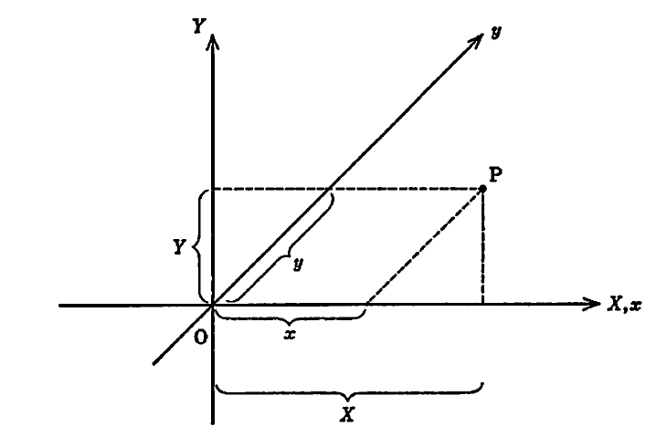
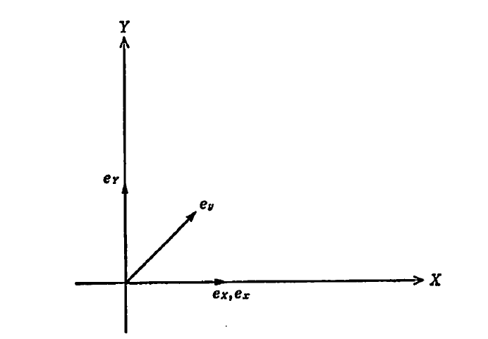
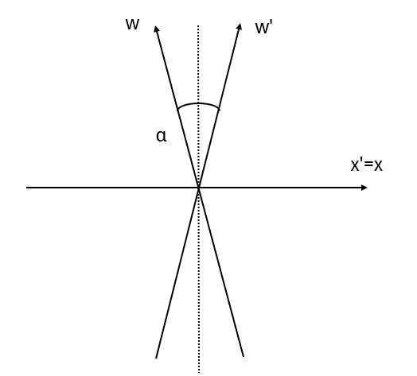
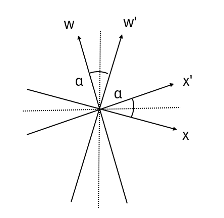

## 特殊相対論から一般相対論へ

　ここからは、等加速度運動している系同士での変換がどのようになるか見ていこう。例えば、今 $x$ 方向に一定加速度 $a$ で移動しているものとすると、

$$

    \frac{\mathrm{d}^2x}{\mathrm{d}t^2}=a、
    \frac{\mathrm{d}^2x'}{\mathrm{d}t'^2}=0、
    t'=t
$$

となるため、以下の関係が成り立つものと考えられる。

$$
    x'=x-\frac{1}{2}at^2=x-\frac{a}{2c^2}w^2、
    w'=w、
    (w=ct)
$$

これをLorentz変換のところでも見せた時空図で描写すると以下のようになる。

    

このことから、加速する座標への変換というのは曲がったものになることが予想される。この曲がった座標へ変換する理論としてRiemann幾何学というものがある。だが、この分野はかなり難解であるため、まずRiemann幾何学の記法について述べていくことにする。

　一般的にベクトルは $\bm{s}$ というように太字で表記されるが、その中身は指定する座標系によって異なってくる。例えば、2次元直交座標系 $(X,Y)$ と2次元斜交座標系 $(x,y)$ の場合だと、それぞれ $\bm{s}=(X,Y)$ あるいは $\bm{s}=(x,y)$ と表される。形だけ見ると同じように感じるが、各座標系が仮に以下の図のようになっていたとすると、そのようになっていないことが分かる。

    

$$
    X = x+\frac{1}{\sqrt{2}}y、
    Y = \frac{1}{\sqrt{2}}y
    \leftrightarrow
    x = X - Y、
    y = \sqrt{2}Y
$$

すなわち、各座標系において

$$
    \bm{s}=(X,Y)=
    \left(
        x+\frac{1}{\sqrt{2}}y,
        \frac{1}{\sqrt{2}}y
    \right)　（直交座標系）
$$
$$
    \bm{s}=(x,y)=
    (X-Y,\sqrt{2}Y)　（斜交座標系）
$$

となるわけだが、この表記だと一目見てどの座標系を利用しているのかが分からず不便である。そこで、どの座標系を利用しているか分かりやすくするために各座標系ごとに**基本ベクトル**（各成分の大きさ1のベクトル）というものを用意する。例として、直交座標系での基本ベクトルを $\bm{e}_X,\bm{e}_Y$ 、斜交座標系での基本ベクトルを $\bm{e}_x,\bm{e}_y$ として

$$
    \bm{s}=
    X\bm{e}_X+Y\bm{e}_Y=
    \left(
        x+\frac{1}{\sqrt{2}}y
    \right)\bm{e}_X+
    \left(
        \frac{1}{\sqrt{2}}y
    \right)\bm{e}_Y
$$
$$
    \bm{s}=
    x\bm{e}_x+y\bm{e}_y=
    (X-Y)\bm{e}_x+
    \sqrt{2}Y\bm{e}_y
$$

というように表記すると、それぞれ直交座標系と斜交座標系を利用していることが分かる。

    

さらに、基本ベクトルを用いると各座標系の間で

$$
    \bm{s}=
    X\bm{e}_X+Y\bm{e}_Y=
    x\bm{e}_x+y\bm{e}_y
$$

が成り立つため、これに先ほどの式をそれぞれ代入すると

$$
    \bm{s}=
    x\bm{e}_X+
    y
    \left(
        \frac{1}{\sqrt{2}}\bm{e}_X+
        \frac{1}{\sqrt{2}}\bm{e}_Y
    \right)=
    x\bm{e}_x+y\bm{e}_y
$$
$$
    \bm{s}=
    X\bm{e}_X+Y\bm{e}_Y=
    X\bm{e}_x+
    Y
    \left(
        -\bm{e}_x+
        \sqrt{2}\bm{e}_y
    \right)
$$
となるため、試しに同じ係数で比較してみると以下のように基本ベクトルの変換式が得られる。
$$
    \bm{e}_x=\bm{e}_X、
    \bm{e}_y=
    \frac{1}{\sqrt{2}}\bm{e}_X+
    \frac{1}{\sqrt{2}}\bm{e}_Y
$$
$$
    \bm{e}_X=\bm{e}_x、
    \bm{e}_Y=
    -\bm{e}_x+
    \sqrt{2}\bm{e}_y
$$

このように、直交座標系から斜交座標系へ変換変換は基本ベクトルを $\bm{e}_X,\bm{e}_Y$ から $\bm{e}_x,\bm{e}_y$ へ置き換えることに相当していることが分かる。また、基本ベクトルの内積をとることで基本ベクトル自体の大きさが1であることと基本ベクトル同士がどのような関係か以下のように表すことができる。

$$
    \bm{e}_X\cdot\bm{e}_X=1、
    \bm{e}_X\cdot\bm{e}_Y=0、
    \bm{e}_Y\cdot\bm{e}_Y=1
$$
$$
    \bm{e}_x\cdot\bm{e}_x=1、
    \bm{e}_x\cdot\bm{e}_y=\frac{1}{\sqrt{2}}、
    \bm{e}_y\cdot\bm{e}_y=1
$$

　上記のことを踏まえて、一般的に直交座標系 $(X,Y)$ から任意の座標系 $(x,y)$ への変換を考えると、

$$
    \bm{s}=\bm{s}(X,Y)=\bm{s}(x,y)
$$

というようにベクトル $\bm{s}$ が変換されるわけだが、この微小変化をとることで

$$
    \mathrm{d}\bm{s}=
    \left(
        \frac{\partial \bm{s}}{\partial X}
    \right)
    \mathrm{d}X+
    \left(
        \frac{\partial \bm{s}}{\partial Y}
    \right)
    \mathrm{d}Y=
    \left(
        \frac{\partial \bm{s}}{\partial x}
    \right)
    \mathrm{d}x+
    \left(
        \frac{\partial \bm{s}}{\partial y}
    \right)
    \mathrm{d}y
$$

と展開できる。すると、基本ベクトルを利用した式と同じように各成分のベクトルの和になっていることが分かる。実際、$\bm{u}$ を基底ベクトル（大きさが1でない各成分のベクトル）として

$$
    \bm{u}_X=
    \frac{\partial \bm{s}}{\partial X}、
    \bm{u}_Y=
    \frac{\partial \bm{s}}{\partial Y}、
    \bm{u}_x=
    \frac{\partial \bm{s}}{\partial x}、
    \bm{u}_y=
    \frac{\partial \bm{s}}{\partial y}
$$

というように置くことで以下の形になることが分かる。

$$
    \mathrm{d}\bm{s}=
    \mathrm{d}X\bm{u}_X+
    \mathrm{d}Y\bm{u}_Y=
    \mathrm{d}x\bm{u}_x+
    \mathrm{d}y\bm{u}_y
$$

ここで、$\bm{u}$ に関して変数に関しても

$$
    X=X(x,y)、Y=Y(x,y)
$$

というように変換後の関数として書けることから、

$$
    \bm{u}_X=
    \frac{\partial \bm{s}}{\partial X}=
    \frac{\partial x}{\partial X}
    \frac{\partial \bm{s}}{\partial x}+
    \frac{\partial y}{\partial X}
    \frac{\partial \bm{s}}{\partial y}=
    \frac{\partial x}{\partial X}
    \bm{u}_x+
    \frac{\partial y}{\partial X}
    \bm{u}_y
$$
$$
    \bm{u}_Y=
    \frac{\partial \bm{s}}{\partial Y}=
    \frac{\partial x}{\partial Y}
    \frac{\partial \bm{s}}{\partial x}+
    \frac{\partial y}{\partial Y}
    \frac{\partial \bm{s}}{\partial y}=
    \frac{\partial \bm{s}}{\partial Y}
    \bm{u}_x+
    \frac{\partial y}{\partial Y}
    \bm{u}_y
$$

となり、逆に変換前の変数で

$$
    x=x(X,Y)、y=y(X,Y)
$$

とも書けるから、以下の通りになる。

$$
    \bm{u}_x=
    \frac{\partial \bm{s}}{\partial x}=
    \frac{\partial X}{\partial x}
    \frac{\partial \bm{s}}{\partial X}+
    \frac{\partial Y}{\partial x}
    \frac{\partial \bm{s}}{\partial Y}=
    \frac{\partial X}{\partial x}
    \bm{u}_X+
    \frac{\partial Y}{\partial x}
    \bm{u}_Y
$$
$$
    \bm{u}_y=
    \frac{\partial \bm{s}}{\partial y}=
    \frac{\partial X}{\partial y}
    \frac{\partial \bm{s}}{\partial x}+
    \frac{\partial Y}{\partial y}
    \frac{\partial \bm{s}}{\partial y}=
    \frac{\partial X}{\partial y}
    \bm{u}_X+
    \frac{\partial Y}{\partial y}
    \bm{u}_Y
$$

ここまでの結果を整理すると、

$$
    \bm{u}_X=
    \frac{\partial x}{\partial X}
    \bm{u}_x+
    \frac{\partial y}{\partial X}
    \bm{u}_y、
    \bm{u}_Y=
    \frac{\partial x}{\partial Y}
    \bm{u}_x+
    \frac{\partial y}{\partial Y}
    \bm{u}_y
$$
$$
    \bm{u}_x=
    \frac{\partial X}{\partial x}
    \bm{u}_X+
    \frac{\partial Y}{\partial x}
    \bm{u}_Y、
    \bm{u}_y=
    \frac{\partial X}{\partial y}
    \bm{u}_X+
    \frac{\partial Y}{\partial y}
    \bm{u}_Y
$$

というように、基底ベクトルの変換になっていることが分かる。試しに、先ほどの直交座標系と斜交座標系の場合だと

$$
    X = x+\frac{1}{\sqrt{2}}y、
    Y = \frac{1}{\sqrt{2}}y
    \rightarrow
    \frac{\partial X}{\partial x}=1、
    \frac{\partial Y}{\partial x}=0、
    \frac{\partial X}{\partial y}=\frac{1}{\sqrt{2}}、
    \frac{\partial Y}{\partial y}=\frac{1}{\sqrt{2}}
$$

$$
    x = X - Y、
    y = \sqrt{2}Y
    \rightarrow
    \frac{\partial x}{\partial X}=1、
    \frac{\partial y}{\partial X}=0、
    \frac{\partial x}{\partial Y}=-1、
    \frac{\partial y}{\partial Y}=\sqrt{2}
$$

となることから、以下のような式が得られる。

$$
    \bm{u}_X=\bm{u}_x、
    \bm{u}_Y=
    -\bm{u}_x+\sqrt{2}\bm{u}_y
$$
$$
    \bm{u}_x=\bm{u}_X、
    \bm{u}_y=
    \frac{1}{\sqrt{2}}\bm{u}_X+
    \frac{1}{\sqrt{2}}\bm{u}_Y
$$

この形から、基底ベクトル $\bm{u}$ と基本ベクトル $\bm{e}$ が同じであれば一致することが分かる。また、基底ベクトルの大きさを $|\bm{u}|$ とすると基本ベクトルが $\bm{e}=\bm{u}/|\bm{u}|$ となることから、それらの関係がどうなるかを見てみよう。

まず、基底ベクトルの大きさは $|\bm{u}|=\sqrt{\bm{u}\cdot\bm{u}}$ というように内積から求められる。そのため、

$$
    \bm{u}_X\cdot\bm{u}_X=
    \bm{u}_x\cdot\bm{u}_x、
    \bm{u}_Y\cdot\bm{u}_Y=
    \bm{u}_x\cdot\bm{u}_x-
    2\sqrt{2} 
    \left(
        \bm{u}_x\cdot\bm{u}_y
    \right)+
    2
    (\bm{u}_y\cdot\bm{u}_y)
$$
$$
    \bm{u}_x\cdot\bm{u}_x=
    \bm{u}_X\cdot\bm{u}_X、
    \bm{u}_y\cdot\bm{u}_y=
    \frac{1}{2}
    (\bm{u}_X\cdot\bm{u}_X)+
    (\bm{u}_X\cdot\bm{u}_Y)+
    \frac{1}{2}
    (\bm{u}_Y\cdot\bm{u}_Y)
$$

というように内積をとってみると、

であることを利用すると、変換後の内積は

$$
    \bm{u}_x\cdot\bm{u}_x=
    \bm{u}_X\cdot\bm{u}_X=1
$$
$$
    \bm{u}_y\cdot\bm{u}_y=
    \frac{1}{2}
    \left(
        \bm{u}_X\cdot\bm{u}_X+
        2(\bm{u}_X\cdot\bm{u}_Y)+
        \bm{u}_Y\cdot\bm{u}_Y
    \right)=1
$$

となることから、基底ベクトルの大きさは以下の通りとなる。

$$
    |\bm{u}_X|=
    \sqrt{\bm{u}_X\cdot\bm{u}_X}=1、
    |\bm{u}_Y|=
    \sqrt{\bm{u}_Y\cdot\bm{u}_Y}=1
$$
$$
    |\bm{u}_x|=
    \sqrt{\bm{u}_x\cdot\bm{u}_x}=1、
    |\bm{u}_y|=
    \sqrt{\bm{u}_y\cdot\bm{u}_y}=1
$$

そのため、全ての基本ベクトルと基底ベクトルが一致していることが分かる。

　以上のことをふまえると、各座標系の基底ベクトルの関係とそれらの内積により座標系の変換ができることになるため、今度は前回までに登場した変換（Galielei変換、Lorentz変換）を見てみよう。まず、Galiei変換は

$$
    w'=w、x=-\beta w+x、y'=y、z'=z、
    \left(\beta=\frac{V}{c}\right)
$$
$$
    \leftrightarrow
    w=w'、x=x'+\beta w'、y=y'、z=z'
$$

という変換であるため、ベクトル $\bm{s}$ は直交座標系の基本ベクトル $\bm{e}_w,\bm{e}_x,\bm{e}_y,\bm{e}_z$ とGalilei変換後の基本ベクトル $\bm{e}_w',\bm{e}_x',\bm{e}_y',\bm{e}_z'$ を用いて以下の通りに書ける。

$$
    \bm{s}=
    w\bm{e}_w+
    x\bm{e}_x+
    y\bm{e}_y+
    z\bm{e}_z=
    w'\bm{e}_w'+
    x'\bm{e}_x'+
    y'\bm{e}_y'+
    z'\bm{e}_z'
$$

そして、この微小変化をとったものは直交座標系の基底ベクトル $\bm{u}_w,\bm{u}_x,\bm{u}_y,\bm{u}_z$ とGalilei変換後の基底ベクトル $\bm{u}_w',\bm{u}_x',\bm{u}_y',\bm{u}_z'$ を用いて以下の通りに書ける。

$$
    \mathrm{d}\bm{s}=
    \mathrm{d}w\bm{u}_w+
    \mathrm{d}x\bm{u}_x+
    \mathrm{d}y\bm{u}_y+
    \mathrm{d}z\bm{u}_z=
    \mathrm{d}w'\bm{u}_w'+
    \mathrm{d}x'\bm{u}_x'+
    \mathrm{d}y'\bm{u}_y'+
    \mathrm{d}z'\bm{u}_z'
$$

そして、基底ベクトルの変換式は

$$
    \bm{u}_w=
    \frac{\partial \bm{s}}{\partial w}=
    \left(
        \frac{\partial w'}{\partial w}
    \right)
    \bm{u}_w'+
    \left(
        \frac{\partial x'}{\partial w}
    \right)
    \bm{u}_x'+
    \left(
        \frac{\partial y'}{\partial w}
    \right)
    \bm{u}_y'+
    \left(
        \frac{\partial z'}{\partial w}
    \right)
    \bm{u}_z'
$$
$$
    \bm{u}_x=
    \frac{\partial \bm{s}}{\partial x}=
    \left(
        \frac{\partial w'}{\partial x}
    \right)
    \bm{u}_w'+
    \left(
        \frac{\partial x'}{\partial x}
    \right)
    \bm{u}_x'+
    \left(
        \frac{\partial y'}{\partial x}
    \right)
    \bm{u}_y'+
    \left(
        \frac{\partial z'}{\partial x}
    \right)
    \bm{u}_z'
$$
$$
    \bm{u}_y=
    \frac{\partial \bm{s}}{\partial y}=
    \left(
        \frac{\partial w'}{\partial y}
    \right)
    \bm{u}_w'+
    \left(
        \frac{\partial x'}{\partial y}
    \right)
    \bm{u}_x'+
    \left(
        \frac{\partial y'}{\partial y}
    \right)
    \bm{u}_y'+
    \left(
        \frac{\partial z'}{\partial y}
    \right)
    \bm{u}_z'
$$
$$
    \bm{u}_z=
    \frac{\partial \bm{s}}{\partial z}=
    \left(
        \frac{\partial w'}{\partial z}
    \right)
    \bm{u}_w'+
    \left(
        \frac{\partial x'}{\partial z}
    \right)
    \bm{u}_x'+
    \left(
        \frac{\partial y'}{\partial z}
    \right)
    \bm{u}_y'+
    \left(
        \frac{\partial z'}{\partial z}
    \right)
    \bm{u}_z'
$$
$$
    \bm{u}_w'=
    \frac{\partial \bm{s}}{\partial w'}=
    \left(
        \frac{\partial w}{\partial w'}
    \right)
    \bm{u}_w+
    \left(
        \frac{\partial x}{\partial w'}
    \right)
    \bm{u}_x+
    \left(
        \frac{\partial y}{\partial w'}
    \right)
    \bm{u}_y+
    \left(
        \frac{\partial z}{\partial w'}
    \right)
    \bm{u}_z
$$
$$
    \bm{u}_x'=
    \frac{\partial \bm{s}}{\partial x'}=
    \left(
        \frac{\partial w}{\partial x'}
    \right)
    \bm{u}_w+
    \left(
        \frac{\partial x}{\partial x'}
    \right)
    \bm{u}_x+
    \left(
        \frac{\partial y}{\partial x'}
    \right)
    \bm{u}_y+
    \left(
        \frac{\partial z}{\partial x'}
    \right)
    \bm{u}_z
$$
$$
    \bm{u}_y'=
    \frac{\partial \bm{s}}{\partial y'}=
    \left(
        \frac{\partial w}{\partial y'}
    \right)
    \bm{u}_w+
    \left(
        \frac{\partial x}{\partial y'}
    \right)
    \bm{u}_x+
    \left(
        \frac{\partial y}{\partial y'}
    \right)
    \bm{u}_y+
    \left(
        \frac{\partial z}{\partial y'}
    \right)
    \bm{u}_z
$$
$$
    \bm{u}_z'=
    \frac{\partial \bm{s}}{\partial z'}=
    \left(
        \frac{\partial w}{\partial z'}
    \right)
    \bm{u}_w+
    \left(
        \frac{\partial x}{\partial z'}
    \right)
    \bm{u}_x+
    \left(
        \frac{\partial y}{\partial z'}
    \right)
    \bm{u}_y+
    \left(
        \frac{\partial z}{\partial z'}
    \right)
    \bm{u}_z
$$

となるため、変換式を代入すると以下の式が得られる。

$$
    \bm{u}_w=
    \bm{u}_w'-\beta\bm{u}_x'、
    \bm{u}_x=\bm{u}_x'、
    \bm{u}_y=\bm{u}_y'、
    \bm{u}_z=\bm{u}_z'
$$
$$
    \bm{u}_w'=
    \bm{u}_w+\beta\bm{u}_x、
    \bm{u}_x'=\bm{u}_x、
    \bm{u}_y'=\bm{u}_y、
    \bm{u}_z'=\bm{u}_z
$$

ここで、変換前の座標系が直交座標系であることを踏まえて**時間軸w以外**の内積

$$
    \bm{u}_x=\bm{e}_x、
    \bm{u}_y=\bm{e}_y、
    \bm{u}_z=\bm{e}_z
$$
$$
    \bm{u}_x\cdot\bm{u}_x=1、
    \bm{u}_y\cdot\bm{u}_x=0、
    \bm{u}_z\cdot\bm{u}_x=0
$$
$$
    \bm{u}_x\cdot\bm{u}_y=0、
    \bm{u}_y\cdot\bm{u}_y=1、
    \bm{u}_z\cdot\bm{u}_y=0
$$
$$
    \bm{u}_x\cdot\bm{u}_z=0、
    \bm{u}_y\cdot\bm{u}_z=0、
    \bm{u}_z\cdot\bm{u}_z=1
$$

を利用して変換後の内積を求めると

$$
    \bm{u}_x'\cdot\bm{u}_x'=1、
    \bm{u}_y'\cdot\bm{u}_x'=0、
    \bm{u}_z'\cdot\bm{u}_x'=0
$$
$$
    \bm{u}_x'\cdot\bm{u}_y'=0、
    \bm{u}_y'\cdot\bm{u}_y'=1、
    \bm{u}_z'\cdot\bm{u}_y'=0
$$
$$
    \bm{u}_x'\cdot\bm{u}_z'=0、
    \bm{u}_y'\cdot\bm{u}_z'=0、
    \bm{u}_z'\cdot\bm{u}_z'=1
$$

となる。ここで、**時間軸wのみ**の変換式について

$$
    \bm{u}_w'\cdot\bm{u}_w'=
    (\bm{u}_w\cdot\bm{u}_w)+
    2\beta(\bm{u}_w\cdot\bm{u}_x)+
    \beta^2、
    \bm{u}_w'\cdot\bm{u}_x'=
    (\bm{u}_w\cdot\bm{u}_x)+
    \beta
$$
$$
    \bm{u}_w\cdot\bm{u}_w=
    (\bm{u}_w'\cdot\bm{u}_w')-
    2\beta(\bm{u}_w'\cdot\bm{u}_x')+
    \beta^2、
    \bm{u}_w\cdot\bm{u}_x=
    (\bm{u}_w'\cdot\bm{u}_x')-
    \beta
$$

となるが、仮に

$$
    \bm{u}_w'\cdot\bm{u}_w'=
    \bm{u}_w\cdot\bm{u}_w=1
$$

となるとすれば、

$$
    \bm{u}_w'\cdot\bm{u}_x'=
    \frac{1}{2}\beta、
    \bm{u}_w\cdot\bm{u}_x=
    -\frac{1}{2}\beta
$$

となる。これを踏まえて変換前のベクトルの大きさは

$$
    |\bm{u}_w|=
    \sqrt{\bm{u}_w\cdot\bm{u}_w}=1、
    |\bm{u}_x|=
    \sqrt{\bm{u}_x\cdot\bm{u}_x}=1
$$
$$
    |\bm{u}_y|=
    \sqrt{\bm{u}_y\cdot\bm{u}_y}=1、
    |\bm{u}_z|=
    \sqrt{\bm{u}_z\cdot\bm{u}_z}=1、
$$

であり、変換後の基底ベクトルの大きさは以下の通りになる。

$$
    |\bm{u}_w'|=
    \sqrt{\bm{u}_{w}'\cdot\bm{u}_{w}'}=1、
    |\bm{u}_x'|=
    \sqrt{\bm{u}_{x}'\cdot\bm{u}_{x}'}=1、
$$
$$
    |\bm{u}_y'|=
    \sqrt{\bm{u}_{y}'\cdot\bm{u}_{y}'}=1、
    |\bm{u}_z'|=
    \sqrt{\bm{u}_{z}'\cdot\bm{u}_{z}'}=1
$$

そのため、Galilei変換後の基本ベクトルは

$$
    \bm{e}_w'=
    \bm{e}_w+\beta\bm{e}_x、
    \bm{e}_x'=
    \bm{e}_x'=\bm{e}_x、
    \bm{e}_y'=\bm{e}_y、
    \bm{e}_z''=\bm{e}_z'
$$

となる。ここまでで内積について変換前が

$$
    \bm{e}_w\cdot\bm{e}_w=1、
    \bm{e}_x\cdot\bm{e}_w=-\frac{1}{2}\beta、
    \bm{e}_y\cdot\bm{e}_w=0、
    \bm{e}_z\cdot\bm{e}_w=0
$$
$$
    \bm{e}_w\cdot\bm{e}_x=-\frac{1}{2}\beta、
    \bm{e}_x\cdot\bm{e}_x=1、
    \bm{e}_y\cdot\bm{e}_x=0、
    \bm{e}_z\cdot\bm{e}_x=0
$$
$$
    \bm{e}_w\cdot\bm{e}_y=0、
    \bm{e}_x\cdot\bm{e}_y=0、
    \bm{e}_y\cdot\bm{e}_y=1、
    \bm{e}_z\cdot\bm{e}_y=0
$$
$$
    \bm{e}_w\cdot\bm{e}_z=0、
    \bm{e}_x\cdot\bm{e}_z=0、
    \bm{e}_y\cdot\bm{e}_z=0、
    \bm{e}_z\cdot\bm{e}_z=1
$$

であり、変換後についても

$$
    \bm{e}_w'\cdot\bm{e}_w'=1、
    \bm{e}_x'\cdot\bm{e}_w'=
    \frac{1}{2}\beta、
    \bm{e}_y'\cdot\bm{e}_w'=0、
    \bm{e}_z'\cdot\bm{e}_w'=0
$$
$$
    \bm{e}_w'\cdot\bm{e}_x'=
    \frac{1}{2}\beta、
    \bm{e}_x'\cdot\bm{e}_x'=1、
    \bm{e}_y'\cdot\bm{e}_x'=0、
    \bm{e}_z'\cdot\bm{e}_x'=0
$$
$$
    \bm{e}_w'\cdot\bm{e}_y'=0、
    \bm{e}_x'\cdot\bm{e}_y'=0、
    \bm{e}_y'\cdot\bm{e}_y'=1、
    \bm{e}_z'\cdot\bm{e}_y'=0
$$
$$
    \bm{e}_w'\cdot\bm{e}_z'=0、
    \bm{e}_x'\cdot\bm{e}_z'=0、
    \bm{e}_y'\cdot\bm{e}_z'=0、
    \bm{e}_z'\cdot\bm{e}_z'=1
$$

としていたが、ここで時間軸 $w$ と $x$ の内積について値を持つのは以下の図のような関係にあるためと考えられる。

    

　次にLorentz変換の場合、変換式は以下の通りであった。
$$
    w'=\gamma(w-\beta x)、
    x'=\gamma(-\beta w+x)、
    y'=y、
    z'=z、
    \left(
        \gamma=\frac{1}{\sqrt{1-\beta^2}}
    \right)
$$
$$
    \leftrightarrow
    w=\gamma(w'+\beta x')、
    x=\gamma(\beta w'+x')、
    y=y'、
    z=z'
$$

このときの基底ベクトルをGalilei変換と同様に求めてみると

$$
    \bm{u}_w=
    \gamma (\bm{u}_w'+\beta\bm{u}_x')、
    \bm{u}_x=
    \gamma (\bm{u}_x'+\beta\bm{u}_w')
$$
$$
    \bm{u}'_w=
    \gamma (\bm{u}_w-\beta\bm{u}_x)、
    \bm{u}'_x=
    \gamma (\bm{u}_x-\beta\bm{u}_w)
$$

であり、このうち**時間軸wを含む**内積をとると

$$
    (\bm{u}_w'\cdot\bm{u}_w')=
    \gamma^2[
        (\bm{u}_w\cdot\bm{u}_w)+
        2\beta(\bm{u}_w\cdot\bm{u}_x)+
        \beta^2(\bm{u}_x\cdot\bm{u}_x)
    ]
$$
$$
    (\bm{u}_w'\cdot\bm{u}_x')=
    \gamma^2[
        (\bm{u}_w\cdot\bm{u}_x)+
        (1+\beta^2)
        (\bm{u}_w\cdot\bm{u}_w)+
        \beta(\bm{u}_x\cdot\bm{u}_x)
    ]
$$
$$
    (\bm{u}_x'\cdot\bm{u}_x')=
    \gamma^2[
        1+
        2\beta(\bm{u}_x\cdot\bm{u}_w)+
        \beta^2
        (\bm{u}_w\cdot\bm{u}_w)
    ]
$$

となるが、**時間軸wを除いた分**の内積が

$$
    \bm{e}_x\cdot\bm{e}_x=1、
    \bm{e}_y\cdot\bm{e}_x=0、
    \bm{e}_z\cdot\bm{e}_x=0
$$
$$
    \bm{e}_x\cdot\bm{e}_y=0、
    \bm{e}_y\cdot\bm{e}_y=1、
    \bm{e}_z\cdot\bm{e}_y=0
$$
$$
    \bm{e}_x\cdot\bm{e}_z=0、
    \bm{e}_y\cdot\bm{e}_z=0、
    \bm{e}_z\cdot\bm{e}_z=1
$$

であるから以下の式が得られる。

$$
    (\bm{u}_w'\cdot\bm{u}_w')=
    \gamma^2[
        (\bm{u}_w\cdot\bm{u}_w)+
        2\beta(\bm{u}_w\cdot\bm{u}_x)+
        \beta^2
    ]
$$
$$
    (\bm{u}_w'\cdot\bm{u}_x')=
    \gamma^2[
        (\bm{u}_w\cdot\bm{u}_x)+
        (1+\beta^2)
        (\bm{u}_w\cdot\bm{u}_w)+
        \beta
    ]
$$
$$
    \gamma^2[
        1+
        2\beta(\bm{u}_x\cdot\bm{u}_w)+
        \beta^2
        (\bm{u}_w\cdot\bm{u}_w)
    ]=
    1
$$

このうち、3つ目の式から

$$
    2(\bm{u}_x\cdot\bm{u}_w)=
    \beta
    \left[
       (\bm{u}_w\cdot\bm{u}_w)-1
    \right]
$$

をそれ以外の式に適用すると

$$
    (\bm{u}_w'\cdot\bm{u}_w')=
    (\bm{u}_w\cdot\bm{u}_w)
$$
$$
    (\bm{u}_w'\cdot\bm{u}_x')=
    \gamma^2[
        (\bm{u}_w\cdot\bm{u}_x)+
        (1+\beta^2)
        (\bm{u}_w\cdot\bm{u}_w)+
        \beta
    ]
$$

変換前の内積が以下のようになっていたとする。

$$
    \bm{e}_w\cdot\bm{e}_w=1、
    \bm{e}_x\cdot\bm{e}_w=-\frac{1}{2}\beta、
    \bm{e}_y\cdot\bm{e}_w=0、
    \bm{e}_z\cdot\bm{e}_w=0
$$
$$
    \bm{e}_w\cdot\bm{e}_x=-\frac{1}{2}\beta、
    \bm{e}_x\cdot\bm{e}_x=1、
    \bm{e}_y\cdot\bm{e}_x=0、
    \bm{e}_z\cdot\bm{e}_x=0
$$
$$
    \bm{e}_w\cdot\bm{e}_y=0、
    \bm{e}_x\cdot\bm{e}_y=0、
    \bm{e}_y\cdot\bm{e}_y=1、
    \bm{e}_z\cdot\bm{e}_y=0
$$
$$
    \bm{e}_w\cdot\bm{e}_z=0、
    \bm{e}_x\cdot\bm{e}_z=0、
    \bm{e}_y\cdot\bm{e}_z=0、
    \bm{e}_z\cdot\bm{e}_z=1
$$

というように内積が不変になるところがあるか見てみると

、基本ベクトルの関係とそれらの内積を求めてみると
$$
    \bm{e}'_w=
    \gamma (\bm{e}_w+\beta\bm{e}_x)、
    \bm{e}'_x=
    \gamma (\bm{e}_x+\beta\bm{e}_w)
$$
$$
    \bm{e}_w\cdot\bm{e}_w=1、
    \bm{e}_w\cdot\bm{e}_x=
    \bm{e}_x\cdot\bm{e}_w=-\beta=
    \cos\left(
        \frac{\pi}{2}+\alpha
    \right)
$$
$$
    \bm{e}_w'\cdot\bm{e}_w'=1、
    \bm{e}_w'\cdot\bm{e}_x'=
    \bm{e}_x'\cdot\bm{e}_w'=\beta=
    \cos\left(
        \frac{\pi}{2}-\alpha
    \right)
$$
となり、座標も記載すると以下の図（ローデル図）の通りになる。

    

　このように既存の座標系の基本ベクトル（$\bm{e}_x,\bm{e}_y,\bm{e}_z$など）から基底ベクトル $\bm{u}$ とその内積 $\bm{u}\cdot\bm{u}$ から基本ベクトルを求めることで変換前と後の座標系がどのような関係にあるか分かることになる。ただ、そもそも基底ベクトルは微小ベクトル $\mathrm{d}\bm{s}$ で関連つけられていたため、
$$
    w=x^0、x=x^1、y=x^2、z=x^3、
    \bm{u}_w=\bm{u}_0、
    \bm{u}_x=\bm{u}_1、
    \bm{u}_y=\bm{u}_2、
    \bm{u}_z=\bm{u}_3
$$
とおき、$\mathrm{d}\bm{s}$ を以下のように書く。
$$
    \mathrm{d}\bm{s}=
    \sum_{\mu}\mathrm{d}x^\mu\bm{u}_\mu=
    \sum_{\mu'}\mathrm{d}x^{\mu'}\bm{u}_{\mu'}
$$
$$
    (\mathrm{d}s)^2=
    \mathrm{d}\bm{s}\cdot\mathrm{d}\bm{s}=
    \sum_{\mu,\nu=0}^{3}
    (\bm{u}_\mu\cdot\bm{u}_\nu)
    \mathrm{d}x^\mu\mathrm{d}x^\nu=
    \sum_{\mu',\nu'=0}^{3}
    (\bm{u}_{\mu'}\cdot\bm{u}_{\nu'})
    \mathrm{d}x^{\mu'}\mathrm{d}x^{\nu'}
$$
ここで片方の内積が分かることで、もう片方の内積や返還前後の関係が分かるため、これはリーマン計量と呼ばれている。

　一方で、相対論的力学でもあったようにLorentz変換においては以下の形で不変となっていた。
$$
    (\mathrm{d}w)^2-
    (\mathrm{d}x)^2-
    (\mathrm{d}y)^2-
    (\mathrm{d}z)^2=
    (\mathrm{d}w')^2-
    (\mathrm{d}x')^2-
    (\mathrm{d}y')^2-
    (\mathrm{d}z')^2
$$
そのため、これを内積として定義した空間（Minkofsky空間）を考えると、内積の形が不変となって便利であることがうかがえる。

これを見ても分かるように内積から求めると変換式がおかしくなってしまうため、逆に

あるいは、これをさらに扱い易くするよう添え字に行列の番号を振って
$$
\begin{pmatrix}
    x'^0 \\
    x'^1 \\
    x'^2 \\
    x'^3
\end{pmatrix}
=
\begin{pmatrix}
    \alpha_{ 0}^0 & \alpha_{ 1}^0 & 
    \alpha_{ 2}^0 & \alpha_{ 3}^0 \\
    \alpha_{ 0}^1 & \alpha_{ 1}^1 & 
    \alpha_{ 2}^1 & \alpha_{ 3}^1 \\
    \alpha_{ 0}^2 & \alpha_{ 1}^2 & 
    \alpha_{ 2}^2 & \alpha_{ 3}^2 \\
    \alpha_{ 0}^3 & \alpha_{ 1}^3 & 
    \alpha_{ 2}^3 & \alpha_{ 3}^3 
\end{pmatrix}
\begin{pmatrix}
    x^0 \\
    x^1 \\
    x^2 \\
    x^3
\end{pmatrix}
$$
とおくと、各成分ごと（ベクトルではない）に簡略化して書ける。
$$
    x'^\mu=
    \sum_{\nu=0}^{3}\alpha_{ \nu}^\mu x^\nu　
    (\mu=0,1,2,3)
$$
あるいは、今ここで $\nu$ に対して総和をとっているが、行列においては下付き添え字（行）と上付き添え字（列）の掛け算は足し合わせることになるので、以下のように総和記号を省いた表記（**Einsteinの縮約記法**）がよく用いられている。
$$
    x'^\mu=\alpha_{ \nu}^\mu x^\nu　
    (\mu=0,1,2,3)
$$
一方で、Lorentz変換においても
$$
    w'=\gamma(w-\beta x)、
    x'=\gamma(-\beta w+x)、
    y'=y、
    z'=z、
    \left(
        \gamma=\frac{1}{\sqrt{1-\beta^2}}
    \right)
$$
となるため、同じように行列にしてみると
$$
\begin{pmatrix}
    w' \\
    x' \\
    y' \\
    z'
\end{pmatrix}
=
\begin{pmatrix}
    \gamma & -\gamma\beta & 0 & 0 \\
    -\gamma\beta & \gamma & 0 & 0 \\
    0 & 0 & 1 & 0 \\
    0 & 0 & 0 & 1
\end{pmatrix}
\begin{pmatrix}
    w \\
    x \\
    y \\
    z
\end{pmatrix}
$$
であるため、先ほどと同様に $\alpha$ を用いた表記をすることができる。ところが、つい先ほど扱った加速度の系の場合だと
$$
    w'=w、x'=-\frac{a}{2c^2}w^2+x、
    y'=y,z'=z
$$
というように、$w^2$ が関わってきてしまうため、一概に同じような関係式で表せないことが分かる。そこで、一般的に以下のような関数で表されるものとする。
$$
    w'=w'(w,x,y,z)、
    x'=x'(w,x,y,z)、
    y'=y'(w,x,y,z)、
    z'=z'(w,x,y,z)
$$
そして、これらの微小変化をとると
$$
    \mathrm{d}w'=
    \left(
        \frac{\partial w'}{\partial w}
    \right)
    \mathrm{d}w+
    \left(
        \frac{\partial w'}{\partial x}
    \right)
    \mathrm{d}x+
    \left(
        \frac{\partial w'}{\partial y}
    \right)
    \mathrm{d}y+
    \left(
        \frac{\partial w'}{\partial z}
    \right)
    \mathrm{d}z
$$
$$
    \mathrm{d}x'=
    \left(
        \frac{\partial x'}{\partial w}
    \right)
    \mathrm{d}w+
    \left(
        \frac{\partial x'}{\partial x}
    \right)
    \mathrm{d}x+
    \left(
        \frac{\partial x'}{\partial y}
    \right)
    \mathrm{d}y+
    \left(
        \frac{\partial x'}{\partial z}
    \right)
    \mathrm{d}z
$$
$$
    \mathrm{d}y'=
    \left(
        \frac{\partial y'}{\partial w}
    \right)
    \mathrm{d}w+
    \left(
        \frac{\partial y'}{\partial x}
    \right)
    \mathrm{d}x+
    \left(
        \frac{\partial y'}{\partial y}
    \right)
    \mathrm{d}y+
    \left(
        \frac{\partial y'}{\partial z}
    \right)
    \mathrm{d}z
$$
$$
    \mathrm{d}z'=
    \left(
        \frac{\partial z'}{\partial w}
    \right)
    \mathrm{d}w+
    \left(
        \frac{\partial z'}{\partial x}
    \right)
    \mathrm{d}x+
    \left(
        \frac{\partial z'}{\partial y}
    \right)
    \mathrm{d}y+
    \left(
        \frac{\partial z'}{\partial z}
    \right)
    \mathrm{d}z
$$
であるのだが、これ書き直すと以下のような形で書けることが分かる。
$$
\begin{pmatrix}
    \mathrm{d}w' \\
    \mathrm{d}x' \\
    \mathrm{d}y' \\
    \mathrm{d}z'
\end{pmatrix}
=
\begin{pmatrix}
    \frac{\partial w'}{\partial w} & 
    \frac{\partial w'}{\partial x} & 
    \frac{\partial w'}{\partial y} & 
    \frac{\partial w'}{\partial z} \\
    \frac{\partial x'}{\partial w} & 
    \frac{\partial x'}{\partial x} & 
    \frac{\partial x'}{\partial y} & 
    \frac{\partial x'}{\partial z} \\
    \frac{\partial y'}{\partial w} & 
    \frac{\partial y'}{\partial x} & 
    \frac{\partial y'}{\partial y} & 
    \frac{\partial y'}{\partial z} \\
    \frac{\partial z'}{\partial w} & 
    \frac{\partial z'}{\partial x} & 
    \frac{\partial z'}{\partial y} & 
    \frac{\partial z'}{\partial z} \\
\end{pmatrix}
\begin{pmatrix}
    \mathrm{d}w \\
    \mathrm{d}x \\
    \mathrm{d}y \\
    \mathrm{d}z
\end{pmatrix}
$$
これは先ほどの各成分ごとの表記と同様な形で
$$
    \mathrm{d}x'^\mu=
    \left(
        \frac{\partial x'^\mu}{\partial x^\nu}
    \right)
    \mathrm{d}x^\nu　
    (\mu=0,1,2,3)
$$
と記述できるため、先ほどの一定加速度での行列は次の通りになる。
$$
\begin{pmatrix}
    \mathrm{d}x'^0 \\
    \mathrm{d}x'^1 \\
    \mathrm{d}x'^2 \\
    \mathrm{d}x'^3
\end{pmatrix}
=
\begin{pmatrix}
    1 & 0 & 0 & 0 \\
    -ax^0/c^2 & 1 & 0 & 0 \\
    0 & 0 & 1 & 0 \\
    0 & 0 & 0 & 1
\end{pmatrix}
\begin{pmatrix}
    \mathrm{d}x^0 \\
    \mathrm{d}x^1 \\
    \mathrm{d}x^2 \\
    \mathrm{d}x^3
\end{pmatrix}
$$
さらに、ここでの偏微分の部分を分母の添え字を用いて簡潔に表現すると以下のようになる。
$$
    e_{\nu}^\mu=
    \partial_\nu x'^\mu=
    \left(
        \frac{\partial x'^\mu}{\partial x^\nu}
    \right)
    \rightarrow
    \mathrm{d}x'^\mu=
    e_{\nu}^\mu\mathrm{d}x^\nu
$$
あるいは、行列の見方を変えると
$$
\begin{pmatrix}
    \mathrm{d}w' \\
    \mathrm{d}x' \\
    \mathrm{d}y' \\
    \mathrm{d}z'
\end{pmatrix}
=
\mathrm{d}w
\begin{pmatrix}
    \frac{\partial w'}{\partial w} \\
    \frac{\partial x'}{\partial w} \\
    \frac{\partial y'}{\partial w} \\
    \frac{\partial z'}{\partial w} 
\end{pmatrix}+
\mathrm{d}x
\begin{pmatrix}
    \frac{\partial w'}{\partial x} \\
    \frac{\partial x'}{\partial x} \\
    \frac{\partial y'}{\partial x} \\
    \frac{\partial z'}{\partial x} 
\end{pmatrix}+
\mathrm{d}y
\begin{pmatrix}
    \frac{\partial w'}{\partial y} \\
    \frac{\partial x'}{\partial y} \\
    \frac{\partial y'}{\partial y} \\
    \frac{\partial z'}{\partial y} 
\end{pmatrix}+
\mathrm{d}z
\begin{pmatrix}
    \frac{\partial w'}{\partial z} \\
    \frac{\partial x'}{\partial z} \\
    \frac{\partial y'}{\partial z} \\
    \frac{\partial z'}{\partial z} 
\end{pmatrix}
$$
というように、基本ベクトルの和の形にもなるため、次のように書くこともできる。
$$
    \mathrm{d}\bm{s}'=
    \mathrm{d}x^{\nu}\bm{e}_{\nu}　
    \left(
        \bm{e}_{\nu}=
        \frac{\partial \bm{s}'}
        {\partial x^\nu}
    \right)

$$
そして、この大きさを求めるために内積をとると
$$
    \mathrm{d}s^2=
    \mathrm{d}\bm{s}'\cdot\mathrm{d}\bm{s}'=
    (\bm{e}_\mu\cdot\bm{e}_\nu)\ 
    \mathrm{d}x^\mu\mathrm{d}x^\nu=
    g_{\mu\nu}
    \mathrm{d}x^\mu\mathrm{d}x^\nu　
    (g_{\mu\nu}=\bm{e}_\mu\cdot\bm{e}_\nu)
$$
となるが、ここで現れる $g_{\mu\nu}$ が**計量**と呼ばれており、Riemann幾何学では重要な役目を果たすものとなっている。実際、この大きさを次の通りにすると互いに不変な形で記載することができる。
$$
    \mathrm{d}s^2=
    g'_{\mu\nu}
    \mathrm{d}x'^\mu\mathrm{d}x'^\nu=
    g_{\lambda\tau}
    \mathrm{d}x^\lambda\mathrm{d}x^\tau、
    （g'_{\mu\nu}=
    \bm{e}'_\mu\cdot\bm{e}'_\nu、
    g_{\lambda\tau}=
    \bm{e}_\lambda\cdot\bm{e}_\tau
    ）
$$
この関係が成り立つかどうかは、まず
$$
    \mathrm{d}x'^\mu\mathrm{d}x'^\nu=
    \partial_\lambda x'^{\mu}
    \mathrm{d}x^\lambda
    \partial_\tau x'^{\nu}
    \mathrm{d}x^\tau=
    \partial_\lambda x'^{\mu}
    \partial_\tau x'^{\nu}
    \mathrm{d}x^\lambda\mathrm{d}x^\tau
$$
と展開することができ、これに計量 $g'_{\mu\nu}$ をかけると
$$
    g'_{\mu\nu}
    \mathrm{d}x'^\mu\mathrm{d}x'^\nu=
    g'_{\mu\nu}
    \partial_\lambda x'^{\mu}
    \partial_\tau x'^{\nu}
    \mathrm{d}x^\lambda\mathrm{d}x^\tau
$$
であり、同じように $g_{\lambda\tau}\mathrm{d}x^\lambda\mathrm{d}x^\tau$ も展開してみると
$$
    g_{\lambda\tau}
    \mathrm{d}x^\lambda\mathrm{d}x^\tau=
    g_{\lambda\tau}
    \partial'_\mu x^{\lambda}
    \partial'_\nu x^{\tau}
    \mathrm{d}x'^\mu\mathrm{d}x'^\nu
$$
というようになるため、以下の関係式が成り立ち互いに代入することで元の $\mathrm{d}s^2$ の関係式を満たしていることが確認できる。
$$
    g'_{\mu\nu}=
    g_{\lambda\tau}
    \partial'_\mu x^{\lambda}
    \partial'_\nu x^{\tau}、
    g_{\lambda\tau}=
    g'_{\mu\nu}
    \partial_\lambda x'^{\mu}
    \partial_\tau x'^{\nu}
$$
ここまでで、$\mathrm{d}s^2$ の式というは今までのベクトルの積の形をしていないように見えるが
$$
    \mathrm{d}x_\mu=
    g_{\mu\nu}\mathrm{d}x^{\nu}、
    \mathrm{d}x_\nu=
    g_{\mu\nu}\mathrm{d}x^{\mu}
$$
というように定義することで、次のように積の形で表記することもできる。
$$
    \mathrm{d}s^2=
    \mathrm{d}x'^\mu\mathrm{d}x'_\mu=
    \mathrm{d}x'_\nu\mathrm{d}x'^\nu=
    \mathrm{d}x^\lambda\mathrm{d}x_\lambda=
    \mathrm{d}x_\tau\mathrm{d}x^\tau
$$
また、$g_{\mu\nu}$ の逆行列で $g^{\mu\nu}$ というように書くと
$$
    \mathrm{d}x^{\nu}=
    g^{\nu\lambda}\mathrm{d}x_{\lambda} 、
    \mathrm{d}x^{\mu}=
    g^{\mu\tau}\mathrm{d}x_{\tau}
$$
であるから、以下のように逆行列の性質を利用して等式が成り立つことが分かる。
$$
    \mathrm{d}x_\mu=
    g_{\mu\nu}\mathrm{d}x^{\nu}=
    g_{\mu\nu}g^{\nu\lambda}
    \mathrm{d}x_{\lambda}=
    \delta_\mu^\lambda\mathrm{d}x_{\lambda}=
    \mathrm{d}x_{\mu}
$$
$$
    \mathrm{d}x_\nu=
    g_{\mu\nu}\mathrm{d}x^{\mu}=
    g_{\mu\nu}g^{\mu\tau}
    \mathrm{d}x_{\tau}=
    \delta_\nu^\tau\mathrm{d}x_{\tau}=
    \mathrm{d}x_{\nu}
$$

実は、この関係が成り立つことは相対論的力学でも出てきており、このときは
$$
    \mathrm{d}t'
    \sqrt{1-\frac{\bm{v'}^2}{c^2}}=
    \mathrm{d}t
    \sqrt{1-\frac{\bm{v}^2}{c^2}}
$$
であったが、変位の形に整理して二乗にすると不変な形をしていることが分かる（Galilei変換、等加速度系の変換でも別の形で不変な形になる）。
$$
    \mathrm{d}w'^2-
    \mathrm{d}x'^2-
    \mathrm{d}y'^2-
    \mathrm{d}z'^2=
    \mathrm{d}w^2-
    \mathrm{d}x^2-
    \mathrm{d}y^2-
    \mathrm{d}z^2
$$
そのため、このときの計量は以下の形をしているものと考えられる。
$$
    g_{\mu\nu}=
    \begin{pmatrix}
        1 & 0 & 0 & 0 \\
        0 & -1 & 0 & 0 \\
        0 & 0 & -1 & 0 \\
        0 & 0 & 0 & -1
    \end{pmatrix}
$$
しかし、このままだと各座標ごとの基本ベクトルが
$$
    \bm{e}_0=
    \begin{pmatrix}
        \gamma \\ -\gamma\beta \\ 0 \\ 0
    \end{pmatrix}、
    \bm{e}_1=
    \begin{pmatrix}
        -\gamma\beta \\ \gamma \\ 0 \\ 0
    \end{pmatrix}、
    \bm{e}_2=
    \begin{pmatrix}
        0 \\ 0 \\ 1 \\ 0
    \end{pmatrix}、
    \bm{e}_3=
    \begin{pmatrix}
        0 \\ 0 \\ 0 \\ 1
    \end{pmatrix}
$$
であることから、計量の値は
$$
    g_{00}=\bm{e}_0\cdot\bm{e}_0=
    \frac{1+\beta^2}{1-\beta^2}\neq 1、
    g_{11}\cdots
$$
というように別の値がでてきてしまう。そこで、
Lorentz変換の形を虚時間を用いて
$$
    x'^0=
    \gamma(x^0-\mathrm{i}\beta x^1)、
    x'^1=
    \gamma(x^1+\mathrm{i}\beta x^0)、
    x'^2=x^2、x'^3=x^3、
    (x^0=\mathrm{i}w)
$$
というようにすると、基本ベクトルが
$$
    \bm{e}_0=
    \begin{pmatrix}
        \gamma \\ 
        \mathrm{i}\gamma\beta \\ 
        0 \\ 0
    \end{pmatrix}、
    \bm{e}_1=
    \begin{pmatrix}
        -\mathrm{i}\gamma\beta \\ 
        \gamma \\ 
        0 \\ 0
    \end{pmatrix}、
    \bm{e}_2=
    \begin{pmatrix}
        0 \\ 0 \\ 1 \\ 0
    \end{pmatrix}、
    \bm{e}_3=
    \begin{pmatrix}
        0 \\ 0 \\ 0 \\ 1
    \end{pmatrix}
$$
となり、このときの計量は以下の形になる。
$$
    g_{\mu\nu}=
    \begin{pmatrix}
        1 & 0 & 0 & 0 \\
        0 & 1 & 0 & 0 \\
        0 & 0 & 1 & 0 \\
        0 & 0 & 0 & 1
    \end{pmatrix}
$$
この場合だと、以下の形で不変な形になることが分かる。
$$
    -\mathrm{d}w'^2+
    \mathrm{d}x'^2+
    \mathrm{d}y'^2+
    \mathrm{d}z'^2=
    -\mathrm{d}w^2+
    \mathrm{d}x^2+
    \mathrm{d}y^2+
    \mathrm{d}z^2
$$

以上のことから、座標に含まれた虚数によってあたかも計量が別の形になっているように見えていたことが考えられ、この見かけの計量はよく**Minkofsky計量**と呼ばれている。
$$
    \eta_{\mu\nu}=
    \begin{pmatrix}
        1 & 0 & 0 & 0 \\
        0 & -1 & 0 & 0 \\
        0 & 0 & -1 & 0 \\
        0 & 0 & 0 & -1
    \end{pmatrix}
    または\ 
    \eta_{\mu\nu}=
    \begin{pmatrix}
        -1 & 0 & 0 & 0 \\
        0 & 1 & 0 & 0 \\
        0 & 0 & 1 & 0 \\
        0 & 0 & 0 & 1
    \end{pmatrix}
$$

このように、特殊相対性理論にもRieman幾何学との間に計量を通じて関係しているため、以降ではこれを用いて一般相対性理論について述べていくことにする。 -->