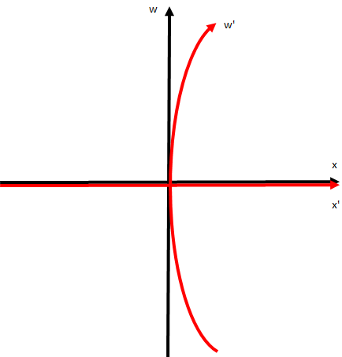
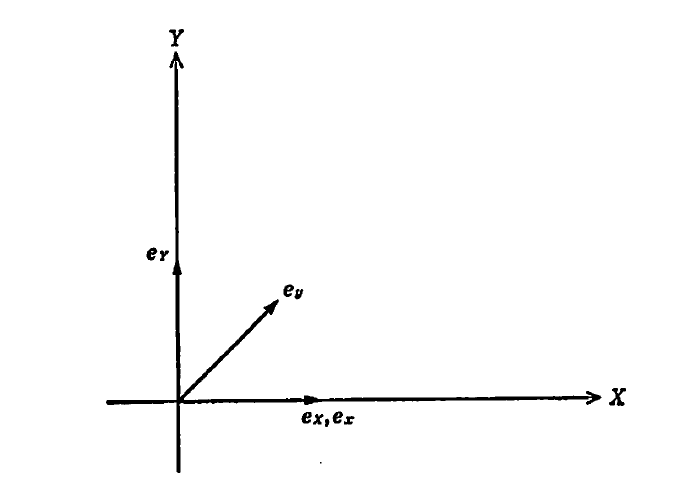
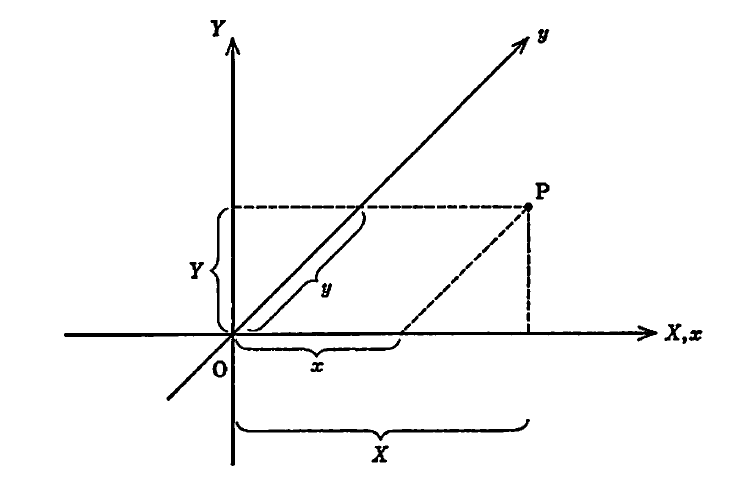

## 加速度系への座標変換について

　ここからは、等加速度運動している系同士での変換がどのようになるか見ていこう。例えば、今 $x$ 方向に一定加速度 $a$ で移動しているものとすると、

$$

    \frac{\mathrm{d}^2x}{\mathrm{d}t^2}=a、
    \frac{\mathrm{d}^2x'}{\mathrm{d}t'^2}=0、
    t'=t
$$

となるため、以下の関係が成り立つものと考えられる。

$$
    x'=x-\frac{1}{2}at^2=x-\frac{a}{2c^2}w^2、
    w'=w、
    (w=ct)
$$

これをLorentz変換のところでも見せた時空図で描写すると以下のようになる。

    

このことから、加速する座標への変換というのは曲がったものになることが予想される。この曲がった座標へ変換する理論としてRiemann幾何学というものがある。だが、この分野はかなり難解であるため、まずRiemann幾何学の記法について述べていくことにする。

　一般的に、ある地点の位置を指定するときはベクトルが用いられており、その中身は座標系を指定することで表すことができる。例えば、平面上の地点をベクトル $\boldsymbol{s}$ で表すとき座標系として二次元直交座標系 $(X,Y)$ を用いると $\boldsymbol{s}=(X,Y)$ となる。しかし、この表記だけだと二次元直交座標系かどうか判断ができない（二次元斜交座標系なども考えられる）ため、**基本ベクトル**（各成分の大きさ1のベクトル）というものが利用される。すなわち、二次元直交座標系の基本ベクトルを $\boldsymbol{e}_X,\boldsymbol{e}_Y$ として

$$
    \boldsymbol{s}=X\boldsymbol{e}_X+Y\boldsymbol{e}_Y、
    \boldsymbol{e}_X\cdot\boldsymbol{e}_X=1、
    \boldsymbol{e}_Y\cdot\boldsymbol{e}_Y=1、
    \boldsymbol{e}_X\cdot\boldsymbol{e}_Y=0
$$

というようにすると、$\boldsymbol{s}$ を表記できてなおかつ基本ベクトルの大きさが1で互いに直交している（直交座標系である）ことが分かる。同様に、二次元斜交座標系 $(x,y)$ において基本ベクトルを $\boldsymbol{e}_x,\boldsymbol{e}_y$ として

$$
    \boldsymbol{s}=x\boldsymbol{e}_x+y\boldsymbol{e}_y、
    \boldsymbol{e}_x\cdot\boldsymbol{e}_x=1、
    \boldsymbol{e}_y\cdot\boldsymbol{e}_y=1、
    \boldsymbol{e}_x\cdot\boldsymbol{e}_y=\frac{1}{\sqrt{2}}
$$

というようにすると、今度は互いに45度の角度をなす座標系になっていることが分かる。このことを踏まえて、今度は直交座標系から斜交座標系に変換することを考えると、ベクトル $\boldsymbol{s}$ について

$$
    \boldsymbol{s}=
    X\boldsymbol{e}_X+Y\boldsymbol{e}_Y=
    x\boldsymbol{e}_x+y\boldsymbol{e}_y
$$

というように表記を置き換えることになる。しかし、このままだと互いにどのような関係になっているか分からない（色々取りうる可能性がある）ため、例として以下の変換式に基づいて座標変換される場合を考えてみる。

    
    

$$
    X = x+\frac{1}{\sqrt{2}}y、
    Y = \frac{1}{\sqrt{2}}y
    \ \leftrightarrow\ 
    x = X - Y、
    y = \sqrt{2}Y
$$

すると、先ほどのベクトル $\boldsymbol{s}$ の関係式に変換式を代入することで

$$
    \boldsymbol{s}=
    \left(
        x+\frac{1}{\sqrt{2}}y
    \right)
    \boldsymbol{e}_X+
    \frac{1}{\sqrt{2}}y\boldsymbol{e}_Y=
    x\boldsymbol{e}_X+
    y
    \left(
        \frac{1}{\sqrt{2}}\boldsymbol{e}_X+
        \frac{1}{\sqrt{2}}\boldsymbol{e}_Y
    \right)=
    x\boldsymbol{e}_x+y\boldsymbol{e}_y
$$
$$
    \boldsymbol{s}=
    \left(
        X-Y
    \right)
    \boldsymbol{e}_x+
    \sqrt{2}Y\boldsymbol{e}_y=
    X\boldsymbol{e}_x+
    Y
    \left(
        -\boldsymbol{e}_x+\sqrt{2}\boldsymbol{e}_y
    \right)=
    X\boldsymbol{e}_X+Y\boldsymbol{e}_Y
$$

というようになるため、比較すると以下の式が得られる。

$$
    \boldsymbol{e}_x=\boldsymbol{e}_X、
    \boldsymbol{e}_y=
    \frac{1}{\sqrt{2}}\boldsymbol{e}_X+
    \frac{1}{\sqrt{2}}\boldsymbol{e}_Y、
    \boldsymbol{e}_X=\boldsymbol{e}_x、
    \boldsymbol{e}_Y=-\boldsymbol{e}_x+\sqrt{2}\boldsymbol{e}_y
$$

この関係から、変換後の内積を求めてみると

$$
    \boldsymbol{e}_x\cdot\boldsymbol{e}_x=
    \boldsymbol{e}_X\cdot\boldsymbol{e}_X=1
$$
$$
    \boldsymbol{e}_y\cdot\boldsymbol{e}_y=
    \frac{1}{2}(\boldsymbol{e}_X\cdot\boldsymbol{e}_X)+
    (\boldsymbol{e}_X\cdot\boldsymbol{e}_Y)+
    \frac{1}{2}(\boldsymbol{e}_Y\cdot\boldsymbol{e}_Y)=1
$$
$$
    \boldsymbol{e}_x\cdot\boldsymbol{e}_y=
    \frac{1}{\sqrt{2}}(\boldsymbol{e}_X\cdot\boldsymbol{e}_X)+
    \frac{1}{\sqrt{2}}(\boldsymbol{e}_X\cdot\boldsymbol{e}_Y)=
    \frac{1}{\sqrt{2}}
$$

というように、内積に関して斜交座標系のものになっていることが分かる。このように、変換式を用いることで座標変換されるとともに変換前後の座標系の状態は基底ベクトルと内積によって確認できるものと予想される。そのため、先ほどの定加速度系での変換について考えてみると、変換前の直交座標系において

$$
    \boldsymbol{s}=x\boldsymbol{e}_x+w\boldsymbol{e}_w、
    \boldsymbol{e}_x\cdot\boldsymbol{e}_x=1、
    \boldsymbol{e}_w\cdot\boldsymbol{e}_w=1、
    \boldsymbol{e}_x\cdot\boldsymbol{e}_w=0
$$

となっているものして、変換後に

$$
    \boldsymbol{s}=
    x\boldsymbol{e}_x+w\boldsymbol{e}_w=
    x'\boldsymbol{e}_{x'}+w'\boldsymbol{e}_{w'}
$$

というようになっているものとする。ところが、ここで変換後の基本ベクトルが各地点で同じではないため、一概にこのような形で書けないという問題がでてきてしまう。そのため、各地点ごとに基本ベクトルがどうなっているかを見る必要が出てくる。そこで $\boldsymbol{s}$ を一般に

$$
    \boldsymbol{s}=\boldsymbol{s}(X,Y)=\boldsymbol{s}(x,y)
$$

というように変換されるものとして、この微小変化をとることで

$$
    \mathrm{d}\boldsymbol{s}=
    \left(
        \frac{\partial \boldsymbol{s}}{\partial X}
    \right)
    \mathrm{d}X+
    \left(
        \frac{\partial \boldsymbol{s}}{\partial Y}
    \right)
    \mathrm{d}Y=
    \left(
        \frac{\partial \boldsymbol{s}}{\partial x}
    \right)
    \mathrm{d}x+
    \left(
        \frac{\partial \boldsymbol{s}}{\partial y}
    \right)
    \mathrm{d}y
$$

と展開してみる。すると、基本ベクトルを利用した式と同じように各成分のベクトルの和になっていることが分かる。実際、$\boldsymbol{u}$ を基底ベクトル（大きさが1でない各成分のベクトル）として

$$
    \boldsymbol{u}_X=
    \frac{\partial \boldsymbol{s}}{\partial X}、
    \boldsymbol{u}_Y=
    \frac{\partial \boldsymbol{s}}{\partial Y}、
    \boldsymbol{u}_x=
    \frac{\partial \boldsymbol{s}}{\partial x}、
    \boldsymbol{u}_y=
    \frac{\partial \boldsymbol{s}}{\partial y}
$$

というように置くことで以下の形になることが分かる。

$$
    \mathrm{d}\boldsymbol{s}=
    \mathrm{d}X\boldsymbol{u}_X+
    \mathrm{d}Y\boldsymbol{u}_Y=
    \mathrm{d}x\boldsymbol{u}_x+
    \mathrm{d}y\boldsymbol{u}_y
$$

また、座標系間で変数が

$$
    X=X(x,y)、Y=Y(x,y)
    \leftrightarrow
    x=x(X,Y)、y=y(X,Y)
$$

というように変換式を満たしていることから、微小変化が

$$
    \mathrm{d}X=
    \left(
        \frac{\partial X}{\partial x}
    \right)
    \mathrm{d}x+
    \left(
        \frac{\partial X}{\partial y}
    \right)
    \mathrm{d}y、
    \mathrm{d}Y=
    \left(
        \frac{\partial Y}{\partial x}
    \right)
    \mathrm{d}x+
    \left(
        \frac{\partial Y}{\partial y}
    \right)
    \mathrm{d}y
$$
$$
    \mathrm{d}x=
    \left(
        \frac{\partial x}{\partial X}
    \right)
    \mathrm{d}X+
    \left(
        \frac{\partial x}{\partial Y}
    \right)
    \mathrm{d}Y、
    \mathrm{d}y=
    \left(
        \frac{\partial y}{\partial X}
    \right)
    \mathrm{d}X+
    \left(
        \frac{\partial y}{\partial Y}
    \right)
    \mathrm{d}Y
$$

であるため、$\mathrm{d}\boldsymbol{s}$ の関係式に代入すると

$$
    \mathrm{d}\boldsymbol{s}=
    \mathrm{d}X\boldsymbol{u}_X+
    \mathrm{d}Y\boldsymbol{u}_Y=
    \left[
        \left(
            \frac{\partial x}{\partial X}
        \right)
        \boldsymbol{u}_x+
        \left(
            \frac{\partial y}{\partial X}
        \right)
        \boldsymbol{u}_y
    \right]
    \mathrm{d}X+
    \left[
        \left(
            \frac{\partial x}{\partial Y}
        \right)
        \boldsymbol{u}_x+
        \left(
            \frac{\partial y}{\partial Y}
        \right)
        \boldsymbol{u}_y
    \right]
    \mathrm{d}Y
$$
$$
    \mathrm{d}\boldsymbol{s}=
    \left[
        \left(
            \frac{\partial X}{\partial x}
        \right)
        \boldsymbol{u}_X+
        \left(
            \frac{\partial Y}{\partial x}
        \right)
        \boldsymbol{u}_Y
    \right]
    \mathrm{d}x+
    \left[
        \left(
            \frac{\partial X}{\partial y}
        \right)
        \boldsymbol{u}_X+
        \left(
            \frac{\partial Y}{\partial y}
        \right)
        \boldsymbol{u}_Y
    \right]
    \mathrm{d}y=
    \mathrm{d}x\boldsymbol{u}_x+
    \mathrm{d}y\boldsymbol{u}_y
$$

となるため、比較すると以下の関係式が得られる。

$$
    \boldsymbol{u}_X=
    \frac{\partial x}{\partial X}
    \boldsymbol{u}_x+
    \frac{\partial y}{\partial X}
    \boldsymbol{u}_y、
    \boldsymbol{u}_Y=
    \frac{\partial x}{\partial Y}
    \boldsymbol{u}_x+
    \frac{\partial y}{\partial Y}
    \boldsymbol{u}_y
$$
$$
    \boldsymbol{u}_x=
    \frac{\partial X}{\partial x}
    \boldsymbol{u}_X+
    \frac{\partial Y}{\partial x}
    \boldsymbol{u}_Y、
    \boldsymbol{u}_y=
    \frac{\partial X}{\partial y}
    \boldsymbol{u}_X+
    \frac{\partial Y}{\partial y}
    \boldsymbol{u}_Y
$$

この関係式が正しいかは、次のように展開してみることで確認できる。

$$
    \boldsymbol{u}_X=
    \frac{\partial \boldsymbol{s}}{\partial X}=
    \frac{\partial x}{\partial X}
    \frac{\partial \boldsymbol{s}}{\partial x}+
    \frac{\partial y}{\partial X}
    \frac{\partial \boldsymbol{s}}{\partial y}=
    \frac{\partial x}{\partial X}
    \boldsymbol{u}_x+
    \frac{\partial y}{\partial X}
    \boldsymbol{u}_y
$$
$$
    \boldsymbol{u}_Y=
    \frac{\partial \boldsymbol{s}}{\partial Y}=
    \frac{\partial x}{\partial Y}
    \frac{\partial \boldsymbol{s}}{\partial x}+
    \frac{\partial y}{\partial Y}
    \frac{\partial \boldsymbol{s}}{\partial y}=
    \frac{\partial x}{\partial Y}
    \boldsymbol{u}_x+
    \frac{\partial y}{\partial Y}
    \boldsymbol{u}_y
$$
$$
    \boldsymbol{u}_x=
    \frac{\partial \boldsymbol{s}}{\partial x}=
    \frac{\partial X}{\partial x}
    \frac{\partial \boldsymbol{s}}{\partial X}+
    \frac{\partial Y}{\partial x}
    \frac{\partial \boldsymbol{s}}{\partial Y}=
    \frac{\partial X}{\partial x}
    \boldsymbol{u}_X+
    \frac{\partial Y}{\partial x}
    \boldsymbol{u}_Y
$$
$$
    \boldsymbol{u}_y=
    \frac{\partial \boldsymbol{s}}{\partial y}=
    \frac{\partial X}{\partial y}
    \frac{\partial \boldsymbol{s}}{\partial X}+
    \frac{\partial Y}{\partial y}
    \frac{\partial \boldsymbol{s}}{\partial Y}=
    \frac{\partial X}{\partial y}
    \boldsymbol{u}_X+
    \frac{\partial Y}{\partial y}
    \boldsymbol{u}_Y
$$

これは基底ベクトルの変換になっているため、例として直交座標系から斜交座標系に変換した場合どうなるか見てみると

$$
    X = x+\frac{1}{\sqrt{2}}y、
    Y = \frac{1}{\sqrt{2}}y
    \rightarrow
    \frac{\partial X}{\partial x}=1、
    \frac{\partial Y}{\partial x}=0、
    \frac{\partial X}{\partial y}=\frac{1}{\sqrt{2}}、
    \frac{\partial Y}{\partial y}=\frac{1}{\sqrt{2}}
$$

$$
    x = X - Y、
    y = \sqrt{2}Y
    \rightarrow
    \frac{\partial x}{\partial X}=1、
    \frac{\partial y}{\partial X}=0、
    \frac{\partial x}{\partial Y}=-1、
    \frac{\partial y}{\partial Y}=\sqrt{2}
$$

となることから、以下のような式が得られる。

$$
    \boldsymbol{u}_X=\boldsymbol{u}_x、
    \boldsymbol{u}_Y=
    -\boldsymbol{u}_x+\sqrt{2}\boldsymbol{u}_y、
    \boldsymbol{u}_x=\boldsymbol{u}_X、
    \boldsymbol{u}_y=
    \frac{1}{\sqrt{2}}\boldsymbol{u}_X+
    \frac{1}{\sqrt{2}}\boldsymbol{u}_Y
$$

また、このときのベクトル $\boldsymbol{s}$ は基本ベクトルを用いて

$$
    \boldsymbol{s}=
    X\boldsymbol{e}_X+Y\boldsymbol{e}_Y=
    x\boldsymbol{e}_x+y\boldsymbol{e}_y
$$

と書ける（**基本ベクトルが位置によって変わらない**）ことから、この偏微分をとることで

$$
    \boldsymbol{u}_X=
    \frac{\partial \boldsymbol{s}}{\partial X}=
    \boldsymbol{e}_X、
    \boldsymbol{u}_Y=
    \frac{\partial \boldsymbol{s}}{\partial Y}=
    \boldsymbol{e}_Y、
    \boldsymbol{u}_x=
    \frac{\partial \boldsymbol{s}}{\partial x}=
    \boldsymbol{e}_x、
    \boldsymbol{u}_y=
    \frac{\partial \boldsymbol{s}}{\partial y}=
    \boldsymbol{e}_y
$$

といように基底ベクトルと基本ベクトルが同じものとなる。一方で、定加速度系については、変換後については基本ベクトルが各地点で同じにならないことから、以下の変換前の式しか成り立たないことになる。

$$
    \boldsymbol{s}=x\boldsymbol{e}_x+y\boldsymbol{e}_y、
    \boldsymbol{u}_x=\boldsymbol{e}_x、
    \boldsymbol{u}_y=\boldsymbol{e}_y
$$

そのため、まず基底ベクトルを

$$
    x=x'+\frac{a}{2c^2}w'^2、
    w=w'
    \rightarrow
    \frac{\partial x}{\partial x'}=1、
    \frac{\partial w}{\partial x'}=0、
    \frac{\partial x}{\partial w'}=\frac{a}{c^2}w'、
    \frac{\partial w}{\partial w'}=1
$$

$$
    x'=x-\frac{a}{2c^2}w^2、
    w'=w
    \rightarrow
    \frac{\partial x'}{\partial x}=1、
    \frac{\partial w'}{\partial x}=0、
    \frac{\partial x'}{\partial w}=-\frac{a}{c^2}w、
    \frac{\partial w'}{\partial w}=1
$$

を利用して求めてみると、以下のような関係式が得られる。

$$
    \boldsymbol{u}_x=\boldsymbol{u}_{x'}、
    \boldsymbol{u}_w=
    -\frac{a}{c^2}w'
    \boldsymbol{u}_{x'}+
    \boldsymbol{u}_{w'}、
    \boldsymbol{u}_{x'}=\boldsymbol{u}_x、
    \boldsymbol{u}_{w'}=
    \frac{a}{c^2}w
    \boldsymbol{u}_x+\boldsymbol{u}_w
$$

そして、これから変換後の内積を求めると

$$
    \boldsymbol{u}_{x'}\cdot\boldsymbol{u}_{x'}=1、
    \boldsymbol{u}_{w'}\cdot\boldsymbol{u}_{w'}=
    1+\frac{a^2}{c^4}w'^2、
    \boldsymbol{u}_{x'}\cdot\boldsymbol{u}_{w'}=
    \frac{a}{c^2}w'
$$

というように、 $w'$ については $w'=0$ では基底ベクトルは基本ベクトルとなっているが、それ以外では別の値になることが分かる。あるいは、微小変位ベクトルを

$$
    \mathrm{d}\boldsymbol{s}=
    \mathrm{d}x\boldsymbol{u}_x+
    \mathrm{d}w\boldsymbol{u}_w=
    \mathrm{d}{x'}\boldsymbol{u}_{x'}+
    \mathrm{d}{w'}\boldsymbol{u}_{w'}
$$

として、この内積を求めると

$$
    \begin{aligned}
        \mathrm{d}\boldsymbol{s}\cdot\mathrm{d}\boldsymbol{s}
        &=
        (\boldsymbol{u}_x\cdot\boldsymbol{u}_x)
        \mathrm{d}x\mathrm{d}x+
        (\boldsymbol{u}_x\cdot\boldsymbol{u}_w)
        \mathrm{d}x\mathrm{d}w+
        (\boldsymbol{u}_w\cdot\boldsymbol{u}_x)
        \mathrm{d}w\mathrm{d}x+
        (\boldsymbol{u}_w\cdot\boldsymbol{u}_w)
        \mathrm{d}w\mathrm{d}w\\
        &=
        (\boldsymbol{u}_{x'}\cdot\boldsymbol{u}_{x'})
        \mathrm{d}{x'}\mathrm{d}{x'}+
        (\boldsymbol{u}_{x'}\cdot\boldsymbol{u}_{w'})
        \mathrm{d}{x'}\mathrm{d}{w'}+
        (\boldsymbol{u}_{w'}\cdot\boldsymbol{u}_{x'})
        \mathrm{d}{w'}\mathrm{d}{x'}+
        (\boldsymbol{u}_{w'}\cdot\boldsymbol{u}_{w'})
        \mathrm{d}{w'}\mathrm{d}{w'}
    \end{aligned}
$$

であるから、これに変換前の内積の関係と変換式を代入すると

$$
        \mathrm{d}\boldsymbol{s}\cdot\mathrm{d}\boldsymbol{s}=
        \mathrm{d}x\mathrm{d}x+
        \mathrm{d}w\mathrm{d}w=
        \mathrm{d}{x'}\mathrm{d}{x'}+
        2\frac{a}{c^2}w'
        \mathrm{d}{x'}\mathrm{d}{w'}+
        \left(
            1+\frac{a^2}{c^4}w'^2
        \right)
        \mathrm{d}{w'}\mathrm{d}{w'}
$$

であるから比較することで、先ほどの内積の関係が得られる。

以上のことから、直交座標系 $(x,w)$ から加速度系 $(x',w')$ へ座標変換した場合ベクトル $\boldsymbol{s}$ に対して

$$
    \mathrm{d}\boldsymbol{s}=
    \mathrm{d}x\boldsymbol{u}_x+
    \mathrm{d}w\boldsymbol{u}_w=
    \mathrm{d}{x'}\boldsymbol{u}_{x'}+
    \mathrm{d}{w'}\boldsymbol{u}_{w'}
$$
$$
    \begin{aligned}
        \mathrm{d}\boldsymbol{s}\cdot\mathrm{d}\boldsymbol{s}
        &=
        (\boldsymbol{u}_x\cdot\boldsymbol{u}_x)
        \mathrm{d}x\mathrm{d}x+
        (\boldsymbol{u}_x\cdot\boldsymbol{u}_w)
        \mathrm{d}x\mathrm{d}w+
        (\boldsymbol{u}_w\cdot\boldsymbol{u}_x)
        \mathrm{d}w\mathrm{d}x+
        (\boldsymbol{u}_w\cdot\boldsymbol{u}_w)
        \mathrm{d}w\mathrm{d}w\\
        &=
        (\boldsymbol{u}_{x'}\cdot\boldsymbol{u}_{x'})
        \mathrm{d}{x'}\mathrm{d}{x'}+
        (\boldsymbol{u}_{x'}\cdot\boldsymbol{u}_{w'})
        \mathrm{d}{x'}\mathrm{d}{w'}+
        (\boldsymbol{u}_{w'}\cdot\boldsymbol{u}_{x'})
        \mathrm{d}{w'}\mathrm{d}{x'}+
        (\boldsymbol{u}_{w'}\cdot\boldsymbol{u}_{w'})
        \mathrm{d}{w'}\mathrm{d}{w'}
    \end{aligned}
$$

という関係が成り立ち、どのように変換されるかは変換式 $x'(x,w)、w'(x,w)$ をもとに求められることになる。具体的には、ベクトル成分に対しては

$$
    \mathrm{d}x'=
    \left(
        \frac{\partial x'}{\partial x}
    \right)
    \mathrm{d}x+
    \left(
        \frac{\partial x'}{\partial w}
    \right)
    \mathrm{d}w、
    \mathrm{d}w'=
    \left(
        \frac{\partial w'}{\partial x}
    \right)
    \mathrm{d}x+
    \left(
        \frac{\partial w'}{\partial w}
    \right)
    \mathrm{d}w
$$

と変換され、片方で基底ベクトルに対しては

$$
    \boldsymbol{u}_x'=
    \frac{\partial x}{\partial x'}
    \boldsymbol{u}_x+
    \frac{\partial w}{\partial x'}
    \boldsymbol{u}_w、
    \boldsymbol{u}_w'=
    \frac{\partial x}{\partial w'}
    \boldsymbol{u}_x+
    \frac{\partial w}{\partial w'}
    \boldsymbol{u}_w
$$

となるが、互いによく見ると同じ変換ではなく係数が逆になっていることが分かる。このように、座標変換をすると少なくとも二通りの変換が行われており、一般的に一つ目の式の形で変換されるベクトルを**反変ベクトル**と、二つ目の式で変換されるベクトルを**共変ベクトル**というように呼ぶ。このことについて、次回で述べていくことにする。