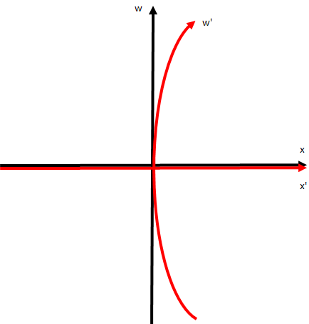

## 特殊相対論から一般相対論へ

　ここからは、等加速度運動している系同士での変換がどのようになるか見ていこう。例えば、今 $x$ 方向に一定加速度 $a$ で移動しているものとすると、

$$

    \frac{\mathrm{d}^2x}{\mathrm{d}t^2}=a、
    \frac{\mathrm{d}^2x'}{\mathrm{d}t'^2}=0、
    t'=t
$$

となるため、以下の関係が成り立つものと考えられる。

$$
    x'=x-\frac{1}{2}at^2=x-\frac{a}{2c^2}w^2、
    w'=w、
    (w=ct)
$$

これをLorentz変換のところでも見せた時空図で描写すると以下のようになる。

    

このことから、加速する座標への変換というのは曲がったものになることが予想される。この曲がった座標へ変換する理論としてRiemann幾何学というものがある。だが、この分野はかなり難解であるため、まずRiemann幾何学の記法について述べていくことにする。

　一般的に、ある地点の位置を指定するときはベクトルが用いられており、その中身は座標系を指定することで表すことができる。例えば、平面上の地点をベクトル $\bm{s}$ で表すとき座標系として二次元直交座標系 $(X,Y)$ を用いると $\bm{s}=(X,Y)$ となる。しかし、この表記だけだと二次元直交座標系かどうか判断ができない（二次元斜交座標系なども考えられる）ため、**基本ベクトル**（各成分の大きさ1のベクトル）というものが利用される。すなわち、二次元直交座標系の基本ベクトルを $\bm{e}_X,\bm{e}_Y$ として

$$
    \bm{s}=X\bm{e}_X+Y\bm{e}_Y、
    \bm{e}_X\cdot\bm{e}_X=1、
    \bm{e}_Y\cdot\bm{e}_Y=1、
    \bm{e}_X\cdot\bm{e}_Y=0
$$

というようにすると、$\bm{s}$ を表記できなおかつ基本ベクトルの大きさが1で互いに直交している（直交座標系である）ことが分かる。同様に、二次元斜交座標系 $(x,y)$ において基本ベクトルを $\bm{e}_x,\bm{e}_y$ として

$$
    \bm{s}=x\bm{e}_x+y\bm{e}_y、
    \bm{e}_x\cdot\bm{e}_x=1、
    \bm{e}_y\cdot\bm{e}_y=1、
    \bm{e}_x\cdot\bm{e}_y=\frac{1}{\sqrt{2}}
$$

というようにすると、今度は互いに45度の角度をなす座標系になっていることが分かる。