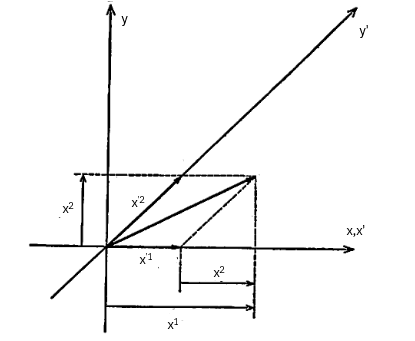

## 共変ベクトルと反変ベクトル

前回までは、ベクトル成分と基底ベクトルが互いに逆の変換になっていることを述べたが、このことを分かりやすくするため今度は直交座標系 $(x,y)$ を角度 $\alpha$ だけ回転した座標系 $(x',y')$ に変換した場合を考えてみよう。

    　　　
    

このとき上図のように、基底ベクトルについては座標軸と同じように回転するが、成分については右側にもあるように逆回転をさせたときのものと同じになる（このときベクトル自体が変化していないことに注意）。そのため、極座標 $(r,\theta)$ により直交座標系は
$$
    x=r\cos\theta、
    y=r\sin\theta
$$

と書けるが、これを角度 $\alpha$ だけ回転すると

$$
    x'=r\cos(\theta-\alpha)=
    r\cos\theta\cos\alpha+r\sin\theta\sin\alpha=
    x\cos\alpha+y\sin\alpha
$$
$$
    y'=r\sin(\theta-\alpha)=
    r\sin\theta\cos\alpha-r\cos\theta\sin\alpha=
    y\cos\alpha-x\sin\alpha
$$

というようになる。また、これから逆変換を求めると以下の通りになる。

$$
    x=x'\cos\alpha-y'\sin\alpha、
    y=y'\cos\alpha+x'\sin\alpha
$$

このことから、偏微分については

$$
    \frac{\partial x'}{\partial x}=
    \cos\alpha、
    \frac{\partial x'}{\partial y}=
    \sin\alpha、
    \frac{\partial y'}{\partial x}=
    -\sin\alpha、
    \frac{\partial y'}{\partial y}=
    \cos\alpha
$$
$$
    \frac{\partial x}{\partial x'}=
    \cos\alpha、
    \frac{\partial x}{\partial y'}=
    -\sin\alpha、
    \frac{\partial y}{\partial x'}=
    \sin\alpha、
    \frac{\partial y}{\partial y'}=
    \cos\alpha
$$

となることから、成分ベクトルと基底ベクトルの変換式は以下の通りとなる（この場合は同じ形になる）。

$$
    \mathrm{d}x'=
    \cos\alpha\ \mathrm{d}x+\sin\alpha\ \mathrm{d}y、
    \mathrm{d}y'=
    -\sin\alpha\ \mathrm{d}x+\cos\alpha\ \mathrm{d}y
$$
$$
    \bm{u}_x'=
    \cos\alpha\ \bm{u}_x+\sin\alpha\ \bm{u}_y、
    \bm{u}_y'=
    -\sin\alpha\ \bm{u}_x+\cos\alpha\ \bm{u}_y
$$

ここで、座標変換（座標軸の変更）に対して基底ベクトルは共に同じ方向に変換されているため**共変ベクトル**、ベクトル成分は逆方向に変換されているため**反変ベクトル**となる。より一般的には、これらは添え字を用いて区別されることが多く、

$$
    \begin{cases}
        ・\bm{u}_x、\bm{u}_y
        \rightarrow
        \bm{u}_1、\bm{u}_2
        &：共変ベクトル（下付き添え字で区別）\\
        ・\mathrm{d}x、\mathrm{d}y
        \rightarrow
        \mathrm{d}x^1、\mathrm{d}x^2
        &：反変ベクトル（上付き添え字で区別）
    \end{cases}
$$

というように書けるため、先ほどの式は以下の通りになる。

$$
    \mathrm{d}x'^1=
    \cos\alpha\ \mathrm{d}x^1+\sin\alpha\ \mathrm{d}x^2、
    \mathrm{d}x'^2=
    -\sin\alpha\ \mathrm{d}x^1+\cos\alpha\ \mathrm{d}x^1
$$
$$
    \bm{u}'_1=
    \cos\alpha\ \bm{u}_1+\sin\alpha\ \bm{u}_2、
    \bm{u}'_2=
    -\sin\alpha\ \bm{u}_1+\cos\alpha\ \bm{u}_1
$$

ここで注意として、$\mathrm{d}x$ は反変ベクトルとなるが $x$ は必ずしも反変ベクトルとなるとは限らないことに注意する必要がある。実際、回転座標ではどちらも同じ形になっていることからもうかがえる。また、前回でも出てきた斜交座標について

$$
    x' = x - y、
    y' = \sqrt{2}y
    \ \leftrightarrow\ 
    x = x'+\frac{1}{\sqrt{2}}y'、
    y = \frac{1}{\sqrt{2}}y'
$$

というように変換すると、共変ベクトルと反変ベクトルは
$$
    x'_1=
    \left(
        \frac{\partial x}{\partial x'}
    \right)
    x_1+
    \left(
        \frac{\partial y}{\partial x'}
    \right)
    x_2=
    x_1、
    x'_2=
    \left(
        \frac{\partial x}{\partial y'}
    \right)
    x_1+
    \left(
        \frac{\partial y}{\partial y'}
    \right)
    x_2=
    \frac{1}{\sqrt{2}}x_1+
    \frac{1}{\sqrt{2}}x_2
$$
$$
    x'^1=
    \left(
        \frac{\partial x'}{\partial x}
    \right)
    x^1+
    \left(
        \frac{\partial x'}{\partial y}
    \right)
    x^2=
    x^1-x^2、
    x'^2=
    \left(
        \frac{\partial y'}{\partial x}
    \right)
    x^1+
    \left(
        \frac{\partial y'}{\partial y}
    \right)
    x^2=
    \sqrt{2}x^2
$$

となるため、以下の図からも分かるように反変ベクトルであることが分かる。

    
    　　
    

この表記を用いると、ベクトル $\bm{s}$ に関する式も

$$
    \mathrm{d}\bm{s}=
    \sum_{\mu=1}^2\mathrm{d}x^\mu\bm{u}_\mu=
    \sum_{\mu=1}^2\mathrm{d}x'^\mu\bm{u}'_\mu
$$
$$
    \mathrm{d}\bm{s}\cdot\mathrm{d}\bm{s}=
    (\mathrm{d}\bm{s})^2=
    \sum_{\mu,\nu=1}^2
    (\bm{u}_\mu\cdot\bm{u}_\nu)
    \mathrm{d}x^\mu\mathrm{d}x^\nu=
    \sum_{\mu,\nu=1}^2
    (\bm{u}'_\mu\cdot\bm{u}'_\nu)
    \mathrm{d}x'^\mu\mathrm{d}x'^\nu
$$

というように総和を用いた形で表記できる。また、上付き文字と下付き文字が同じ添え字がついているものというのは決まって総和になっていることを踏まえて、よく総和の記号を省略した記法（**Einsteinの縮約記法**）が用いられる。

$$
    \mathrm{d}\bm{s}=
    \mathrm{d}x^{\mu}\bm{u}_\mu=
    \mathrm{d}x'^{\mu}\bm{u}'_\mu、
    (\mathrm{d}\bm{s})^2=
    (\bm{u}_\mu\cdot\bm{u}_\nu)
    \mathrm{d}x^{\mu}\mathrm{d}x^{\nu}=
    (\bm{u}'_\mu\cdot\bm{u}'_\nu)
    \mathrm{d}x'^{\mu}\mathrm{d}x'^{\nu}
$$

また、基底ベクトル同士の内積というのは座標系の各地点の形状を示す重要な量（**Riemann計量**）となっており、

$$
    g_{\mu\nu}=\bm{u}_\mu\cdot\bm{u}_\nu、
    g'_{\mu\nu}=\bm{u}'_\mu\cdot\bm{u}'_\nu
$$

と表記すると、内積のほうも以下のように表記される。

$$
    (\mathrm{d}\bm{s})^2=
    g_{\mu\nu}
    \mathrm{d}x^{\mu}\mathrm{d}x^{\nu}=
    g'_{\mu\nu}
    \mathrm{d}x'^{\mu}\mathrm{d}x'^{\nu}
$$
