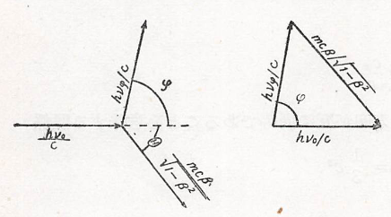

## 光の粒子仮設

　前回は電磁波のエネルギーの最小単位が $h\nu$ であると仮定することで、Planckの公式を導出していた。ただ、これはエネルギーが質量と等価であることを踏まえると、電磁波は $h\nu$ のエネルギーを持つ粒子として考えることもできると予想される。それを用いてEinsteinは、光が $h\nu$ のエネルギーを持つ粒子としてもふるまうもの（**光量子仮説**）として光電効果の説明を行った。
　光電効果とは高い振動数の光線（紫外線域）いわゆるX線のようなものを金属などの物質の表面にあてると、そこから電子が飛び出してくる現象である。実験を行ったLenardにより、以下のことが確認されている。

1. 飛び出る電子の一つ一つのエネルギーを測ってみると、それは照らす輻射線の強さに無関係である。

1. 照らす輻射線の強さを大きくすると、飛び出る電子の個数（単位時間あたりの個数、出現頻度）が多くなるだけである。

1. 飛び出る電子一つ一つのエネルギーは照らす輻射線の色に関係する。すなわちその輻射線の波長が短いほどエネルギーの大きな電子が飛び出してくる。

これに対して、先ほどの光量子仮説を適用すると電子を飛び出させるのに必要なエネルギーを $W$（仕事関数） としたときに電子のエネルギーは
$$
    E=h\nu-W
$$
と書ける。そのため、実験で得られた事実と矛盾しないことが分かる。（1・3：波長、振動数にしか依存しない、2：強さ（量子の個数）が大きくなれば電子の数も比例して多くなる）このことは、後にMillikanが行った実験においても確かめられている。

　また、光の粒子性が現れるもう一つの現象として1923年にComptonによって発見された**Compton効果**がある（ここで発見されたという意味はその現象が光の粒子性によるもであるということが発見されたという意味で、現象自体は以前より知られていたものとなっている）。X線を物体にあてるとそれが四方に散乱されることはよく知られている。ところが、このとき単色のX線を用いて実験を行い、この散乱されたX線の波長を詳しく測ってみると、その一部は入射X線と同じ波長を持っているが、その外に入射するX線よりも長いものがあるという事実が知られていたのである。このX線の散乱について有名なThomsonの理論が存在していたが、散乱されたX線の波長は入射したものと同じである必要があり、事実とは異なるものとなっていた。そこで、Comptonは光の粒子説を用いてきわめて単純に説明できることを示したのである。

　具体的には、まず光は $h\nu$ という量子としてみなせることを述べたが、同時に運動量も有している。これについては、空洞輻射において光が壁に反射する際に圧力を及ぼすことから伺える。実際、光が等方的に壁に当たる場合、圧力 $P$ はエネルギー密度 $u$ と 
$$
    P=\frac{1}{3}u
$$
という関係にあり、Stefanの法則やWienのずれの法則を導くときの土台となっている。さらに、気体分子運動論にて圧力は運動量により
$$
    P=n\braket{c_{\perp}p_{\perp}}=
    \frac{N}{V}
    \braket{c_{\perp}p_{\perp}}
$$
であり、 $h\nu$ の粒子が $N$ 個ある場合は
$$
    uV=Nh\nu
    \rightarrow
    u=\frac{N}{V}h\nu
$$
となることから、以下の式が得られる。
$$
    \braket{c_{\perp}p_{\perp}}=
    \frac{1}{3}h\nu
$$
さらに、運動量と速度の方向が同じであることと 等方的にエネルギーが利用されることを踏まえて
$$
    c_{\perp}=
    c\left(
        \frac{p_{\perp}}{p}
    \right)、
    \braket{p_{\perp}^2}=
    \frac{1}{3}\braket{p^2}
$$
となることや、今は振動数 $\nu$ のみ考えていることから
$$
    \frac{1}{3}cp=\frac{1}{3}h\nu
    \rightarrow
    p=\frac{h\nu}{c}
$$
となることが分かる。このことについては、特殊相対性理論からも推測できる。このときは、物体が光速では質量を持てない（静止質量が $0$ ）ことからエネルギーと運動量の関係式より
$$
    (h\nu)^2=(m_0c^2)^2+(cp)^2
    \rightarrow
    p=\frac{h\nu}{c}
$$
というようになる。

    

運動量保存の法則により、
$$
    \frac{h\nu_0}{c}=
    \frac{h\nu_{\phi}}{c}\cos\phi+
    \gamma m_{e}v\cos\alpha、
    \left(
        \gamma=
        \frac{1}{\sqrt{1-(v/c)^2}}
    \right)
$$
$$
    0=
    \frac{h\nu_{\phi}}{c}\sin\phi-
    \gamma m_{e}v\sin\alpha
$$
であることから、
$$
    \left(
        \frac{h\nu_0}{c}-
        \frac{h\nu_{\phi}}{c}\cos\phi
    \right)^2=
    (\gamma m_{e}v\cos\alpha)^2
$$
$$
    \left(
        \frac{h\nu_{\phi}}{c}\sin\phi
    \right)^2=
    (\gamma m_{e}v\sin\alpha)^2
$$
となるため、これら二式を足し合わせる。
$$
    \left(
        \frac{h\nu_0}{c}
    \right)^2-
    2\frac{h^2\nu_0\nu_{\phi}}{c^2}
    \cos\phi+
    \left(
        \frac{h\nu_{\phi}}{c}
    \right)^2=
    (\gamma m_{e}v)^2
$$
さらに、エネルギー保存則から
$$
    h\nu_0+m_{e}c^2=
    h\nu_\phi+\gamma  m_{e}c^2
$$
であり、両辺を二乗すると
$$
    (h\nu_0-h\nu_\phi+m_{e}c^2)^2=
    (\gamma  m_{e}c^2)^2
$$
$$
    v^2=
    c^2
    \left[
        1-
        \left(
            \frac{m_{e}c^2}
            {h\nu_0-h\nu_\phi+m_{e}c^2}
        \right)^2
    \right]
$$
であるため、右辺は以下の通りになる。
$$
    (\gamma  m_{e}c^2)^2=
    \frac{1}{c^2}
    \left[
        (h\nu_0-h\nu_\phi+m_{e}c^2)^2-
        (m_{e}c^2)^2
    \right]
$$
そのため、式を整理すると最終的に以下の式が得られる。
$$
    \nu_\phi=
    \frac{\nu_0}
    {1+\frac{2h\nu_0}{m_ec^2}\sin^2\frac{\phi}{2}}
$$
これが散乱されたX線の振動数であり、$\phi$ によらず $\nu_\phi<\nu_0$ と小さくなること及び実験とも一致した結果が得られる。ただ、この形よりも波長の形により
$$
    \lambda_\phi=
    \lambda_0+
    \left(
        \frac{h}{m_ec}
    \right)
    2\sin^2\frac{\phi}{2}
$$ 
と表示した方が式が容易になり、ここでの $h/m_ec$ はCompton波長と呼ばれている。
$$
    \frac{h}{m_ec}=
    2.42\times 10^{-13}\ \mathrm{m}=
    0.0242\ \mathrm{\AA}
$$