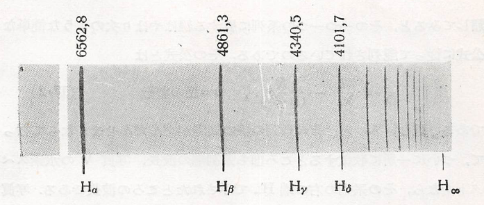

## 電子の波動説

　色々のガスのガイスラー管（蛍光灯の一種）や、いろいろの物質を電極にするアーク燈（ランプ）から出てくる光を分光器でみると、それぞれの物質に特有なスペクトルがみられる。このスペクトルのうち線スペクトルといわれているものは、その物質の原子が射出するものである。この線スペクトルは夫々の物質原子に配列を持っているから、原子の構造をうかがう最も直接なデータである。だからこのスペクトル線の配列の仕方の法則性を求めることは非常に重要なことである。

　いろいろな物質のうち水素の発するスペクトルは最も簡単な配列を示している。以下の図は可視部から紫外線部にかけて現れる水素のスペクトルの写真であるが、これを見ただけでもいかにも意味ありげな線の並び方になっている。

    

　この水素の線の並び方を数式的に表すことに成功したのはスイスの中学校の先生Balmerの手柄である（1885年）。彼は可視部にある4本のスペクトル線 H$_\alpha$、H$_\beta$、H$_\gamma $及び H$_\delta$ の波長がそれぞれ
$$
    \frac{9}{5}h、
    \frac{16}{12}h、
    \frac{25}{21}h、
    \frac{36}{32}h、
    （h=3645.6\ \mathrm{\AA}）
$$
で表されることをを発見し、これが
$$
    \lambda=
    \frac{n^2}{n^2-4}、
    （n=3,4,5,6）
$$
なる公式にまとめられることに気がついた。これに続いて、スウェーデンのRydbergも他の原子のスペクトルも細かく調べて、より複雑な状況でもいくつかの系列に分類すると、その一つ一つの系列に属する線が以下の公式に従って配列していることを1890年に発見した。
$$
    \frac{1}{\lambda}=
    \frac{1}{\lambda_{\infty}}-
    \frac{R}{(n+b)^2}、
    n=正の整数
$$
ただし、$\lambda_\infty$ とはその系列の線の間隔が段々せまくなって行って、ついに一か所に集約するところ（系列端）の波長であり、上記の図においての右端 H$_\infty$ で示されたところの波長になる。他には、以下の図のようにNaのスペクトルは水素のものと比べて相当複雑であるが、これらの線は主系列、第1副系列、第2副系列という風に分類することで、各系列が上記の公式に従って配置していることが分かる。

    

特に、公式中の $R$ は原子の種類によらない不変定数（**Rydbergの定数**）であり
$$
    R=109677.691\ \mathrm{cm}^{-1}
$$
であり、Balmerの$h$との関係は $R=h/4$
 である。これに対して、$b$ は物質ごとに又は系列ごとに異なる値をとるが、一つの系列内では近似的に一定の値を持つ定数である。さらに、Rydbergの研究は進み、系列端においても規則正しく並んでいることから、上記の公式において
$$
    \frac{1}{\lambda_\infty}=
    \frac{R}{(m+a)^2}、
    （m:正の整数）
$$
であることも見出した。そのため、公式は**Rydbergの公式**として以下の形でまとめられる。
$$
    \frac{1}{\lambda}=
    \frac{R}{(m+a)^2}-
    \frac{R}{(n+b)^2}
$$
この公式に従うと、各系列の波長は
$$
    \begin{cases}
        ・m=1（Lyman系列、1906年）\\
        ・m=2（Balmer系列、1885年）\\
        ・m=3（Paschen系列、1908年）\\
        ・m=4（Brackatt系列、1922年）
    \end{cases}
$$
というように対応しており、水素の場合で図にまとめると以下のようになる（$m$が4以上の波長は省略している）。

    

　このように、スペクトルの波長は連続しておらず離散的な値をとることが分かる。これについては光の粒子説で述べたことが関係していると考えられる。具体的には、空洞輻射での光のエネルギーが
$$
    E_n=nh\nu
$$
となっていることから、原子においてもエネルギーが離散的な値 $W_n$ しかとらないものとする。また、光電効果において電子は光から $h\nu$ のエネルギーを吸収して起こるわけだが、そのとき電子のエネルギーが増加したと考えると逆にエネルギーが減少して $h\nu$ の光を放出することも予想される。この２つのことから、仮に原子のエネルギーが $W_n$ から $W_m$ に減少し、その分 $h\nu$ の光が放出されたとすると
$$
    h\nu=W_n-W_m
    \rightarrow
    \nu=\frac{W_n-W_m}{h}
$$
という関係が成り立つと考えられる（**Bohrの振動数関係**）。すなわち、あるエネルギー $W_n$ にある間は安定した状態（**定常状態**）であり、ある特定の作用が起こることで $W_n$ から $W_m$ のような変化（**量子的飛躍、状態の遷移**）が起こるものとする。すると、水素原子の場合では
$$
    \frac{1}{\lambda}=
    \frac{R}{m^2}-
    \frac{R}{n^2}
    \leftrightarrow
    \nu=
    \frac{Rc}{m^2}-
    \frac{Rc}{n^2}
$$
であるが、整数が逆数をとった形になっており、1項目が端の波長に対応したものであることを踏まえて $m<n$ であるから 
$$
    \frac{1}{m^2} > \frac{1}{n^2}
$$
となるが、この形を $W_n$ とすると空洞輻射の場合と逆で整数が大きくなるにつれてエネルギーが減少する形になってしまうため、$W_n$ を以下のように負符号をつけたものにしてみる。
$$
    \frac{W_n}{h}=-\frac{Rc}{n^2}
    \rightarrow
    W_n=-\frac{Rhc}{n^2}
$$
すると、$n$ が大きくなるにつれて0に近づいて連続的に分布するようになるが、ここで連続で分布するようになるというのは古典的な状態に相当していることから、振動数に関する式において まず $m=n-\tau$ とすると
$$
    \nu=
    Rc
    \left(
        \frac{n^2-m^2}{n^2m^2}
    \right)=
    Rc
    \frac{(n+m)(n-m)}{n^2m^2}=
    Rc\frac{\tau}{n^3}
    \frac{(2-\tau/n)}{(1-\tau/n)^2}
$$
であるから、$n\to\infty\ (\tau/n\to 0)$ とする近似的に以下の式が得られる。
$$
    \nu\simeq\frac{2Rc}{n^3}\tau=
    \frac{2}{\sqrt{Rch^3}}
    |W_n|^{3/2}\tau、
    (|W_n|=-W_n)
$$
一方で、水素原子は当時電子が円運動をしているものと考えられており、このときのエネルギーは
$$
    W_n=
    \frac{1}{2}mv_n^2-
    \frac{1}{4\pi\epsilon_0}
    \frac{e^2}{r_n}
$$
であり、円運動する条件として
$$
    \frac{mv_n^2}{r_n}=
    \frac{1}{4\pi\epsilon_0}
    \frac{e^2}{r_n^2}
$$
を利用すると、速度と動径は以下の通りになる。
$$
    v_n=\sqrt{\frac{2}{m}}
    |W_n|^{1/2}、
    r_n=
    \frac{e^2}{8\pi\epsilon_0}
    |W_n|^{-1}
$$
さらに速度に関して $v_n=2\pi r_n\nu_n$ とおけるため
$$
    \sqrt{\frac{2}{m}}
    |W_n|^{1/2}=
    2\pi
    \frac{e^2}{8\pi\epsilon_0}
    |W_n|^{-1}\nu_n
    \rightarrow
    \nu_n=
    2\sqrt{
        \frac{8\epsilon_0^2}{me^4}
    }
    |W_n|^{3/2}
$$
そのため、ある範囲 $\tau$ でエネルギーが変化したときに放出する光の振動数は次のようになる。
$$
    \nu=
    2\sqrt{
        \frac{8\epsilon_0^2}{me^4}
    }
    |W_n|^{3/2}\tau
$$
以上の考察から、次の関係式が成り立つことが予想される。
$$
    \frac{1}{\sqrt{Rch^3}}=
    \sqrt{
        \frac{8\epsilon_0^2}{me^4}
    }
    \rightarrow
    R=
    \frac{me^4}{8\epsilon_0^2h^3c}
$$
各定数に値を代入すると、$R$ の値が既知のものと一致していることが分かる。また、円運動の際は角運動量 $L_n$ が保存しているので求めてみると、$L_n=mv_nr_n$ であるから $r_n$ と $v_n$ が
$$
    v_n=
    \sqrt{\frac{2Rhc}{m}}
    \frac{1}{n}=
    \frac{e^2}{2\epsilon_0h}
    \frac{1}{n}、
    r_n=
    \frac{e^2}{8\pi\epsilon_0Rhc}n^2=
    \frac{\epsilon_0h^2}{\pi me^2}n^2
$$
となることから、以下のように簡単な形になることが分かる。
$$
    L_n=mv_nr_n=
    \frac{h}{2\pi}n
$$
というように、簡単な関係式が導かれる。この関係式は**Bohrの量子条件**と呼ばれ、角運動量が前回のエネルギーと同じように飛び飛びになっているを意味している。