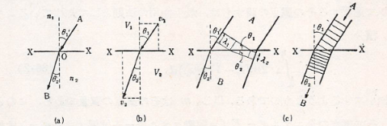
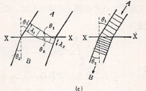

## 波動力学

　前回まで電子が波としての性質を有することを述べたが、粒子とされていたものが波でないかという考えは過去に光学にもあった。光学においては光を粒子としてその経路により光の振る舞いを説明していたが、多くの実験も踏まえて光が波であることが実証された。このとき、光学でも幾何光学から波動光学というように移動したわけだが、今回も同じように力学でも粒子から波動に置きかえてみると新しい法則が見つかるのではないかということが推測される。

　幾何光学の法則が力学の法則と同じ形をしているということは最小作用の原理のような進んだ理論をまたずとも、すでにNewtonの時代に注目され、Newtonはこれによって光の粒子論を展開しようとしていたのである。最も簡単な具体的な例として光の屈折を考えてみよう。

    

上図に示すように、屈折率 $n_1$ の媒質と $n_2$ の媒質とが 平面$XX$ を境にして接続しているとする。1本の（単色）光線がAからBに進んでいくとき、その進路AOBは、Snellの法則
$$
    \frac{\sin\theta_1}{\sin\theta_2}=
    \frac{n_2}{n_1}
$$
を満たす。ただし、$\theta_1$ は入射角、$\theta_2$ は屈折角である。これがこの場合の幾何光学の法則である。これをNewtonと同じように粒子的な立場に立つと次のように説明される。光の粒子が媒質Aから媒質Bに入射するとき、その境界面 $XX$ を通過する際、その面に直角な力の作用を受ける。その力は、面に直角であるので粒子の速度の法線成分を変化させる（図の場合では増加する）。同時に、接線成分は変化しないはずなので以下の関係が成り立つ。

$$
    v_1\sin\theta_1=v_2\sin\theta_2
    \leftrightarrow
    \frac{\sin\theta_1}{\sin\theta_2}=
    \frac{v_2}{v_1}
$$

当時の考え方としては、位相速度 $u$ と速度 $v$ を同じものとして

$$
    \frac{\sin\theta_1}{\sin\theta_2}=
    \frac{v_2}{v_1}=
    \frac{u_2}{u_1}=
    \frac{n_1}{n_2}
$$

が得られるため、Snellの法則を満たさず粒子説が否定されていた。ところが、特殊相対性理論により光を粒子として考えた場合は速度ではなく運動量でしか取り扱えないため

$$
    p_1\sin\theta_1=p_2\sin\theta_2
    \leftrightarrow
    \frac{\sin\theta_1}{\sin\theta_2}=
    \frac{p_2}{p_1}=
    \frac{n_2}{n_1}
$$

を満たす条件を考えると、次の比例式（比例定数 $k$ ）が成り立つことが予想される。

$$
    n=kp
$$

　一方で、波として扱った場合にも、Huygensの原理に従って以下の図のように考えることができる。

    

このとき屈折する前後の波長の関係は、媒質1の中での波の波長を $\lambda_1$ 、媒質2の中でのそれを $\lambda_2$ とすると、

$$
    \frac{\lambda_1}{\sin\theta_1}=
    \frac{\lambda_2}{\sin\theta_2}
    \rightarrow
    \frac{\sin\theta_1}{\sin\theta_2}=
    \frac{\lambda_1}{\lambda_2}
$$

となる。そのため、屈折率とはその場所での波長に逆比例するものであるといってもよい。すなわち、比例定数 $k'$ を用いて
$$
    n=\frac{k'}{\lambda}
$$
と表わされることになる。

　以上のように、粒子的な立場あるいは波動論的な立場で考えることで運動量と波長の逆数が関係していることがうかがえる。このことから、光以外のものについても一般的に二つの側面から考察が可能であると予想できる。すなわち、電流（電子の流れ）というようなものを波動論的立場によって取り扱うことで、波としてみた時の光と同じように干渉や回折を示すことはなかろうか。光の進行がこれら波動特有の現象によって幾何光学の法則から外れるように、電子の運動も干渉や回折によって以前までの物理法則から外れて奇妙な振る舞いをすることはないであろうか。こうして、幾何学に対して波動光学が成立したことに相当して、通常の力学に対して波動力学が成立すると考えなければならないことになる。そこで、Compton散乱の説明でも登場した光の関係式

$$
    E=h\nu、
    p=\frac{h\nu}{c}=\frac{h}{\lambda}
$$

がその他の物質（電子など）でも成り立つものと仮定してみる。ここで、$E,p$ は**光子**（光を粒子とみなしたときの名称）のエネルギーと運動量、$\nu,\lambda$ は**光波**（光を波とみなしたときの名称）の振動数と波長である。その上で、電子における屈折がどうなるかを考えてみると、エネルギー $E$ が保存されており、運動量 $p$ も電子の質量 $m$ と速度 $v$ により $p=mv
$ と書けるため、位相速度 $u$ は以下の通りになる。

$$
    u=\nu\lambda=\frac{E}{p}=
    \frac{E}{mv}
    \propto
    \frac{1}{v}
$$

そのため、電子においても屈折に関してはSnellの法則を満たすことが分かる。